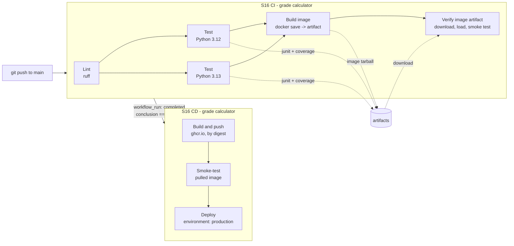
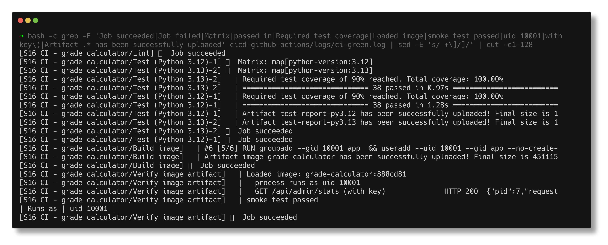
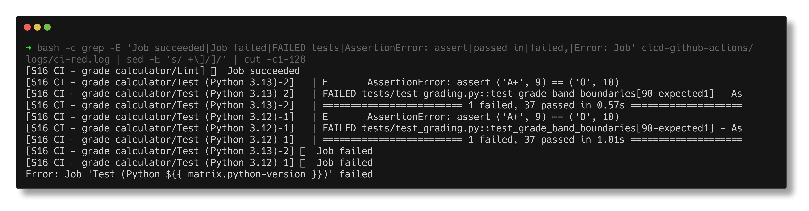
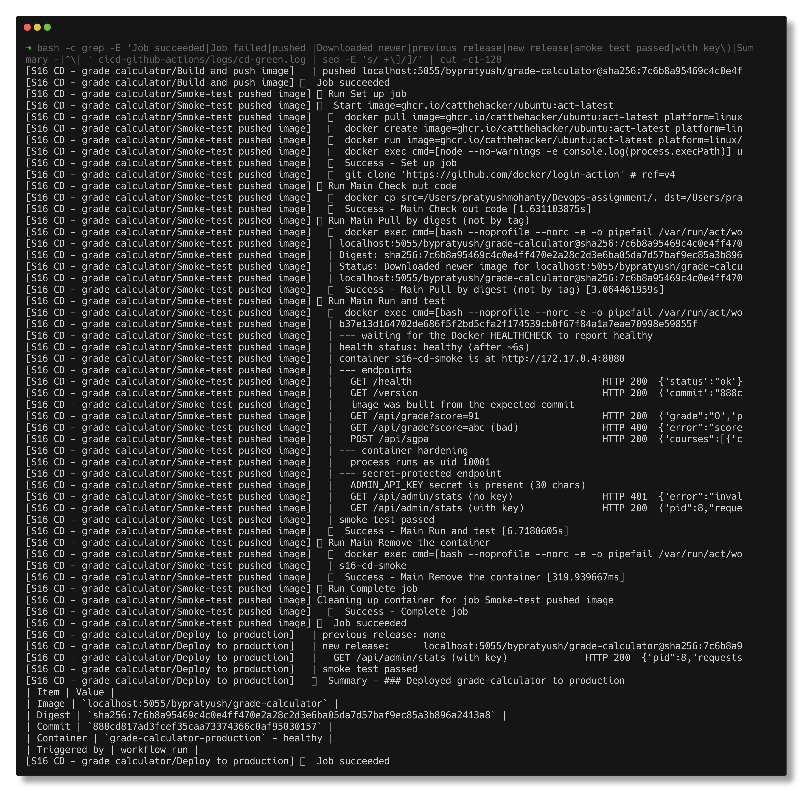
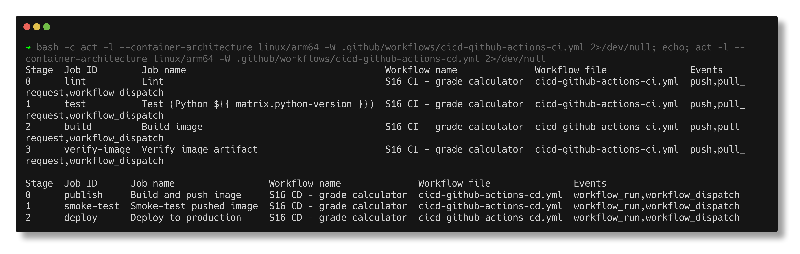

# CI/CD with GitHub Actions

> **Submitted by:** Pratyush Mohanty  |  **Roll No.:** 24BCS10238

**Form field:** CI/CD & GitHub Actions · **Course session:** `session-16-github-actions` (ref: `10-final-cicd-pipeline`)

Run it: `./run.sh` (needs Docker and [act](https://github.com/nektos/act)) · Verified output: [output.md](output.md) · Full act logs: [logs/](logs/)

A small Flask API (a student grade / SGPA calculator) with real unit tests, a
hardened Dockerfile, and two GitHub Actions workflows: **CI** (lint, test on two
Python versions, build the image, verify the image artifact) and **CD** (push to
GHCR, smoke-test the pushed image, deploy through a `production` environment).

| File | What it is |
|---|---|
| [app/grading.py](app/grading.py) | Grading rules (10-point scale) and SGPA maths, no Flask |
| [app/\_\_init\_\_.py](app/__init__.py) | Flask app: `/health`, `/version`, `/api/grade`, `/api/sgpa`, `/api/admin/stats` |
| [tests/](tests/) | 38 pytest tests, 100% line and branch coverage |
| [Dockerfile](Dockerfile) · [.dockerignore](.dockerignore) | `python:3.13-slim`, non-root uid 10001, `HEALTHCHECK`, gunicorn |
| [scripts/smoke-test.sh](scripts/smoke-test.sh) | Black-box checks used by CI, CD and deploy |
| [../.github/workflows/cicd-github-actions-ci.yml](../.github/workflows/cicd-github-actions-ci.yml) | CI workflow |
| [../.github/workflows/cicd-github-actions-cd.yml](../.github/workflows/cicd-github-actions-cd.yml) | CD workflow |
| [run.sh](run.sh) | Runs both workflows locally with act, plus a deliberate failure |

The workflows live at the repository root in `.github/workflows/` because that is
the only place GitHub looks. Each one has a `paths:` filter on this folder and
its own file, so a commit to some other topic folder does not start them.

---

## 1. CI vs CD

| | Continuous Integration | Continuous Delivery | Continuous Deployment |
|---|---|---|---|
| Question it answers | Does this change break anything? | Could we release this commit right now? | Release it. |
| Runs on | every push and PR | every green build of `main` | every green build of `main` |
| Ends with | a tested, built artifact | an artifact in a registry, ready, with a human pressing "deploy" | the artifact running in production, no human step |
| Here | `S16 CI` workflow | `S16 CD` with a required reviewer on the `production` environment | `S16 CD` as committed (no reviewer rule) |

The only difference between delivery and deployment is the manual approval. In
GitHub Actions that switch is not in the YAML at all: it is a protection rule on
the environment (Settings -> Environments -> production -> Required reviewers).
The same workflow file is continuous deployment without the rule and continuous
delivery with it.

## 2. The pipeline



If any box fails, nothing to its right runs. A red CI run still triggers the CD
workflow (`workflow_run` fires on *completed*), but the first CD job's `if:`
checks `conclusion == 'success'`, so every CD job is skipped. That path is
exercised for real in section 6.

## 3. GitHub Actions concepts, as used here

| Concept | Meaning | Where in these workflows |
|---|---|---|
| **Workflow** | A YAML file in `.github/workflows/`, one automated process | `cicd-github-actions-ci.yml`, `cicd-github-actions-cd.yml` |
| **Event / trigger** | What starts a workflow | CI: `push`, `pull_request` (both with `paths:`), `workflow_dispatch`. CD: `workflow_run` of CI, `workflow_dispatch` |
| **Job** | A set of steps on one runner; jobs run in parallel unless linked with `needs:` | `lint`, `test`, `build`, `verify-image`; `publish`, `smoke-test`, `deploy` |
| **Step** | One shell command (`run:`) or one action (`uses:`) inside a job; steps share the job's filesystem | e.g. `actions/checkout`, `docker build` |
| **Runner** | The machine that executes a job | `ubuntu-latest` (GitHub-hosted); locally, a container from `ghcr.io/catthehacker/ubuntu:act-latest` |
| **Matrix** | One job definition expanded into several runs | `python-version: ["3.12", "3.13"]`, `fail-fast: false` |
| **Secret** | Encrypted value, injected at run time, masked as `***` in logs | `ADMIN_API_KEY`, plus the automatic `GITHUB_TOKEN` for GHCR |
| **Artifact** | Files saved from a job, downloadable by later jobs or from the run page | test reports (junit + coverage) per Python version, the image tarball |
| **Environment** | A named deployment target with its own secrets and protection rules | `deploy` job: `environment: production` |
| **Permissions** | Scopes of `GITHUB_TOKEN` for the run | `contents: read` by default, `packages: write` only on `publish` |
| **Concurrency** | At most one run per group | CI cancels superseded runs; CD queues and never cancels a deploy |

**GitHub-hosted vs self-hosted runners.** A GitHub-hosted runner is a fresh VM per
job, destroyed afterwards: nothing leaks between runs, nothing to patch, billed
by the minute (free for public repos). A self-hosted runner is your own machine
registered with `runs-on: [self-hosted, linux]`: it can reach private networks
and keeps caches warm, but you patch it, and a public repo should never use one,
because a pull request from a fork could run code on it. Each job here gets a
new runner, which is why the image travels from `build` to `verify-image` as an
artifact rather than just being "there".

## 4. Walk-through of the workflow files

### CI - [cicd-github-actions-ci.yml](../.github/workflows/cicd-github-actions-ci.yml)

- **`lint`** - `ruff check` (pyflakes, pycodestyle, bugbear, isort, pyupgrade and the
  flake8-bandit `S` rules) and `ruff format --check`. Cheapest check first.
- **`test`** (`needs: lint`) - a matrix over Python 3.12 and 3.13 with pip caching.
  `pytest --cov-fail-under=90` writes `reports/junit.xml` and `reports/coverage.xml`,
  uploaded as `test-report-py3.12` / `test-report-py3.13` with `if: always()`: the
  report matters most when a test fails.
- **`build`** (`needs: test`) - `docker build` with `GIT_SHA` baked in, then
  `docker save | gzip` and upload as the `image-grade-calculator` artifact.
- **`verify-image`** (`needs: build`) - a *different runner* downloads that artifact,
  `docker load`s it, starts it with the `ADMIN_API_KEY` secret and runs
  [scripts/smoke-test.sh](scripts/smoke-test.sh): waits for the Docker
  `HEALTHCHECK` to say healthy, hits every endpoint, checks `/version` reports the
  commit being tested, checks the process is not uid 0, and checks the admin
  endpoint returns 401 without the key and 200 with it. Writes a job summary.

### CD - [cicd-github-actions-cd.yml](../.github/workflows/cicd-github-actions-cd.yml)

- **Trigger** - `workflow_run` on `S16 CI - grade calculator`, `types: [completed]`,
  `branches: [main]`. The first job continues only if the CI run's `conclusion`
  was `success` *and* its `event` was `push` (a green PR build must not deploy).
- **`publish`** - checks out `workflow_run.head_sha` (a `workflow_run` workflow runs
  on the default branch, so without this it could build a newer commit than CI
  tested), logs in to `ghcr.io` with `GITHUB_TOKEN` (`packages: write`), builds,
  pushes `:<short-sha>` and `:latest`, and exports the **digest** the registry
  acknowledged. The image name is lower-cased because registry paths must be.
- **`smoke-test`** - pulls `image@sha256:...` (never a tag, which can move) and
  runs the same smoke test against what is actually in the registry.
- **`deploy`** - `environment: production`. Fails if the production secret is
  missing, replaces the running container with the new digest, re-runs the smoke
  test, and writes a deployment summary.

Honest scope note: there is no server for a homework repo, so the "production"
target is a container on the runner (published on `127.0.0.1:18716`). On GitHub
it lives only as long as the job; under act it keeps running on the Mac, which
is how section 6 calls it. Pointing this at a real host means changing one step
(`ssh` + `docker run`, or `kubectl set image`); everything around it - the gate on
CI, the digest, the environment and its secret - stays the same.

### Secrets

- `ADMIN_API_KEY` is a repository (or `production` environment) secret. It reaches
  the container through `env:` and `docker run -e ADMIN_API_KEY`, never through the
  command line text, and the scripts only ever print its length.
- GitHub replaces the value with `***` anywhere it appears in a log. That only
  works for the exact string: a base64 or URL-encoded copy is *not* masked, which is
  why the value is never transformed and printed.
- CI degrades gracefully when the secret is absent (fork PRs get no secrets): it
  checks for HTTP 503 and emits a warning. The deploy job refuses to run without it.

To set it on GitHub: `gh secret set ADMIN_API_KEY` (or per environment:
`gh secret set ADMIN_API_KEY --env production`).

## 5. Running it locally with act

[act](https://github.com/nektos/act) reads the same YAML and runs each job in a
Docker container. Commands that worked on this Mac (Apple Silicon, act 0.2.89):

```bash
# CI, push event
act push -W .github/workflows/cicd-github-actions-ci.yml \
  -P ubuntu-latest=ghcr.io/catthehacker/ubuntu:act-latest \
  --container-architecture linux/arm64 \
  --artifact-server-path cicd-github-actions/.act/artifacts \
  --secret-file cicd-github-actions/.secrets --rm

# CD, as if CI had just finished green (payload written by run.sh)
docker run -d --name s16-registry -p 127.0.0.1:5055:5000 registry:2
act workflow_run -W .github/workflows/cicd-github-actions-cd.yml \
  -e cicd-github-actions/.act/workflow_run-success.json  ...same flags...
```

`./run.sh` wraps all of it: `ci`, `fail-demo`, `cd-blocked`, `cd`, `verify`,
`cleanup`, or `all`. It creates a random, git-ignored `.secrets` on first run.

What differs under act, and how each workflow handles it:

| On GitHub | Under act | How |
|---|---|---|
| `ghcr.io` with `GITHUB_TOKEN` | local `registry:2` on `localhost:5055` | registry chosen from `$ACT`; login steps have `if: ${{ !env.ACT }}` |
| `workflow_run` from a real CI run | a JSON payload passed with `-e` | `run.sh` writes it with the real `HEAD` sha and the chosen conclusion |
| checkout of `workflow_run.head_sha` | the local working tree | separate checkout step per case (act only copies local files when `ref` is empty) |
| artifacts in GitHub storage | act's artifact server on disk | `--artifact-server-path` |
| environment protection rules | ignored | `environment:` is accepted but act has no reviewers |

## 6. Pipeline execution (real runs)

Everything below is copied from [output.md](output.md) / [logs/](logs/).

**Green CI** - every job, both matrix legs, artifacts uploaded:

```text
[S16 CI - grade calculator/Lint] 🏁  Job succeeded
[S16 CI - grade calculator/Test (Python 3.13)-2] 🏁  Job succeeded
[S16 CI - grade calculator/Test (Python 3.12)-1] 🏁  Job succeeded
[S16 CI - grade calculator/Build image         ] 🏁  Job succeeded
[S16 CI - grade calculator/Verify image artifact] 🏁  Job succeeded

act exit code: 0
...
artifacts/1/image-grade-calculator/image-grade-calculator.zip
artifacts/1/test-report-py3.12/test-report-py3.12.zip
artifacts/1/test-report-py3.13/test-report-py3.13.zip
```

The `verify-image` job, on a fresh runner, after downloading the artifact:

```text
  GET /version                                 HTTP 200  {"commit":"888cd817ad3fcef35caa73374366c0af95030157","version":"1.2.0"}
  image was built from the expected commit
  GET /api/grade?score=91                      HTTP 200  {"grade":"O","points":10,"score":91.0}
  GET /api/grade?score=abc (bad)               HTTP 400  {"error":"score must be a number"}
--- container hardening
  process runs as uid 10001
--- secret-protected endpoint
  ADMIN_API_KEY secret is present (30 chars)
  GET /api/admin/stats (no key)                HTTP 401  {"error":"invalid or missing X-API-Key"}
  GET /api/admin/stats (with key)              HTTP 200  {"pid":7,...}
smoke test passed
```



**A pipeline that never fails proves nothing**, so `run.sh fail-demo` moves the
O-grade boundary from 90 to 91 (a realistic off-by-one), runs CI, then restores
the file:

```text
-    (90, "O", 10),
+    (91, "O", 10),
...
E       AssertionError: assert ('A+', 9) == ('O', 10)
FAILED tests/test_grading.py::test_grade_band_boundaries[90-expected1] - AssertionError: assert ('A+', 9) == ('O', 10)

--- job results in this run
  Lint: succeeded
  Test (Python 3.13)-2: failed
  Test (Python 3.12)-1: failed
  Build image: never started
  Verify image artifact: never started
```

Both legs failed (so it is not a version quirk), `needs: test` kept the build
from running, and the failing test report was still uploaded because of
`if: always()` - `run.sh` reads the failing case back out of that artifact.



**CD after the red run** - `workflow_run` with `conclusion: failure`: act starts,
evaluates `publish`'s `if:`, and runs nothing. `smoke-test` and `deploy` depend on
`publish`, so they are skipped too. Exit code 0, zero jobs.

**CD after the green run** - pushed, pulled back by digest on another runner,
smoke-tested, deployed:

```text
pushed localhost:5055/bypratyush/grade-calculator@sha256:7c6b8a95469c4c0e4ff470e2a28c2d3e6ba05da7d57baf9ec85a3b896a2413a8
Status: Downloaded newer image for localhost:5055/bypratyush/grade-calculator@sha256:7c6b8a95...
previous release: none
new release:      localhost:5055/bypratyush/grade-calculator@sha256:7c6b8a95...
Summary - ### Deployed grade-calculator to production
| Digest | `sha256:7c6b8a95469c4c0e4ff470e2a28c2d3e6ba05da7d57baf9ec85a3b896a2413a8` |
| Container | `grade-calculator-production` - healthy |
```

and then from the Mac, outside act:

```text
grade-calculator-production   localhost:5055/bypratyush/grade-calculator   Up 9 seconds (healthy)   127.0.0.1:18716->8080/tcp

$ curl localhost:18716/version
{"commit":"888cd817ad3fcef35caa73374366c0af95030157","version":"1.2.0"}
```





The commit is `888cd81` because act takes `github.sha` from the local `HEAD`;
this work was not committed yet when it ran.

## 7. Notes from actually running this

- **upload-artifact v6 and v7 fail under act 0.2.89** with `Error unauthorized`
  from act's built-in artifact server; v5 works (tested v4/v5/v6/v7 in a scratch
  repo). The workflows pin `upload-artifact@v5` and `download-artifact@v7`, which
  work both locally and on GitHub.
- **A published `127.0.0.1` port is invisible to an act job.** act runs each job
  in a container on Docker Desktop's VM network, so `curl localhost:<port>`
  returned `000`. The container's bridge IP (`172.17.0.x`) is reachable from both
  an act job and a GitHub runner, so the smoke test uses that.
- **`ref:` on `actions/checkout` changes act's behaviour.** Without `ref`, act
  copies the local tree; with `ref: ${{ ...head_sha }}` it really fetched commit
  `888cd81` from github.com, which has no `cicd-github-actions/` folder, and the
  next step died with `chdir ... no such file or directory`. Hence two checkout
  steps gated on `env.ACT`.
- **The first full run's CD failed on the network**, not the code: act re-clones
  every action on each run and a `git clone` of `docker/login-action` timed out.
  `--action-offline-mode` reuses actions already in `~/.cache/act`. That failed
  attempt is left in [output.md](output.md) as it happened.
- **`docker inspect` on a missing container still prints an empty line**, so
  `x=$(docker inspect ... || echo none)` gave `"\nnone"`. Test existence first.
- **Docker Hub returned `429 Too Many Requests`** for anonymous pulls during this
  work; the act runner image was taken from the publisher's own GHCR copy
  (`ghcr.io/catthehacker/ubuntu:act-latest`).
- Port 5000 is the macOS AirPlay Receiver, so the stand-in registry uses 5055.
- With the containerd image store, `docker build` adds an attestation manifest, so
  the pushed digest is an image index. The digest is read from `docker push`
  output (what the registry acknowledged) rather than from `RepoDigests`.

## 8. Interview Q&A

**Q: CI vs continuous delivery vs continuous deployment?**
CI merges and verifies every change automatically (build + test). Continuous
delivery keeps every green `main` build releasable and stops at a human approval.
Continuous deployment removes that approval. Here the difference is one
environment protection rule, not a different pipeline.

**Q: How do you pass a file from one job to another?**
Artifacts (`upload-artifact` / `download-artifact`). Jobs run on separate
runners, so the filesystem is not shared. `needs:` only orders jobs and passes
small string `outputs`, which is how the digest travels from `publish` to `deploy`.

**Q: Why deploy by digest instead of `:latest`?**
A tag is a pointer anyone can move; a digest is the hash of the exact manifest.
Smoke-testing `:latest` and then deploying `:latest` could test one image and ship
another if a push lands in between.

**Q: `workflow_run` vs putting deploy jobs in the CI file with `needs:`?**
`workflow_run` keeps CD separate (its own permissions, its own concurrency group
that never cancels) and only fires after CI has completed. The catches: it runs
on the default branch's copy of the workflow, it fires on failure too (hence the
`conclusion` check), and you must check out `head_sha` explicitly.

**Q: How are secrets protected?**
Encrypted at rest, only decrypted into the runner for jobs that reference them,
masked in logs, not given to workflows triggered by fork PRs, and environment
secrets are only released after the environment's protection rules pass.

**Q: What does `fail-fast: false` change in a matrix?**
By default one failing leg cancels the others. With `false` both Python versions
report, so you learn whether a failure is version-specific.

**Q: GitHub-hosted or self-hosted runner for a public repo?**
GitHub-hosted. A self-hosted runner on a public repo lets anyone with a fork PR
run code on your machine, and it is not wiped between jobs.

**Q: Why does `GITHUB_TOKEN` need `packages: write` only on one job?**
Least privilege. The token's scope is set per job; the test and smoke-test jobs
can only read, so a compromised test dependency cannot push an image.

**Q: The pipeline is green but production is broken. What did CI miss?**
Usually configuration rather than code: a missing secret, a different base image,
an env var. That is why the smoke test runs against the pushed image, and again
after deploy, with the real secret, instead of trusting the unit tests alone.
