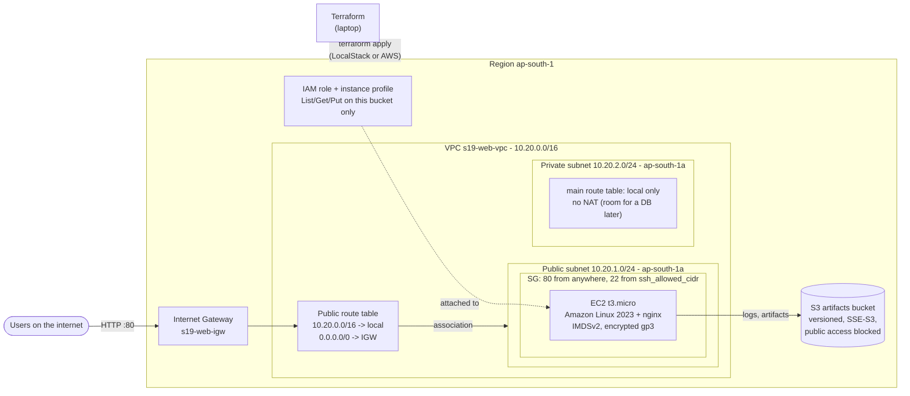
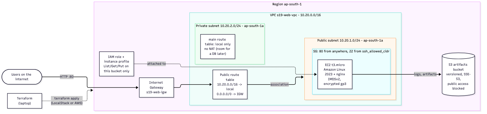
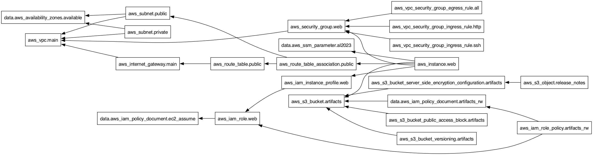
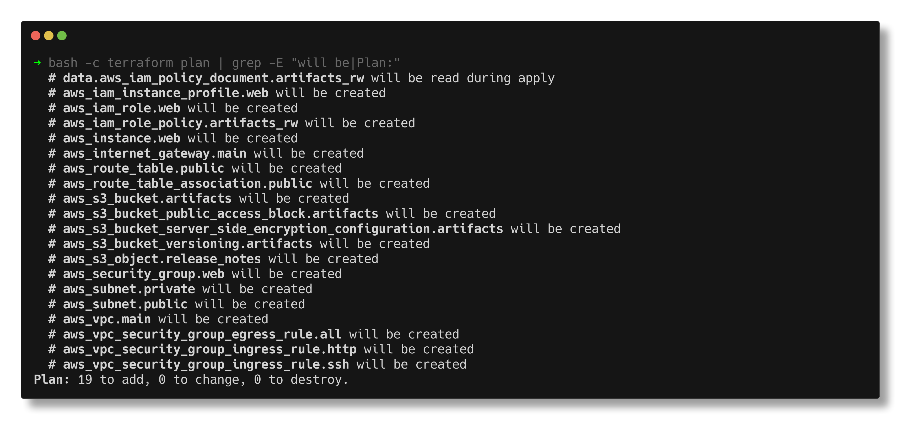
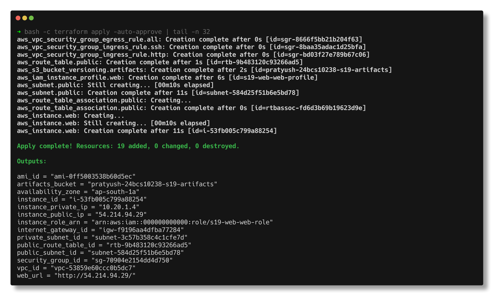
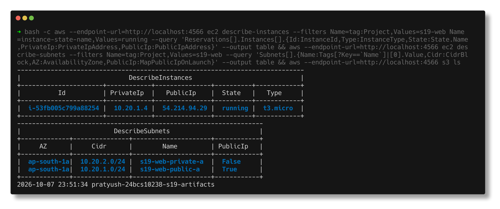
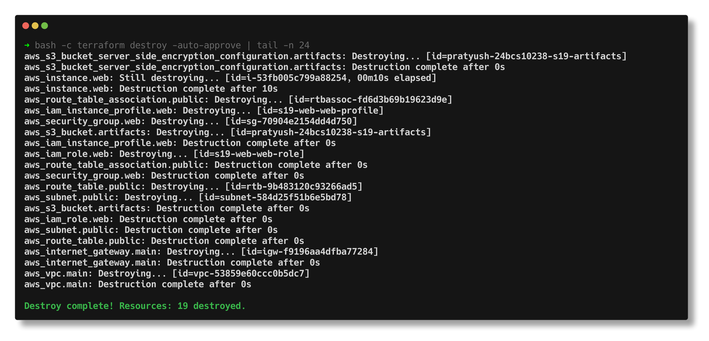
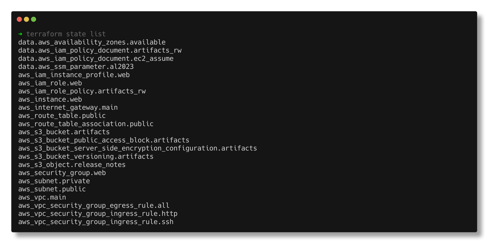

# Cloud & Terraform in Action

> **Submitted by:** Pratyush Mohanty  |  **Roll No.:** 24BCS10238

**Form field:** Cloud & Terraform in Action · **Course session:** `session19-cloud-terraform`

Run it: `../lab/localstack.sh up && ./run.sh`  ·  Verified output: [output.md](output.md)

An end-to-end AWS environment in Terraform: a VPC with a public and a private
subnet, an internet gateway and route table, a security group, an EC2 web
server with a least-privilege IAM role, and a private S3 bucket for artifacts
and logs. 19 resources, created, inspected, verified with the AWS CLI and
destroyed.

All of it ran against **LocalStack 4.14.0** (AWS emulator in Docker on
`localhost:4566`) because there is no AWS account behind this homework. The code
is real AWS code: `use_localstack = false` sends it to an actual account.

---

## Architecture



PNG version (rendered from [docs/architecture.mmd](docs/architecture.mmd) with
`npx @mermaid-js/mermaid-cli`):



How traffic reaches the instance: user -> internet gateway -> public route table
(`0.0.0.0/0 -> igw`) -> public subnet -> security group (port 80 allowed) ->
nginx. The private subnet has no route out at all, which is exactly what makes
it private.

---

## Files

| File | What it does |
|---|---|
| [versions.tf](versions.tf) | Terraform and provider version constraints; a commented-out S3 backend for team use |
| [providers.tf](providers.tf) | The `aws` provider, the `use_localstack` switch (endpoints for ec2, iam, s3, s3control, ssm, sts) and `default_tags` |
| [variables.tf](variables.tf) | 15 typed inputs with descriptions; validations on the VPC CIDR and on `ssh_allowed_cidr` (refuses `0.0.0.0/0`) |
| [network.tf](network.tf) | VPC, AZ lookup, public + private subnet, internet gateway, route table, association |
| [security.tf](security.tf) | Security group plus three separate rule resources (HTTP, SSH, egress) |
| [compute.tf](compute.tf) | AMI lookup through SSM, the EC2 instance, and the one explicit `depends_on` |
| [iam.tf](iam.tf) | Role EC2 can assume, inline policy scoped to one bucket, instance profile |
| [storage.tf](storage.tf) | S3 bucket with versioning, SSE-S3, public access block, and a release file |
| [outputs.tf](outputs.tf) | 14 outputs: IDs, IPs, URL, bucket, role ARN |
| [templates/user_data.sh.tftpl](templates/user_data.sh.tftpl) | First-boot script: install nginx, write a page, copy the boot log to S3 |
| [terraform.tfvars.example](terraform.tfvars.example) | Template to copy; [terraform.tfvars](terraform.tfvars) holds the values of the recorded run (no secrets) |
| [run.sh](run.sh) | `deploy`, `verify`, `graph`, `destroy`, `shots`, default `all` |

Splitting by concern (network / security / compute / iam / storage) instead of
one big `main.tf` is only for humans: Terraform loads every `.tf` file in the
folder as one configuration.

### Provider, variables, resources, outputs

- **Provider**: `hashicorp/aws ~> 6.0` (6.67.0 locked). `default_tags` puts
  Project, Environment, Owner, RollNo and ManagedBy on every taggable resource,
  so nothing is untagged by accident.
- **Variables**: everything that differs between environments (region, CIDRs,
  instance type, SSH source, bucket name) is a variable. The SSH validation
  means a careless `0.0.0.0/0` fails at plan time, not in a security audit.
- **Resources**: 19 managed, plus 4 data sources (AZ list, AMI parameter, two
  IAM policy documents). Data sources read; they never create.
- **Outputs**: the values someone needs after apply - the URL, the instance ID
  for SSM, the bucket name for a pipeline.

### AMI: looked up, not hard-coded

```hcl
data "aws_ssm_parameter" "al2023" {
  name = "/aws/service/ami-amazon-linux-latest/al2023-ami-kernel-default-x86_64"
}
locals {
  ami_id = coalesce(var.ami_id, nonsensitive(data.aws_ssm_parameter.al2023.value))
}
```

AMI IDs differ per region and change with every release, so a hard-coded ID
rots. AWS publishes the latest Amazon Linux 2023 ID as a public SSM parameter;
LocalStack serves the same path (it resolved to `ami-0ff5003538b60d5ec`,
`al2023-ami-2023.10.20260120.4-kernel-6.1-x86_64`). `var.ami_id` can still pin
one.

---

## Dependencies

**Implicit (from references).** Writing `vpc_id = aws_vpc.main.id` inside the
subnet is enough for Terraform to know the VPC comes first. Almost every
dependency in this project is like that, and the apply order shows it:

```text
aws_vpc.main: Creation complete after 2s [id=vpc-1343639b420af3a36]
aws_internet_gateway.main: Creating...
aws_subnet.private: Creating...
aws_subnet.public: Creating...
aws_security_group.web: Creating...
...
aws_subnet.public: Creation complete after 10s [id=subnet-28ace29de50f5704f]
aws_route_table_association.public: Creating...
aws_route_table_association.public: Creation complete after 1s [id=rtbassoc-da12bcb70106cf739]
aws_instance.web: Creating...
aws_instance.web: Creation complete after 11s [id=i-17d970bb33eee9df6]
```

Independent things (the bucket, the IAM role, the VPC) start in parallel.

**Explicit (`depends_on`).** One place needs it:

```hcl
resource "aws_instance" "web" {
  ...
  depends_on = [aws_route_table_association.public]
}
```

Nothing in the instance block references the route table, so from the code
alone Terraform could launch the instance at the same time as the route. But
the `user_data` runs `dnf install nginx` on first boot and needs the
`0.0.0.0/0 -> IGW` route to already exist; if it does not, the install fails
once and cloud-init never retries. That is a behavioural dependency Terraform
cannot see, which is exactly what `depends_on` is for.

`run.sh graph` proves the difference by graphing a copy of the code with the
`depends_on` removed:

```text
--- what aws_instance.web waits for (edges out of it) ---
  "aws_instance.web" -> "data.aws_ssm_parameter.al2023";
  "aws_instance.web" -> "aws_iam_instance_profile.web";
  "aws_instance.web" -> "aws_route_table_association.public";
  "aws_instance.web" -> "aws_s3_bucket.artifacts";
  "aws_instance.web" -> "aws_security_group.web";

--- the same, from a copy of the code with depends_on deleted ---
  "aws_instance.web" -> "data.aws_ssm_parameter.al2023";
  "aws_instance.web" -> "aws_iam_instance_profile.web";
  "aws_instance.web" -> "aws_s3_bucket.artifacts";
  "aws_instance.web" -> "aws_security_group.web";
  "aws_instance.web" -> "aws_subnet.public";
```

Without it, the instance only waits for the subnet and nothing links it to the
route table. (With it, the direct subnet edge is not drawn because it is implied
through the association.) The instance also depends on the bucket, through
`templatefile(..., { bucket = aws_s3_bucket.artifacts.bucket })` in user_data -
references inside function calls count too.

The full graph, from `terraform graph | dot -Tpng` (graphviz 16.1.0):



Arrows point from a resource to what it needs. Destroy walks the same graph
backwards: the instance went first and the VPC last.

---

## The commands, with real output

### init, fmt, validate

```text
- Reusing previous version of hashicorp/aws from the dependency lock file
- Installed hashicorp/aws v6.67.0 (signed by HashiCorp)
Terraform has been successfully initialized!

fmt: all files already in canonical format
Success! The configuration is valid.
```

### plan

```text
  # aws_iam_instance_profile.web will be created
  # aws_iam_role.web will be created
  # aws_iam_role_policy.artifacts_rw will be created
  # aws_instance.web will be created
  # aws_internet_gateway.main will be created
  ...
  # aws_vpc_security_group_ingress_rule.ssh will be created
Plan: 19 to add, 0 to change, 0 to destroy.
```

`data.aws_iam_policy_document.artifacts_rw will be read during apply` also
appears: that document contains the bucket ARN, which does not exist until the
bucket is created, so even a data source can be deferred.



### apply and outputs

```text
Apply complete! Resources: 19 added, 0 changed, 0 destroyed.

Outputs:

ami_id = "ami-0ff5003538b60d5ec"
artifacts_bucket = "pratyush-24bcs10238-s19-artifacts"
availability_zone = "ap-south-1a"
instance_id = "i-17d970bb33eee9df6"
instance_private_ip = "10.20.1.4"
instance_public_ip = "54.214.148.216"
instance_role_arn = "arn:aws:iam::000000000000:role/s19-web-web-role"
internet_gateway_id = "igw-a4a249d28fcb4d1a5"
private_subnet_id = "subnet-a19ef5b7f68063c11"
public_route_table_id = "rtb-cafafee3ec0ece15f"
public_subnet_id = "subnet-28ace29de50f5704f"
security_group_id = "sg-dee8785394a128d6a"
vpc_id = "vpc-1343639b420af3a36"
web_url = "http://54.214.148.216/"
```

`10.20.1.4` is the first usable host: AWS reserves the first four addresses of
every subnet (.0 network, .1 router, .2 DNS, .3 future) and the last one.



### Verified with the AWS CLI

```text
$ aws ec2 describe-subnets
|     AZ      |     Cidr      |            Id              |       Name         | PublicIpOnLaunch   |
|  ap-south-1a|  10.20.2.0/24 |  subnet-a19ef5b7f68063c11  |  s19-web-private-a |  False             |
|  ap-south-1a|  10.20.1.0/24 |  subnet-28ace29de50f5704f  |  s19-web-public-a  |  True              |

$ aws ec2 describe-route-tables  (the public one: local route + default route to the IGW)
|  Destination  |  State  |         Target          |
|  10.20.0.0/16 |  active |  local                  |
|  0.0.0.0/0    |  active |  igw-a4a249d28fcb4d1a5  |

$ aws ec2 describe-security-group-rules
|      Cidr       |                 Desc                  | Egress  | From  | Proto  | To   |
|  0.0.0.0/0      |  All outbound (package installs, S3)  |  True   |  -1   |  -1    |  -1  |
|  203.0.113.10/32|  SSH from the admin CIDR only         |  False  |  22   |  tcp   |  22  |
|  0.0.0.0/0      |  HTTP from anywhere                   |  False  |  80   |  tcp   |  80  |

$ aws ec2 describe-instances
|  Ami       |  ami-0ff5003538b60d5ec  |
|  IMDS      |  required               |
|  Id        |  i-17d970bb33eee9df6    |
|  PrivateIp |  10.20.1.4              |
|  State     |  running                |
|  Type      |  t3.micro               |
```

(Trimmed to the rows; the VPC, internet gateway, S3 and IAM checks are in
[output.md](output.md), step 9.)



### Changing things: update in place vs replace

Plan-only experiments, nothing applied:

```text
--- change the instance type ---
  # aws_instance.web will be updated in-place
      ~ instance_type                        = "t3.micro" -> "t3.small"
  # aws_s3_object.release_notes will be updated in-place
Plan: 0 to add, 2 to change, 0 to destroy.

--- change the public subnet CIDR ---
  # aws_instance.web must be replaced
      ~ subnet_id                            = "subnet-28ace29de50f5704f" -> (known after apply) # forces replacement
  # aws_route_table_association.public must be replaced
  # aws_subnet.public must be replaced
      ~ cidr_block                                     = "10.20.1.0/24" -> "10.20.3.0/24" # forces replacement
Plan: 3 to add, 0 to change, 3 to destroy.
```

Some attributes can be changed on a live object; others are immutable in AWS,
and changing them means delete and recreate (`# forces replacement`). The
replacement ripples to everything holding the old ID. Reading the plan for
`must be replaced` before every apply is the habit that prevents surprise
outages.

### destroy

```text
Plan: 0 to add, 0 to change, 19 to destroy.
aws_instance.web: Destroying... [id=i-17d970bb33eee9df6]
...
aws_instance.web: Destruction complete after 12s
aws_route_table_association.public: Destroying... [id=rtbassoc-da12bcb70106cf739]
...
aws_vpc.main: Destroying... [id=vpc-1343639b420af3a36]
aws_vpc.main: Destruction complete after 0s
Destroy complete! Resources: 19 destroyed.

$ aws ec2 describe-vpcs --filters tag:Project=s19-web
[]
$ aws ec2 describe-instances  (terminated instances stay listed for a while, as on AWS)
|  i-17d970bb33eee9df6 |  terminated  |
```



---

## State

```text
terraform.tfstate: format v4, serial 21, lineage b1eb9c91...
  19 managed resources, 4 data sources, 14 outputs
```



`terraform state show aws_route_table.public` prints one resource exactly as
recorded, including attributes the code never set (`owner_id`, the full route
object with every target type `null` except `gateway_id`):

```text
# aws_route_table.public:
resource "aws_route_table" "public" {
    arn              = "arn:aws:ec2:ap-south-1:000000000000:route-table/rtb-cafafee3ec0ece15f"
    id               = "rtb-cafafee3ec0ece15f"
    owner_id         = "000000000000"
    route            = [
        {
            cidr_block                 = "0.0.0.0/0"
            gateway_id                 = "igw-a4a249d28fcb4d1a5"
            ...
        },
    ]
    vpc_id           = "vpc-1343639b420af3a36"
}
```

Reading the instance from `terraform show -json` showed something I did not
expect: state stores a `depends_on` list for every resource, and for the
instance it is the **full transitive** list (VPC, IGW, route table, subnet,
SSM parameter, ...), not just the five direct edges. That is how Terraform can
still destroy in the right order after a resource has been deleted from the
code - the dependency information survives in state.

The state is local here (`terraform.tfstate`, git-ignored). For a team it
belongs in a remote backend; `versions.tf` has the S3 backend block ready,
with `use_lockfile = true` so two applies cannot run at once.

---

## Switching to real AWS

1. `aws configure` (or SSO) so that `aws sts get-caller-identity` works.
2. In `terraform.tfvars`: `use_localstack = false`, `ssh_allowed_cidr` = your
   IP `/32` (`curl -s https://checkip.amazonaws.com`), and a bucket name nobody
   else has used.
3. Optionally create a key pair and set `key_name`, or skip SSH and use SSM
   Session Manager.
4. `terraform init && terraform plan && terraform apply`, then
   `terraform destroy` when done.

`run.sh` itself is LocalStack-specific (it exports dummy keys and passes
`--endpoint-url`), so on real AWS run the commands by hand.

## Cost notes (real AWS, ap-south-1)

| Resource | Cost |
|---|---|
| VPC, subnets, route table, IGW, security group, IAM | Free |
| EC2 t3.micro | Free tier 750 h/month for 12 months, otherwise roughly USD 0.01/hour |
| 8 GiB gp3 root volume | Free tier 30 GiB, otherwise about USD 0.09/GB-month |
| Public IPv4 address | About USD 0.005/hour since Feb 2024, even inside the free tier for EC2 |
| S3 | Pennies for a few KB; free tier 5 GB |
| NAT gateway | **Not created** - about USD 0.056/hour plus data, the classic surprise bill |

Destroying straight after the demo keeps the total at effectively zero.

---

## Notes from actually running this

- **LocalStack mocks EC2.** The instance shows `running` with a public IP
  (`54.214.148.216`), but no VM boots: the IP is invented and not routable, and
  the user_data never runs. What this proves is the API calls, the ordering and
  the wiring between resources - not that nginx serves a page. On real AWS
  `web_url` would answer once cloud-init finishes.
- **Endpoints first.** The S3 demo in session 18 taught me that a missing
  endpoint override sends calls to real AWS, so this provider lists every
  service it touches (ec2, iam, s3, s3control, ssm, sts) before the first run.
  It applied cleanly first time.
- **`aws_subnet.public` took 10-11 s** while the private subnet took 0 s. The
  difference is `map_public_ip_on_launch = true`, which is a separate
  `ModifySubnetAttribute` call that the provider waits on.
- **Recording on a clean emulator.** LocalStack keeps state in memory, and a
  trial run had left a terminated instance listed. `./lab/localstack.sh down`
  then `up` gave a clean account before the recorded run.
- **Terraform-made security groups have no egress rule.** The console adds
  "allow all outbound" for you; the API (and so Terraform) does not, so
  `aws_vpc_security_group_egress_rule.all` is needed or the instance could not
  even reach the package mirrors.
- **Mermaid layout.** A top-to-bottom version of the diagram rendered with the
  private subnet box spilling outside the VPC box; left-to-right rendered
  cleanly, so that is the one used.

---

## Interview Q&A

**Q: What makes a subnet public?**
Only its route table: a route `0.0.0.0/0 -> internet gateway`. The name, the
CIDR and `map_public_ip_on_launch` do not make it public on their own.

**Q: Implicit vs explicit dependencies?**
Implicit ones come from references (`aws_vpc.main.id`) and are preferred.
`depends_on` is for dependencies Terraform cannot see in the code, such as the
instance's boot script needing the internet route. Overusing it slows applies
and hides the real relationships.

**Q: Security group vs NACL?**
Security groups attach to instances (ENIs), are stateful (return traffic is
allowed automatically) and only allow. NACLs attach to subnets, are stateless
(return traffic needs its own rule), have numbered allow and deny rules, and
are evaluated in order.

**Q: Why an IAM role instead of access keys on the instance?**
Keys on disk leak and never expire. A role gives the instance short-lived
credentials through the metadata service, rotated automatically, scoped by
policy - here to one bucket.

**Q: What does IMDSv2 (`http_tokens = "required"`) protect against?**
SSRF: a vulnerable app tricked into fetching `http://169.254.169.254/...` with
a plain GET could leak the role's credentials. IMDSv2 requires a PUT to get a
session token first, which those bugs usually cannot do.

**Q: What happens if someone changes a resource in the console?**
The next plan shows drift (the refreshed real value differs from the code) and
apply puts it back. That is why changes should go through the code only.

**Q: Why might `terraform apply` replace something you only meant to edit?**
Some attributes are immutable in AWS (a subnet CIDR, an instance's subnet). The
plan marks them `# forces replacement` and everything referencing the old ID
is replaced too, as the subnet experiment showed.

**Q: Where should state live for a team?**
In a remote backend (S3 with `use_lockfile`, or Terraform Cloud) with
versioning and encryption, never in git and never only on one laptop.
