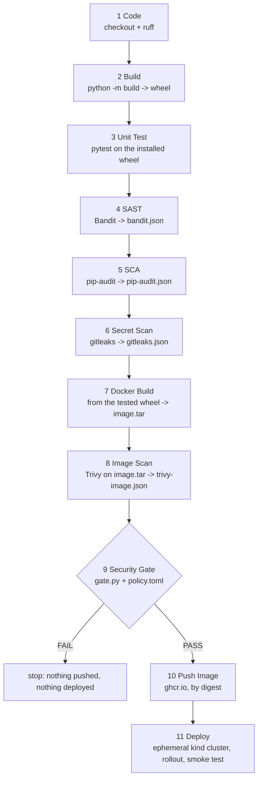
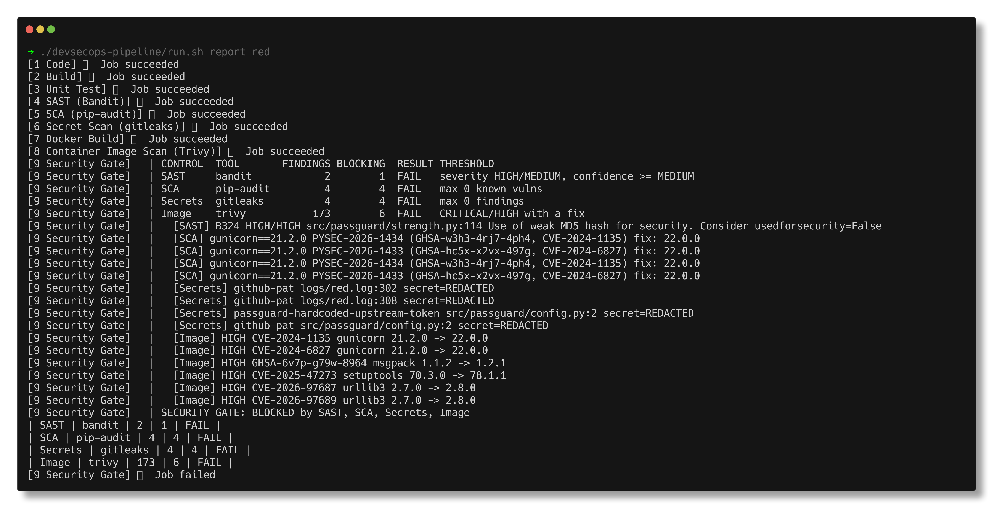
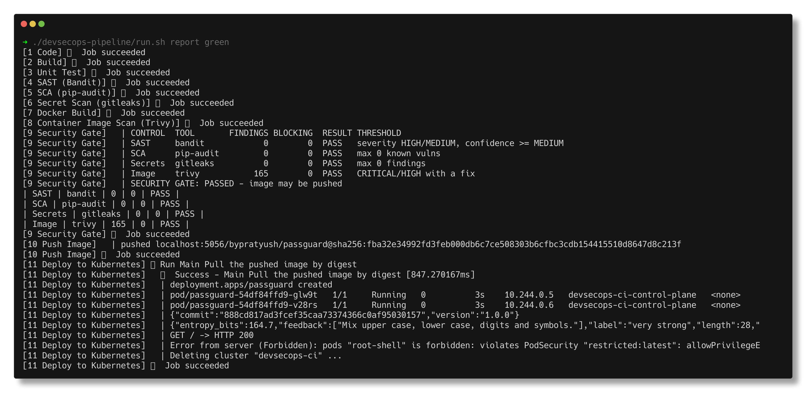

# DevSecOps Pipeline

> **Submitted by:** Pratyush Mohanty  |  **Roll No.:** 24BCS10238

**Form field:** Complete CI/CD & DevSecOps · **Course session:** `session-17-devsecops`

Run it: `./run.sh` (needs Docker, kind and [act](https://github.com/nektos/act)) · Verified output: [output.md](output.md) · Full act logs: [logs/](logs/)

**PassGuard** is a small password strength API (Flask): `POST /api/strength`
scores a password, `GET /api/generate` makes one with `secrets`, `/` is a web
page, `/healthz` and `/readyz` are the probes. It is shipped by one GitHub Actions
workflow, [`.github/workflows/devsecops.yml`](../.github/workflows/devsecops.yml),
with eleven jobs chained by `needs:` in exactly the order the task asks for.

| Path | What it is |
|---|---|
| [src/passguard/](src/passguard/) | The app (src layout, built into a wheel) |
| [tests/](tests/) | 30 pytest tests, run against the installed wheel |
| [Dockerfile](Dockerfile) | Two stages, `python:3.13-slim`, non-root uid 10001, `HEALTHCHECK` |
| [k8s/](k8s/) | Namespace (Pod Security `restricted`), Deployment (probes, securityContext), Service |
| [security/policy.toml](security/policy.toml) | The gate thresholds - one file |
| [security/gate.py](security/gate.py) | Reads all four reports, applies the policy, decides |
| [security/gitleaks.toml](security/gitleaks.toml) | gitleaks default rules + one project rule |
| [security/install-tools.sh](security/install-tools.sh) | Pinned gitleaks, Trivy, kind, kubectl with hard-coded sha256 |
| [run.sh](run.sh) | `red` (inject problems, watch the gate stop it), `green`, `cleanup` |

---

## 1. The flow



The scanners **detect**: each runs its tool, prints the findings and uploads a
JSON report. The Security Gate **decides**: it downloads all four reports and
applies [policy.toml](security/policy.toml) in one place. Two reasons for that
split:

- one red run shows every problem at once, instead of stopping at the first
  scanner and hiding the rest until the next push;
- thresholds live in one reviewed file instead of being scattered across tool
  flags in YAML. A missing report is treated as a failure (fail closed), so
  deleting a scanner step cannot quietly open the gate.

The same artifacts flow through: the wheel built in job 2 is what job 3 tests and
what job 7 installs into the image; the `image.tar` built in job 7 is what job 8
scans and what job 10 pushes. Nothing is rebuilt after it has been checked.

## 2. Security controls

| Control | Tool | Catches | Config | Blocks when |
|---|---|---|---|---|
| SAST | Bandit 1.9.4 | insecure code patterns: weak hashes, `shell=True`, `eval`, `debug=True`, hard-coded binds, `yaml.load`... | `[tool.bandit]` in [pyproject.toml](pyproject.toml) | any HIGH or MEDIUM severity finding with MEDIUM+ confidence |
| SCA | pip-audit 2.10.1 | known CVE / GHSA / PYSEC advisories in [requirements.txt](requirements.txt) (OSV / PyPI data) | pinned, complete requirements | any known vulnerability |
| Secret scan | gitleaks 8.30.1 | tokens and keys in any file of this folder (about 200 rules + a project rule for `*_TOKEN = "..."`) | [security/gitleaks.toml](security/gitleaks.toml), `--redact` | any finding |
| Image scan | Trivy 0.74.0 | CVEs in the image's Debian packages and Python packages | `--scanners vuln`, JSON report | CRITICAL or HIGH that has a fixed version |
| Gate | [gate.py](security/gate.py) | combines the above | [policy.toml](security/policy.toml) | any control over its limit, or any report missing |
| Admission | Kubernetes Pod Security | pods that run as root, escalate, keep capabilities | `pod-security.kubernetes.io/enforce: restricted` on the namespace | always, at the API server |

Supply chain of the pipeline itself: the scanners are not pulled through
third-party marketplace actions. [install-tools.sh](security/install-tools.sh)
downloads fixed releases and checks a sha256 written in the repo, so a replaced
release fails the step instead of running with the pipeline's token. (Trivy is
pinned to 0.74.0 rather than the six-day-old 0.75.0 on purpose.)

Hardening that the scanners do not cover but the manifests enforce:
`runAsNonRoot`, uid 10001, `readOnlyRootFilesystem`, `allowPrivilegeEscalation:
false`, all capabilities dropped, `seccompProfile: RuntimeDefault`, no service
account token, CPU/memory limits, and startup/readiness/liveness probes.

## 3. Proving the gate gates

`./run.sh red` injects three deliberate problems, runs the whole pipeline with
act, then restores the files (the bad versions exist only in this narrative and
in [output.md](output.md)):

```text
--- strength.py
6a7
> import hashlib
108a110,114
> 
> 
> def fingerprint(password):
>     """Short id used to cache results."""
>     return hashlib.md5(password.encode()).hexdigest()[:12]
--- requirements.txt
6c6
< gunicorn==26.2.0
---
> gunicorn==21.2.0
--- new file config.py (token masked here)
# upstream API used for breach lookups
UPSTREAM_TOKEN = "ghp_<36 fake characters>"
```

The token is `ghp_` followed by `FAKE0demo0token0for0gitleaks0test012`, assembled
at run time from two halves so that no file in the repo ever contains it.

Jobs 1-8 pass (they detect, they do not decide); the gate reads the four
reports and stops the run:

```text
CONTROL  TOOL       FINDINGS BLOCKING  RESULT THRESHOLD
SAST     bandit            2        1  FAIL   severity HIGH/MEDIUM, confidence >= MEDIUM
SCA      pip-audit         4        4  FAIL   max 0 known vulns
Secrets  gitleaks          4        4  FAIL   max 0 findings
Image    trivy           173        6  FAIL   CRITICAL/HIGH with a fix
  [SAST] B324 HIGH/HIGH src/passguard/strength.py:114 Use of weak MD5 hash for security. Consider usedforsecurity=False
  [SCA] gunicorn==21.2.0 PYSEC-2026-1434 (GHSA-w3h3-4rj7-4ph4, CVE-2024-1135) fix: 22.0.0
  [SCA] gunicorn==21.2.0 PYSEC-2026-1433 (GHSA-hc5x-x2vx-497g, CVE-2024-6827) fix: 22.0.0
  ...
  [Secrets] github-pat logs/red.log:302 secret=REDACTED
  [Secrets] github-pat logs/red.log:308 secret=REDACTED
  [Secrets] passguard-hardcoded-upstream-token src/passguard/config.py:2 secret=REDACTED
  [Secrets] github-pat src/passguard/config.py:2 secret=REDACTED
  [Image] HIGH CVE-2024-1135 gunicorn 21.2.0 -> 22.0.0
  [Image] HIGH CVE-2024-6827 gunicorn 21.2.0 -> 22.0.0
  [Image] HIGH GHSA-6v7p-g79w-8964 msgpack 1.1.2 -> 1.2.1
  [Image] HIGH CVE-2025-47273 setuptools 70.3.0 -> 78.1.1
  [Image] HIGH CVE-2026-97687 urllib3 2.7.0 -> 2.8.0
  [Image] HIGH CVE-2026-97689 urllib3 2.7.0 -> 2.8.0

SECURITY GATE: BLOCKED by SAST, SCA, Secrets, Image
...
  9 Security Gate: failed
  10 Push Image: never started
  11 Deploy to Kubernetes: never started
```

Three things in that output were not planned, and all three are real lessons:

1. **Bandit's low-severity B105 also saw the token** (`Possible hardcoded password`),
   but LOW is below the SAST threshold, so only the MD5 finding blocks. The
   secret is blocked by the control built for it.
2. **gitleaks found the token in `logs/red.log` too.** Bandit prints the offending
   source line, so the CI log itself carried the token, and the secret scan (which
   runs later and scans this folder) caught it in the log of its own run. CI logs
   are a classic leak path; `run.sh` now redacts `ghp_...` before writing logs.
3. **Four image findings had nothing to do with the injection**: `msgpack`,
   `setuptools` and `urllib3` vendored inside the base image's own `pip`
   (`pip/_vendor/vendor.txt`). The image scan caught something SCA cannot see by
   design. Fix: uninstall `pip` from the runtime stage (the app never needs a
   package manager at run time) - see the [Dockerfile](Dockerfile).



## 4. The green run

After restoring the code and removing `pip` from the runtime image,
`./run.sh green` runs all eleven jobs, including the deploy to a throwaway kind
cluster created inside the act job:

```text
CONTROL  TOOL       FINDINGS BLOCKING  RESULT THRESHOLD
SAST     bandit            0        0  PASS   severity HIGH/MEDIUM, confidence >= MEDIUM
SCA      pip-audit         0        0  PASS   max 0 known vulns
Secrets  gitleaks          0        0  PASS   max 0 findings
Image    trivy           165        0  PASS   CRITICAL/HIGH with a fix

SECURITY GATE: PASSED - image may be pushed
...
pushed localhost:5056/bypratyush/passguard@sha256:fba32e34992fd3feb000db6c7ce508303b6cfbc3cdb154415510d8647d8c213f
...
Creating cluster "devsecops-ci" ...
deployment "passguard" successfully rolled out
pod/passguard-54df84ffd9-glw9t   1/1     Running   0          3s    10.244.0.5   devsecops-ci-control-plane
pod/passguard-54df84ffd9-v28rs   1/1     Running   0          3s    10.244.0.6   devsecops-ci-control-plane
{"commit":"888cd817ad3fcef35caa73374366c0af95030157","version":"1.0.0"}
{"entropy_bits":164.7,"feedback":["Mix upper case, lower case, digits and symbols."],"label":"very strong","length":28,"score":4}
GET / -> HTTP 200
Error from server (Forbidden): pods "root-shell" is forbidden: violates PodSecurity "restricted:latest": allowPrivilegeEscalation != false ...
Deleting cluster "devsecops-ci" ...

act exit code: 0
```

Unit tests on the installed wheel: `30 passed`, coverage 98%. Trivy still lists
165 findings (44 HIGH) in Debian packages, but none has a fixed version, so
`ignore_unfixed` lets them through and they stay visible in the report. The
`Forbidden` line is the expected result of the last check: a root pod is
refused by the namespace's Pod Security level. After the run: registry holds
`bypratyush/passguard:888cd81`, `kind get clusters` lists only the unrelated
`devops-hw` cluster, and no act containers are left.



## 5. Container registry

On GitHub, job 10 logs in to `ghcr.io` with the built-in `GITHUB_TOKEN`
(`permissions: packages: write` on that job only), pushes
`ghcr.io/<owner>/passguard:<short-sha>`, and outputs the **digest** the registry
returned. Job 11 pulls `image@sha256:...`, never a tag, so the bytes deployed are
the bytes Trivy scanned.

Under act there is no GHCR login, so the push step picks a local `registry:2`
on `localhost:5056` when `$ACT` is set (`run.sh` starts it as `s17-registry`;
port 5000 is taken by the macOS AirPlay Receiver). The GHCR login step has
`if: ${{ !env.ACT }}`. That is the only difference in this job.

## 6. Kubernetes deployment

Job 11 creates a throwaway kind cluster (`devsecops-ci`, node image pinned by
digest), pulls the pushed image by digest, loads it into the nodes with
`kind load docker-image`, applies [k8s/](k8s/) (the image line is substituted
with `sed`), waits for `rollout status`, smoke-tests through the Service with
`kubectl port-forward`, then proves the namespace refuses a root pod, and finally
deletes the cluster in an `if: always()` step.

Under act the job is itself a container, so kind's usual `127.0.0.1:<port>`
kubeconfig points at the job container, not at the cluster. The step rewrites
the server to the control-plane node's Docker network IP, which works both on
a GitHub runner and under act.

## 7. Running it locally

```bash
docker run -d --name s17-registry -p 127.0.0.1:5056:5000 registry:2
act push -W .github/workflows/devsecops.yml \
  -P ubuntu-latest=ghcr.io/catthehacker/ubuntu:act-latest \
  --container-architecture linux/arm64 \
  --artifact-server-path devsecops-pipeline/.act/artifacts --rm
```

or just `./run.sh` (red run, green run, cleanup).

## 8. Notes from actually running this

- **The pipeline's own log leaked the test token** (see section 3). Anything that
  prints source lines - Bandit, pytest tracebacks, `set -x` - can copy a secret
  into a log. `run.sh` redacts `ghp_...` before saving logs, and gitleaks runs
  with `--redact` so its own output never repeats a secret.
- **The base image failed the image gate on its own.** `python:3.13-slim` ships
  pip, and pip vendors `urllib3`, `msgpack` and `setuptools`; Trivy reads
  `pip/_vendor/vendor.txt` and reported four fixable HIGHs. Removing pip from
  the runtime stage fixed it. SCA on `requirements.txt` could never have seen this.
- **Under act a published `127.0.0.1` port and kind's default kubeconfig are both
  unreachable** from the job container. Containers' Docker-network IPs are
  reachable, so the deploy job rewrites the kubeconfig to the control-plane IP
  (`kind get kubeconfig --internal` + `sed`). This also works on a GitHub runner.
- **upload-artifact v6/v7 fail under act 0.2.89** (`Error unauthorized` from act's
  artifact server); v5 works, so it is pinned. Two act runs at once also clash on
  the artifact server port (`bind: address already in use`), hence
  `--artifact-server-port 34568` here.
- **act re-clones every action on each run** and one clone timed out on the
  network; `--action-offline-mode` reuses the cached copies.
- **ruff failed the first red attempt** on long lines in `gate.py` - the Code
  stage did its job before any security stage ran. Fixed with `ruff format`.
- pip-audit reports each advisory twice for `gunicorn` (once per alias source),
  which is why SCA shows 4 findings for 2 CVEs.
- `docker build` with the containerd image store adds an attestation manifest;
  `--provenance=false` keeps a plain single-platform image so that
  `kind load docker-image` accepts it.

## 9. Interview Q&A

**Q: SAST vs SCA vs DAST?**
SAST reads your own source for dangerous patterns without running it (Bandit).
SCA checks third-party dependencies against vulnerability databases (pip-audit).
DAST attacks the running app from outside (e.g. OWASP ZAP); it would sit after
the deploy job.

**Q: Why scan the image when you already ran SCA on requirements.txt?**
The image contains far more than your requirements: the Debian base, OpenSSL,
glibc, pip itself, anything a `RUN` line installs. SCA sees the manifest; Trivy
sees what actually ships.

**Q: Why `ignore_unfixed` for the image gate?**
A HIGH CVE with no fixed version anywhere cannot be fixed by the team today;
blocking on it stops every release without improving security. It still appears
in the report and is counted. Fixable HIGH/CRITICAL findings block.

**Q: A secret was committed and then removed in the next commit. Done?**
No. It is still in git history and in every clone and fork. Revoke and rotate the
credential first, then rewrite history if needed. Scanning history
(`gitleaks git`) and push protection catch it earlier.

**Q: What makes a security gate trustworthy?**
It fails closed (missing report = fail), the policy is versioned and reviewed,
exceptions are explicit and expire, and nothing downstream can run without it:
`push-image` has `needs: security-gate`, so there is no path to the registry
around it.

**Q: Why deploy by digest?**
A tag can be re-pointed between the scan and the deploy. A digest is the hash of
the exact manifest that was scanned.

**Q: What does the `restricted` Pod Security level enforce?**
Non-root, no privilege escalation, all capabilities dropped, a seccomp profile,
no host namespaces or hostPath. It is enforced by the API server at admission, so
it holds even for a `kubectl run` that never went through the pipeline.

**Q: How do you stop the pipeline itself being the attack path?**
Least-privilege `permissions:` per job, pinned tool versions with checksums (or
actions pinned to commit SHAs), no secrets in PR builds from forks, and
GitHub-hosted runners for public repos.
