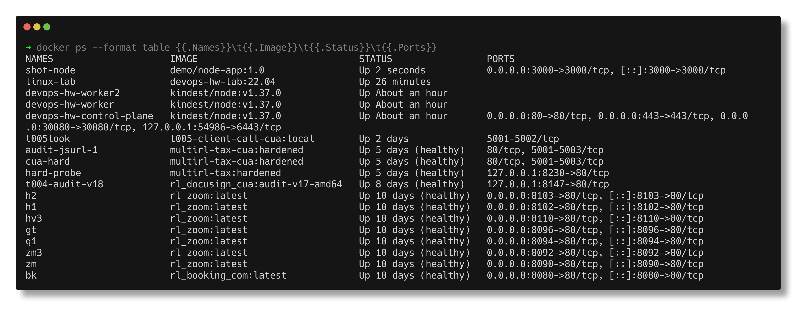
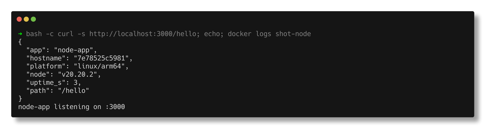

# Docker Fundamentals

> **Submitted by:** Pratyush Mohanty  |  **Roll No.:** 24BCS10238

**Form field:** Docker Fundamentals  ·  **Course session:** `session6-7-docker`

Run it: `./run.sh`  ·  Verified output: [output.md](output.md)

Two small apps are built and run to demonstrate the container lifecycle:
[node-app/](node-app/) (Node 20) and [python-app/](python-app/) (Python 3.12).

---

## 1. Image vs container

- **IMAGE** is a read-only template: a filesystem plus metadata. Like a class.
- **CONTAINER** is a running instance of an image with a thin writable layer on
  top. Like an object.

One image, many containers, each isolated.

## 2. Running one, and publishing a port

```text
$ docker run -d --name demo-node -p 3000:3000 demo/node-app:1.0

NAMES       IMAGE               STATUS         PORTS
demo-node   demo/node-app:1.0   Up 2 seconds   0.0.0.0:3000->3000/tcp

$ curl http://localhost:3000/hello
  {
    "app": "node-app",
    "hostname": "f0add644144f",
    "platform": "linux/arm64",
    "node": "v20.20.2"
  }
```

`-p HOST:CONTAINER` forwards a host port into the container. **Without `-p` the
port is unreachable from outside** even though the process is listening happily.

> A real snag hit while writing this: `-p 5000:5000` failed with
> `bind: address already in use`, because macOS runs the AirPlay Receiver on
> port 5000. The host port must be free; the container port does not care. The
> script uses `-p 5001:5000` instead.



## 3. One image, many configurations

```text
$ docker run -d --name demo-py -p 5001:5000 -e APP_NAME=custom-name demo/python-app:1.0
  { "app": "custom-name", ... }
```

`-e` overrode the `ENV` baked into the image. This is how a single tested
artifact serves dev, staging and production: configuration is injected at
runtime, never built in.

## 4. The lifecycle

```text
created -> running -> paused -> stopped -> removed

  after run                    running
  after pause                  paused
  after unpause                running
  after stop                   exited (exit 137, took 1s)
  after start (restarted)      running
```

A **stopped** container still exists. Its writable layer is on disk and
`docker start` brings it back. It is gone only after `docker rm`, which is why
`docker ps -a` matters.

### Exit 137 is worth understanding

```text
  >>> EXIT 137 = 128 + 9 = SIGKILL.
      docker stop sends SIGTERM first and waits 10s. This app never installs a
      SIGTERM handler, so it ignored it and Docker had to SIGKILL it.
```

A well-behaved app traps SIGTERM, finishes in-flight requests and exits 0. One
that does not gets killed on every deploy, dropping live requests. The same
applies to Kubernetes, which sends SIGTERM before its grace period too.

## 5. Logs

```text
$ docker logs demo-node
  node-app listening on :3000
```

`docker logs` captures **stdout and stderr**. This is why containerised apps
should log to stdout rather than to a file: a log file inside a container
disappears with the container.

```bash
docker logs -f <c>          # follow
docker logs --tail 50 <c>   # last 50 lines
docker logs --since 10m <c> # recent only
```



## 6. Exec, and PID 1

```text
$ docker exec demo-node whoami
  node
```

Not root, because the Dockerfile sets `USER node`. Containers run as root by
default, which means a container escape starts from root on the host.

The application is **PID 1** inside the container. There is no init system, so
PID 1 must handle signals itself and reap any zombie children.

## 7. Resource limits

```text
$ docker run -d --memory=64m --cpus=0.5 demo/node-app:1.0
  memory limit : 67108864 bytes
  cpu quota    : 500000000 nano-cpus (1e9 = 1 core)
```

**A container is not limited by default.** Without `--memory` it can consume all
host RAM and take the machine down. These flags are what Kubernetes `resources.limits`
map onto.

`docker stats` shows live usage.

## 8. Restart policies

```text
no              default, never restart
on-failure[:N]  restart only on a non-zero exit, at most N times
always          always restart, including when the daemon starts
unless-stopped  like always, but not if you stopped it manually
```

## 9. Cleaning up

```bash
docker stop $(docker ps -q)      # stop all running
docker rm -f $(docker ps -aq)    # force remove all
docker rmi $(docker images -q)   # remove all images
docker system df                 # what is using disk
docker system prune -a           # remove everything unused (destructive)
```

---

## Interview Q&A

**Q: Container vs virtual machine?**
A VM virtualises hardware and runs a full guest OS, so it boots in seconds to
minutes and costs gigabytes. A container shares the host kernel and isolates only
the process using namespaces and cgroups, so it starts in milliseconds and costs
megabytes. Containers are isolation of processes, not of machines.

**Q: What actually provides the isolation?**
Linux **namespaces** (pid, net, mnt, uts, ipc, user) give a container its own
view of the system, and **cgroups** limit how much CPU, memory and IO it can use.
Docker orchestrates both; it did not invent either.

**Q: `docker stop` vs `docker kill`?**
`stop` sends SIGTERM, waits (10s by default), then SIGKILL. `kill` sends SIGKILL
immediately. Exit 137 tells you the SIGKILL path was taken, which usually means
the app ignores SIGTERM.

**Q: Why do my container's files disappear?**
The writable layer is deleted with the container. Anything that must persist
belongs in a volume or a bind mount.

**Q: `EXPOSE` vs `-p`?**
`EXPOSE` in a Dockerfile is documentation only and publishes nothing. `-p`
actually maps a host port to a container port.

**Q: Why should a container not run as root?**
A container escape or a vulnerability in the app then starts with root on the
host. Add a user in the Dockerfile and set `USER`, as both apps here do.

**Q: Why is `docker ps` empty when my container "exists"?**
`docker ps` lists only running containers. Use `docker ps -a` to see stopped
ones, then `docker logs` to find out why it exited.

---

## Homework: Hello World apps in six stacks

The homework's six apps are in [hello-world-apps/](hello-world-apps/README.md), one
folder each with its code and Dockerfile: `nodejs-app`, `python-app`, `java-app`,
`Apache-app`, `React-app` and `nginx-app`. `hello-world-apps/run.sh` builds and runs all
six on ports 8081-8086 and checks that "Hello World" is on every page, including the
React one, which only appears after the browser runs its JavaScript.

| App | Port | Image size |
|---|---|---|
| nodejs-app (Express) | 8081 | 246MB |
| python-app (Flask + gunicorn) | 8082 | 212MB |
| java-app (JDK HTTP server, multi-stage) | 8083 | 286MB |
| Apache-app (httpd) | 8084 | 115MB |
| React-app (Vite build -> nginx, multi-stage) | 8085 | 92.4MB |
| nginx-app | 8086 | 92.1MB |

Output: [hello-world-apps/output.md](hello-world-apps/output.md) · browser screenshots of
every page in the [hello-world-apps README](hello-world-apps/README.md#in-the-browser).
