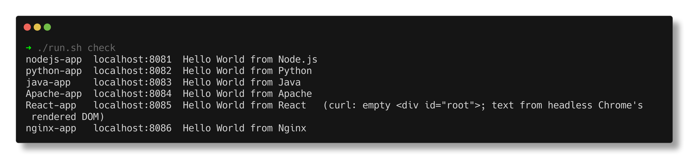
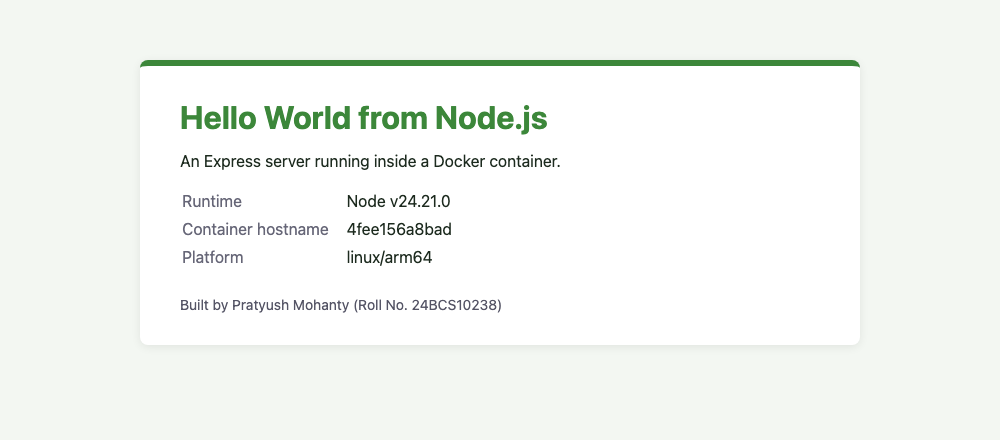
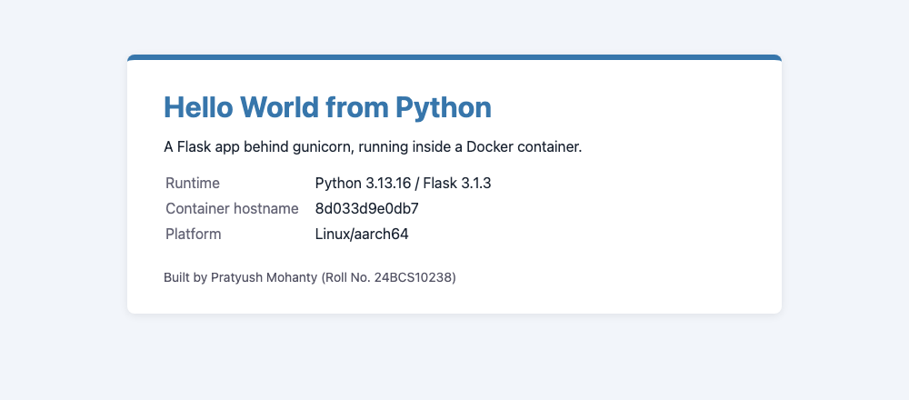
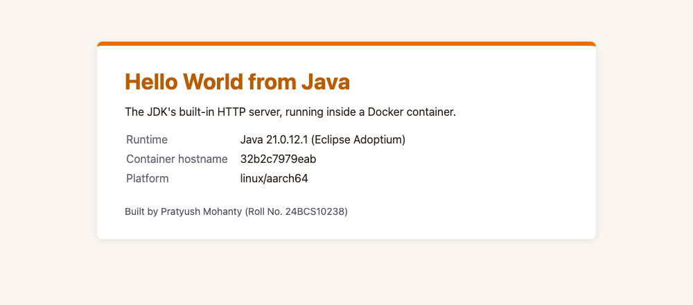
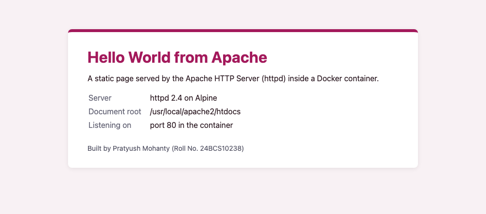
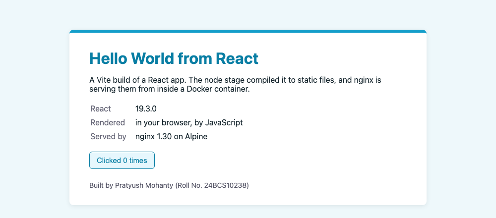
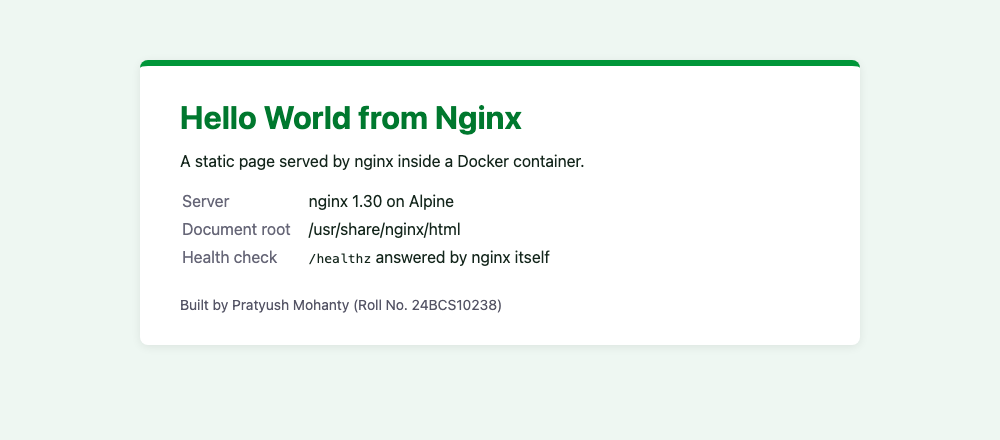
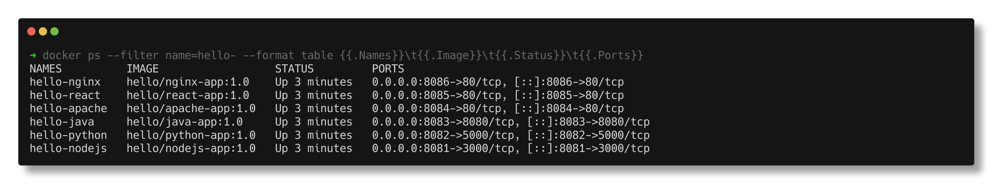
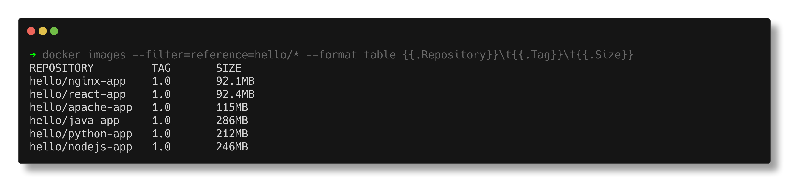

# Hello World Apps in Docker

> **Submitted by:** Pratyush Mohanty  |  **Roll No.:** 24BCS10238

**Form field:** Docker Homework - Hello World Applications · **Course session:** `session6-7-docker`

Run it: `./run.sh` · Verified output: [output.md](output.md)

Six small web apps, one folder each (folder names exactly as the homework asks),
each with its own code and Dockerfile. Every one was built, run and checked on this
Mac (Apple Silicon, Docker Desktop, engine 29.6.1).

| Folder | Stack | Base image(s) | Host port | Container port | Image size |
|---|---|---|---|---|---|
| [nodejs-app](nodejs-app/) | Node.js 24 + Express 5 | `node:24-alpine` | 8081 | 3000 | 246MB |
| [python-app](python-app/) | Python 3.13 + Flask 3.1 + gunicorn | `python:3.13-slim` | 8082 | 5000 | 212MB |
| [java-app](java-app/) | Java 21, JDK built-in HTTP server | `eclipse-temurin:21-jdk-alpine` -> `21-jre-alpine` | 8083 | 8080 | 286MB |
| [Apache-app](Apache-app/) | Apache httpd 2.4, static page | `httpd:2.4-alpine` | 8084 | 80 | 115MB |
| [React-app](React-app/) | React 19 + Vite 8, served by nginx | `node:24-alpine` -> `nginx:1.30-alpine` | 8085 | 80 | 92.4MB |
| [nginx-app](nginx-app/) | nginx 1.30, static page | `nginx:1.30-alpine` | 8086 | 80 | 92.1MB |

Sizes are from `docker images` after the build (unpacked size on disk).

```bash
./run.sh            # build all six, run all six, verify
./run.sh check      # one line per app: is "Hello World" on the page?
./run.sh shots      # screenshots into screenshots/
./run.sh cleanup    # stop + remove containers and images
```

Or one app by hand, e.g.:

```bash
docker build -t hello/python-app:1.0 ./python-app
docker run -d --name hello-python -p 8082:5000 hello/python-app:1.0
curl -s http://localhost:8082/ | grep -o 'Hello World from [A-Za-z.]*'
```

---

## 1. Hello World on each page

```text
nodejs-app   http://localhost:8081  HTTP 200  Hello World from Node.js
python-app   http://localhost:8082  HTTP 200  Hello World from Python
java-app     http://localhost:8083  HTTP 200  Hello World from Java
Apache-app   http://localhost:8084  HTTP 200  Hello World from Apache
React-app    http://localhost:8085  HTTP 200  (not in the raw HTML)
nginx-app    http://localhost:8086  HTTP 200  Hello World from Nginx
```

React is the odd one out, which is correct: curl only receives the HTML shell, and
the text is put on the page by JavaScript in the browser.

```text
$ curl -s http://localhost:8085/ | grep -E 'root|script'
  <script type="module" crossorigin src="/assets/index-CQH-phKj.js"></script>
  <div id="root"></div>

  Headless Chrome, DOM after rendering:
    <h1>Hello World from React</h1>
```



### In the browser

Real headless Chrome screenshots of each page (taken while the containers were running):

| | |
|---|---|
|  `localhost:8081` |  `localhost:8082` |
|  `localhost:8083` |  `localhost:8084` |
|  `localhost:8085` |  `localhost:8086` |

The "Container hostname" on the Node, Python and Java pages is the container ID, which
matches `docker ps`. That is a quick way to prove the page really came from the container.

## 2. All six running

```text
NAMES          IMAGE                  STATUS          PORTS
hello-nginx    hello/nginx-app:1.0    Up 4 seconds    0.0.0.0:8086->80/tcp
hello-react    hello/react-app:1.0    Up 5 seconds    0.0.0.0:8085->80/tcp
hello-apache   hello/apache-app:1.0   Up 6 seconds    0.0.0.0:8084->80/tcp
hello-java     hello/java-app:1.0     Up 7 seconds    0.0.0.0:8083->8080/tcp
hello-python   hello/python-app:1.0   Up 9 seconds    0.0.0.0:8082->5000/tcp
hello-nodejs   hello/nodejs-app:1.0   Up 10 seconds   0.0.0.0:8081->3000/tcp
```





## 3. Notes on each Dockerfile

**nodejs-app** - `package.json` and `package-lock.json` are copied before `server.js`,
so the `npm ci` layer stays cached until a dependency changes. `npm ci --omit=dev`
installs exactly what the lockfile says and nothing for development. Runs as the
image's built-in `node` user. `server.js` handles SIGTERM, so `docker stop` gets a
clean exit 0 instead of the 10 second wait and SIGKILL (exit 137) seen in the main
Docker Fundamentals notes.

**python-app** - `python:3.13-slim` (Debian) rather than alpine: Python wheels are
built for glibc, and on musl some packages fall back to compiling from source.
`PYTHONUNBUFFERED=1` makes log lines reach `docker logs` straight away. The app is
served by gunicorn with 2 workers, not `flask run`, which is a development server.
Runs as a non-root `appuser`.

**java-app** - a real multi-stage build. Stage 1 uses the full JDK to `javac` and
`jar` one class; stage 2 copies only `hello.jar` onto the JRE image. The JDK base is
556MB and the JRE base 287MB (both from `docker images`), so shipping the JRE alone
roughly halves the image. No Maven and no framework: the JDK's own
`com.sun.net.httpserver` is enough for a page, with virtual threads handling requests.

**Apache-app** - `httpd:2.4-alpine` with the page copied into
`/usr/local/apache2/htdocs/`. Two lines appended to `httpd.conf`: `ServerName localhost`
removes the AH00558 warning printed on every start, and `ServerTokens Prod` stops the
`Server` header advertising the exact version.

**React-app** - multi-stage again: `node:24-alpine` runs `npm ci` and `vite build`, and
only the `dist/` folder (HTML, one JS bundle, one CSS file) is copied onto
`nginx:1.30-alpine`. Node, `node_modules` and the source never reach the final image,
which is why it is 92.4MB while the node base alone is 238MB. `nginx.conf` sends unknown
paths back to `index.html` (single-page app routing) and caches the hashed `/assets/` files.

**nginx-app** - `nginx:1.30-alpine` with its own `default.conf` (`server_tokens off`
and a `/healthz` endpoint answered by nginx itself) and the page in `html/`.

Common to all six: pinned tags (never `:latest`), a `.dockerignore` where there is
something to keep out of the build context, and `EXPOSE` for documentation only.
The `-p HOST:CONTAINER` on `docker run` is what actually publishes the port.

## 4. Which user is running what

```text
  hello-nodejs   node:MainThread x1
  hello-python   appuser:gunicorn x3
  hello-java     app:java x1
  hello-apache   root:httpd x1   www-data:httpd x3
  hello-react    nginx:nginx x15   root:nginx x1
  hello-nginx    nginx:nginx x15   root:nginx x1
```

The three app images run everything as a non-root user. httpd and nginx keep one root
master process (to bind port 80) and serve requests from unprivileged workers. nginx
starts 15 workers because `worker_processes auto` means one per CPU, and this Docker
Desktop VM has 15.

---

## Notes from actually running this

- **Docker Hub rate limit.** The first pulls failed with
  `429 Too Many Requests` (`ratelimit-remaining: 0;w=3600` for this IP), because several
  things on this machine were pulling anonymously at once. After `docker login` the pulls
  went through. `run.sh` now uses an image if it is already local, and otherwise retries
  with a growing wait instead of failing on the first 429.
- **React text is not in the HTML.** My first check grepped every page with curl and the
  React one "failed". It was the check that was wrong: client-side rendering. The script
  now checks the JS bundle and renders the page in headless Chrome (`--dump-dom`).
- **Headless Chrome did not exit.** On this Mac it wrote the screenshot and then hung.
  `run.sh` starts it in the background, waits for the file, then kills that one process
  (matched by its temporary profile directory).
- **favicon.ico returns 200 on the React app.** The SPA fallback (`try_files ... /index.html`)
  answers any missing file with `index.html`. Fine for routes, slightly misleading for
  real missing files.
- **Build times of 1s** in output.md are BuildKit's cache: the layers already existed
  from an earlier build. A cold build of the React app takes longer (it runs `npm ci`
  and `vite build`).
- **Stop exit codes.** Node exits 0 (SIGTERM handler). Java exits 143 (128 + 15): the
  JVM runs its shutdown hook on SIGTERM and then reports the signal, which is normal.
  httpd's image sets `STOPSIGNAL SIGWINCH`, Apache's graceful stop
  (`caught SIGWINCH, shutting down gracefully` in its log). In the cleanup captured in
  output.md gunicorn and httpd reported 137 after 1-2 seconds; I stopped both three more
  times afterwards and got exit 0 every time, with clean shutdown lines in the logs, so I
  could not reproduce it.
- **`docker images` shows some bases bigger than the app built on them** (httpd 116MB vs
  115MB, nginx 92.9MB vs 92.1MB). The compressed download size is identical, so this is
  a reporting quirk of the containerd image store, not the app making the image smaller.
- Requests from the Mac show up in the container logs as `192.168.65.1`: Docker Desktop's
  VM gateway, because the container runs inside a Linux VM, not on macOS directly.

## Interview Q&A

**Q: Why copy `package.json` before the source code?**
Layers are cached in order. The dependency install only reruns when the manifest
changes, instead of on every code edit.

**Q: `npm install` vs `npm ci` in a Dockerfile?**
`npm ci` installs exactly what `package-lock.json` says and fails if it disagrees with
`package.json`, so builds are reproducible. `npm install` may resolve newer versions.

**Q: Why serve a React app with nginx instead of `npm start`?**
`npm start` runs a development server. A production React build is just static files,
and nginx serves static files faster with a far smaller image (92MB here) and no Node.

**Q: Why gunicorn instead of `flask run`?**
The Flask server is for development: one process, warns against production use.
gunicorn runs several worker processes and handles signals properly.

**Q: What does the multi-stage build buy the Java app?**
The compiler and the rest of the JDK stay in the build stage. The runtime image only has
the JRE and one jar: 286MB instead of a 556MB+ JDK image.

**Q: Why does nginx run as root inside the container?**
Only the master process does, to bind port 80 and read config. Workers that handle
requests run as the `nginx` user. Images like `nginxinc/nginx-unprivileged` listen on
8080 so even the master can be non-root.

**Q: Alpine or slim?**
Alpine (musl) is smaller and fine for Node, Java and static servers. For Python, slim
(glibc) avoids compiling packages from source because most wheels target glibc.
