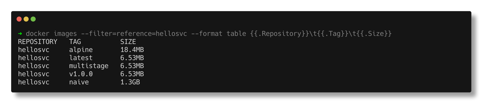
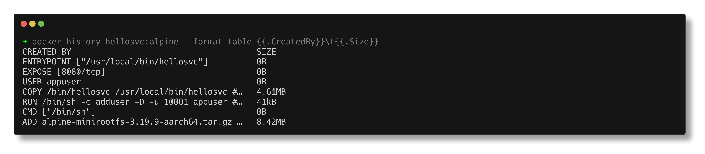

# Docker Images

> **Submitted by:** Pratyush Mohanty  |  **Roll No.:** 24BCS10238

**Form field:** Docker Images  ·  **Course session:** `session6-7-docker`

Run it: `./run.sh`  ·  Verified output: [output.md](output.md)

The same tiny Go HTTP service is built three different ways, and the difference
is measured rather than asserted.

| File | What it shows |
|---|---|
| [Dockerfile.naive](Dockerfile.naive) | Ships the whole Go toolchain to production |
| [Dockerfile.multistage](Dockerfile.multistage) | Builds in one stage, ships only the binary onto `scratch` |
| [Dockerfile.alpine](Dockerfile.alpine) | Multi-stage onto alpine, keeping a shell for debugging |
| [.dockerignore](.dockerignore) | Keeps junk out of the build context |

---

## 1. The result

```text
  IMAGE                       ON DISK       DOWNLOAD
  ---------------------- ------------ --------------
  hellosvc:naive                1.3GB       293.9 MB
  hellosvc:alpine              18.4MB         5.0 MB
  hellosvc:multistage          6.53MB         1.8 MB

    naive is 159x larger than the multi-stage build
    every pull saves 292.1 MB  -  on every node, on every deploy
```

Two numbers are reported because this Docker uses the **containerd snapshotter**,
where they genuinely differ:

- **ON DISK** (`docker images`) is the uncompressed size once unpacked on a node.
- **DOWNLOAD** (`docker image inspect .Size`) is the sum of the compressed layers,
  which is what actually crosses the network on a pull.



## 2. Why the naive image is so big

```text
$ docker run --rm hellosvc:naive sh -c 'go version; du -sh /usr/local/go'
  go version go1.22.12 linux/arm64
  251M	/usr/local/go
```

A quarter of a gigabyte of **compiler** that the running service never touches.
It is pure bandwidth cost and pure attack surface.

## 3. What multi-stage actually does

```dockerfile
FROM golang:1.22 AS builder
RUN CGO_ENABLED=0 GOOS=linux go build -ldflags="-s -w" -o /bin/hellosvc .

FROM scratch
COPY --from=builder /bin/hellosvc /hellosvc
```

`COPY --from=builder` reaches into the previous stage and takes **only the
artifact**. Everything else in that stage is discarded.

- `CGO_ENABLED=0` produces a statically linked binary with no libc dependency,
  which is what makes `scratch` (a completely empty image) possible.
- `-ldflags="-s -w"` strips the symbol table and DWARF debug info.

`scratch` really is empty:

```text
$ docker run --rm --entrypoint ls hellosvc:multistage
  -> exec: "ls"
$ docker run --rm --entrypoint sh hellosvc:multistage
  -> exec: "sh"
```

No shell, no `ls`, no package manager. Excellent for security, awkward for
debugging, which is the trade-off `Dockerfile.alpine` makes for 12 MB more.

> A gotcha worth knowing: the image sets `ENTRYPOINT ["/hellosvc"]`, so a plain
> `docker run image ls` runs `/hellosvc ls` and starts the server instead of
> failing. You need `--entrypoint` to actually test this.

## 4. Layers

```text
$ docker history hellosvc:alpine
CREATED BY                                      SIZE
ENTRYPOINT ["/usr/local/bin/hellosvc"]          0B
USER appuser                                    0B
COPY /bin/hellosvc /usr/local/bin/hellosvc      4.61MB
RUN /bin/sh -c adduser -D -u 10001 appuser      41kB
ADD alpine-minirootfs-3.19.9-aarch64.tar.gz     8.42MB
```

Each instruction that changes the filesystem creates a layer. Metadata-only
instructions (`ENTRYPOINT`, `USER`, `EXPOSE`) cost 0 bytes. Layers are
content-addressed and shared, so a second alpine-based image only downloads the
layers you do not already have.



## 5. The build cache, proven

BuildKit prints each step as `#N [description]` and separately prints `#N CACHED`
for the ones it reused. Pairing them shows exactly what was rebuilt.

**Rebuild with no source change:**
```text
    CACHED    [builder 2/4] WORKDIR /src
    CACHED    [builder 3/4] COPY app/ ./
    CACHED    [builder 4/4] RUN CGO_ENABLED=0 GOOS=linux go build ...
    CACHED    [stage-1 2/3] RUN adduser -D -u 10001 appuser
    CACHED    [stage-1 3/3] COPY --from=builder /bin/hellosvc ...
```

**After appending one comment to `app/main.go`:**
```text
    CACHED    [builder 2/4] WORKDIR /src
    REBUILT   [builder 3/4] COPY app/ ./
    REBUILT   [builder 4/4] RUN CGO_ENABLED=0 GOOS=linux go build ...
    CACHED    [stage-1 2/3] RUN adduser -D -u 10001 appuser
    REBUILT   [stage-1 3/3] COPY --from=builder /bin/hellosvc ...
```

Read it line by line:

| step | result | why |
|---|---|---|
| `WORKDIR /src` | CACHED | comes **before** the COPY |
| `COPY app/ ./` | REBUILT | its input changed |
| `RUN go build` | REBUILT | comes **after** the changed COPY |
| `RUN adduser` | CACHED | different stage, nothing it uses changed |
| `COPY --from=builder` | REBUILT | the binary it copies is different |

**A changed layer invalidates itself and every layer after it, within its stage.**

> Getting this demo right took two attempts. The first version appended a fixed
> comment, so the second run produced byte-identical content that the previous
> run had already cached, and everything showed CACHED. The cache-busting change
> has to be unique per run.

### The rule that follows

**Put what changes least at the top of the Dockerfile.**

```dockerfile
COPY package*.json ./     # changes rarely
RUN npm ci                # expensive, stays cached
COPY . .                  # changes every commit
```

Copy everything first and `npm ci` reruns on every single commit.

## 6. Tags are pointers, not copies

```text
REPOSITORY   TAG          IMAGE ID       SIZE
hellosvc     latest       6aa6a49112cf   6.53MB
hellosvc     multistage   6aa6a49112cf   6.53MB
hellosvc     v1.0.0       6aa6a49112cf   6.53MB
```

Three tags, **one image ID**. And never deploy `:latest` in production: it is
mutable, so two clusters can run different code from the same tag with no way to
tell what actually shipped.

---

## Interview Q&A

**Q: What is a multi-stage build and why use one?**
Multiple `FROM` statements in one Dockerfile. Build tooling lives in an early
stage, and the final stage copies only the artifact with `COPY --from`. Here it
took the image from 1.3 GB to 6.53 MB, and removed the compiler from production.

**Q: Image vs container?**
An image is a read-only template made of stacked layers. A container is a running
instance with a thin writable layer on top. One image, many containers.

**Q: Why does image size matter?**
Pull time on every node and every deploy, registry storage and egress cost, and
attack surface. A compiler and package manager in a production image are things
an attacker can use after a breakout.

**Q: How does the build cache work, and how do you use it well?**
Each instruction's result is cached and reused while its inputs are unchanged.
A changed layer invalidates every layer after it. So order instructions from
least-frequently-changed to most, and copy dependency manifests before source.

**Q: `COPY` vs `ADD`?**
`COPY` just copies. `ADD` also auto-extracts local tar archives and can fetch
URLs, which is surprising behaviour you rarely want. Use `COPY` unless you
specifically need extraction.

**Q: `CMD` vs `ENTRYPOINT`?**
`ENTRYPOINT` is the executable; `CMD` provides default arguments to it. With an
`ENTRYPOINT` set, anything you pass to `docker run` becomes arguments rather than
replacing the command, which is exactly the `--entrypoint` gotcha above.

**Q: What is `scratch`?**
A completely empty base image: no shell, no libc, no utilities. Only usable with
a statically linked binary, and it gives the smallest and most locked-down image
possible at the cost of being undebuggable from inside.

**Q: What is `.dockerignore` for?**
It excludes files from the build context sent to the daemon. Without it `.git`
and build artifacts are uploaded on every build, slowing builds and risking
secrets being baked into an image.

---

## Homework: run the course's multi-stage Dockerfile

[multi-stage-homework/](multi-stage-homework/README.md) clones the course repository,
builds `session6-7-docker/multi-stage-dockerfile`, runs it on **host port 8080**
(`0.0.0.0:8080->3000/tcp`) and checks for
"Hello World from Docker Multi-Stage Build!". It also builds the same app single-stage
for comparison (255MB vs 249MB - small, because that app has no build step, unlike the
Go service above) and deploys Node.js, Python and Java apps for Task 3.

Name, roll number, screenshots and output: [multi-stage-homework/README.md](multi-stage-homework/README.md)
· [output.md](multi-stage-homework/output.md)
