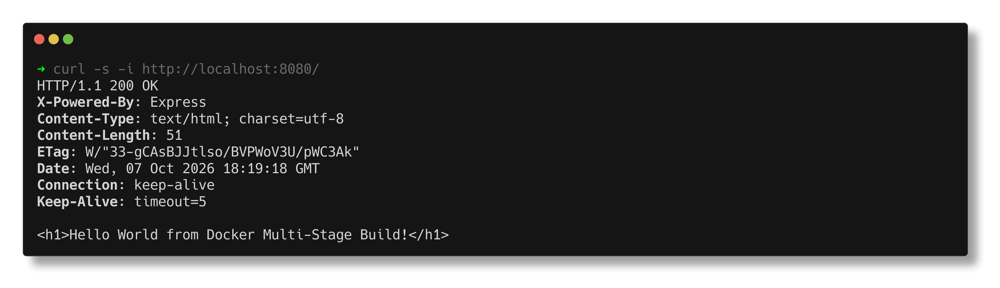
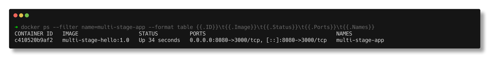
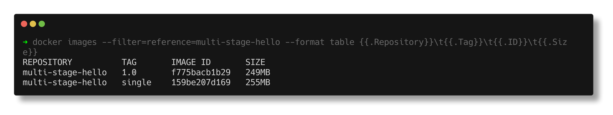
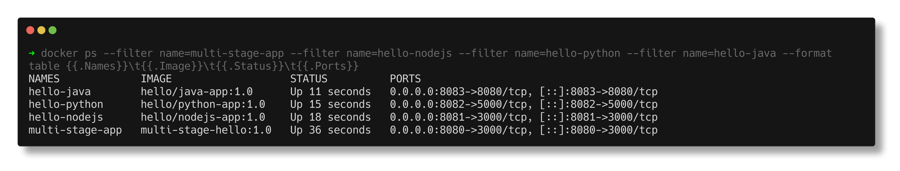

# Docker Multi-Stage Build Homework

> **Submitted by:** Pratyush Mohanty  |  **Roll No.:** 24BCS10238

**Form field:** Docker Multi-Stage Build Homework · **Course session:** `session6-7-docker`

| | |
|---|---|
| **Name** | Pratyush Mohanty |
| **Enrollment / Roll No.** | 24BCS10238 |
| **Date** | 2026-10-07 |
| **Machine** | macOS on Apple Silicon, Docker Desktop (engine 29.6.1) |

Run it: `./run.sh` · Verified output: [output.md](output.md)

`run.sh` clones the course repository into a temporary directory (not into this repo),
builds `session6-7-docker/multi-stage-dockerfile`, runs it on host port 8080, checks
it, builds a single-stage version for comparison, deploys three more apps (Task 3) and
deletes the clone at the end. `./run.sh shots` takes the screenshots, `./run.sh cleanup`
removes everything.

---

## Task 1 - Run the multi-stage Dockerfile

### Clone and build

```text
$ git clone --depth 1 https://github.com/Nency-Ravaliya/devops-heros.git
  cloned commit 8376590 (2026-10-05) replicas from 2 to 5

$ ls session6-7-docker/multi-stage-dockerfile
  Dockerfile
  package.json
  server.js

$ docker build -t multi-stage-hello:1.0 .
  build OK. Steps BuildKit ran, per stage:
    [builder 1/5] FROM docker.io/library/node:24-alpine@sha256:ebfe2f90462722a7a4de65e9199
    [builder 2/5] WORKDIR /app
    [builder 3/5] COPY package*.json ./
    [builder 4/5] RUN npm install
    [builder 5/5] COPY . .
    [production 3/5] COPY --from=builder /app/package*.json ./
    [production 4/5] RUN npm install --omit=dev
    [production 5/5] COPY --from=builder /app/server.js ./
```

### Run it on port 8080 and access it

The app listens on 3000 inside the container, so the host's 8080 is mapped to it:

```text
$ docker run -d --name multi-stage-app -p 8080:3000 multi-stage-hello:1.0
  c410520b9af2

$ docker logs multi-stage-app

  > docker-hello-world@1.0.0 start
  > node server.js

  Server running on port 3000

$ curl -i http://localhost:8080/
  HTTP/1.1 200 OK
  X-Powered-By: Express
  Content-Type: text/html; charset=utf-8
  Content-Length: 51

  <h1>Hello World from Docker Multi-Stage Build!</h1>
```

**Screenshot - the application in the browser at `http://localhost:8080/`:**




### Verify with `docker ps` - running on port 8080

```text
$ docker ps --filter name=multi-stage-app
CONTAINER ID   IMAGE                   STATUS         PORTS                                         NAMES
c410520b9af2   multi-stage-hello:1.0   Up 3 seconds   0.0.0.0:8080->3000/tcp, [::]:8080->3000/tcp   multi-stage-app

$ docker port multi-stage-app
  3000/tcp -> 0.0.0.0:8080
  3000/tcp -> [::]:8080

$ lsof -nP -iTCP:8080 -sTCP:LISTEN     (on the Mac itself)
  COMMAND    TYPE  NODE  NAME
  com.docke  IPv6  TCP   *:8080  (LISTEN)
```

**Screenshot - `docker ps` showing the container on port 8080:**



`0.0.0.0:8080->3000/tcp` reads as "anything arriving on port 8080 of the host goes to
port 3000 in the container". On the Mac the listener is Docker Desktop's backend
(`com.docker.backend`, cut to 9 characters by `lsof`), which forwards into the Linux VM.

---

## The two stages

```dockerfile
FROM node:24-alpine AS builder          # stage 1: "builder"
WORKDIR /app
COPY package*.json ./
RUN npm install                         # all dependencies, creates package-lock.json
COPY . .

FROM node:24-alpine AS production       # stage 2: what actually ships
WORKDIR /app
COPY --from=builder /app/package*.json ./
RUN npm install --omit=dev              # production dependencies only
COPY --from=builder /app/server.js ./   # only the one file the app needs
EXPOSE 3000
CMD ["npm", "start"]
```

- **Stage 1 (`builder`)** gets the full source and installs everything. In a bigger app
  this is where tests, TypeScript compilation or a bundler would run.
- **Stage 2 (`production`)** starts again from a clean `node:24-alpine`. `COPY --from=builder`
  takes only `package.json`, `package-lock.json` and `server.js` out of stage 1. Everything
  else in stage 1 (its `node_modules`, any dev tools, the stray `Dockerfile` copied by
  `COPY . .`) is thrown away. Only the last stage becomes the image.

`docker history` confirms that only stage 2's layers are in the image:

```text
CREATED BY                                      SIZE
CMD ["npm" "start"]                             0B
EXPOSE [3000/tcp]                               0B
COPY /app/server.js ./ # buildkit               12.3kB
RUN /bin/sh -c npm install --omit=dev # buil…   9.44MB
COPY /app/package*.json ./ # buildkit           45.1kB
WORKDIR /app                                    8.19kB
CMD ["node"]                                    0B
```

## Multi-stage vs single-stage, measured

[Dockerfile.single-stage](Dockerfile.single-stage) is the builder stage shipped as it is,
built from the same cloned source:

```text
  IMAGE                         ON DISK     DOWNLOAD  LAYERS
  multi-stage-hello:single        255MB       64.9MB       8
  multi-stage-hello:1.0           249MB       64.0MB       8

--- what is in /app in each image ---
  multi-stage-hello:single   Dockerfile node_modules package-lock.json package.json server.js
                             node_modules: 65 packages, 4.3M
  multi-stage-hello:1.0      node_modules package-lock.json package.json server.js
                             node_modules: 65 packages, 4.3M

--- npm's download cache (/root/.npm) left behind in each image ---
  multi-stage-hello:single   7.5M   (66 package tarballs, 65 registry metadata documents)
  multi-stage-hello:1.0      2.1M   (66 package tarballs, 0 registry metadata documents)
```



**Only 6MB smaller, and I think that is the honest result for this app.** Its only
dependency is `express`, there are no devDependencies and no build step, so both images
end up with the same 65 packages. The 6MB comes from two side effects:

1. The stray `Dockerfile` that `COPY . .` dragged in (no `.dockerignore` in the course folder).
2. npm's cache. The single-stage `npm install` only had `package.json`, so npm downloaded
   every package's registry metadata to work out versions. The production stage received
   `package-lock.json` from the builder, so it fetched the exact tarballs and no metadata.
   A `npm cache clean --force` in the same `RUN` would remove the cache in both.

Multi-stage pays off when the build stage needs things the runtime does not. Measured
elsewhere in this repo:

| Case | Without multi-stage | With multi-stage |
|---|---|---|
| Go service ([docker-images](../README.md)) | 1.3GB (`golang` toolchain) | 6.53MB (`scratch`) |
| Java hello app ([java-app](../../docker-fundamentals/hello-world-apps/java-app/)) | JDK base alone is 556MB | 286MB (JRE + one jar) |
| React hello app ([React-app](../../docker-fundamentals/hello-world-apps/React-app/)) | node base alone is 238MB | 92.4MB (nginx + static files) |

---

## Task 3 - Three different types of application

The Node.js, Python and Java apps from
[docker-fundamentals/hello-world-apps](../../docker-fundamentals/hello-world-apps/README.md)
were built and run next to the multi-stage app by the same `run.sh`:

```text
$ docker run -d --name hello-nodejs -p 8081:3000 hello/nodejs-app:1.0
  43a738febecf
$ docker run -d --name hello-python -p 8082:5000 hello/python-app:1.0
  5a26eff1496d
$ docker run -d --name hello-java -p 8083:8080 hello/java-app:1.0
  1c1033bf61ad

  curl localhost:8081  ->  Hello World from Node.js
  curl localhost:8082  ->  Hello World from Python
  curl localhost:8083  ->  Hello World from Java

--- docker ps - the multi-stage app plus three different stacks ---
NAMES             IMAGE                   STATUS          PORTS
hello-java        hello/java-app:1.0      Up 2 seconds    0.0.0.0:8083->8080/tcp
hello-python      hello/python-app:1.0    Up 6 seconds    0.0.0.0:8082->5000/tcp
hello-nodejs      hello/nodejs-app:1.0    Up 9 seconds    0.0.0.0:8081->3000/tcp
multi-stage-app   multi-stage-hello:1.0   Up 27 seconds   0.0.0.0:8080->3000/tcp
```



| App | Stack | Port | How it is built |
|---|---|---|---|
| nodejs-app | Node.js 24 + Express | 8081 | single stage, `npm ci --omit=dev`, non-root `node` user |
| python-app | Python 3.13 + Flask + gunicorn | 8082 | single stage on `python:3.13-slim`, non-root user |
| java-app | Java 21 (JDK HTTP server) | 8083 | multi-stage: `javac` on the JDK, run on the JRE |

Browser screenshots of all three (and of the Apache, React and nginx apps) are in the
[hello-world-apps README](../../docker-fundamentals/hello-world-apps/README.md#in-the-browser).

---

## Notes from actually running this

- The homework text says the page shows "Hello World from Docker multi-stage build". The
  actual `server.js` in the course repo sends
  `<h1>Hello World from Docker Multi-Stage Build!</h1>`, and that is what was checked for.
- Port 8080 had to be free on the Mac; `lsof -nP -iTCP:8080 -sTCP:LISTEN` before the run
  showed nothing, after the run it shows Docker Desktop's listener.
- `CMD ["npm", "start"]` means npm is PID 1 and node is its child. That is why the log
  starts with npm's `> docker-hello-world@1.0.0 start` banner. `CMD ["node", "server.js"]`
  would make node PID 1 and save an extra process.
- The base image pull was blocked once by Docker Hub's anonymous rate limit
  (`429 Too Many Requests`); after `docker login` it went through.

## Interview Q&A

**Q: What is a multi-stage build?**
A Dockerfile with several `FROM` lines. Earlier stages build things, the last stage
copies in only what it needs with `COPY --from=<stage>`. Only the last stage is the image.

**Q: Does multi-stage always make the image smaller?**
No. It removes what the build needed and the runtime does not. Here both stages need
the same `express` package, so the gain was 6MB. For Go or Java it is hundreds of MB.

**Q: What does `-p 8080:3000` mean?**
Host port 8080 forwards to container port 3000. The app does not know or care about 8080.

**Q: `EXPOSE 3000` is in the Dockerfile, why is `-p` still needed?**
`EXPOSE` is documentation in the image metadata. Only `-p` (or `-P`) publishes a port.

**Q: How would you make this image smaller still?**
Add a `.dockerignore`, use `npm ci --omit=dev && npm cache clean --force`, start with
`node` instead of `npm`, and run as the `node` user.
