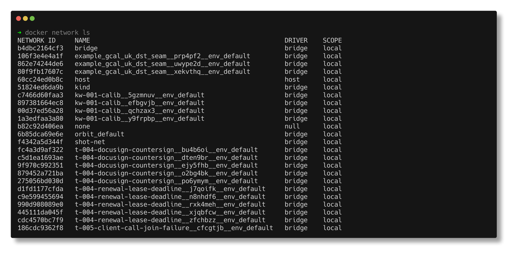
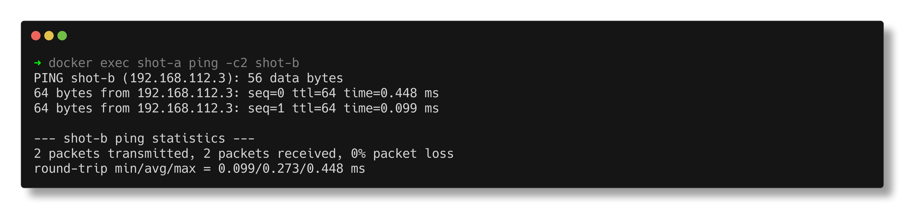
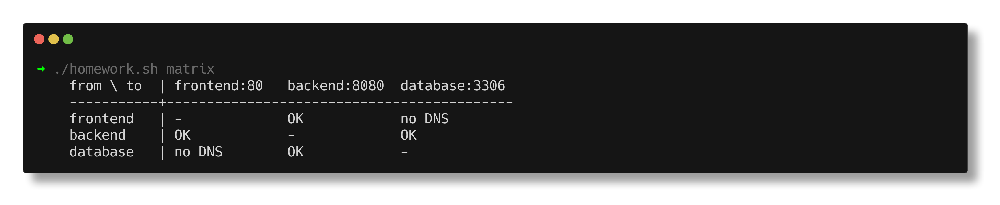
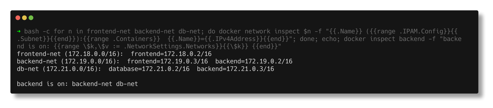
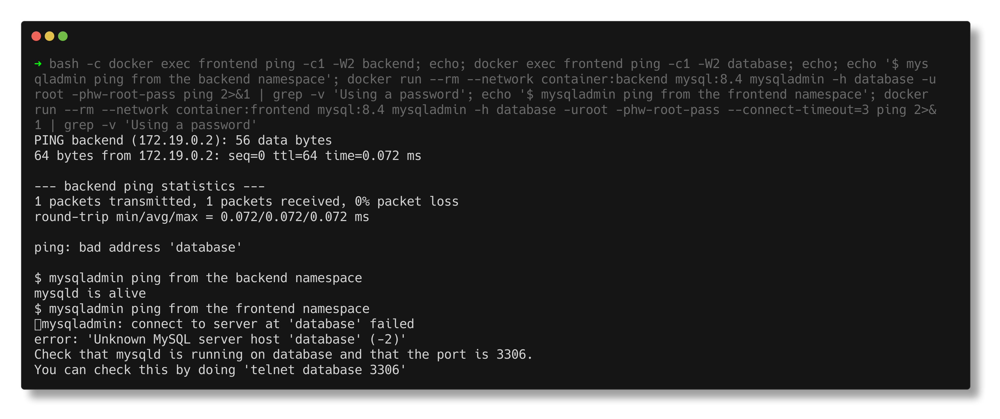
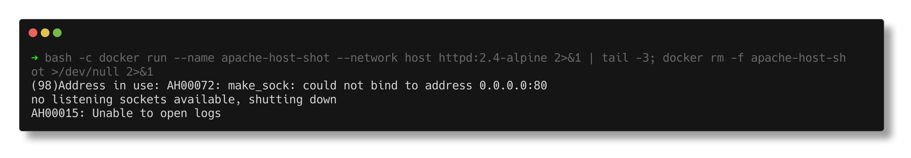
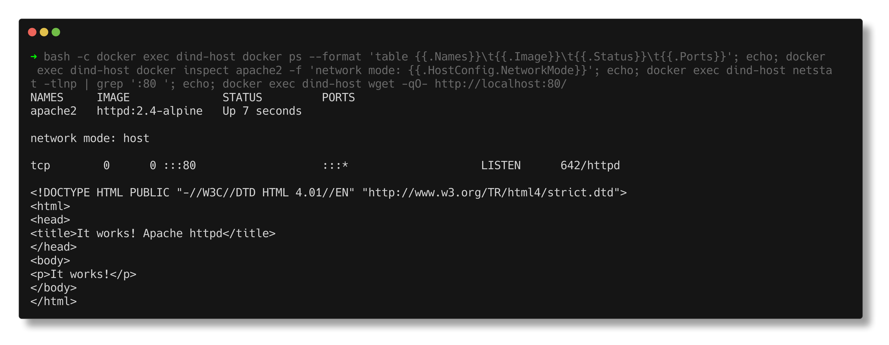
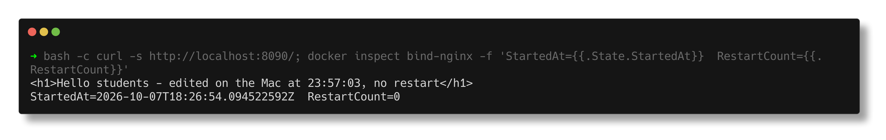

# Docker Networking

> **Submitted by:** Pratyush Mohanty  |  **Roll No.:** 24BCS10238

**Form field:** Docker Networking  ·  **Course session:** `session8-docker-networking-volume`

Run it: `./run.sh`  ·  Verified output: [output.md](output.md)

---

## 1. The three built-in network drivers

```text
bridge   the default. Containers get an IP on docker0 and reach the outside
         via NAT. NO automatic DNS between containers.
host     no isolation: the container uses the host's network stack directly.
none     no networking at all, loopback only.
```



## 2. The problem with the default bridge

Two containers on the default bridge:

```text
$ docker exec net-a ping -c1 net-b        (by NAME)
  ping: bad address 'net-b'

$ docker exec net-a ping -c1 172.17.0.13  (by IP)
  64 bytes from 172.17.0.13: seq=0 ttl=64 time=1.380 ms
```

**By IP it works. By name it fails.** The default bridge has no service
discovery, and container IPs change on every restart, so hardcoding them is not
an option either.

## 3. The fix: a user-defined bridge

```text
$ docker network create app-net
  subnet: 192.168.112.0/20  driver: bridge

$ docker exec net-a ping -c1 net-b        (by NAME, on app-net)
  64 bytes from 192.168.112.3: seq=0 ttl=64 time=0.294 ms
```

A user-defined bridge runs an **embedded DNS server at 127.0.0.11** that resolves
container names to their current IPs:

```text
$ cat /etc/resolv.conf
nameserver 127.0.0.11
```

**Always create a user-defined network for multi-container apps.** `docker
compose` does this automatically, which is exactly why compose services can reach
each other by service name.



## 4. Several networks at once

```text
  net-a networks: bridge(172.17.0.11) app-net(192.168.112.2)
```

One interface per network. This is how you isolate tiers: put the web container
on `frontend` and `backend`, and the database on `backend` only, so the database
is simply unreachable from outside.

## 5. Host and none

```text
  network mode: host   ip assigned: (none)
```

With `host` there is no separate IP and `-p` is ignored, because there is nothing
to forward. Faster (no NAT) but no isolation and real port collisions.

> On macOS, Docker runs inside a Linux VM, so `host` means *the VM*, not your
> Mac. This confuses a lot of people.

```text
$ docker exec net-none ip -brief addr
  lo    UNKNOWN    127.0.0.1/8 ::1/128
```

`none` gives loopback only, for batch jobs that must not touch the network.

## 6. Publishing ports

```text
EXPOSE 8080            Dockerfile: DOCUMENTATION only, publishes nothing
-p 8080:80             publish container port 80 as host port 8080
-p 127.0.0.1:8080:80   bind to localhost only, not reachable from the LAN
-P                     publish every EXPOSEd port to random high ports
```

Containers on the same user-defined network reach each other on the **container**
port directly. `-p` is only needed for traffic from outside.

## 7. Volumes: data that outlives the container

```text
$ docker run --rm -v demo-data:/data alpine sh -c 'echo "..." > /data/note.txt'
  (that container is then REMOVED)

$ docker run --rm -v demo-data:/data alpine cat /data/note.txt
  written at 19:14:29 by container 1
```

The data survived the container that created it. A container's writable layer is
deleted with the container; anything that must persist goes in a volume.

## 8. Bind mounts

```text
$ docker run -v /tmp/xyz:/mnt alpine cat /mnt/hostfile.txt
  host file content

  writing from the container:
  host file content
  added by container
```

Changes flow **both ways**.

```text
VOLUME       docker-managed, portable, best for DATA
BIND MOUNT   a specific host path, best for SOURCE CODE in development
tmpfs        in memory only, never written to disk, for secrets
```

---

## Interview Q&A

**Q: Why can't my containers talk to each other by name?**
They are on the default bridge, which has no DNS. Create a user-defined network
(`docker network create`) and attach them; it provides an embedded DNS server
that resolves container names.

**Q: bridge vs host vs none?**
`bridge` gives the container its own network namespace and IP with NAT to the
outside. `host` shares the host's stack, so no isolation, no `-p`, but no NAT
overhead. `none` gives loopback only.

**Q: Volume vs bind mount?**
A volume is managed by Docker in its own storage area, is portable and is the
right choice for data. A bind mount maps a specific host path, which is ideal for
mounting source code during development but ties you to the host's layout.

**Q: How do you isolate a database from the internet but keep it reachable by the app?**
Put both on a `backend` network, put the web container additionally on a
`frontend` network, and publish ports only on the web container. The database has
no published port and no route from outside.

**Q: What happens to data when a container is removed?**
Everything in its writable layer is deleted. Only volumes and bind mounts survive.

**Q: Does `EXPOSE` publish a port?**
No. It is documentation in the image metadata. `-p` (or `-P`) is what actually
publishes.

---

# Homework tasks (Docker Networking & Volume)

Run it: `./homework.sh` (or `task1`, `task2`, `task3`; `SHOTS=1` also takes the
screenshots) · Verified output: [homework-output.md](homework-output.md)

Files: [homework.sh](homework.sh), [homework/backend/default.conf](homework/backend/default.conf)
(the backend's JSON stand-in API), [homework/frontend/index.html](homework/frontend/index.html),
[bind-mount-site/index.html](bind-mount-site/index.html) (Task 3).

## Task 1 - frontend, backend, database on three networks

| Container | Image | Networks at the end |
|---|---|---|
| `frontend` | `nginx:1.30-alpine` | frontend-net, backend-net |
| `backend` | `nginx:1.30-alpine` (answers JSON on 8080) | **backend-net, db-net** (2 networks) |
| `database` | `mysql:8.4` | db-net |

I built it up in three steps so each `docker network connect` shows its effect.
Each cell asks "can this container resolve the other's name and open a TCP
connection to its service port?"

**1. One network each - everything isolated:**

```text
    from \ to  | frontend:80   backend:8080  database:3306
    -----------+-------------------------------------------
    frontend   | -             no DNS        no DNS
    backend    | no DNS        -             no DNS
    database   | no DNS        no DNS        -
```

**2. `docker network connect db-net backend` - the backend is now on 2 networks:**

```text
$ docker exec backend ip -o -f inet addr show      (one interface per network)
  lo    127.0.0.1/8
  eth0  172.22.0.2/16
  eth1  172.23.0.3/16

    from \ to  | frontend:80   backend:8080  database:3306
    -----------+-------------------------------------------
    frontend   | -             no DNS        no DNS
    backend    | no DNS        -             OK
    database   | no DNS        OK            -
```

**3. `docker network connect backend-net frontend` - so the frontend can call the API:**

```text
    from \ to  | frontend:80   backend:8080  database:3306
    -----------+-------------------------------------------
    frontend   | -             OK            no DNS
    backend    | OK            -             OK
    database   | no DNS        OK            -
```

frontend -> backend -> database works, and the frontend has **no path at all** to the
database. The backend, on 2 networks, is the only way into the data tier.



The same thing with real tools (from [homework-output.md](homework-output.md)):

```text
$ docker exec frontend wget -qO- http://backend:8080/
  {"service":"backend","db_host":"database:3306","status":"ok"}

$ docker exec frontend ping -c 2 database
  ping: bad address 'database'

$ docker exec backend ping -c 2 database
  64 bytes from 172.23.0.2: seq=0 ttl=64 time=0.335 ms
  64 bytes from 172.23.0.2: seq=1 ttl=64 time=0.132 ms

$ docker run --rm --network container:backend mysql:8.4 mysqladmin -h database -uroot -p*** ping
  mysqld is alive
$ docker run --rm --network container:backend mysql:8.4 mysql -h database ... -e 'SELECT @@hostname, @@version, DATABASE()' appdb
  @@hostname	@@version	DATABASE()
  0f6990bf1a28	8.4.11	appdb

$ docker run --rm --network container:frontend mysql:8.4 mysqladmin -h database -uroot -p*** ping
  mysqladmin: connect to server at 'database' failed
  error: 'Unknown MySQL server host 'database' (-2)'
```

The backend image has no MySQL client, so a throwaway `mysql:8.4` container borrows a
network namespace with `--network container:backend`. It then sees exactly what the
backend sees, which makes it a fair test from the backend's position.

It is not only DNS. Even with the database's IP, the frontend cannot connect, because
Docker's firewall rules drop traffic between different bridge networks:

```text
$ docker exec frontend nc -z -w 3 172.23.0.2 3306
  failed - exit 1, no route between the two bridges
$ docker exec backend  nc -z -w 3 172.23.0.2 3306
  connected
```

`docker network inspect` evidence:

```text
  frontend-net (172.21.0.0/16):  frontend=172.21.0.2/16
  backend-net (172.22.0.0/16):  backend=172.22.0.2/16  frontend=172.22.0.3/16
  db-net (172.23.0.0/16):  database=172.23.0.2/16  backend=172.23.0.3/16
```

The Task 1 screenshots below come from a second run of `./homework.sh task1` (also in
[homework-output.md](homework-output.md)), so the subnets differ from the text above.





## Task 2 - Apache2 on the host network, port 80

**The straight attempt failed, for a real reason:**

```text
$ docker run -d --name apache-host --network host httpd:2.4-alpine
$ docker ps -a --filter name=apache-host
NAMES         STATUS                     PORTS
apache-host   Exited (1) 2 seconds ago

$ docker logs apache-host
  (98)Address in use: AH00072: make_sock: could not bind to address [::]:80
  (98)Address in use: AH00072: make_sock: could not bind to address 0.0.0.0:80
  no listening sockets available, shutting down

$ docker ps --filter publish=80
NAMES                     PORTS
devops-hw-control-plane   0.0.0.0:80->80/tcp, 0.0.0.0:443->443/tcp, ...
```

On macOS, Docker Desktop runs containers in a Linux VM, so `--network host` means **the
VM's** network stack, not the Mac's. In that VM port 80 is already held by the port
mapping of the kind cluster from the Kubernetes homework. I did not want to break the
cluster, so I needed a host whose port 80 is free.



**Docker-in-Docker as a clean host.** `docker:29-dind` runs its own Docker daemon. For
containers started by that inner daemon, the dind container's network namespace *is*
the host:

```text
$ docker run -d --privileged --name dind-host -e DOCKER_TLS_CERTDIR= -p 8088:80 docker:29-dind
  inner daemon up: Docker 29.8.2
$ docker save httpd:2.4-alpine | docker exec -i dind-host docker load
  Loaded image: httpd:2.4-alpine

$ docker exec dind-host docker run -d --name apache2 --network host httpd:2.4-alpine
$ docker exec dind-host docker ps
NAMES     IMAGE              STATUS         PORTS
apache2   httpd:2.4-alpine   Up 5 seconds

$ docker exec dind-host netstat -tlnp | grep ':80 '
  tcp        0      0 :::80                   :::*                    LISTEN      642/httpd

$ docker exec dind-host wget -qO- http://172.17.0.3:80/   (the host's own IP, port 80 directly)
  <title>It works! Apache httpd</title>
  <p>It works!</p>
```

No `-p` on the inner `docker run`, no PORTS column, no IP of its own: httpd is listening
on the host's port 80 itself. (`docker inspect` printed `ip=invalid IP` for it - with host
networking there is simply no container IP to show.)

The one `-p 8088:80` on the dind container lets the Mac browse that host's port 80:




On a normal Linux server none of this is needed: `docker run -d --network host httpd`
and `curl http://<server>:80/` is the whole task.

## Task 3 - Bind mount, edit live

```text
$ mkdir -p bind-mount-site && echo '<h1>Hello students</h1>' > bind-mount-site/index.html
$ docker run -d --name bind-nginx -p 8090:80 -v "$PWD/bind-mount-site:/usr/share/nginx/html:ro" nginx:1.30-alpine
  mount: bind  .../docker-networking/bind-mount-site -> /usr/share/nginx/html  rw=false

$ curl -s http://localhost:8090/
  <h1>Hello students</h1>
  container StartedAt: 2026-10-07T18:26:54.094522592Z

$ echo '<h1>Hello students - edited on the Mac at 23:57:03, no restart</h1>' > bind-mount-site/index.html

$ curl -s http://localhost:8090/
  <h1>Hello students - edited on the Mac at 23:57:03, no restart</h1>

  StartedAt before the edit : 2026-10-07T18:26:54.094522592Z
  StartedAt after the edit  : 2026-10-07T18:26:54.094522592Z
  RestartCount              : 0
```

Same `StartedAt`, `RestartCount` 0: the edit on the Mac showed up in the running
container with no restart. nginx reads the file on each request, and the bind mount
means the container's `/usr/share/nginx/html` *is* the host folder.

| Before the edit | After the edit (no restart) |
|---|---|
|  |  |



The mount is `:ro`, so the host can change the site but the web server cannot:

```text
$ docker exec bind-nginx sh -c 'echo hacked > /usr/share/nginx/html/index.html'
  sh: can't create /usr/share/nginx/html/index.html: Read-only file system
```

## Task 4 - Overlay networks (research)

**What it is.** A bridge network lives on one Docker host. An **overlay** network is
one virtual layer-2 network stretched across several Docker hosts, so containers on
different machines get IPs in the same subnet and reach each other by name as if they
were on one bridge.

**How it crosses hosts - VXLAN.** Each host keeps a normal bridge for its local
containers. When a container sends to a container on another host, the frame is wrapped
in a VXLAN header (with the network's VNI, a 24-bit network ID), put inside a UDP packet
to **port 4789**, and sent over the ordinary "underlay" network to the other host's IP.
That host strips the wrapper and delivers the frame to the target container. The
containers never see the hosts' real network.

**Who knows where everything is - Swarm.** Overlay networks need a control plane that
tells every host which container IP/MAC lives on which host. In Docker that is **swarm
mode**: `docker swarm init` on a manager, `docker swarm join` on the others. Managers
keep the network state in their Raft store and hosts gossip endpoint locations to each
other. Ports that must be open between hosts:

| Port | Protocol | Used for |
|---|---|---|
| 2377 | TCP | cluster management (join, Raft) |
| 7946 | TCP + UDP | node discovery / gossip of container locations |
| 4789 | UDP | the VXLAN data traffic itself |

**Commands:**

```bash
docker swarm init --advertise-addr <manager-ip>          # on the manager
docker swarm join --token <token> <manager-ip>:2377      # on each worker
docker network create -d overlay app-overlay             # services only
docker network create -d overlay --attachable app-net    # plain `docker run` containers too
docker network create -d overlay --opt encrypted secure-net
docker service create --name web --replicas 3 --network app-overlay nginx
```

- `--attachable` lets standalone containers (`docker run --network app-net`) join, not
  just swarm services.
- `--opt encrypted` encrypts the VXLAN traffic between hosts with IPsec (ESP). Costs
  some CPU; worth it when the underlay network is not trusted.
- Every swarm also gets an `ingress` overlay for the **routing mesh**: a published
  service port is open on every node and forwarded to a healthy replica wherever it runs.
- Service names resolve through Docker's DNS to a virtual IP that load-balances across
  the replicas.

**Use cases:** services spread over several hosts (web on one machine, API on another,
both on `app-overlay`); scaling replicas across a cluster without caring which node they
land on; keeping tiers apart across hosts the same way Task 1 does on one host
(frontend overlay, backend overlay); encrypted traffic between hosts in different racks
or clouds.

| | bridge | overlay |
|---|---|---|
| Spans | one host | many hosts |
| Needs | nothing | swarm mode (or another control plane) |
| Data path | Linux bridge + NAT | VXLAN over UDP 4789 between hosts |
| Typical use | single machine, docker compose | swarm services, multi-host apps |

In Kubernetes the same job is done by the CNI plugin (Flannel's VXLAN backend, Calico's
VXLAN or IP-in-IP mode), which is why every pod can reach every other pod across nodes.

I kept this part as research and did not run a multi-host swarm here: on this Mac every
"host" would be a container inside the same Docker Desktop VM, and putting the Desktop
engine itself into swarm mode would affect everything else running on it.

## Notes from actually running this

- **MySQL "ready" too early.** I first waited for `mysqladmin ping` over the local
  socket. On first start the image runs a temporary server with networking off while it
  creates `appdb`, and that one already answers a socket ping, so the backend's first TCP
  check failed. Waiting for a TCP ping (`-h 127.0.0.1 --protocol=TCP`) fixed it (16-45s
  on this machine).
- **Alpine's `mariadb-client` cannot log in to MySQL 8.4.** It failed with
  `Plugin caching_sha2_password could not be loaded`. MySQL 8.4's default auth plugin is
  not in that package, hence the `mysql:8.4` client container sharing the backend's
  namespace instead.
- **busybox `ip` in nginx:alpine has no `-brief`.** `ip -o -f inet addr show` works.
- **`tr: Illegal byte sequence`** in the captured output comes from macOS's `tr` reading
  the binary MySQL greeting in a UTF-8 locale; only the version string got through.
  `LC_ALL=C tr` fixes it and the script now uses that.
- **Port 80 and host networking on Docker Desktop** - see Task 2. `docker logs` showed the
  real cause (`Address in use`), which is the first place to look when a container exits
  straight away.
- **Bind mounts and editors.** The edit used `>` which rewrites the same file. Mounting
  the *folder* (not the single file) matters: editors that save by writing a new file and
  renaming it would leave a single-file mount pointing at the old inode.

## Homework Interview Q&A

**Q: How do you let only the backend talk to the database?**
Put the database on its own network and attach only the backend to it. Containers on
other networks cannot resolve its name or reach its IP.

**Q: What does `docker network connect` do to a running container?**
Adds another interface (eth1, eth2...) on that network, live, with no restart.

**Q: Why did `--network host` fail on my Mac when port 80 looked free?**
Docker Desktop's "host" is its Linux VM, and something in the VM already had port 80.

**Q: Bind mount vs volume for a website's files?**
Bind mount while developing (edit on the host, see it immediately). A volume, or the
files baked into the image, for production.

**Q: What does `:ro` on a mount give you?**
The container cannot modify the mounted files, so a compromised web server cannot
deface the site on disk.

**Q: How does an overlay network carry traffic between hosts?**
VXLAN: the container's frame is wrapped in UDP (port 4789) and sent host to host over
the normal network; swarm tells each host where every container lives.

**Q: Bridge vs overlay?**
Bridge is one host. Overlay spans hosts and needs swarm (or another control plane).
