# Final DevOps Project - Campus Lost & Found

> **Submitted by:** Pratyush Mohanty  |  **Roll No.:** 24BCS10238

**Form field:** Final DevOps Project · **Course session:** `session21-python` (Final DevOps Project & Troubleshooting)

## Project overview

Every hostel and library on campus has a box of lost wallets, ID cards and water
bottles, and a notice board nobody reads. **Campus Lost & Found** is a small web
app for the help desk: anyone can report something they lost or found, search
what has been reported, and the desk marks items claimed or closed.

The app is deliberately small. The point of the project is everything around it:
how a commit travels from my laptop to a monitored Kubernetes deployment, with
tests, security scans, infrastructure as code and GitOps on the way, and what
happens when something in that chain breaks.

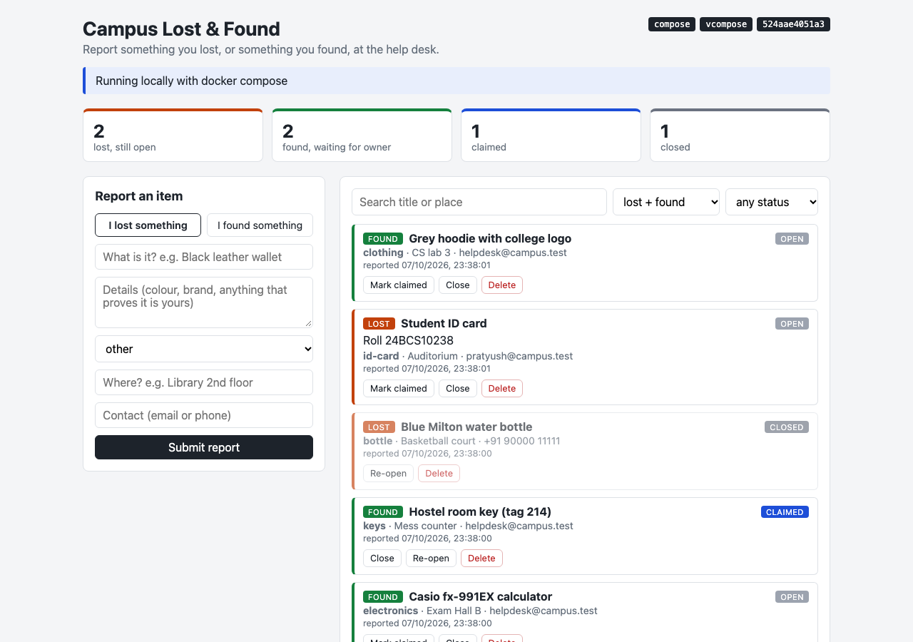

## Architecture

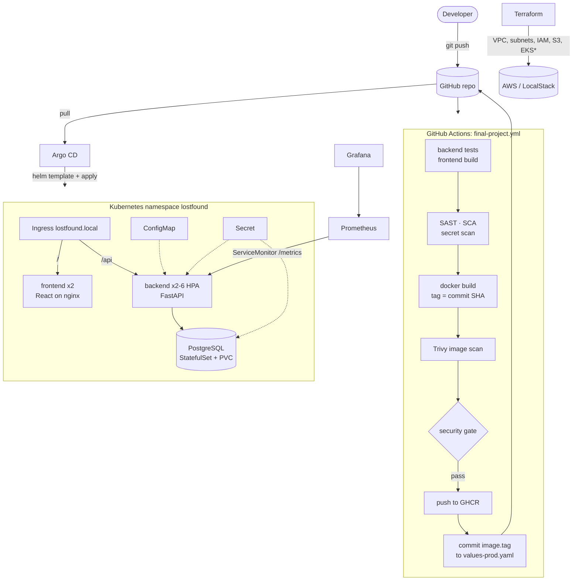

`*` EKS is behind `enable_eks`; LocalStack Community has no EKS API, so locally the
Kubernetes side runs on the kind cluster used for the whole course.

## Technologies used

| Area | Tool |
|---|---|
| Backend | Python 3.13, FastAPI, SQLAlchemy 2, Alembic, Uvicorn, prometheus-client |
| Frontend | React 19, Vite 8, served by nginx (unprivileged) |
| Database | PostgreSQL 17 |
| Tests / quality | pytest (13 tests), ruff |
| Containers | Docker, multi-stage builds, Docker Compose |
| Orchestration | Kubernetes v1.37 (kind, 3 nodes), ingress-nginx, metrics-server |
| Packaging | Helm (chart `lostfound`, dev and prod values) |
| CI/CD | GitHub Actions (run locally with `act`) |
| DevSecOps | Bandit (SAST), pip-audit + npm audit (SCA), gitleaks (secrets), Trivy (images), a security gate |
| Registry | GHCR (`ghcr.io/bypratyush/...`), a local `registry:2` under act |
| IaC | Terraform 1.16, AWS provider, LocalStack |
| Monitoring | kube-prometheus-stack (Prometheus Operator, Prometheus, Grafana, kube-state-metrics) |
| GitOps | Argo CD 3.5, Gitea (in-cluster Git server for the local demo) |

## Folder layout

```text
final-devops-project/
├── application/        backend/ (FastAPI, Alembic, tests)  frontend/ (React + Vite)
├── docker/             backend.Dockerfile  frontend.Dockerfile  docker-compose.yml  .env.example
├── kubernetes/         namespace.yaml (bootstrap) + README
├── helm/lostfound/     the chart: values.yaml, values-dev.yaml, values-prod.yaml, templates/
├── terraform/          VPC, subnets, IAM, S3 backup bucket, EKS (toggle)
├── .github/workflows/  -> the real workflow is /.github/workflows/final-project.yml (see CI/CD)
├── security/           bandit / gitleaks configs, pinned tool installer, pipeline run output
├── monitoring/         kube-prometheus-stack values, alert rules, Grafana dashboard
├── gitops/             Argo CD Applications (GitHub and local Gitea)
├── troubleshooting/    the fault-injection challenge
├── scripts/            seed.sh (sample data), traffic.sh (load for the dashboards)
└── screenshots/
```

---

## Application setup

```text
application/backend/app/
  main.py           routes: /api/items (GET, POST), /api/items/{id} (GET, PUT, DELETE), /api/stats, /api/info
                    probes: /health (liveness, no DB), /ready (readiness, checks the DB), /metrics
  models.py         Item: kind (lost|found), title, description, category, location, contact, status
  schemas.py        pydantic validation (kind/status/category are enums, length limits)
  config.py         everything from environment variables (ConfigMap + Secret in Kubernetes)
  observability.py  JSON logs + Prometheus metrics middleware
alembic/versions/0001_create_items.py   the schema, applied on start-up
```

Run the tests (they use a throwaway SQLite file, never Postgres):

```bash
cd application/backend
pip install -r requirements-dev.txt
pytest -v && ruff check . && ruff format --check .
```

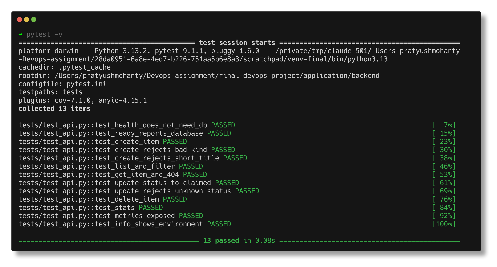

Two details worth pointing out:

- **Migrations with more than one replica.** Every backend pod runs
  `alembic upgrade head` on start. Two replicas starting together would both try
  to `CREATE TABLE`, so `alembic/env.py` takes a Postgres advisory lock first:
  one pod migrates, the other waits and then finds nothing to do.
- **Metric labels use the route template** (`/api/items/{item_id}`), not the
  path, so each item id does not become a new time series.

## Docker setup

| Image | Build | Runs as | Size |
|---|---|---|---|
| `lostfound-backend` | 2 stages: venv built in `python:3.13-slim`, copied into a clean `python:3.13-slim`; pip removed from the runtime | uid 10001 | 303 MB |
| `lostfound-frontend` | 2 stages: `npm ci && npm run build` in `node:22-alpine`, only `dist/` copied into `nginx-unprivileged:1.29-alpine` + `apk upgrade` | uid 101 | 112 MB |

The last two details came from the Trivy gate, not from planning. The first
scan failed both images on **fixable HIGH CVEs that were not in my code or my
requirements**: the backend's came from pip's own vendored copies of urllib3,
msgpack and setuptools in the base image (pip-audit was clean, because pip itself
is not a dependency), and the frontend's 42 came from Alpine packages (curl,
openssl, libxml2, expat...) in an nginx tag that had not been rebuilt yet. Removing
pip from the runtime image and running `apk upgrade` in the nginx stage took both
scans to 0. The frontend grew by 30 MB for it.

```bash
cd docker
cp .env.example .env          # sets DB_PASSWORD; .env is git-ignored
docker compose up --build     # db (healthcheck) -> backend (runs migrations) -> frontend
open http://localhost:3000
../scripts/seed.sh http://localhost:3000
```

```text
NAME                   STATUS                            PORTS
lostfound-backend-1    Up 8 seconds (health: starting)   0.0.0.0:8000->8000/tcp
lostfound-db-1         Up 14 seconds (healthy)           5432/tcp
lostfound-frontend-1   Up 8 seconds                      0.0.0.0:3000->8080/tcp
```

In compose the frontend's nginx proxies `/api` to the backend (the address comes
from `BACKEND_URL` through nginx's envsubst templates); in Kubernetes the Ingress
does that routing instead.

The first `compose up` failed - the backend crash-looped with
`ModuleNotFoundError: No module named 'app'` from `alembic/env.py`. The `alembic`
CLI does not put the working directory on `sys.path`; `prepend_sys_path = .` in
`alembic.ini` fixed it. The retry loop in `entrypoint.sh` had been printing
"database not ready yet" for that error, which was a lie - it now says
"migration attempt N failed (database not up yet?)".

## Kubernetes deployment

Bootstrap, then the chart (see [kubernetes/README.md](kubernetes/README.md) for
the object-by-object table):

```bash
kubectl apply -f kubernetes/namespace.yaml        # enforces Pod Security "restricted"
kubectl -n lostfound create secret generic lostfound-db --from-literal=DB_PASSWORD="$(openssl rand -hex 16)"
```

Deployment, Service, ConfigMap, Secret, Ingress, HPA, probes and storage are all
in the chart. Everything runs non-root with a read-only root filesystem except
Postgres (which needs to write its socket directory).

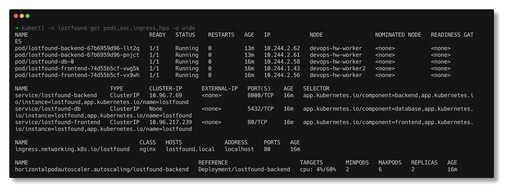

```text
$ curl -s -H 'Host: lostfound.local' http://localhost/api/info
{"app":"Campus Lost & Found","version":"1.0.0","environment":"prod","pod":"lostfound-backend-6c5cb5894d-lzq7x",
 "notice":"Help desk is open 9am - 5pm, Block A ground floor"}
```

The first install failed on Pod Security - that is incident 0 in the
[troubleshooting write-up](troubleshooting/README.md).

## Helm deployment

```bash
helm lint helm/lostfound -f helm/lostfound/values-prod.yaml
helm upgrade --install lostfound helm/lostfound -n lostfound -f helm/lostfound/values-prod.yaml --wait
```

```text
LAST DEPLOYED: Wed Oct  7 23:48:01 2026
NAMESPACE: lostfound
STATUS: deployed
REVISION: 2
DESCRIPTION: Upgrade complete
TEST SUITE: None
NOTES:
Campus Lost & Found is installed as release "lostfound" in namespace "lostfound".
  environment : prod
  image tag   : 1.0.0
  backend     : HPA 2-6 replicas
  frontend    : 2 replica(s)
```

| | values-dev.yaml | values-prod.yaml |
|---|---|---|
| backend | 1 replica, no HPA | HPA 2-6 |
| frontend | 1 replica | 2 replicas |
| log level | DEBUG | INFO |
| DB password | inline dev value | `existingSecret: lostfound-db` |
| ServiceMonitor | off | on |

The chart refuses to render without a password source
(`fail "set database.password (dev) or database.existingSecret (prod)"`), and
puts `checksum/config` and `checksum/secret` annotations on the backend pods so a
config change rolls them. After the first two Helm revisions, the release was
handed over to Argo CD (see GitOps).

## Terraform infrastructure

See [terraform/README.md](terraform/README.md). A VPC (`10.20.0.0/16`) with two
public and two private subnets across two AZs, internet gateway and routes, a
worker-node security group, IAM roles for the EKS control plane and node group,
an S3 bucket for database backups, and the EKS cluster plus managed node group
behind `enable_eks`. It was applied and destroyed for real against LocalStack;
the EKS part is shown as a real `terraform plan` because LocalStack Community has
no EKS API.

```text
Plan: 28 to add, 0 to change, 0 to destroy.          (enable_eks = false, applied)
Plan: 6 to add ...  aws_eks_cluster, aws_eks_node_group, launch template, NAT gateway + EIP + route
                                                      (enable_eks = true, plan only)
$ aws eks list-clusters   ->  InternalFailure ... not included in your current license plan
Destroy complete! Resources: 28 destroyed.
```

A second `terraform plan` straight after apply showed no changes, which is the
real test that the code and the infrastructure agree. On real AWS the same code
runs with `use_localstack = false` and `enable_eks = true`, followed by
`aws eks update-kubeconfig --name <cluster>`; the NAT gateway and the EKS control
plane are the two things that cost money by the hour, so `terraform destroy`
afterwards is not optional.

## CI/CD pipeline

GitHub only runs workflows from the repository root, so the pipeline is
[/.github/workflows/final-project.yml](../.github/workflows/final-project.yml),
filtered to `final-devops-project/**`. On every push and PR:

```text
backend-test ───┬─> sast ───────────────────────┐
frontend-build ─┼─> sca ────────────────────────┤
                ├─> secret-scan ────────────────┼─> security-gate -> push (main) -> deploy-gitops (main)
                └─> docker-build -> image-scan ─┘
```

- images are tagged with the **short commit SHA**, never `latest`
- `push` logs in to GHCR with the built-in `GITHUB_TOKEN` (`packages: write`)
- `deploy-gitops` writes the SHA into `helm/lostfound/values-prod.yaml` and commits
  it with `[skip ci]`; Argo CD picks it up. CI never talks to the cluster.

Run locally with `act` before pushing (command and full log in
[security/pipeline-output.md](security/pipeline-output.md)):

| Job | Result |
|---|---|
| backend-test | 13 passed, 97% coverage; `alembic upgrade head` and `downgrade base` against a `postgres:17-alpine` service container |
| frontend-build | `npm ci` + `vite build`, `dist/` uploaded as an artifact |
| sast / sca / secret-scan | Bandit: no issues · pip-audit and npm audit: 0 vulnerabilities · gitleaks: no leaks |
| docker-build + image-scan | both images built with the SHA tag; Trivy 0 HIGH/CRITICAL after the Dockerfile fixes above |
| security-gate | passed |
| push | `bypratyush/lostfound-backend:888cd81` and `-frontend:888cd81` pushed to the local registry (GHCR on GitHub) |
| deploy-gitops | skipped under act by design; runs on GitHub after a push to main |

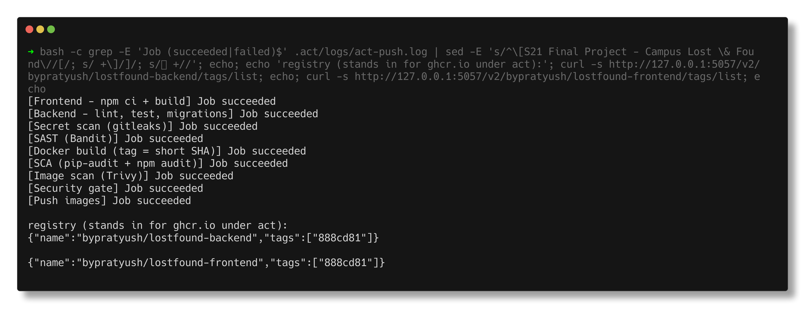

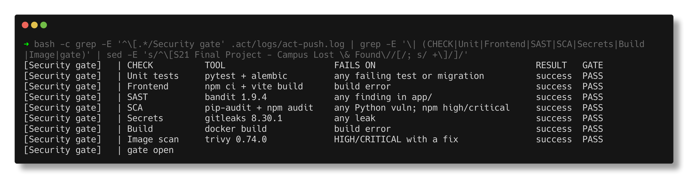

Two things broke under act on the first run and are explained in the security
README: two jobs installing Node into act's shared tool cache at the same time,
and the Postgres service container not being reachable by hostname (act runs
jobs on the host network), fixed with a port mapping that works on GitHub too.

## DevSecOps implementation

See [security/README.md](security/README.md).

| Control | Tool | Fails the gate when |
|---|---|---|
| SAST | Bandit | any medium+ severity finding in `app/` |
| SCA | pip-audit, npm audit | a known-vulnerable dependency (npm: high+) |
| Secret scanning | gitleaks | any match in `final-devops-project/` |
| Image scanning | Trivy | a fixable HIGH or CRITICAL CVE in either image |
| Security gate | job with `needs:` on all of the above | any of them failed |

## Monitoring

See [monitoring/README.md](monitoring/README.md). kube-prometheus-stack in
namespace `monitoring`; the chart's ServiceMonitor gets the backend scraped,
four alert rules, and a Grafana dashboard loaded from a ConfigMap.

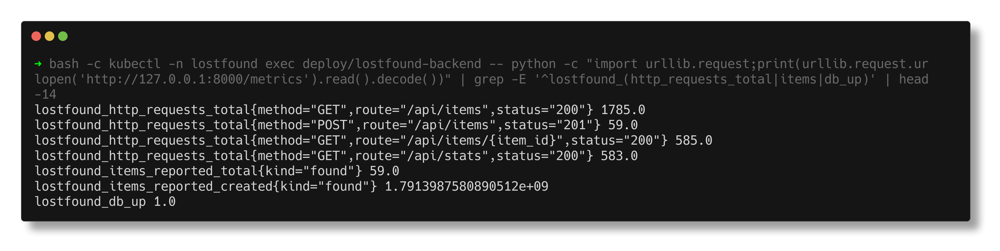

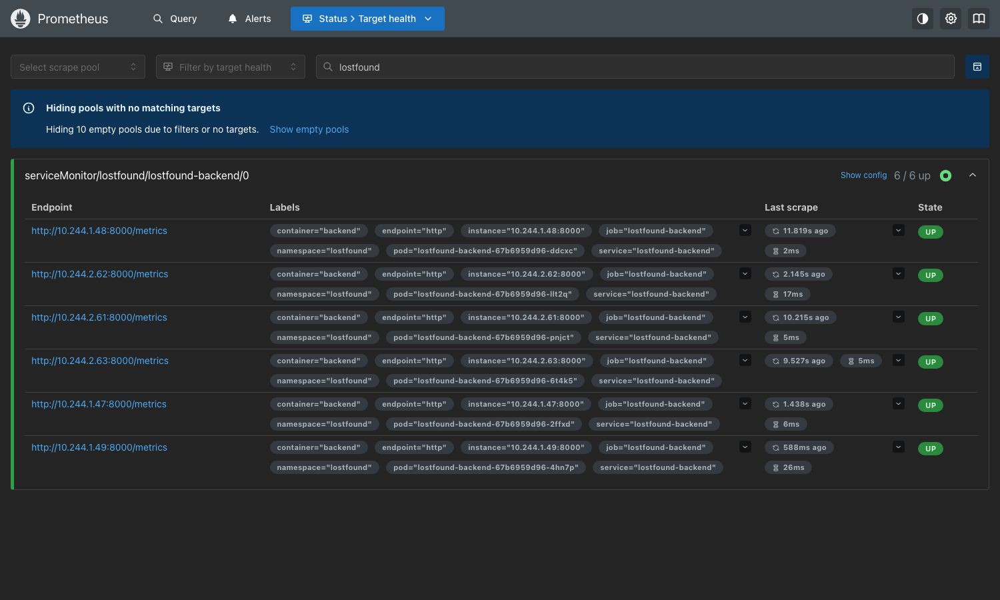

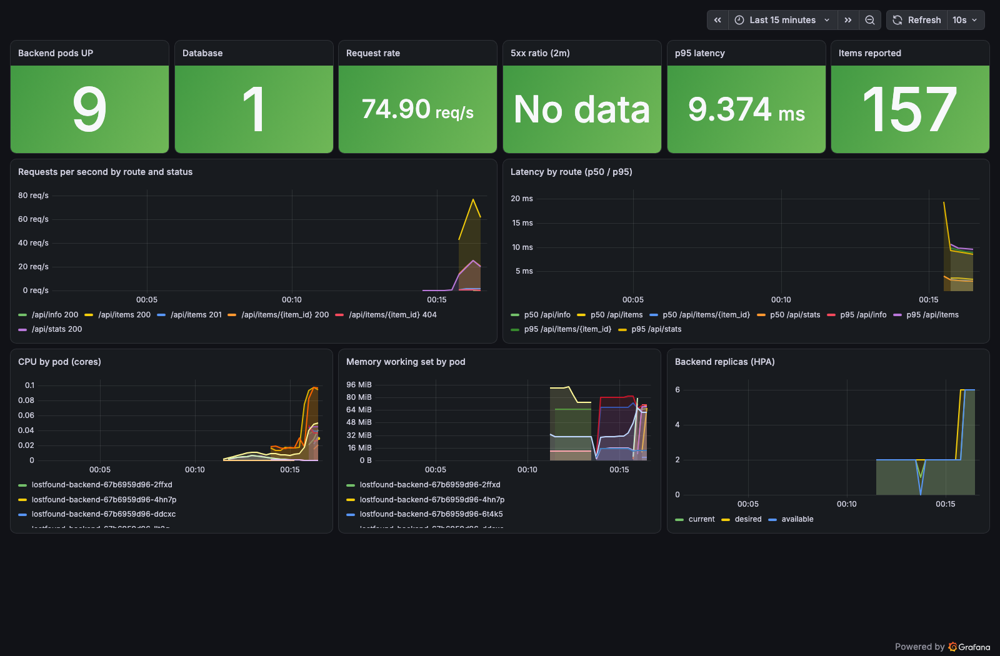

## GitOps

See [gitops/README.md](gitops/README.md). Argo CD watches
`final-devops-project/helm/lostfound` with `values-prod.yaml`, automated sync,
prune and self-heal. Locally the source is an in-cluster Gitea (the GitHub repo
was not pushed yet); [gitops/application.yaml](gitops/application.yaml) is the
same Application pointed at GitHub.

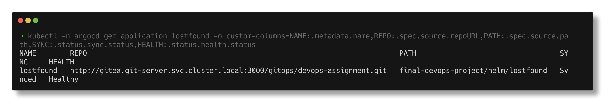

## Troubleshooting

See [troubleshooting/README.md](troubleshooting/README.md): one real incident
(Pod Security blocking Postgres) and three faults introduced as Git commits - a
release tag that was never built, a Service selecting no pods (503 on every API
call while Argo CD said Healthy), and a ServiceMonitor label that silently
stopped Prometheus scraping the app. Each one: identify, investigate, root cause,
fix through Git, verify.

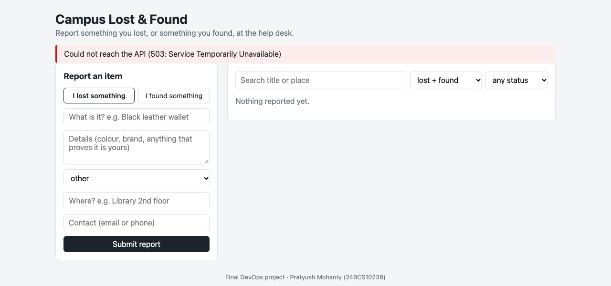

## Screenshots

| Screenshot | Shows |
|---|---|
| [app-compose-browser.png](screenshots/app-compose-browser.png) | the app running from `docker compose` |
| [pytest-passing.png](screenshots/pytest-passing.png) | 13 tests passing |
| [kubectl-pods-svc.png](screenshots/kubectl-pods-svc.png) | pods, Services, Ingress, HPA in `lostfound` |
| [backend-metrics.png](screenshots/backend-metrics.png) | `/metrics` from a backend pod |
| [prometheus-targets.png](screenshots/prometheus-targets.png) | the app's targets UP in Prometheus |
| [grafana-lostfound-dashboard.png](screenshots/grafana-lostfound-dashboard.png) | live dashboard under load, HPA scaling 2 -> 6 |
| [argocd-application.png](screenshots/argocd-application.png) | the Argo CD Application, Synced/Healthy |
| [fault2-browser-api-503.png](screenshots/fault2-browser-api-503.png), [fault2-alert-firing.png](screenshots/fault2-alert-firing.png) | fault 2 from the user's side and Prometheus' |
| `pipeline-*.png`, `terraform/screenshots/` | the pipeline run and the Terraform workflow |

## Lessons learned

1. **"Healthy" is a statement about objects, not about users.** Argo CD reported
   Healthy while every API call returned 503. End-to-end checks (a curl through
   the Ingress, an alert on the app's own metrics) are what catch wiring mistakes.
2. **Cascading failures point at the wrong thing.** The Pod Security block showed
   up as a backend CrashLoopBackOff with a DNS error; the real error was on the
   StatefulSet, two objects away.
3. **`maxUnavailable: 0` turns a bad release into a non-event.** The broken image
   tag never took a single serving pod away.
4. **Monitoring needs monitoring.** When the ServiceMonitor stopped matching,
   nothing was red anywhere; the `absent()` alert was the only signal, and it is
   slow by design (see fault 3).
5. **Keep secrets out of Git but keep their *shape* in Git.** The chart knows a
   Secret called `lostfound-db` with a `DB_PASSWORD` key must exist; the value is
   created out of band.
6. **Retry loops lie if their messages guess.** "Database not ready yet" hid an
   import error for a whole debugging round.
