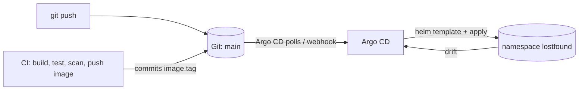

# GitOps - Argo CD deploys the Helm chart from Git

> **Submitted by:** Pratyush Mohanty  |  **Roll No.:** 24BCS10238

| File | Used for |
|---|---|
| [application.yaml](application.yaml) | The real setup: source = `github.com/bypratyush/devops-assignment`, path `final-devops-project/helm/lostfound`, `values-prod.yaml` |
| [application-local.yaml](application-local.yaml) | The demo actually run: identical, but `repoURL` points at the in-cluster Gitea, because the GitHub repo had not been pushed yet |

Argo CD and Gitea were installed in session 20 and left running
(see [lab/gitops.sh](../../lab/gitops.sh)). For this project a Gitea repo
`gitops/devops-assignment` was created and a snapshot of `final-devops-project/`
pushed to it, so the path inside the repo is the same as on GitHub.



The cluster is never pushed to. CI's last step only edits `image.tag` in
`values-prod.yaml` and commits it; Argo CD notices the commit and pulls.

## The Application

```yaml
spec:
  source:
    path: final-devops-project/helm/lostfound
    helm:
      valueFiles: [values-prod.yaml]
  destination: { namespace: lostfound }
  syncPolicy:
    automated: { prune: true, selfHeal: true }
    syncOptions: [CreateNamespace=true]
    managedNamespaceMetadata:
      labels: { pod-security.kubernetes.io/enforce: restricted, ... }
```

- `prune` - an object deleted from Git is deleted from the cluster.
- `selfHeal` - a manual `kubectl` change is reverted to what Git says.
- `managedNamespaceMetadata` - Argo CD creates the namespace *with* the Pod
  Security labels from [kubernetes/namespace.yaml](../kubernetes/namespace.yaml).
- The DB password Secret (`lostfound-db`) is deliberately **not** in Git; it is
  created once by hand (`values-prod.yaml` uses `existingSecret`). In a real team
  this would be Sealed Secrets or External Secrets.

## Handing the release over from Helm to Argo CD

The app had been installed with `helm upgrade --install` first. Moving it to
Argo CD without losing data:

```text
$ helm -n lostfound uninstall lostfound
release "lostfound" uninstalled

$ kubectl -n lostfound get pvc,secret
persistentvolumeclaim/data-lostfound-db-0   Bound    pvc-16f7144b-...   2Gi   RWO   standard
secret/lostfound-db   Opaque   1      30m

$ kubectl apply -f gitops/application-local.yaml
application.argoproj.io/lostfound created
...
$ curl -s -H 'Host: lostfound.local' http://localhost/api/stats
{"total":6,"lost_open":2,"found_open":2,"claimed":1,"closed":1}
```

The six items seeded before the handover were still there. `helm uninstall`
removes the StatefulSet but not the PVCs created from its `volumeClaimTemplates`,
and naming the Application `lostfound` makes Argo CD render the same object names
(`lostfound-db-0` -> `data-lostfound-db-0`), so the new pod re-attached the old volume.

## A normal change, end to end

Commit `176c7eb Extend help desk hours notice for exam week` changed one line of
`values-prod.yaml`:

```text
-  campusNotice: "Help desk is open 9am - 5pm, Block A ground floor"
+  campusNotice: "Exam week: help desk open till 8pm, Block A ground floor"
```

```text
operation  2026-10-07T18:45:42Z  ->  2026-10-07T18:45:45Z  successfully synced (all tasks run)
deployment "lostfound-backend" successfully rolled out

$ curl -s -H 'Host: lostfound.local' http://localhost/api/info
{"app":"Campus Lost & Found","version":"1.0.0","environment":"prod","pod":"lostfound-backend-67b6959d96-llt2q",
 "notice":"Exam week: help desk open till 8pm, Block A ground floor"}
```

The pods restarted on their own even though only a ConfigMap changed: the chart
puts a `checksum/config` annotation on the pod template, so a new ConfigMap means
a new template hash and a rolling update. Without it the env vars would keep the
old value until someone restarted the pods.

## Rollback is `git revert`

All three faults in [troubleshooting/](../troubleshooting/) were introduced and
fixed through Git (fault 3 twice - see its write-up). The Gitea history of the demo:

```text
b13e588 Revert "Revert "Revert "Label ServiceMonitor for the prometheus release"""
0fa3dca Revert "Revert "Label ServiceMonitor for the prometheus release""
331bdfa Revert "Label ServiceMonitor for the prometheus release"
70480f2 Label ServiceMonitor for the prometheus release
9b68c4c Revert "Rename backend component to api in Service"
0f03e95 Rename backend component to api in Service
7cb3f19 Revert "Release backend and frontend 1.0.1"
8dfab38 Release backend and frontend 1.0.1
176c7eb Extend help desk hours notice for exam week
62058cf Add Lost & Found chart and GitOps manifests
```

## Notes from running this

- **`status.sync.revision` is not "deployed".** My first timing script waited for
  it to equal the new commit and reported "synced after 2s" - but that field is
  the revision Argo CD has *compared*, and the app was still `OutOfSync`. The
  field that means applied is `status.operationState.syncResult.revision` with
  `operationState.phase = Succeeded`.
- `kubectl -n argocd annotate application lostfound argocd.argoproj.io/refresh=normal`
  makes Argo CD look at Git now instead of at the next poll (it polls every few
  minutes by default). A Git webhook does the same automatically.
- Argo CD's `Healthy` means the objects it applied are healthy. During fault 2
  it was `Synced / Healthy` while every API call returned 503.
