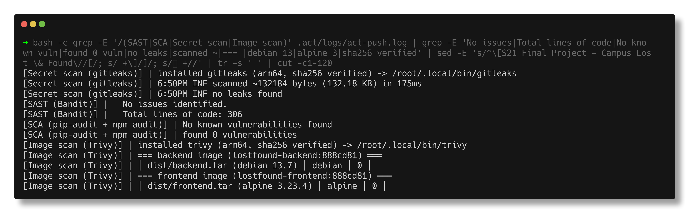
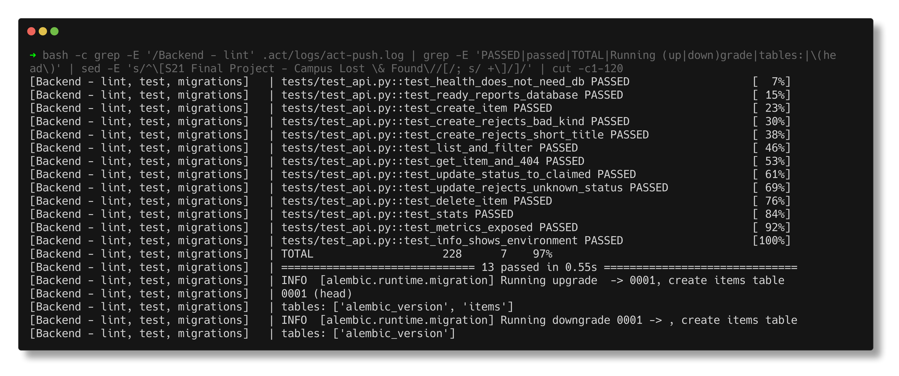

# Security Checks - Final Project Pipeline

> **Submitted by:** Pratyush Mohanty  |  **Roll No.:** 24BCS10238

**Form field:** Final DevOps Project · **Course session:** `session-21-final-project`

Run it: `./security/run-pipeline.sh` (from `final-devops-project/`, needs Docker and [act](https://github.com/nektos/act)) · Verified output: [pipeline-output.md](pipeline-output.md) · Workflow: [`.github/workflows/final-project.yml`](../../.github/workflows/final-project.yml)

The configs in this folder are what the security jobs of the pipeline read. Each
scanner job fails on its own threshold; `security-gate` then looks at every
job's result and stops the pipeline unless all of them are `success`. `push`
needs the gate, and `deploy-gitops` needs `push`, so a red scanner means no
image in the registry and no new tag for Argo CD.

## Pipeline order

```text
backend-test --+-- docker-build -- image-scan --+
frontend-build-+-- sast ------------------------+
               +-- sca -------------------------+-- security-gate -- push -- deploy-gitops
               +-- secret-scan -----------------+
```

`push` and `deploy-gitops` only run for a push to `main`. Under act the images go
to a local `registry:2` on `127.0.0.1:5057` instead of `ghcr.io`, the GHCR login
step is skipped (`if: ${{ !env.ACT }}`), and `deploy-gitops` is skipped because the
event file passed with `-e` contains `{"act": true}` (the job has
`if: ... && !github.event.act` - the `env` context is not allowed in a job-level `if`).

## Tools, thresholds and what they found

| Job | Tool (pinned) | Config | Fails on | Result on commit `888cd81` |
|---|---|---|---|---|
| sast | bandit 1.9.4 | [bandit.yaml](bandit.yaml) | any finding in `app/` (tests excluded, nothing skipped) | `No issues identified.` 306 lines scanned |
| sca | pip-audit 2.10.1 | `requirements.txt` | any known vuln in a pinned backend dependency | `No known vulnerabilities found` |
| sca | npm audit (npm 10.9.9) | `package-lock.json` | `--audit-level=high` | `found 0 vulnerabilities` |
| secret-scan | gitleaks 8.30.1 | [gitleaks.toml](gitleaks.toml) | any leak in `final-devops-project/` | `no leaks found` (~132 KB scanned) |
| image-scan | trivy 0.74.0 | flags in the workflow | HIGH/CRITICAL **with a fix available** (`--ignore-unfixed --exit-code 1`) | 0 on both images, after the fixes below |

gitleaks and Trivy are installed by [install-tools.sh](install-tools.sh): release
binaries pinned by version and checked against sha256 sums written in the
script, so a tampered release fails the job instead of running in it. The
gitleaks config is the full default rule set plus one project rule for a
Postgres URL with an inline password (the app builds its URL from
`DB_PASSWORD` at runtime, so a literal one in a file is always a leak).

Reports are uploaded as artifacts: `report-sast` (bandit JSON),
`report-secrets` (gitleaks JSON), `report-image-scan` (the Trivy tables for both
images), plus `backend-test-report` (junit XML + coverage XML).

## What Trivy found, and the fix

Before the pipeline ran I scanned the existing images with the same flags. Both
failed:

| Image | Findings (HIGH, fixed upstream) | Where from |
|---|---|---|
| backend (`python:3.13-slim`) | 4 - msgpack GHSA-6v7p-g79w-8964, setuptools CVE-2025-47273, urllib3 CVE-2026-97687 / CVE-2026-97689 | not our requirements: the libraries **vendored inside pip** (`pip/_vendor`), in both the base image and the venv |
| frontend (`nginx-unprivileged:1.29-alpine`) | 42 - c-ares, curl/libcurl, libcrypto3/libssl3, libexpat, libxml2, libuuid, pcre2 ... | Alpine 3.23.4 packages the base tag had not picked up yet (re-pulling the tag did not help) |

Fixes, in `docker/` (the only files outside this folder that I changed):

- `backend.Dockerfile`: `pip uninstall -y pip` at the end of the deps stage, and
  `python3 -m pip uninstall -y pip` for the base image's own pip in the runtime
  stage. Nothing installs packages at runtime, so pip was only attack surface.
  Checked: imports of fastapi/sqlalchemy/alembic/psycopg still work, still uid 10001.
- `frontend.Dockerfile`: `USER root` + `RUN apk upgrade --no-cache` right after
  the nginx `FROM`; the existing `USER 101` later in the file drops root again.
  Checked: `nginx/1.29.8`, runs as uid 101.

After that, the pipeline's own scan of the built tarballs:

```text
[Image scan (Trivy)] | === backend image (lostfound-backend:888cd81) ===
[Image scan (Trivy)] | | dist/backend.tar (debian 13.7) | debian | 0 |
[Image scan (Trivy)] | === frontend image (lostfound-frontend:888cd81) ===
[Image scan (Trivy)] | | dist/frontend.tar (alpine 3.23.4) | alpine | 0 |
```

## The green run

```text
CHECK          TOOL                     FAILS ON                               RESULT   GATE
Unit tests     pytest + alembic         any failing test or migration          success  PASS
Frontend       npm ci + vite build      build error                            success  PASS
SAST           bandit 1.9.4             any finding in app/                    success  PASS
SCA            pip-audit + npm audit    any Python vuln; npm high/critical     success  PASS
Secrets        gitleaks 8.30.1          any leak                               success  PASS
Build          docker build             build error                            success  PASS
Image scan     trivy 0.74.0             HIGH/CRITICAL with a fix               success  PASS
gate open
...
{"name":"bypratyush/lostfound-backend","tags":["888cd81"]}
{"name":"bypratyush/lostfound-frontend","tags":["888cd81"]}
```

Tests: `13 passed`, coverage 97%. Migrations on a real `postgres:17-alpine`
service container: `upgrade -> 0001` leaves `['alembic_version', 'items']`,
`downgrade 0001 ->` leaves `['alembic_version']`. Only the short SHA tag exists
in the registry, never `latest`.






## Notes from actually running this

- **First run: two red jobs, neither a code problem.** (1) `npm run build` died
  with `Cannot find module '../../package.json'` inside
  `/opt/hostedtoolcache/node/...`. act shares one toolcache volume between all
  job containers, and `sca` was running `setup-node` at the same moment, unpacking
  the same Node into it. Fixed by running the scanners after `backend-test` and
  `frontend-build`, so the toolcache is already filled. (2) Alembic could not
  resolve the host `postgres`: act runs job containers on the `host` network and
  only the service sits on act's job network. Publishing the service on a fixed
  port (`25432:5432`) and connecting to `localhost:25432` works both under act
  and on a GitHub runner.
- **Trivy found nothing in our own dependencies** - pip-audit agreed - but the
  backend image still failed because of pip's vendored copies of urllib3 and
  friends. The scanner scans the whole filesystem, not your requirements file.
- `docker build` does not re-pull a cached base tag, and even a fresh pull of
  `nginx-unprivileged:1.29-alpine` still had the 42 findings, so `apk upgrade` in
  the Dockerfile was the fix rather than "pull again".
- The gate is a plain `needs.<job>.result` check with `if: always()`. Without
  `always()` a failed scanner would make the gate itself *skipped*, and a skipped
  job does not show up as a red X on the summary.
