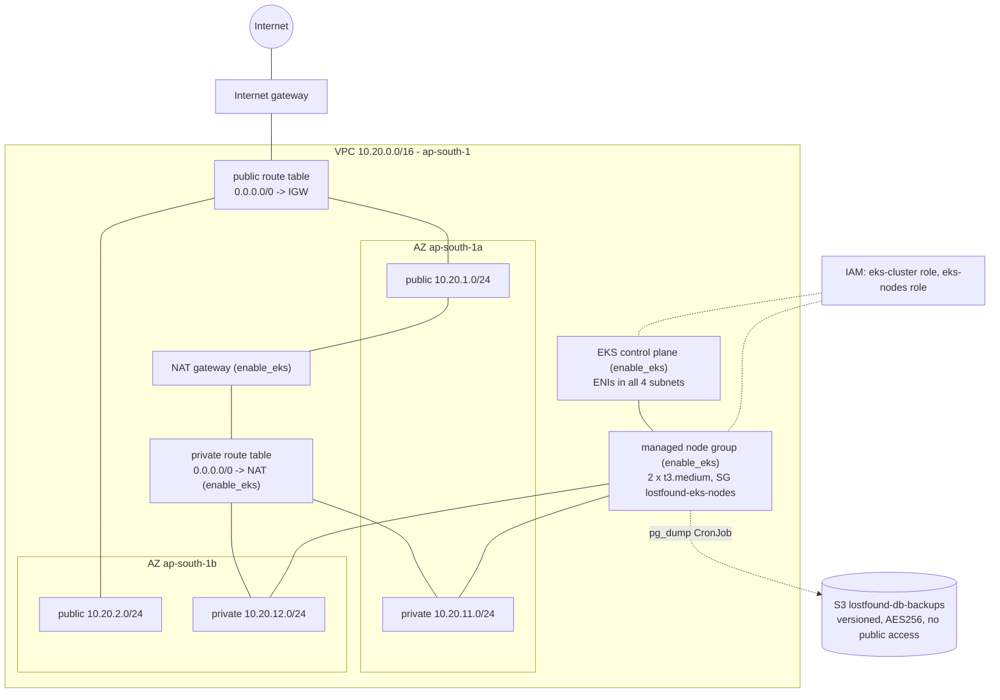
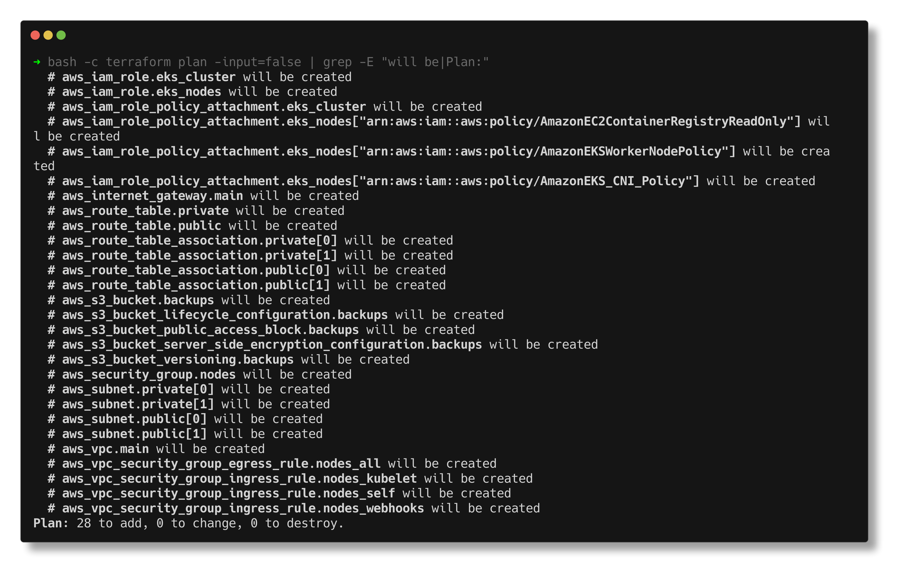
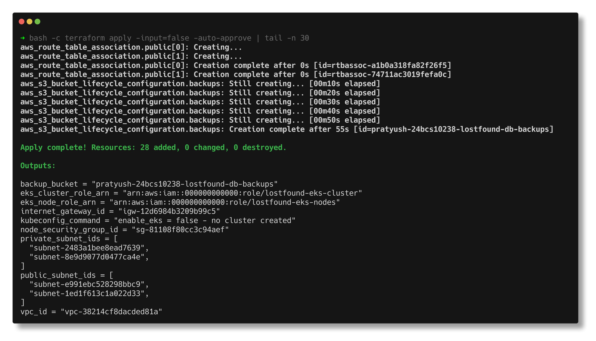
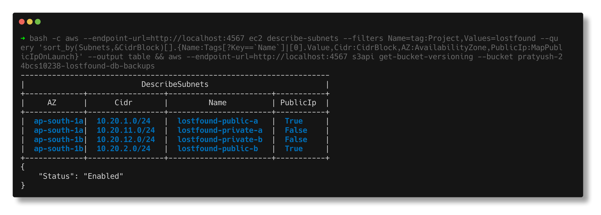
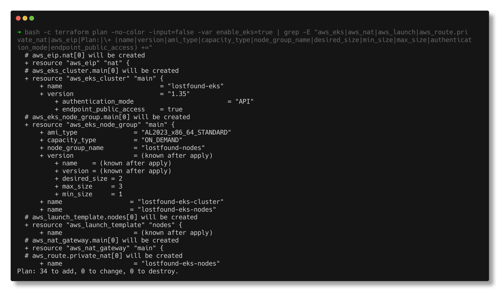
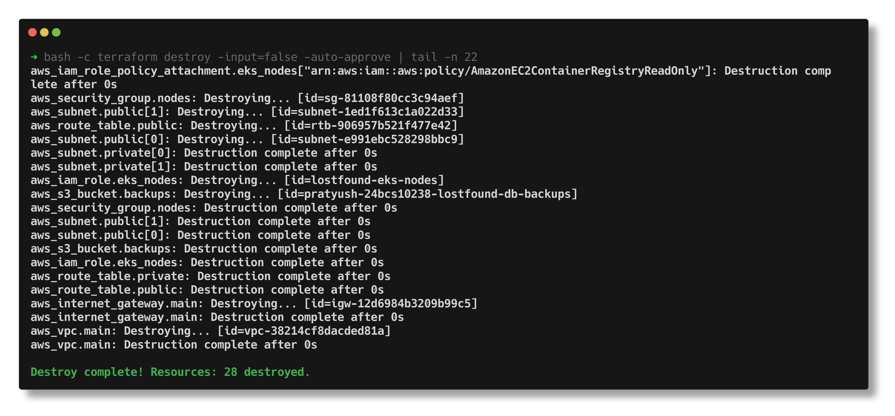

# Terraform - AWS Infrastructure for Campus Lost & Found

> **Submitted by:** Pratyush Mohanty  |  **Roll No.:** 24BCS10238

**Form field:** Final DevOps Project · **Course session:** `session-21-final-project`

Run it: `./run.sh` (needs Docker, Terraform and the AWS CLI; it starts its own LocalStack) · Verified output: [output.md](output.md)

The cloud side of the final project: the network, IAM and storage an EKS
deployment of Lost & Found needs in `ap-south-1`, plus the EKS cluster and its
managed node group behind one switch, `enable_eks`. There is no AWS account
behind this homework, so everything is applied to LocalStack 4.14.0 in its own
container (`localstack-final` on `localhost:4567`, so the Session 19
LocalStack on 4566 is never touched), checked with the AWS CLI, and destroyed.

## What it builds

| File | Resources |
|---|---|
| `vpc.tf` | VPC `10.20.0.0/16` (DNS hostnames on), IGW, 2 public subnets (`10.20.1.0/24` in 1a, `10.20.2.0/24` in 1b), 2 private subnets (`10.20.11.0/24`, `10.20.12.0/24`), public route table (`0.0.0.0/0 -> IGW`) + 2 associations, private route table + 2 associations, worker node security group + 4 rules. With `enable_eks`: EIP + NAT gateway + `0.0.0.0/0 -> NAT` in the private table |
| `iam.tf` | `lostfound-eks-cluster` role (trusted by `eks.amazonaws.com`, `AmazonEKSClusterPolicy`) and `lostfound-eks-nodes` role (trusted by `ec2.amazonaws.com`, `AmazonEKSWorkerNodePolicy`, `AmazonEKS_CNI_Policy`, `AmazonEC2ContainerRegistryReadOnly`) |
| `storage.tf` | S3 bucket for Postgres dumps: versioning, AES256 encryption, all four public access blocks, lifecycle rule expiring old versions after 30 days |
| `eks.tf` | with `enable_eks`: EKS cluster (API auth mode, public + private endpoint, control plane logs), launch template (our SG + the cluster SG, IMDSv2 only), managed node group (2 x `t3.medium` in the private subnets, min 1 / max 3) |
| `providers.tf`, `versions.tf`, `variables.tf`, `outputs.tf` | AWS provider `~> 6.0` with the `use_localstack` switch, inputs with validation, 11 outputs |



Why two AZs and a private tier: EKS refuses to create a cluster whose subnets
are all in one AZ, and the nodes (and the Postgres pod with its volume) belong
where nothing on the internet can reach them directly. Public subnets carry the
`kubernetes.io/role/elb` tag so an internet-facing load balancer for the ingress
controller lands there; private ones carry `kubernetes.io/role/internal-elb`.

## The commands, with real output

`./run.sh all` = `up` (start LocalStack) -> `deploy` (init, fmt, validate, plan,
apply) -> `verify` (output, state list, AWS CLI, idempotency) -> `eks-plan` ->
`destroy`. Snippets below are from [output.md](output.md).

Init, format and validation:

```text
fmt: all files already in canonical format
Success! The configuration is valid.
```

Plan and apply with `enable_eks = false` (28 resources; the lifecycle rule is
the slow one on LocalStack):

```text
Plan: 28 to add, 0 to change, 0 to destroy.
...
aws_s3_bucket_lifecycle_configuration.backups: Creation complete after 55s [id=pratyush-24bcs10238-lostfound-db-backups]
Apply complete! Resources: 28 added, 0 changed, 0 destroyed.
```





Then the AWS CLI is asked directly (`--endpoint-url http://localhost:4567`,
dummy `test` keys), not Terraform:

```text
$ aws ec2 describe-subnets
+-------------+----------------+----------------------------+----------------------+------------+
|     AZ      |     Cidr       |            Id              |        Name          | PublicIp   |
+-------------+----------------+----------------------------+----------------------+------------+
|  ap-south-1a|  10.20.1.0/24  |  subnet-b80e5c05afa206880  |  lostfound-public-a  |  True      |
|  ap-south-1a|  10.20.11.0/24 |  subnet-df6f0ff5fcc2cda66  |  lostfound-private-a |  False     |
|  ap-south-1b|  10.20.12.0/24 |  subnet-c1a891a4d3b234e19  |  lostfound-private-b |  False     |
|  ap-south-1b|  10.20.2.0/24  |  subnet-c5b65e76e386a14bd  |  lostfound-public-b  |  True      |
+-------------+----------------+----------------------------+----------------------+------------+
$ aws ec2 describe-route-tables  (routes per table)
+-----------------------+-----------------------------------------------------------+----------+
|         Name          |                          Routes                           | Subnets  |
+-----------------------+-----------------------------------------------------------+----------+
|  lostfound-private-rt |  10.20.0.0/16-> local                                     |  2       |
|  lostfound-public-rt  |  10.20.0.0/16-> local, 0.0.0.0/0-> igw-52cfa869f5ef322e9  |  2       |
+-----------------------+-----------------------------------------------------------+----------+
$ aws s3api get-bucket-versioning --bucket pratyush-24bcs10238-lostfound-db-backups
{
    "Status": "Enabled"
}
--- a backup round trip: two uploads of the same key = two versions
|  daily/lostfound.sql |  True   |  22    |
|  daily/lostfound.sql |  False  |  22    |
```



A second plan straight after apply has nothing to do:

```text
plan exit code: 0  (0 = no changes, 2 = changes)
No changes. Your infrastructure matches the configuration.
```

### EKS: `terraform plan -var enable_eks=true`

Planned against the applied network, so it shows only what the switch adds:

```text
plan exit code: 0
  # aws_eip.nat[0] will be created
  # aws_eks_cluster.main[0] will be created
  # aws_eks_node_group.main[0] will be created
  # aws_launch_template.nodes[0] will be created
  # aws_nat_gateway.main[0] will be created
  # aws_route.private_nat[0] will be created
Plan: 6 to add, 0 to change, 0 to destroy.
```

Selected lines of the two EKS blocks (full blocks in [output.md](output.md)):

```text
  # aws_eks_cluster.main[0] will be created
      + name                          = "lostfound-eks"
      + role_arn                      = "arn:aws:iam::000000000000:role/lostfound-eks-cluster"
      + version                       = "1.35"
          + authentication_mode                         = "API"
          + endpoint_private_access   = true
          + endpoint_public_access    = true
              + "subnet-b80e5c05afa206880",
              + "subnet-c1a891a4d3b234e19",
              + "subnet-c5b65e76e386a14bd",
              + "subnet-df6f0ff5fcc2cda66",
  # aws_eks_node_group.main[0] will be created
      + ami_type               = "AL2023_x86_64_STANDARD"
      + capacity_type          = "ON_DEMAND"
          + "t3.medium",
      + node_group_name        = "lostfound-nodes"
      + node_role_arn          = "arn:aws:iam::000000000000:role/lostfound-eks-nodes"
          + "subnet-c1a891a4d3b234e19",
          + "subnet-df6f0ff5fcc2cda66",
          + desired_size = 2
          + max_size     = 3
          + min_size     = 1
```

The cluster gets all four subnets, the node group only the two private ones.
Applying it is not possible here:

```text
$ aws eks list-clusters --endpoint-url http://localhost:4567

aws: [ERROR]: An error occurred (InternalFailure) when calling the ListClusters operation: The API for service eks is either not included in your current license plan or has not yet been emulated by LocalStack.
```

The screenshot is the same plan taken from an empty state (`./run.sh shots`), so it counts all 34 resources:



### Destroy

```text
Destroy complete! Resources: 28 destroyed.

state after destroy: 0 resources
VPCs tagged Project=lostfound left: 0
```



## Real AWS: what changes

1. `terraform.tfvars`: `use_localstack = false`, `enable_eks = true`. Credentials
   come from `aws configure sso` / env vars, never from tfvars.
2. `terraform apply` - EKS takes roughly 10-15 minutes for the control plane and
   a few more for the node group.
3. Point kubectl at it (the command is also the `kubeconfig_command` output):
   ```bash
   aws eks update-kubeconfig --region ap-south-1 --name lostfound-eks
   kubectl get nodes -o wide
   ```
4. Install ingress-nginx (its Service gets an NLB in the public subnets), then the
   Helm chart / Argo CD Application from `helm/` and `gitops/` exactly as on kind.
5. Move state to the S3 backend shown in `versions.tf` before a second person
   ever runs `apply`.

Rough monthly cost in `ap-south-1` (on-demand, 730 h):

| Item | Approx. USD / month |
|---|---|
| EKS control plane (0.10 / h) | 73 |
| 2 x t3.medium nodes | 60 |
| NAT gateway (0.056 / h) + data | 41+ |
| NLB for the ingress controller | 20+ |
| EBS for Postgres, S3 backups | 2 |
| **Total** | **~ 195** |

With `enable_eks = false` the VPC, subnets, route tables, SG, IAM roles and an
empty bucket cost nothing. The single NAT gateway is the deliberate saving: one
per AZ is the HA answer but doubles that line, and if AZ a fails the private
subnet in AZ b loses internet access. `terraform destroy` at the end of a demo
is the biggest saving of all.

## Notes from actually running this

- **LocalStack Community has no EKS API.** `aws eks list-clusters` against it
  returns `InternalFailure ... not included in your current license plan`, which
  is why `enable_eks` exists and the recorded apply uses `false`. A plan with
  `enable_eks=true` still works because planning a *new* resource makes no EKS
  API call; the `eks` endpoint override is there so even that plan can never
  reach real AWS by mistake.
- **A permanent diff on the first run.** The second `plan` after `apply` wanted
  to add the description back to the self-referencing SG rule every time:
  LocalStack 4.14 stores descriptions for CIDR rules but drops them for
  SG-to-SG rules. Real AWS keeps it. I removed that one description (and left a
  comment) so the idempotency check is clean: `plan exit code: 0`.
- **The lifecycle rule takes ~55 s to "create"** on LocalStack. The provider
  polls until the rule reads back consistently; everything else is instant.
- A versioned bucket does not delete while it holds versions, and I kept
  `force_destroy = false` on a *backup* bucket on purpose. `run.sh destroy`
  deletes the two test versions explicitly first.
- `describe-security-group-rules` prints `None` in the CIDR column for the
  self rule; the source is in `ReferencedGroupInfo.GroupId`, so the query uses
  `CidrIpv4||ReferencedGroupInfo.GroupId`.
- Once a launch template sets security groups, EKS stops adding the cluster
  security group to the nodes by itself, so both are listed in the template. Easy
  to miss, and nodes then cannot talk to the control plane.

## Interview Q&A

**Q: Why do the worker nodes sit in private subnets, and what do they need then?**
Nothing on the internet should reach a kubelet or a pod directly. They still need
outbound access to pull images and reach the EKS API, so the private route
table gets a NAT gateway (or VPC endpoints for ECR/S3/STS if you want to avoid NAT).

**Q: What is the difference between the cluster role and the node role?**
The cluster role is assumed by the EKS service to manage ENIs, load balancers and
logs for the control plane. The node role is the EC2 instance profile: it lets
the kubelet join the cluster, the VPC CNI assign pod IPs, and the node pull from ECR.

**Q: Why `count` for EKS instead of a separate stack?**
One flag switches the expensive part on and off with the rest unchanged, and the
plan shows exactly what turning it on adds (`6 to add` on top of the applied
network). References need `[0]` / `one()` because the resource becomes a list.

**Q: Why versioning *and* a lifecycle rule on the backup bucket?**
Versioning protects against an overwritten or deleted dump. Without a lifecycle
rule every old version is kept and billed forever; expiring non-current versions
after 30 days bounds that.

**Q: How would a team share this state safely?**
S3 backend with a lock (`use_lockfile = true` in recent Terraform), versioning on
the state bucket, and no local `terraform.tfstate` in Git (it is in `.gitignore`).

**Q: Why is `terraform.tfvars` committed?**
It only holds the non-secret values of the recorded run. Credentials never go in
tfvars; `terraform.tfvars.example` shows the shape for someone else.
