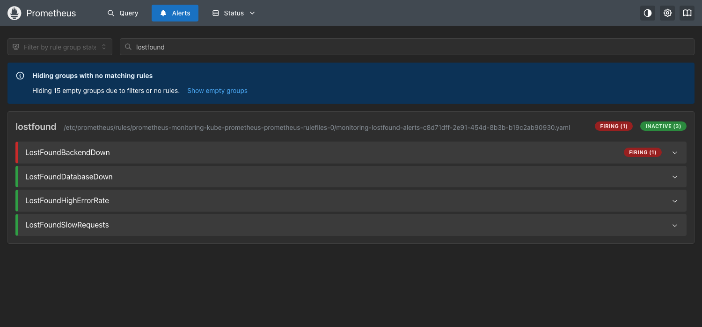

# Final Troubleshooting Challenge

> **Submitted by:** Pratyush Mohanty  |  **Roll No.:** 24BCS10238

Faults were introduced into the running project **the same way real changes
arrive: as Git commits**. Argo CD synced each one into the cluster, and each was
then found, investigated and fixed by another commit (`git revert`). The only
exception is incident 0, which was not planted at all: I hit it while building
the project.

| # | Fault | What the user saw | Root cause | Fix |
|---|---|---|---|---|
| 0 | Postgres pod forbidden by Pod Security (real, unplanned) | nothing loads, backend CrashLoopBackOff | namespace enforces `restricted`, postgres container had no securityContext | securityContext in the chart |
| 1 | Release `1.0.1` that was never built | nothing - old pods kept serving | image tag not in the registry | `git revert` |
| 2 | Service selector renamed `backend` -> `api` | page loads, every API call 503 | Service selects no pods, empty EndpointSlice | `git revert` |
| 3 | ServiceMonitor relabelled `release: prometheus` | nothing - the app was fine | Prometheus stopped scraping it; the alert took 6.5 min | `git revert` |

The broken changes are kept as patches: [fault-1-image-tag.patch](fault-1-image-tag.patch),
[fault-2-service-selector.patch](fault-2-service-selector.patch),
[fault-3-servicemonitor-label.patch](fault-3-servicemonitor-label.patch).
The full terminal transcript is in [output.md](output.md).

---

## Incident 0 - the database never started (real)

**Identify.** The first `helm upgrade --install` timed out:

```text
Error: resource Deployment/lostfound/lostfound-backend not ready. status: InProgress, message: Available: 0/2
resource StatefulSet/lostfound/lostfound-db not ready. status: InProgress, message: Replicas: 0/1
```

**Investigate.** The backend was crash-looping, so its logs came first:

```text
$ kubectl -n lostfound logs deploy/lostfound-backend --tail=4
sqlalchemy.exc.OperationalError: (psycopg.OperationalError) failed to resolve host 'lostfound-db': [Errno -2] Name or service not known
migrations failed after 15 attempts, giving up
```

"Name or service not known" for a Service that exists means the headless
Service has no ready pods behind it (a headless Service with no endpoints
returns NXDOMAIN). The StatefulSet had **0 pods**, and its events said why:

```text
Warning  FailedCreate  statefulset-controller  Create Pod lostfound-db-0 in StatefulSet lostfound-db failed error:
pods "lostfound-db-0" is forbidden: violates PodSecurity "restricted:latest": allowPrivilegeEscalation != false
(container "postgres" must set securityContext.allowPrivilegeEscalation=false), unrestricted capabilities
(container "postgres" must set securityContext.capabilities.drop=["ALL"]), seccompProfile (...)
```

**Root cause.** [kubernetes/namespace.yaml](../kubernetes/namespace.yaml) enforces
the `restricted` Pod Security Standard. The backend and frontend templates were
written for it; the postgres StatefulSet was not. A forbidden pod never exists, so
`kubectl get pods` shows nothing wrong - the error is only on the StatefulSet.

**Fix.** Pod-level `seccompProfile: RuntimeDefault` plus a container
`securityContext` (`allowPrivilegeEscalation: false`, `capabilities.drop: [ALL]`)
in [templates/postgres.yaml](../helm/lostfound/templates/postgres.yaml).

**Verify.** `helm upgrade` -> revision 2 deployed, `lostfound-db-0` Running, and
the crash-looping backend pods recovered on their own once the DB answered.

**Lesson.** One failure cascaded into three symptoms in three different objects
(StatefulSet events -> DNS -> backend CrashLoopBackOff). Fix the first broken
thing in the chain, not the loudest.

---

## Fault 1 - a release that was never built

**Introduced** as commit `8dfab38 Release backend and frontend 1.0.1`: `image.tag`
`1.0.0` -> `1.0.1` in `values-prod.yaml`. Nothing built or pushed `1.0.1`.

**Identify.** Argo CD synced it and went `Synced / Progressing`, and stayed there.
The site itself did **not** go down:

```text
lostfound-backend-5c96bd94bf-62pqt   0/1     ImagePullBackOff   0          23s
lostfound-backend-67b6959d96-2ffxd   1/1     Running            0          112s
... 5 more old backend pods Running ...
lostfound-frontend-7cf89597d-qq752   0/1     ImagePullBackOff   0          23s

site still up? HTTP 200
```

**Investigate.**

```text
$ kubectl -n lostfound describe pod lostfound-backend-5c96bd94bf-62pqt
  Warning  Failed  kubelet  Failed to pull image "ghcr.io/bypratyush/lostfound-backend:1.0.1": ...
           failed to fetch anonymous token: unexpected status from GET request to https://ghcr.io/token?...: 403 Forbidden
$ docker exec devops-hw-worker crictl images | grep lostfound
ghcr.io/bypratyush/lostfound-backend     1.0.0   104cc30454fd8   66.5MB
ghcr.io/bypratyush/lostfound-frontend    1.0.0   0b4eb816bbd65   23.2MB
```

**Root cause.** The tag does not exist anywhere. GHCR answers 403 rather than 404
for an image it has never seen, which can look like an auth problem - it is not.

**Fix.** `git revert` -> commit `7cb3f19`, Argo CD synced it, both rollouts
finished, application back to `Synced / Healthy`.

**Why it was harmless.** The backend Deployment uses `maxUnavailable: 0`, so the
broken pod was a *surge* pod and no old pod was removed until a new one was
Ready - which never happened. In the real pipeline this cannot reach Git at all,
because the `deploy-gitops` job only writes a tag after that exact image was
built, scanned and pushed.

---

## Fault 2 - the API Service selects nothing

**Introduced** as commit `0f03e95 Rename backend component to api in Service`,
which changed only the Service's selector, not the pods' labels.

**Identify.** Half the site worked:

```text
GET / (frontend)      -> HTTP 200
GET /api/stats        -> HTTP 503
```


Argo CD said `Synced / Healthy`. It is right: every object it applied is valid
and healthy. Argo CD checks the objects, not whether they are wired together.

**Investigate.** Pods fine -> Service has no endpoints -> compare selector and labels:

```text
$ kubectl -n lostfound get endpointslices -l kubernetes.io/service-name=lostfound-backend
NAME                      ADDRESSTYPE   PORTS     ENDPOINTS   AGE
lostfound-backend-txqr7   IPv4          <unset>   <unset>     4m50s

$ kubectl -n lostfound get svc lostfound-backend -o jsonpath='{.spec.selector}'
{"app.kubernetes.io/component":"api","app.kubernetes.io/instance":"lostfound","app.kubernetes.io/name":"lostfound"}

pod labels: app.kubernetes.io/component=backend,app.kubernetes.io/instance=lostfound,...
```

The ingress-nginx access log confirms it never had an upstream to try (`[]`,
0.000s): `"GET /api/items?q=library HTTP/1.1" 503 ... [lostfound-lostfound-backend-http] [] - - - -`

Prometheus noticed too: with no endpoints there were no scrape targets, and
`LostFoundBackendDown` fired after its `for: 1m`.



**Root cause.** Selector `component=api` vs pod label `component=backend`.

**Fix.** `git revert` -> `9b68c4c`. Endpoints back immediately, `/api/stats` -> 200.

---

## Fault 3 - Prometheus stops watching the app

**Introduced** as commit `70480f2 Label ServiceMonitor for the prometheus release`
(it sounds reasonable, which is the point).

**Identify.** Nothing a user could see. The app kept answering 200, Argo CD said
`Synced / Healthy`. The only symptom is in the monitoring itself: the app's
targets disappeared from Prometheus' target list 20 seconds after the sync.

**Investigate.** Timeline from the second run (the first run is in
[output.md](output.md) - I reverted after 200s, before the alert had a chance,
which is how I found out how slow it is):

```text
00:26:28  +0s    targets=2 alert=inactive      <- fault synced by Argo CD
00:26:48  +20s   targets=0 alert=inactive      <- operator regenerated the scrape config
00:31:56  +328s  targets=0 alert=pending       <- old `up` series finally gone
00:32:57  +389s  targets=0 alert=firing        <- after the rule's for: 1m
```

Why 5 minutes of nothing: when a whole scrape pool is removed by a config
reload, the old `up` series are not marked stale - they stay visible for the
query lookback window (5 minutes). During that time `absent(up{...})` is false,
because as far as a query is concerned the series still exists:

```text
2 up series visible now at 00:28:13      <- 85s after the targets vanished
```

Then the two objects that have to agree:

```text
$ kubectl -n lostfound get servicemonitor lostfound-backend -o jsonpath='{.metadata.labels.release}'
prometheus
$ kubectl -n monitoring get prometheus monitoring-kube-prometheus-prometheus -o jsonpath='{.spec.serviceMonitorSelector}'
{"matchLabels":{"release":"monitoring"}}
```

**Root cause.** The Prometheus instance only loads ServiceMonitors labelled
`release: monitoring` (the Helm release name of kube-prometheus-stack). The
commit relabelled ours `release: prometheus` - the name people usually give that
release, hence "sounds reasonable" - so Prometheus silently ignored it.

**Fix.** `git revert` (`b13e588`). Recovery was fast, unlike detection:

```text
00:33:04  +0s   targets_up=0 alert=firing
00:33:14  +10s  targets_up=1 alert=firing
00:33:19  +15s  targets_up=2 alert=firing
00:33:24  +20s  targets_up=2 alert=inactive
```

**Lesson.** A monitoring blind spot does not page anyone until something else
breaks. The `absent()` rule did catch it, but only after ~6.5 minutes. A tighter
check is to alert on the number of targets of a *job* that should always exist,
or to have CI render the chart and assert the ServiceMonitor's labels match the
Prometheus selector before the change ever reaches Git.

---

## The order I actually used

1. **What does the user see?** `curl` through the Ingress, the browser. Fault 1
   looked fine from outside; fault 2 was half broken; fault 3 invisible.
2. **What does Argo CD say?** `Synced/Progressing` (1) and `Synced/Healthy` (2, 3).
   "Healthy" means the objects are healthy, not that the app works.
3. **Pods -> describe -> events -> logs**, in that order. Events answered fault 1
   and incident 0; logs answered incident 0's second half.
4. **Follow the traffic path**: Ingress -> Service -> EndpointSlice -> pod labels
   (fault 2). An empty EndpointSlice almost always means a selector/label mismatch
   or no Ready pods.
5. **Check the monitoring itself** (fault 3): a missing target is quieter than a
   down one. Alert on absence, not just on failure.
6. **Fix in Git, not with kubectl.** With `selfHeal: true` a `kubectl edit` would be
   undone by Argo CD within seconds - the revert is the fix *and* the audit trail.
