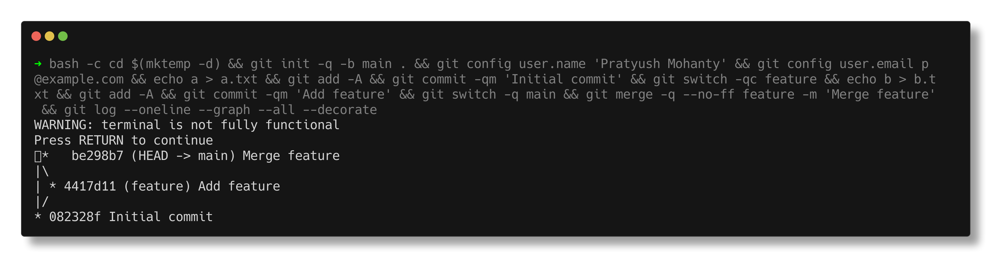

# Git and GitHub

> **Submitted by:** Pratyush Mohanty  |  **Roll No.:** 24BCS10238

**Form field:** Git and GitHub · **Course session:** `session5-git-github`

Run it: `./git-demo.sh` - Verified output: [output.md](output.md)

Everything runs in a `mktemp -d` sandbox with an `EXIT` trap, so it creates a
throwaway repo, demonstrates each workflow against it, and deletes it. It never
touches the repository you are reading this from.

---

## 1. The three areas

```text
working tree  ->  git add  ->  index (staging)  ->  git commit  ->  history
```

Staging is a *separate step* and that is the point: you choose which changes go
into a commit, rather than committing everything you happen to have edited.

```text
$ git status --short
?? README.md          <- untracked
A  app.py             <- staged
 M config.py          <- modified, NOT staged
```

## 2. Branching and fast-forward merge

```text
$ git merge --ff-only feature/login
Updating 67eb71f..ac0da0e
Fast-forward
```

A fast-forward just **moves the branch pointer** - no merge commit - because
`main` had no commits of its own since the branch point. `--ff-only` makes Git
refuse rather than silently create a merge commit.

## 3. A real merge conflict

Both branches changed `version.py` differently:

```text
$ git merge feature/banner
CONFLICT (add/add): Merge conflict in version.py
Automatic merge failed; fix conflicts and then commit the result.

$ cat version.py
<<<<<<< HEAD
VERSION = "2.0-hotfix"          <- your side (main)
=======
VERSION = "2.0-banner"          <- their side (feature/banner)
>>>>>>> feature/banner
```

The two-letter status code tells you how the conflict arose:

| code | meaning |
|---|---|
| `AA` | both sides **added** the same new file |
| `UU` | both sides **modified** an existing file (the common case) |
| `DU` / `UD` | one side deleted it, the other modified it |

Resolution is always the same three steps: **edit the file -> `git add` -> `git commit`**.
`git merge --abort` backs out entirely at any point.

The result has **two parents**, which is what makes it a merge commit:

```text
*   81a8c29 (HEAD -> main) Merge feature/banner: reconcile version to 2.0
|\
| * ae21253 (feature/banner) Set version 2.0-banner
* | 0456dce Set version 2.0-hotfix
|/
```



## 4. Cherry-pick - take one commit, not the branch

```text
$ git cherry-pick e0c8c38

  original on feature/experimental : e0c8c38
  new commit on main               : f4fcbe9
```

**Different hashes, same change.** A commit hash covers its parent, so the same
diff applied to a different base is always a different commit object. The
unwanted second commit on that branch did not come across.

Typical use: a hotfix that must also land on a release branch.

## 5. Undoing - `reset` vs `revert`

```text
git reset --soft  HEAD~1   undo commit, keep changes STAGED
git reset --mixed HEAD~1   undo commit, keep changes in WORKING TREE (default)
git reset --hard  HEAD~1   undo commit AND DISCARD changes     <-- destructive
```

```text
$ git revert --no-edit <hash>
[main 732d440] Revert "Add helper function"
```

> **The rule:** `reset` *rewrites* history - only ever on your own unpushed
> commits. `revert` *adds* history - the correct tool for anything already pushed.

Rewriting history someone else has pulled forces them into a painful recovery,
which is why `git push --force` on a shared branch is a serious mistake.
`--force-with-lease` is the safer form.

## 6. Stash

```text
$ git stash push -m "WIP on app.py"
$ git stash list
stash@{0}: On main: WIP on app.py
$ git stash pop
```

For when you need a clean tree *right now* - to switch branches or pull - but
are not ready to commit. `pop` applies and drops; `apply` keeps the stash.

## 7. Tags

```text
$ git tag -n
v1.0.0          First release
v1.0.1          Revert "Add helper function"
```

`-a` creates an **annotated** tag - a real object with author, date and message.
A bare `git tag x` is lightweight, just a pointer. Use annotated for releases.

**Tags are not pushed by default:** `git push origin v1.0.0`, or `--tags`.

## 8. .gitignore

```text
$ git status --short
?? .gitignore
```

`debug.log`, `.env` and `__pycache__/` exist on disk but never appear.

> `.gitignore` only affects **untracked** files. A file that is already committed
> stays tracked no matter what you add to `.gitignore` - you need
> `git rm --cached <file>`. This is how secrets keep getting committed.

## 9. Remotes

```text
$ git push -u origin main
 * [new branch]      main -> main
branch 'main' set up to track 'origin/main'.
```

Verified against a real bare repository created with `git init --bare`.

```text
git fetch    download remote commits, do NOT touch your working tree
git pull     = fetch + merge      (git pull --rebase = fetch + rebase)
git push     upload your commits
git clone    copy a repo, sets 'origin' automatically
```

The GitHub flow: **fork/branch -> commit -> push -> Pull Request -> review -> merge.**

## 10. Inspection

```bash
git log --oneline --graph --all --decorate   # the one worth aliasing
git show --stat HEAD                         # what a commit changed
git diff HEAD~1 --stat                       # what changed between commits
git blame version.py                         # who last touched each line
git reflog                                   # EVERY HEAD position - recovers "lost" commits
```

---

## Interview Q&A

**Q: `git fetch` vs `git pull`?**
`fetch` downloads remote commits and updates remote-tracking branches but leaves
your working tree alone. `pull` is `fetch` + `merge` (or `+ rebase` with
`--rebase`), which changes your working tree immediately.

**Q: `merge` vs `rebase`?**
`merge` preserves history and creates a merge commit with two parents. `rebase`
replays your commits on top of another branch, producing linear history but
**new commit hashes**. Never rebase commits that others have already pulled.

**Q: `reset` vs `revert`?**
`reset` moves the branch pointer and rewrites history - fine locally, dangerous
on shared branches. `revert` creates a new commit that undoes an old one, leaving
history intact - the safe choice for anything already pushed.

**Q: What does cherry-pick do?**
Applies the *changes* from one commit onto the current branch as a **new commit
with a different hash**. Used to move a single fix between branches without
taking everything else on that branch.

**Q: How do you resolve a merge conflict?**
Open the conflicted files, choose the correct content and remove the
`<<<<<<< ======= >>>>>>>` markers, `git add` each resolved file, then `git commit`.
`git merge --abort` backs out entirely. `git status` lists what is still conflicted.

**Q: I committed a secret. What do I do?**
Rotate the secret first - it must be assumed compromised the moment it was
pushed. Removing it from history (`git filter-repo`, or BFG) does not un-leak it,
and rewriting shared history has its own cost. Then add it to `.gitignore` and
`git rm --cached` the file.

**Q: What is `git reflog` for?**
It records every position HEAD has held, including commits orphaned by a
`reset --hard` or a bad rebase. It is the undo of last resort - almost nothing is
truly lost for the first ~90 days.

**Q: Lightweight vs annotated tag?**
Lightweight is just a pointer to a commit. Annotated (`-a`) is a full object with
its own author, date, message and optional GPG signature. Releases should be
annotated.

**Q: How do you undo the last commit but keep the changes?**
`git reset --soft HEAD~1` keeps them staged; `git reset --mixed HEAD~1` (the
default) keeps them in the working tree.
