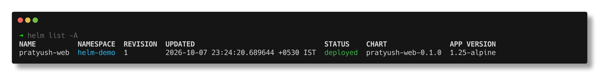
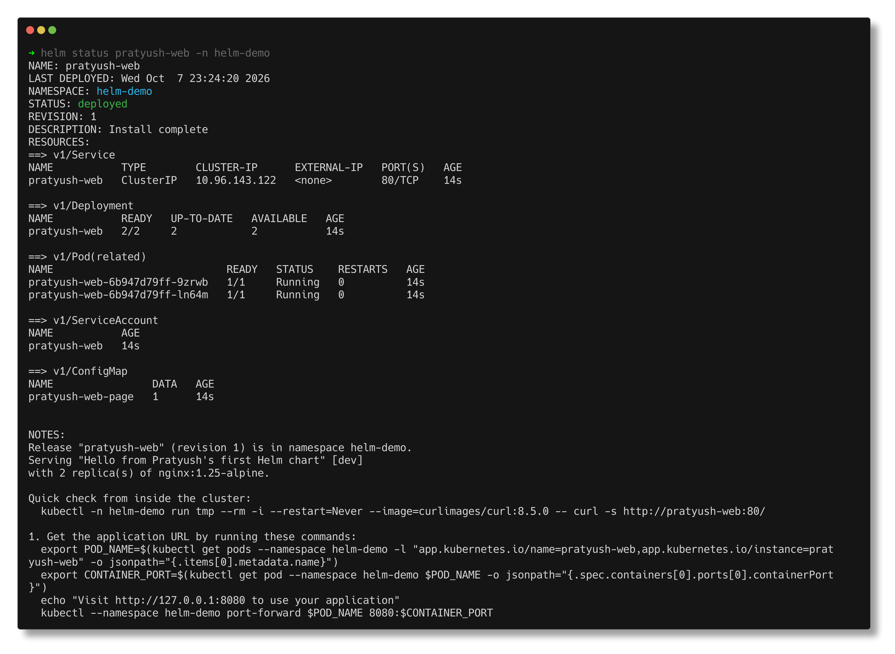
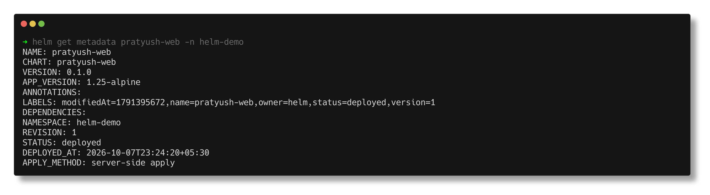
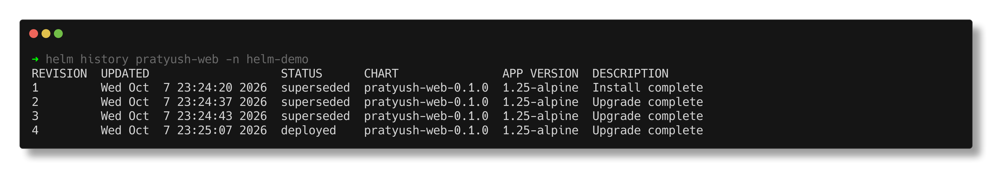
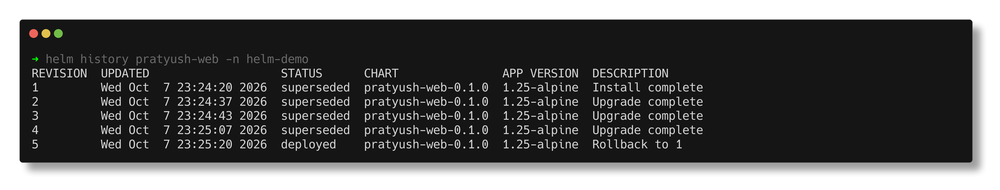
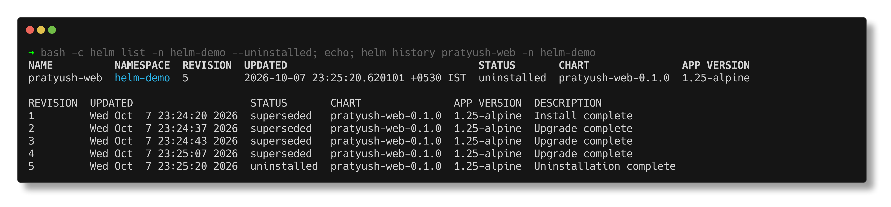
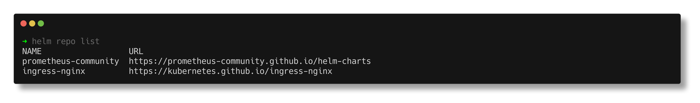
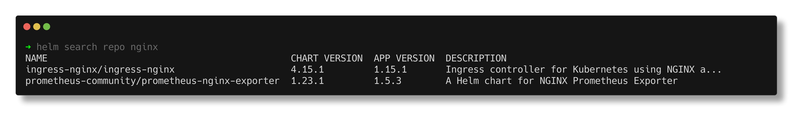
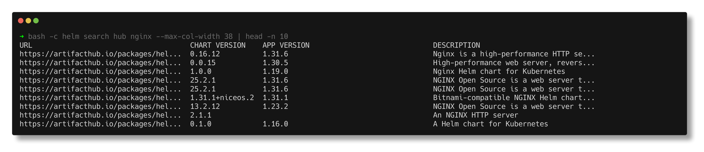

# Task 1 - Helm Commands

> **Submitted by:** Pratyush Mohanty  |  **Roll No.:** 24BCS10238

**Form field:** Helm · **Course session:** `session-15-helm`

Run it: `./run.sh` (or `./run.sh local|release|repo|cleanup`). Add `SHOTS=1` to also refresh the screenshots.
Verified output: [output.md](output.md) - one real run of every command below, Helm **v4.3.0**
against the kind cluster (Kubernetes v1.37.0), namespace `helm-demo`.

The chart used throughout is [`pratyush-web/`](pratyush-web/): made with `helm create`, then
customised - a ConfigMap that renders a small page from values (`web.message`,
`web.environment`), mounted into nginx, a `checksum/page` annotation so a changed page rolls
the pods, small resource requests, a pinned busybox for the test hook, and a NOTES.txt that
prints the curl command. [`values-staging.yaml`](values-staging.yaml) is the override file
for the `-f` demo.

The page prints the release revision it was rendered for, which turns out to be the most
useful thing on it (see rollback).

| # | Command | One line |
|---|---|---|
| 1 | `helm create` | scaffold a chart |
| 2 | `helm lint` | static checks on a chart |
| 3 | `helm template` | render locally, no cluster |
| 4 | `helm install` (+ `--dry-run`) | create a release (revision 1) |
| 5 | `helm list` | which releases exist |
| 6 | `helm status` | state + resources + NOTES of one release |
| 7 | `helm get` | what Helm stored: values, manifest, notes, hooks, metadata, all |
| 8 | `helm upgrade` | new revision with `--set`, `-f`, `--reuse-values` |
| 9 | `helm history` | every revision of a release |
| 10 | `helm rollback` | re-apply an old revision as a NEW revision |
| 11 | `helm test` | run the chart's test hook |
| 12 | `helm uninstall` | remove a release, with or without `--keep-history` |
| 13 | `helm repo` | add / list / update / remove chart repositories |
| 14 | `helm search` | search added repos (`repo`) or Artifact Hub (`hub`) |

---

## 1. `helm create`

Generates a working chart skeleton: Chart.yaml, values.yaml, `_helpers.tpl`, a Deployment,
Service, ServiceAccount, Ingress, HTTPRoute, HPA, NOTES.txt and a test hook. Most of it is
switched off by values (`ingress.enabled: false`, `autoscaling.enabled: false`).

```text
$ helm create pratyush-web
Creating pratyush-web
...
My committed ./pratyush-web started as exactly this. Files I changed or added:
  Files pratyush-web/Chart.yaml and ./pratyush-web/Chart.yaml differ
  Only in pratyush-web: charts
  Files pratyush-web/templates/NOTES.txt and ./pratyush-web/templates/NOTES.txt differ
  Only in ./pratyush-web/templates: configmap.yaml
  Files pratyush-web/templates/deployment.yaml and ./pratyush-web/templates/deployment.yaml differ
  Files pratyush-web/templates/tests/test-connection.yaml and ./pratyush-web/templates/tests/test-connection.yaml differ
  Files pratyush-web/values.yaml and ./pratyush-web/values.yaml differ
```

The script runs `helm create` into a temp dir and diffs it against my committed copy, so the
customisation is visible and checkable rather than just claimed.

## 2. `helm lint`

Renders every template and checks the result is valid YAML with the expected structure.
It does not talk to the cluster.

```text
$ helm lint broken-web
==> Linting broken-web
[INFO] Chart.yaml: icon is recommended
[ERROR] templates/: parse error at (pratyush-web/templates/configmap.yaml:16): unclosed action started at pratyush-web/templates/configmap.yaml:15

Error: 1 chart(s) linted, 1 chart(s) failed
exit code: 1
```

The non-zero exit code is what makes it useful as a CI gate. `--strict` turns warnings into
failures; `-f`/`--set` lint the chart with the values a real environment will use.

## 3. `helm template`

Renders the chart to plain YAML on my machine. `-s templates/configmap.yaml` shows one file.
It is the fastest way to answer "what will this values change actually do?":

```text
$ helm template pratyush-web ./pratyush-web | grep -E 'replicas:|image: "nginx'
  replicas: 2
          image: "nginx:1.25-alpine"
$ helm template pratyush-web ./pratyush-web -f values-staging.yaml | grep -E 'replicas:|image: "nginx'
  replicas: 2
          image: "nginx:1.27-alpine"
$ helm template pratyush-web ./pratyush-web -f values-staging.yaml --set replicaCount=4 | grep -E 'replicas:|image: "nginx'
  replicas: 4
          image: "nginx:1.27-alpine"

$ helm template ... -f values-staging.yaml --set web.environment=from-set-flag -s templates/configmap.yaml | grep -E 'message|environment'
    message     : Staging build - now on nginx 1.27
    environment : from-set-flag
```

That last one is the precedence rule in one line: `--set` beats `-f`, which beats the chart's
`values.yaml`. `helm template` does not render NOTES.txt (`-s templates/NOTES.txt` errors
with "could not find template").

## 4. `helm install`

Renders the chart, sends the objects to the API server and stores revision 1.

**`--dry-run` first.** In Helm 4 it takes a mode: `client` (render only) or `server` (the API
server validates the objects too). A bare `--dry-run` still works but warns:

```text
$ helm install pratyush-web ./pratyush-web -n helm-demo --dry-run | head -n 1
level=WARN msg="--dry-run is deprecated and should be replaced with '--dry-run=client'"
NAME: pratyush-web
```

`--debug` adds the values the templates were rendered with (and Helm 4's structured
`level=DEBUG` log lines):

```text
$ helm install pratyush-web ./pratyush-web -n helm-demo --dry-run=client --debug --set replicaCount=3 | sed -n '/^USER-SUPPLIED/,/^COMPUTED/p'
...
USER-SUPPLIED VALUES:
replicaCount: 3

COMPUTED VALUES:
```

Then the real install. `--create-namespace` makes `helm-demo`; `--wait` blocks until the
Deployment is actually ready instead of returning as soon as the API accepted the objects:

```text
$ helm install pratyush-web ./pratyush-web -n helm-demo --create-namespace --wait --timeout 120s
NAME: pratyush-web
NAMESPACE: helm-demo
STATUS: deployed
REVISION: 1
DESCRIPTION: Install complete
NOTES:
Release "pratyush-web" (revision 1) is in namespace helm-demo.
Serving "Hello from Pratyush's first Helm chart" [dev]
with 2 replica(s) of nginx:1.25-alpine.
...
What the Service actually serves (curl from a client pod in helm-demo):
  | message     : Hello from Pratyush's first Helm chart
  | environment : dev
  | owner       : Pratyush Mohanty (24BCS10238)
  | release     : pratyush-web (revision 1) in namespace helm-demo
  | chart       : pratyush-web-0.1.0
  | Server: nginx/1.25.5
```

## 5. `helm list`

Lists releases in the current namespace; `-A` for all namespaces, `-q` for names only.

```text
$ helm list -A
NAME        	NAMESPACE	REVISION	UPDATED                             	STATUS  	CHART             	APP VERSION
pratyush-web	helm-demo	1       	2026-10-07 23:24:20.689644 +0530 IST	deployed	pratyush-web-0.1.0	1.25-alpine
```



**Helm 4 change I hit:** `helm list` now shows releases in *every* status by default, including
`uninstalled` ones kept with `--keep-history` (section 12). Helm 3 showed only deployed/failed
and needed `-a/--all`; in Helm 4 `-a` is an unknown flag. Use `--deployed`, `--failed`,
`--uninstalled` etc. to filter.

## 6. `helm status`

Status, revision, description, the live resources and the rendered NOTES of one release.



**Helm 4 change:** the RESOURCES block is always printed. Helm 3 needed `--show-resources`,
which is now gone:

```text
$ helm status pratyush-web -n helm-demo --show-resources
Error: unknown flag: --show-resources
```

## 7. `helm get`

Downloads what Helm *stored* for a release (not the live cluster state):

| Sub-command | Gives you |
|---|---|
| `get values` | only the values I supplied (`--all` for the merged result) |
| `get manifest` | the exact YAML that was applied |
| `get notes` | rendered NOTES.txt |
| `get hooks` | hook resources (here the test pod) |
| `get metadata` | chart, version, revision, status, apply method |
| `get all` | all of the above in one dump |

```text
$ helm get values pratyush-web -n helm-demo
USER-SUPPLIED VALUES:
null
  (null = I passed no overrides; the chart defaults were used)

$ helm get manifest pratyush-web -n helm-demo | grep -E '^(# Source|kind):'
# Source: pratyush-web/templates/serviceaccount.yaml
kind: ServiceAccount
# Source: pratyush-web/templates/configmap.yaml
kind: ConfigMap
# Source: pratyush-web/templates/service.yaml
kind: Service
# Source: pratyush-web/templates/deployment.yaml
kind: Deployment
```



`APPLY_METHOD: server-side apply` is Helm 4's default for new installs (Helm 3 used a
client-side three-way merge).

## 8. `helm upgrade`

Renders the chart again with new values and applies the difference as a new revision.
Three upgrades, three lessons:

**`--set` (revision 2)** - replicas 2 -> 3 and a new message. `helm get values` now shows
exactly those two keys.

**`-f values-staging.yaml` (revision 3)** - nginx 1.27, staging message:

```text
  | message     : Staging build - now on nginx 1.27
  | environment : staging
  | release     : pratyush-web (revision 3) in namespace helm-demo
  | Server: nginx/1.27.5
$ helm get values pratyush-web -n helm-demo
USER-SUPPLIED VALUES:
image:
  tag: 1.27-alpine
replicaCount: 2
web:
  environment: staging
  message: Staging build - now on nginx 1.27

>>> The --set values from revision 2 are GONE (replicas 3 -> 2, message replaced).
```

A plain `helm upgrade` starts again from the chart defaults plus only what is on *this*
command line. Forgetting that is the classic way to silently undo someone's earlier `--set`.

**`--reuse-values --set replicaCount=4` (revision 4)** - keeps the previous release's values
and merges the new key on top:

```text
USER-SUPPLIED VALUES:
image:
  tag: 1.27-alpine
replicaCount: 4
web:
  environment: staging
  message: Staging build - now on nginx 1.27
```

The safest habit is neither: keep every environment's values in a file and always pass
`-f` explicitly (that is what the mini project does).

## 9. `helm history`



Each revision is a Secret in the release's namespace, holding the chart, values and rendered
manifest as base64 + gzip'd JSON:

```text
$ kubectl get secrets -n helm-demo -l owner=helm
NAME                                 TYPE                 DATA   AGE
sh.helm.release.v1.pratyush-web.v1   helm.sh/release.v1   1      60s
sh.helm.release.v1.pratyush-web.v2   helm.sh/release.v1   1      43s
sh.helm.release.v1.pratyush-web.v3   helm.sh/release.v1   1      37s
sh.helm.release.v1.pratyush-web.v4   helm.sh/release.v1   1      13s
$ kubectl get secret sh.helm.release.v1.pratyush-web.v2 ... | base64 -d | base64 -d | gunzip | python3 -c ...
['apply_method', 'chart', 'config', 'hooks', 'info', 'manifest', 'name', 'namespace', 'version']
config = {'replicaCount': 3, 'web': {'message': 'Upgraded with --set'}}
```

That is why rollback can work at all: the whole old release is still there. History is
capped at 10 revisions by default (`--history-max`).

## 10. `helm rollback`

```text
$ helm rollback pratyush-web 1 -n helm-demo --wait --timeout 120s
Rollback was a success! Happy Helming!
```



Two things this proves:

1. Rollback does not delete revisions 2-4; it creates **revision 5** ("Rollback to 1").
2. The page now says `release : pratyush-web (revision 1)` although the release is at
   revision 5. Rollback re-applies the manifest **stored** for revision 1; it does not
   re-render the templates. `helm get values` is back to `null`, i.e. revision 1's values.

## 11. `helm test`

Runs pods annotated `helm.sh/hook: test` (here `templates/tests/test-connection.yaml`, a
busybox `wget` against the Service):

```text
TEST SUITE:     pratyush-web-test-connection
Phase:          Succeeded

POD LOGS: pratyush-web-test-connection (wget)
message     : Hello from Pratyush's first Helm chart
```

## 12. `helm uninstall`

**With `--keep-history`**: the objects are deleted, but the release records stay, marked
`uninstalled`:



```text
$ kubectl get all,cm,sa -n helm-demo
NAME                               READY   STATUS      RESTARTS   AGE
pod/curl                           1/1     Running     0          76s
pod/pratyush-web-test-connection   0/1     Completed   0          4s
...
```

The test pod survives: hook resources are not tracked as part of the release, so uninstall
leaves them (my curl pod was never Helm's in the first place). Because history was kept, the
release could be brought straight back with `helm rollback pratyush-web 4` (revision 6).

**Plain `helm uninstall`** removes the objects *and* the history Secrets:

```text
$ helm history pratyush-web -n helm-demo
Error: release: not found
$ kubectl get secrets -n helm-demo -l owner=helm
No resources found in helm-demo namespace.
```

## 13. `helm repo`

Repositories are just URLs serving an `index.yaml`. They live in the local Helm config, not
in the cluster.

```text
$ helm repo add prometheus-community https://prometheus-community.github.io/helm-charts
"prometheus-community" has been added to your repositories
$ helm repo update
Hang tight while we grab the latest from your chart repositories...
...Successfully got an update from the "ingress-nginx" chart repository
...Successfully got an update from the "prometheus-community" chart repository
Update Complete. ⎈Happy Helming!⎈
$ helm repo remove prometheus-community ingress-nginx
"prometheus-community" has been removed from your repositories
"ingress-nginx" has been removed from your repositories
```



## 14. `helm search`

`search repo` searches the indexes downloaded by `repo add/update` (offline, fast).
`search hub` queries Artifact Hub over the network and needs no repo at all.



```text
$ helm search repo ingress-nginx/ingress-nginx --versions | head -n 5
NAME                       	CHART VERSION	APP VERSION	DESCRIPTION
ingress-nginx/ingress-nginx	4.15.1       	1.15.1     	Ingress controller for Kubernetes using NGINX a...
ingress-nginx/ingress-nginx	4.15.0       	1.15.0     	Ingress controller for Kubernetes using NGINX a...
...
$ helm search hub nginx | tail -n +2 | wc -l | tr -d ' '
304
```



CHART VERSION is the chart's own version; APP VERSION is the software inside it. They move
independently. `helm show chart <repo/chart>` reads a chart's metadata without installing it.

---

## Helm 4 vs Helm 3 - differences I actually ran into

| What | Helm 3 | Helm 4.3 (what I saw) |
|---|---|---|
| `--dry-run` | bare flag | `--dry-run=client\|server`; bare form warns "deprecated" |
| `helm status` resources | needed `--show-resources` | always shown; flag removed |
| `helm list` default | deployed + failed, `-a` for all | every status; `-a` is an unknown flag |
| `--atomic` | auto rollback on failure | deprecated -> `--rollback-on-failure` (see [02-rollback](../02-rollback/README.md)) |
| `--force` | replace resources | deprecated -> `--force-replace` |
| Apply method | client-side 3-way merge | server-side apply (`APPLY_METHOD: server-side apply`) |
| `--wait` | boolean | strategy: `watcher` (when given alone), `hookOnly` (default), `legacy` |
| `--debug` | plain text | structured `level=DEBUG msg=...` lines |

---

## Notes from actually running this

- **`--wait` returning does not mean every request will succeed.** Right after an upgrade
  my first curl failed with exit code 7 (connection refused): the old pods were already
  shutting down and kube-proxy had not yet programmed the new endpoints. The script's
  `page()` helper retries for a few seconds. [02-rollback](../02-rollback/README.md) shows
  the proper fix (a `preStop` sleep).
- **The Bitnami repo was too big for `helm repo update`.** `helm repo add bitnami
  https://charts.bitnami.com/bitnami` worked, but its `index.yaml` is 27 MB (served via a
  redirect to Broadcom) and `helm repo update` gave up:
  `...Unable to get an update from the "bitnami" chart repository ... context deadline
  exceeded (Client.Timeout or context cancellation while reading body)`. `curl` alone took
  54 s for that file. I switched the demo to `prometheus-community` and `ingress-nginx`.
- **OCI charts hit Docker Hub's anonymous rate limit.** `helm show chart
  oci://registry-1.docker.io/bitnamicharts/nginx` failed with `response status code 429:
  toomanyrequests`. OCI charts need no `helm repo add`, but they do count as registry pulls.
- **`helm search hub` failed once** with `unable to perform search against
  "https://hub.helm.sh"` and worked on the next try - it depends on Artifact Hub being up.
- **`charts/` disappears in git.** `helm create` makes an empty `charts/` directory; git
  does not track empty directories and this chart has no dependencies, so I removed it.
- **The page includes the revision number on purpose.** It changes the ConfigMap on every
  upgrade, so every upgrade rolls the pods (via the checksum annotation) - and it is what
  exposed that rollback re-applies the old rendered manifest instead of re-rendering.

---

## Interview Q&A

**Q: `helm install` vs `helm upgrade --install`?**
`install` fails if the release exists; `upgrade` fails if it does not. `upgrade --install`
does whichever is needed, so it is the idempotent choice for CI/CD.

**Q: What is the values precedence?**
Chart `values.yaml` < parent chart values < `-f` files (left to right) < `--set`/`--set-json`
etc. Shown in section 3: `--set web.environment=...` beat the same key in `-f`.

**Q: What happens to my earlier `--set` values on the next `helm upgrade`?**
They are dropped unless you pass `--reuse-values` (or `--reset-then-reuse-values`). Section 8
shows replicas going 3 -> 2 on a plain `-f` upgrade.

**Q: Where does Helm 3/4 keep release state?**
In Secrets of type `helm.sh/release.v1` in the release namespace, one per revision. No Tiller.

**Q: Does `helm rollback` restore the old templates or the old values?**
Neither is re-rendered - it re-applies the stored manifest of that revision and records it as
a new revision. Section 10: the page still said "revision 1" at revision 5.

**Q: `helm template` vs `helm install --dry-run=server`?**
`template` renders locally with no cluster. `--dry-run=server` also sends the objects to the
API server for validation and admission, but persists nothing.

**Q: `helm uninstall --keep-history` - why?**
Keeps the release records so you can audit or `helm rollback` it back later; the release name
stays taken until a plain uninstall.
