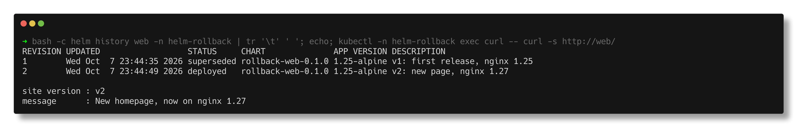
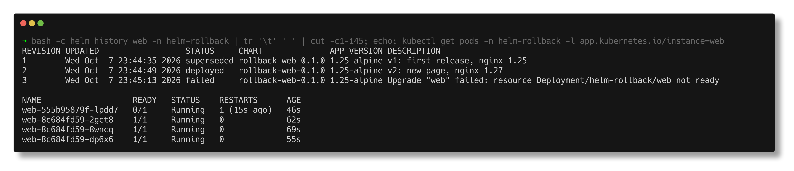
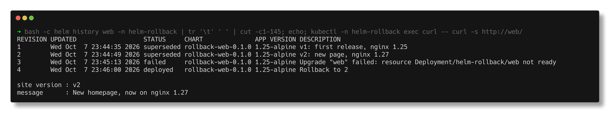
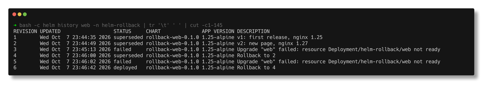

# Task 2 - Helm Rollback Workflow

> **Submitted by:** Pratyush Mohanty  |  **Roll No.:** 24BCS10238

**Form field:** Helm · **Course session:** `session-15-helm` (`08-rollback`)

Run it: `./run.sh` (`SHOTS=1 ./run.sh` also refreshes the screenshots; `./run.sh cleanup` removes everything).
Verified output: [output.md](output.md) - a real run on Helm v4.3.0 / Kubernetes v1.37.0, namespace `helm-rollback`.

## What is in the folder

| File | Purpose |
|---|---|
| [`rollback-web/`](rollback-web/) | the chart: Deployment (3 nginx replicas, readiness + liveness probes, `preStop` sleep), Service, ConfigMap page, `_helpers.tpl`, NOTES.txt |
| `rollback-web/values.yaml` | revision 1: page v1, `nginx:1.25-alpine` |
| [`values-v2.yaml`](values-v2.yaml) | revision 2 (good): page v2, `nginx:1.27-alpine` |
| [`values-v3-bad.yaml`](values-v3-bad.yaml) | revision 3 (bad): same as v2 but `containerPort: 8080` - nginx still listens on 80 |
| `run.sh` | the whole workflow, with a verify after every step |

"Verify" is the same three checks every time: `helm history`, the live pods (image, port,
ready, restarts) and **10 real requests through the Service** from a curl pod, grouped by
the page version and the `Server:` header (which gives away the nginx version).

## The flow

```text
 STEP 1  INSTALL        rev 1  page v1, nginx 1.25        deployed
            |
 STEP 3  UPGRADE        rev 2  page v2, nginx 1.27        deployed   (rev 1 -> superseded)
            |
 STEP 4  VERIFY         10/10 requests: page v2, nginx/1.27.5
            |
 STEP 5  UPGRADE AGAIN  rev 3  containerPort 8080         FAILED after --wait --timeout 45s
            |                                             (rev 2 stays "deployed")
 STEP 6  VERIFY         1 new pod 0/1, restarting; 3 old pods still serve v2
            |
 STEP 8  ROLLBACK 2     rev 4  "Rollback to 2"            deployed   (a NEW revision)
            |
 STEP 9  VERIFY         3/3 pods ready on port 80, 10/10 requests page v2,
                        manifest of rev 4 == manifest of rev 2
```

Before touching the cluster, `helm template` + `diff` shows exactly what each values file
changes - v2 changes the page and the image, v3 changes one line:

```text
$ diff <(helm template web ./rollback-web -f values-v2.yaml) <(helm template web ./rollback-web -f values-v3-bad.yaml)
72c72
<               containerPort: 80
---
>               containerPort: 8080
```

## Step by step

### Install (rev 1) and verify

`--description` labels each revision in `helm history`, the same job as
`kubernetes.io/change-cause` on a Deployment.

```text
$ helm install web ./rollback-web -n helm-rollback --create-namespace --wait --timeout 90s --description 'v1: first release, nginx 1.25'
STATUS: deployed
REVISION: 1
DESCRIPTION: v1: first release, nginx 1.25
...
--- pods ---
  POD                    IMAGE              PORT  READY  RESTARTS
  web-7c98bb87d5-gtkv7   nginx:1.25-alpine  80    true   0
  web-7c98bb87d5-lmmzf   nginx:1.25-alpine  80    true   0
  web-7c98bb87d5-wqzpz   nginx:1.25-alpine  80    true   0
--- 10 requests through Service/web ---
  10 page v1  served by nginx/1.25.5
```

### Upgrade (rev 2) and verify

```text
--- 10 requests through Service/web ---
  10 page v2  served by nginx/1.27.5
```



### Upgrade again - the bad one (rev 3)

`--wait --timeout 45s` makes Helm wait for the Deployment to become ready and give up if it
does not, instead of reporting success the moment the API accepts the objects:

```text
$ helm upgrade web ./rollback-web -n helm-rollback -f values-v3-bad.yaml --wait --timeout 45s --description 'v3: move to port 8080'
level=WARN msg="upgrade failed" name=web error="resource Deployment/helm-rollback/web not ready. status: InProgress, message: Updated: 1/3\ncontext deadline exceeded"
Error: UPGRADE FAILED: resource Deployment/helm-rollback/web not ready. status: InProgress, message: Updated: 1/3
context deadline exceeded
exit code: 1
```

### Verify rev 3

```text
--- helm history ---
2   ...  deployed    rollback-web-0.1.0  1.25-alpine  v2: new page, nginx 1.27
3   ...  failed      rollback-web-0.1.0  1.25-alpine  Upgrade "web" failed: resource Deployment/helm-rollback/web not ...

--- pods ---
  POD                    IMAGE              PORT  READY  RESTARTS
  web-555b95879f-lpdd7   nginx:1.27-alpine  8080  false  1
  web-8c684fd59-2gct8    nginx:1.27-alpine  80    true   0
  web-8c684fd59-8wncq    nginx:1.27-alpine  80    true   0
  web-8c684fd59-dp6x6    nginx:1.27-alpine  80    true   0

--- 10 requests through Service/web ---
  10 page v2  served by nginx/1.27.5

--- why the new pod never becomes Ready ---
  Liveness probe failed: Get "http://10.244.1.218:8080/": dial tcp 10.244.1.218:8080: connect: connection refused
  Readiness probe failed: Get "http://10.244.1.218:8080/": dial tcp 10.244.1.218:8080: connect: connection refused
```



The interesting part: Helm says **failed**, yet users saw nothing. The rolling update
(`maxSurge` 25% of 3 = 1, `maxUnavailable` 25% of 3 rounded down = 0) only added one surge
pod, which never became Ready, so the three v2 pods were never touched. The Service's
`targetPort: http` is a port *name*, resolved per pod, so the old pods kept answering on 80.
The Deployment is stuck half-way though, and the failed pod keeps restarting under the
liveness probe - that is what the rollback cleans up.

Note that after a failed upgrade the last good revision (2) stays `deployed` and the failed
one is `failed`; Helm also replaced my `--description` with the failure reason.

`helm get` shows exactly what differed:

```text
$ diff <(helm get manifest web -n helm-rollback --revision 2) <(helm get manifest web -n helm-rollback --revision 3)
72c72
<               containerPort: 80
---
>               containerPort: 8080
```

### Rollback (rev 4) and verify

```text
$ helm rollback web 2 -n helm-rollback --wait --timeout 90s
Rollback was a success! Happy Helming!

$ helm history web -n helm-rollback --show-rollback-revision
REVISION  ...  STATUS      ...  ROLLBACK  DESCRIPTION
1         ...  superseded  ...            v1: first release, nginx 1.25
2         ...  superseded  ...            v2: new page, nginx 1.27
3         ...  failed      ...            Upgrade "web" failed: resource Deployment/helm-rollback
4         ...  deployed    ...  2         Rollback to 2

--- pods ---
  POD                    IMAGE              PORT  READY  RESTARTS
  web-8c684fd59-2gct8    nginx:1.27-alpine  80    true   0
  web-8c684fd59-8wncq    nginx:1.27-alpine  80    true   0
  web-8c684fd59-dp6x6    nginx:1.27-alpine  80    true   0
--- 10 requests through Service/web ---
  10 page v2  served by nginx/1.27.5

$ diff <(helm get manifest ... --revision 2) <(helm get manifest ... --revision 4) && echo '  manifests of revision 2 and 4 are identical'
  manifests of revision 2 and 4 are identical
$ kubectl get secrets -n helm-rollback -l owner=helm,name=web
sh.helm.release.v1.web.v1 ... v2 ... v3 ... v4
```



**Rollback created revision 4**; it did not rewind to 2 or delete 3. The failed revision stays
in history as evidence, and `--show-rollback-revision` (an extra column in Helm 4's
`helm history`) records which revision was restored. The same pod names before and after
show the Deployment simply went back to its old ReplicaSet.

### Bonus - automatic rollback with `--rollback-on-failure`

Helm 4 renamed `--atomic`. The old name still works but warns:

```text
Flag --atomic has been deprecated, use --rollback-on-failure instead
```

A typo in the image tag, with automatic rollback:

```text
$ helm upgrade web ./rollback-web -n helm-rollback -f values-v2.yaml --set image.tag=1.27-alpinee --rollback-on-failure --timeout 40s --description 'v5: typo in image tag'
Error: UPGRADE FAILED: release web failed, and has been rolled back due to rollback-on-failure being set: resource Deployment/helm-rollback/web not ready. status: InProgress, message: Updated: 1/3
context deadline exceeded

Failed to pull image "nginx:1.27-alpinee": rpc error: code = NotFound desc = failed to pull and unpack image "docker.io/library/nginx:1.27-alpinee": ... not found
```



Revision 5 failed and Helm itself wrote revision 6, "Rollback to 4". `--rollback-on-failure`
implies `--wait`. It is the right default for CI pipelines, where nobody is watching to
type the rollback by hand.

---

## Notes from actually running this

- **2 of 10 requests failed right after a successful upgrade** in my first run, before the
  chart had a `preStop` hook:

  ```text
  --- 10 requests through Service/web ---
    2 NO RESPONSE
    8 page v2  served by nginx/1.27.5
  ```

  `helm upgrade --wait` had returned, but old pods were being terminated. nginx stops
  listening as soon as it gets the stop signal, while kube-proxy removes the pod from the
  Service a moment *later*, so a few connections went to a pod that had already closed its
  socket. A `preStop: sleep: seconds: 5` (the native sleep action, no `sleep` binary needed)
  keeps the old pod serving until the endpoint update has propagated. After adding it, every
  verify in the run was 10/10.
- **The bad values file has to repeat the good values.** `values-v3-bad.yaml` restates v2's
  image and page. Without that, a plain `helm upgrade -f values-v3-bad.yaml` would have
  reset everything else to the chart defaults (page v1, nginx 1.25) - a second, accidental
  change hidden inside the "port" change.
- **Why the bad change is a port and not the page.** The ConfigMap is shared by old and new
  pods. If revision 3 had also changed the page, the old v2 pods would have picked up the new
  content through the volume (kubelet refreshes ConfigMap volumes) even though the upgrade
  failed. Changing only the pod template keeps the old ReplicaSet genuinely untouched.
- **APP VERSION never changes in history** - it comes from `Chart.yaml`'s `appVersion`, not
  from `--set image.tag`. That is why `--description` (or bumping `appVersion`) matters.
- **The image-tag typo was pulled for real.** The nodes pull through a registry mirror, so
  the failure is a genuine `NotFound`, not a rate limit. The port-8080 failure needs no
  registry at all, which is why it is the main demo.

---

## Interview Q&A

**Q: Does `helm rollback` delete the bad revision?**
No. It writes a new revision with the old revision's manifest and values. History here ends
at 6 revisions, two of them `failed`.

**Q: `helm rollback web` with no revision number?**
Rolls back to the previous revision. Pass the number explicitly - after a failed upgrade the
"previous" one may not be the one you want.

**Q: How does Helm know an upgrade failed?**
Only if you ask it to wait. Without `--wait` (Helm 4 default `hookOnly`), Helm reports
success once the API server accepts the objects, even if every new pod crash-loops.

**Q: What does `--rollback-on-failure` (`--atomic` in Helm 3) do?**
Waits for readiness; on failure or timeout it rolls back to the last successful revision
automatically and returns an error.

**Q: Helm marked the release failed - is production down?**
Not necessarily. Here 10/10 requests still got v2 because the rolling update never removed a
healthy pod. Check the pods and real traffic, not just `helm status`.

**Q: Helm rollback vs `kubectl rollout undo`?**
`rollout undo` only reverts a Deployment's pod template. `helm rollback` reverts every object
in the release (ConfigMaps, Services, Ingress...) to a recorded revision and keeps Helm's
history consistent. Using `kubectl rollout undo` on a Helm-managed Deployment makes the
cluster drift from what Helm thinks is deployed.
