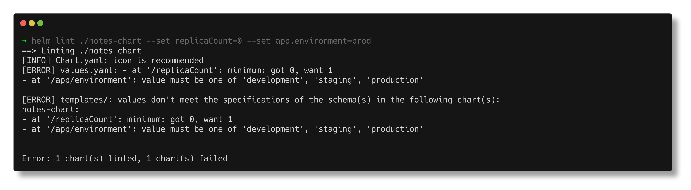
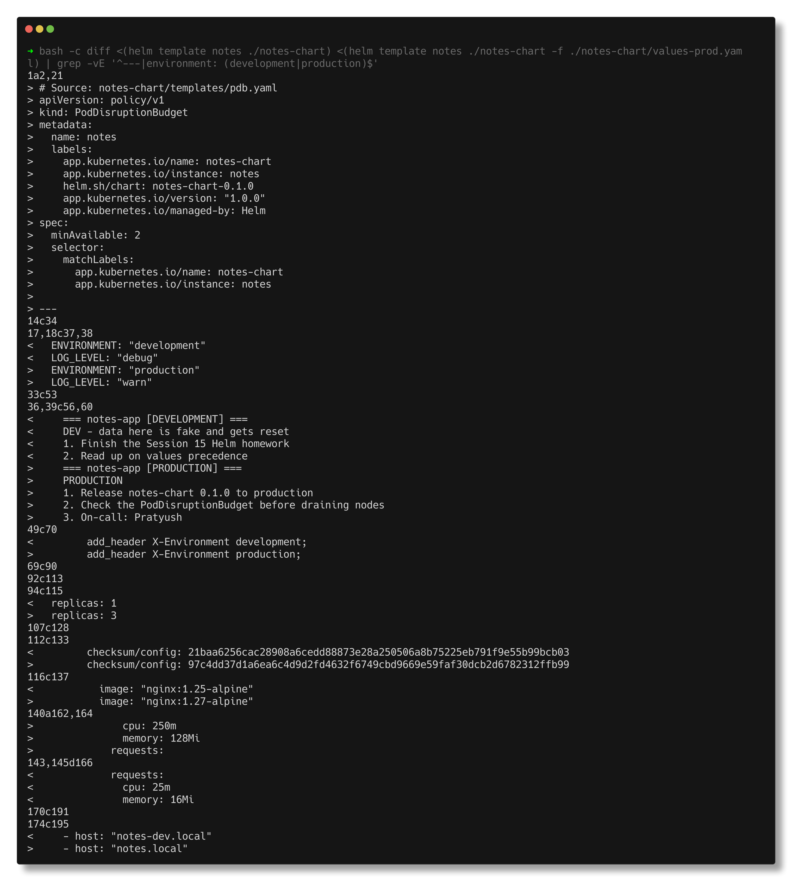
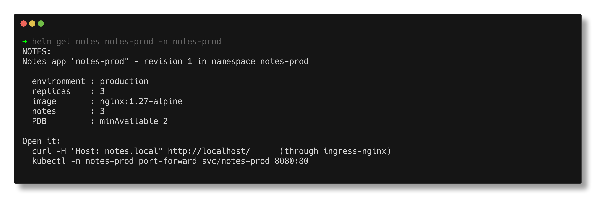
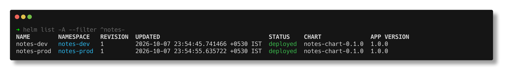
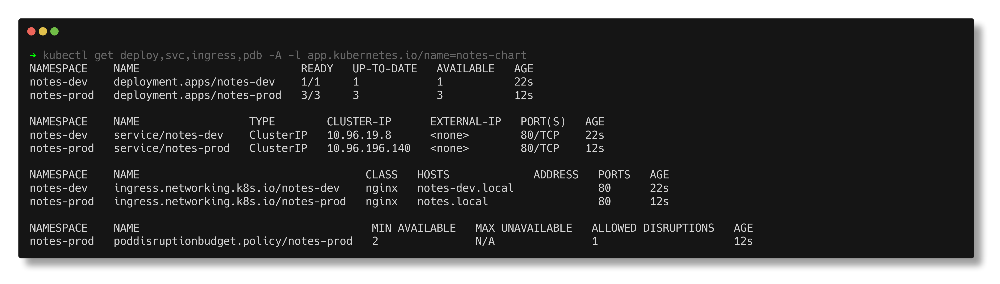
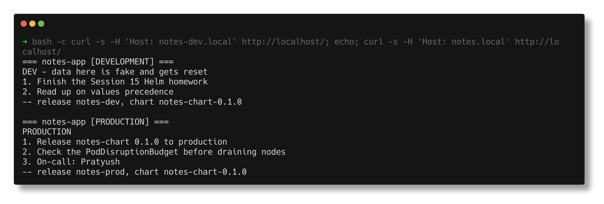
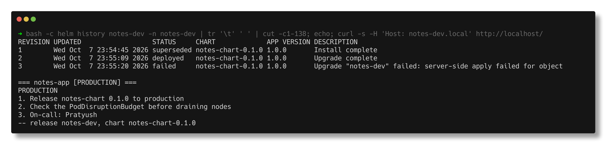
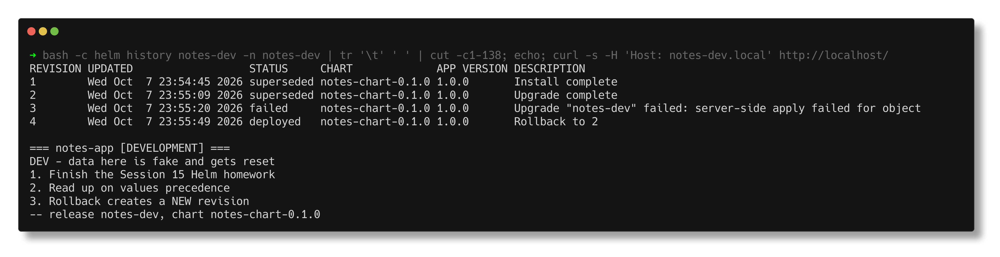

# Task 3 - Helm Mini Project: Notes App, Dev and Prod from One Chart

> **Submitted by:** Pratyush Mohanty  |  **Roll No.:** 24BCS10238

**Form field:** Helm · **Course session:** `session-15-helm` (`mini-project`)

Run it: `./run.sh` (`SHOTS=1 ./run.sh` also refreshes the screenshots; `./run.sh cleanup` removes everything).
Verified output: [output.md](output.md) - a real run on Helm v4.3.0 / Kubernetes v1.37.0.
Needs ingress-nginx with host port 80 on localhost (the kind cluster from earlier topics has it).

The instructor's mini project packages a "Notes app" (nginx standing in for the app) as
`notes-chart` with a ConfigMap, Deployment, Service, `values.yaml` and `values-prod.yaml`.
I wrote my own version of that chart and ran it the way a chart is meant to be used: **one
chart, two releases, two namespaces, different values** - then upgraded, broke and rolled
back the dev release while prod stayed untouched.

## Deliverables

| Deliverable | Where |
|---|---|
| Helm chart | [`notes-chart/`](notes-chart/) - `Chart.yaml`, `.helmignore` |
| values.yaml | [`notes-chart/values.yaml`](notes-chart/values.yaml) (dev defaults) + [`values-prod.yaml`](notes-chart/values-prod.yaml) + [`values.schema.json`](notes-chart/values.schema.json) |
| Templates | [`templates/`](notes-chart/templates/) - configmap, deployment, service, ingress, pdb, `_helpers.tpl`, `NOTES.txt` |
| Installation | [STEP 4-6](#installation-dev-and-prod) |
| Upgrade | [STEP 7](#upgrade-dev-revision-2) |
| Rollback | [STEP 8-9](#a-bad-upgrade-and-the-rollback) |
| Screenshots | [`screenshots/`](screenshots/) (embedded below) |
| README | this file + [output.md](output.md) |

## The chart

```text
notes-chart/
  Chart.yaml            name, chart version 0.1.0, appVersion 1.0.0
  values.yaml           dev defaults: 1 replica, nginx 1.25, debug, small resources
  values-prod.yaml      only what differs: 3 replicas, nginx 1.27, warn, bigger resources, PDB
  values.schema.json    validates values before anything is rendered
  .helmignore
  templates/
    _helpers.tpl        notes.fullname, notes.selectorLabels, notes.labels, notes.image
    configmap.yaml      <rel>-config (env vars) and <rel>-web (index.html + nginx server block)
    deployment.yaml     envFrom the config map, probes on /healthz, checksum annotation
    service.yaml        ClusterIP by default; nodePort only if type=NodePort and set
    ingress.yaml        only if ingress.enabled; host is `required`
    pdb.yaml            only if podDisruptionBudget.enabled (prod)
    NOTES.txt           printed after install/upgrade
```

Template features worth pointing at:

| Feature | Where | Why |
|---|---|---|
| `define` / `include` + `nindent` | `_helpers.tpl`, every `metadata.labels` | one label set, no copy-paste between files |
| `range` over a list | `configmap.yaml` renders `notes:` as a numbered list | values can be data, not just scalars |
| `if` / `with` | `ingress.yaml`, `pdb.yaml`, `resources` | objects that exist only in some environments |
| `required` | image tag, ingress host | fail rendering with a clear message instead of producing broken YAML |
| `default`, `quote`, `upper`, `add1` | configmap | small sprig helpers |
| `sha256sum` of the ConfigMap | pod annotation `checksum/config` | a config change rolls the pods (env vars and subPath mounts never update in place) |
| `values.schema.json` | chart root | type/enum/range checks on values |

## Values validation (before the cluster)

```text
$ helm lint ./notes-chart --set replicaCount=0 --set app.environment=prod
[ERROR] values.yaml: - at '/app/environment': value must be one of 'development', 'staging', 'production'
- at '/replicaCount': minimum: got 0, want 1
...
Error: 1 chart(s) linted, 1 chart(s) failed

$ helm template notes ./notes-chart --set ingress.host=null
Error: execution error at (notes-chart/templates/ingress.yaml:11:15): ingress.host is required when ingress.enabled=true
```



## `helm template` - dev vs prod

Both rendered with the same release name, so every line of the diff comes from
`values-prod.yaml`:

```text
$ diff <(helm template notes ./notes-chart) <(helm template notes ./notes-chart -f ./notes-chart/values-prod.yaml)
1a2,21
> # Source: notes-chart/templates/pdb.yaml
> apiVersion: policy/v1
> kind: PodDisruptionBudget
...
17,18c37,38
<   ENVIRONMENT: "development"
<   LOG_LEVEL: "debug"
---
>   ENVIRONMENT: "production"
>   LOG_LEVEL: "warn"
...
94c115
<   replicas: 1
---
>   replicas: 3
112c133
<         checksum/config: 21baa6256cac28908a6cedd88873e28a250506a8b75225eb791f9e55b99bcb03
---
>         checksum/config: 97c4dd37d1a6ea6c4d9d2fd4632f6749cbd9669e59faf30dcb2d6782312ffb99
116c137
<           image: "nginx:1.25-alpine"
---
>           image: "nginx:1.27-alpine"
```

(Full diff in [output.md](output.md), including resources and the ingress host.)



## Installation (dev and prod)

```bash
helm install notes-dev  ./notes-chart -n notes-dev  --create-namespace --wait --timeout 120s
helm install notes-prod ./notes-chart -n notes-prod --create-namespace -f notes-chart/values-prod.yaml --wait --timeout 120s
```

NOTES.txt is rendered with each release's own values:

```text
NOTES:
Notes app "notes-dev" - revision 1 in namespace notes-dev

  environment : development
  replicas    : 1
  image       : nginx:1.25-alpine
  notes       : 2

Open it:
  curl -H "Host: notes-dev.local" http://localhost/      (through ingress-nginx)
  kubectl -n notes-dev port-forward svc/notes-dev 8080:80
```





### What differs between the two environments (read from the live objects)

```text
  NAMESPACE   REPLICAS  IMAGE              REQUESTS              LIMITS                ENV           PDB
  notes-dev   1         nginx:1.25-alpine  25m/16Mi              100m/64Mi             development/debug none
  notes-prod  3         nginx:1.27-alpine  100m/64Mi             250m/128Mi            production/warn minAvailable=2

$ kubectl exec -n notes-prod deploy/notes-prod -- printenv APP_NAME ENVIRONMENT LOG_LEVEL
notes-app
production
warn
```



Through ingress-nginx from the Mac, with only the Host header changing:

```text
--- curl -H 'Host: notes-dev.local' http://localhost/ ---
  HTTP/1.1 200 OK
  X-Served-By: notes-dev-76b6bdcc75-srj8m
  X-Environment: development
  | === notes-app [DEVELOPMENT] ===
  | DEV - data here is fake and gets reset
  | 1. Finish the Session 15 Helm homework
  | 2. Read up on values precedence
  | -- release notes-dev, chart notes-chart-0.1.0

--- curl -H 'Host: notes.local' http://localhost/ ---
  HTTP/1.1 200 OK
  X-Served-By: notes-prod-649c598766-vs47c
  X-Environment: production
  | === notes-app [PRODUCTION] ===
  | PRODUCTION
  | 1. Release notes-chart 0.1.0 to production
  | 2. Check the PodDisruptionBudget before draining nodes
  | 3. On-call: Pratyush
  | -- release notes-prod, chart notes-chart-0.1.0
```



## Upgrade dev (revision 2)

One more note and a second replica. `--set-json` sets a whole list in one flag:

```text
$ helm upgrade notes-dev ./notes-chart -n notes-dev --set replicaCount=2 --set-json 'notes=["Finish the Session 15 Helm homework","Read up on values precedence","Rollback creates a NEW revision"]' --wait --timeout 120s
STATUS: deployed
REVISION: 2
  | 3. Rollback creates a NEW revision
```

## A bad upgrade, and the rollback

The instructor's step 11 is `helm upgrade notes-dev notes-chart -f values-prod.yaml`. With a
single release that is just "promote dev to prod settings". With a real prod release next
to it, it is a mistake - so I ran it on purpose:

```text
$ helm upgrade notes-dev ./notes-chart -n notes-dev -f ./notes-chart/values-prod.yaml --wait --timeout 120s
Error: UPGRADE FAILED: server-side apply failed for object notes-dev/notes-dev networking.k8s.io/v1, Kind=Ingress: admission webhook "validate.nginx.ingress.kubernetes.io" denied the request: host "notes.local" and path "/" is already defined in ingress notes-prod/notes-prod
exit code: 1
```

The ingress-nginx admission webhook refused a second Ingress for `notes.local`. So nothing
changed? No:

```text
  NAMESPACE   REPLICAS  IMAGE              REQUESTS              LIMITS                ENV           PDB
  notes-dev   3         nginx:1.27-alpine  100m/64Mi             250m/128Mi            production/warn minAvailable=2
  notes-prod  3         nginx:1.27-alpine  100m/64Mi             250m/128Mi            production/warn minAvailable=2

  HTTP/1.1 200 OK
  X-Served-By: notes-dev-5bdf9db858-w2f2b
  X-Environment: production
  | === notes-app [PRODUCTION] ===
  | PRODUCTION
```



The ConfigMaps, the Deployment and a new PDB were applied before Helm reached the Ingress.
Revision 3 is `failed`, yet the dev URL serves a 3-replica production config. **Helm upgrades
are not transactions** - "failed" can mean "half applied".

Rollback to the last good revision:

```text
$ helm rollback notes-dev 2 -n notes-dev --wait --timeout 120s
Rollback was a success! Happy Helming!

1  ...  superseded  Install complete
2  ...  superseded  Upgrade complete
3  ...  failed      Upgrade "notes-dev" failed: server-side apply failed for object ...
4  ...  deployed    Rollback to 2

  notes-dev   2         nginx:1.25-alpine  25m/16Mi              100m/64Mi             development/debug none
  X-Environment: development
  | 3. Rollback creates a NEW revision

$ helm history notes-prod -n notes-prod
1  ...  deployed  notes-chart-0.1.0  1.0.0  Install complete
```



Revision 4 put back 2 replicas, nginx 1.25, development config, and **deleted the PDB**
(it is not in revision 2's manifest). Prod still has exactly one revision: each release
has its own history.

---

## Notes from actually running this

- **I did not keep the instructor's `nodePort: 30090` in both values files.** NodePorts are
  cluster-wide, so dev and prod would fight over it. STEP 11 proves it - and shows that a
  server-side dry run cannot catch it:

  ```text
  $ helm install nodeport-b ./notes-chart -n notes-prod --set service.type=NodePort --set service.nodePort=30090 --set ingress.enabled=false --dry-run=server | grep -E '^(STATUS|DESCRIPTION|Error)'
  STATUS: pending-install
  DESCRIPTION: Dry run complete
  $ helm install nodeport-b ./notes-chart -n notes-prod --set service.type=NodePort --set service.nodePort=30090 --set ingress.enabled=false
  Error: INSTALLATION FAILED: ... Service "nodeport-b" is invalid: spec.ports[0].nodePort: Invalid value: 30090: provided port is already allocated
  ```

  A dry run does not allocate ports. My chart defaults to ClusterIP and exposes both
  environments through ingress-nginx by host name instead (and only 30080 is mapped to the
  Mac in this kind cluster anyway).
- **The first capture of the bad upgrade looked harmless.** The curl straight after
  `kubectl rollout status` still returned the DEVELOPMENT page from a terminating old pod
  (ingress-nginx updates its upstream list a moment after the rollout finishes, and the
  `preStop` sleep keeps old pods serving on purpose). The script now waits for the old
  pods to be gone before looking, which is when the production page shows up on the dev URL.
- **12 requests to prod hit only 2 of the 3 pods** in the recorded run (4 and 8); an earlier
  run spread them 2/7/3. ingress-nginx keeps keepalive connections to upstream pods, so small
  samples are lumpy - it is not evidence that a pod was unhealthy.
- **Two ConfigMaps, not one.** `envFrom` imports every key as an env var; keys like
  `index.html` are not valid env var names and would be skipped with a warning. Settings go
  in `<release>-config`, files in `<release>-web`.
- **subPath mounts never receive ConfigMap updates**, which is one more reason for the
  `checksum/config` annotation: the page only changes because the pods are replaced.

---

## Interview Q&A

**Q: How do you deploy the same app to dev and prod with Helm?**
One chart, one release per environment (here also one namespace each), a values file per
environment. `values.yaml` holds defaults, `values-prod.yaml` only the differences.

**Q: Why put a checksum of the ConfigMap in the pod annotations?**
Changing a ConfigMap does not restart pods. The hash changes the pod template, so the
Deployment rolls out new pods that read the new config.

**Q: What is `values.schema.json` for?**
JSON Schema checked by `lint`, `template`, `install` and `upgrade`. Wrong types, unknown
enum values or out-of-range numbers fail before any YAML is rendered.

**Q: A `helm upgrade` failed. Is the cluster back to the previous state?**
Not necessarily - objects applied before the failure stay changed (shown above). Roll back
explicitly, or use `--rollback-on-failure` so Helm does it for you.

**Q: What does `_helpers.tpl` contain and why the underscore?**
Named templates (`define`) shared by the other templates. Files starting with `_` are not
rendered as manifests themselves.

**Q: What is `NOTES.txt`?**
A template rendered after install/upgrade and printed to the user (`helm get notes` shows it
again) - usage instructions with the real names, hosts and ports filled in.
