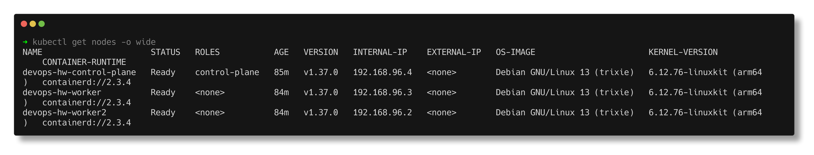
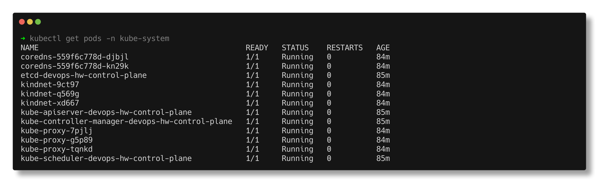

# Kubernetes Fundamentals

> **Submitted by:** Pratyush Mohanty  |  **Roll No.:** 24BCS10238

**Form field:** Kubernetes Fundamentals  ·  **Course session:** `session9-k8s`

Run it: `./run.sh`  ·  Verified output: [output.md](output.md)

Verified against a 3-node [kind](https://kind.sigs.k8s.io/) cluster running
Kubernetes **v1.37.0**.

---

## 1. The cluster

```text
NAME                      STATUS   ROLES           VERSION   CONTAINER-RUNTIME
devops-hw-control-plane   Ready    control-plane   v1.37.0   containerd://2.3.4
devops-hw-worker          Ready    <none>          v1.37.0   containerd://2.3.4
devops-hw-worker2         Ready    <none>          v1.37.0   containerd://2.3.4
```



## 2. Architecture

**Control plane** decides what should run where:

| Component | Job |
|---|---|
| `kube-apiserver` | The only way in. Everything talks to this. |
| `etcd` | Key-value store holding the entire cluster state |
| `kube-scheduler` | Assigns pods to nodes |
| `kube-controller-manager` | Runs the control loops (deployment, replicaset, ...) |

**Every node** actually runs the workloads:

| Component | Job |
|---|---|
| `kubelet` | Starts and stops containers, reports status |
| `kube-proxy` | Programs the network rules that make Services work |
| container runtime | containerd or CRI-O |

These are not abstractions, they are real pods in the cluster:

```text
etcd-devops-hw-control-plane                      Running
kube-apiserver-devops-hw-control-plane            Running
kube-controller-manager-devops-hw-control-plane   Running
kube-scheduler-devops-hw-control-plane            Running
kube-proxy-7pjlj / g5p89 / tqnkd                  Running   (one per node)
kindnet-9ct97 / q569g / xd667                     Running   (CNI, one per node)
```

Note that `kube-proxy` and the CNI appear once per node. That is a DaemonSet,
covered in [topic 09](../kubernetes-pods-replicasets-deployments/05-daemonset/).



## 3. The declarative model

This is the idea everything else rests on. You do not tell Kubernetes what to
**do**. You declare what you **want**, and controllers work continuously to make
reality match.

```text
    DESIRED STATE  (your YAML, stored in etcd)
          |
    controller compares  <-------------------+
          |                                   |
    ACTUAL STATE  (what is really running) ---+
```

This reconciliation loop is why a deleted pod comes back, why a failed node's
pods get rescheduled, and why `kubectl apply` is idempotent.

```text
imperative : kubectl run nginx --image=nginx      (do this now)
declarative: kubectl apply -f deployment.yaml     (make it so)
```

Production uses declarative YAML in git. Imperative commands are for exploring.

## 4. Every object has the same four fields

```yaml
apiVersion: apps/v1     # which API group and version
kind: Deployment        # what type of object
metadata:               # name, namespace, labels, annotations
  name: my-app
spec:                   # YOUR desired state - you write this
  replicas: 3
status:                 # ACTUAL state - Kubernetes writes this, never you
```

On a real object:

```text
  spec.replicas   (desired) : 2
  status.replicas (actual)  : 2
  status.readyReplicas      : 2
```

Editing `status` by hand is meaningless; the controller overwrites it. `spec` is
the only half you own.

## 5. Namespaces

```text
default          where your objects go unless you say otherwise
kube-system      the control plane's own components
kube-public      world-readable cluster info
kube-node-lease  node heartbeats
```

Namespaces scope **names**, and are the unit for RBAC and ResourceQuotas. The
same object name can exist in two namespaces without conflict.

> They do **not** isolate the network. A pod in one namespace can reach a pod in
> another unless a NetworkPolicy stops it. This is a common and dangerous
> assumption.

Some resources are cluster-scoped and live outside any namespace: `nodes`,
`namespaces`, `persistentvolumes`, `clusterroles`.

## 6. Labels and selectors

```text
fundamentals-demo-78cf7d4bb-4nsqz   app=fundamentals-demo,pod-template-hash=78cf7d4bb
```

Labels are arbitrary key/value pairs; selectors query them. This is the **only**
mechanism connecting Services to Pods, Deployments to their Pods, and
NetworkPolicies to their targets.

**There are no foreign keys or IDs anywhere in Kubernetes.** It is all label
matching, which is why a selector typo produces a Service with zero endpoints
that fails silently.

```bash
kubectl get pods -l app=web,env=prod       # AND
kubectl get pods -l 'env in (dev,stage)'   # set-based
kubectl get pods -l '!canary'              # does NOT have the label
```

**Labels** are for selecting: short, indexed, queryable.
**Annotations** are for metadata: arbitrary, not queryable, read by tools
(ingress config, `last-applied-configuration`, checksums).

## 7. The API is the product

```text
  78 resource types
```

kubectl is only an HTTP client for the API server, which `-v=6` makes obvious:

```text
$ kubectl get pods -v=6
  GET https://127.0.0.1:54986/api/v1/namespaces/default/pods?limit=500   -> 200 OK
```

Everything (kubectl, the dashboard, controllers, operators, CI) is a client of
that one API. That is why RBAC applied at the API server secures the whole system.

## 8. The commands worth knowing

```bash
kubectl get <kind> [-n ns] [-o wide|yaml|json] [--show-labels] [-l selector]
kubectl describe <kind>/<name>        # human-readable, EVENTS at the bottom
kubectl logs <pod> [-c container] [-f] [--previous]
kubectl exec -it <pod> -- sh
kubectl apply -f file.yaml            # declarative create-or-update
kubectl edit <kind>/<name>            # opens $EDITOR, applies on save
kubectl explain deployment.spec       # field documentation, offline
kubectl api-resources                 # what kinds exist
kubectl get events --sort-by=.lastTimestamp
kubectl config get-contexts           # which cluster am I pointed at
```

`kubectl explain` is the one people forget. It documents every field of every
object without leaving the terminal.

When something is wrong, the order is almost always:
**`describe` (read the Events) -> `logs` -> `get events`.**

---

## Interview Q&A

**Q: What is Kubernetes?**
A container orchestrator. You declare desired state through its API and
controllers continuously reconcile actual state to match, handling scheduling,
self-healing, scaling, service discovery and rollouts.

**Q: What are the control plane components?**
`kube-apiserver` (the only entry point), `etcd` (cluster state), `kube-scheduler`
(places pods on nodes), `kube-controller-manager` (runs the reconciliation loops).
Nodes additionally run `kubelet`, `kube-proxy` and a container runtime.

**Q: What does the scheduler actually do?**
It watches for pods with no `nodeName`, filters nodes that cannot run them
(resources, taints, node selectors, affinity), scores the rest, and binds the pod
to the best one. It does not start the container; the kubelet on that node does.

**Q: Imperative vs declarative, and which should you use?**
Imperative says what to do now (`kubectl run`); declarative says what should be
true (`kubectl apply -f`). Declarative YAML in version control is what you use in
production, because it is reviewable, repeatable and idempotent.

**Q: What is a namespace, and does it isolate the network?**
A virtual cluster that scopes names and acts as the boundary for RBAC and quotas.
It does **not** isolate the network by default. You need NetworkPolicies for that.

**Q: How does a Service find its Pods?**
Purely through label selectors. The endpoints controller watches for pods that
match and are Ready, and writes their IPs into an EndpointSlice.

**Q: Labels vs annotations?**
Labels are for identifying and selecting objects, and are indexed. Annotations
hold arbitrary non-identifying metadata for tools, and cannot be selected on.

**Q: What is etcd and why does it matter?**
The distributed key-value store holding all cluster state. It is the single
source of truth, so it needs backing up, and losing it means losing the cluster's
configuration.

**Q: A pod is stuck in Pending. What do you check?**
`kubectl describe pod` and read the Events. Usually insufficient resources, an
unschedulable taint, a node selector matching nothing, or an unbound
PersistentVolumeClaim.
