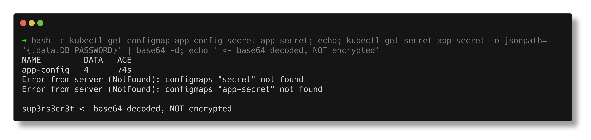
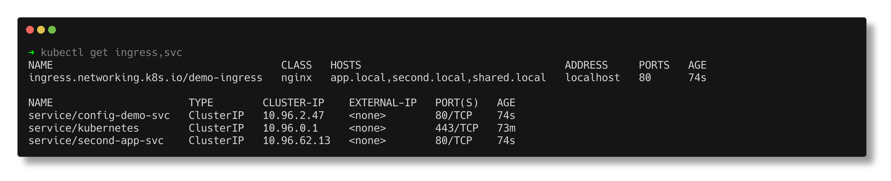
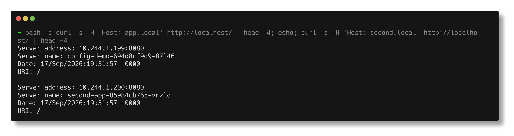

# Kubernetes Ingress, ConfigMaps & Secrets

> **Submitted by:** Pratyush Mohanty  |  **Roll No.:** 24BCS10238

**Form field:** Kubernetes Ingress, ConfigMaps & Secrets  ·  **Course session:** `session-12-ingress-configmaps-secrets`

Run it: `./run.sh`  ·  Verified output: [output.md](output.md)

| Manifest | What it is |
|---|---|
| [configmap.yaml](configmap.yaml) | Key/value pairs and a whole config file |
| [secret.yaml](secret.yaml) | Two secret values via `stringData` |
| [app.yaml](app.yaml) | Consumes both, as env vars **and** as mounted files |
| [services.yaml](services.yaml) | Two apps with Services, so Ingress has two backends |
| [ingress.yaml](ingress.yaml) | Host-based and path-based HTTP routing |

| Folder | Task |
|---|---|
| [ingress-vs-ingress-controller/](ingress-vs-ingress-controller/README.md) | Task 4 - Ingress vs Ingress Controller, proven with an Ingress no controller picks up ([output](ingress-vs-ingress-controller/output.md)) |
| [troubleshooting/](troubleshooting/README.md) | Task 5 - three real breakages (Secret newline, empty endpoints behind an Ingress, missing ConfigMap key) with before/after ([output](troubleshooting/output.md)) |

Verified on a 3-node kind cluster (Kubernetes v1.37.0) with the
**ingress-nginx** controller, using kind port mappings so `localhost:80` reaches
the controller exactly as a browser would.

---

## 1. ConfigMaps

Configuration that is not secret, kept out of the image so that one tested
artifact runs in every environment.

```text
  APP_ENV = production
  LOG_LEVEL = info
  FEATURE_FLAG = enabled
  app.properties = server.port=8080 / server.timeout=30 / cache.enabled=true
```

### Consumed as environment variables

```text
$ kubectl exec <pod> -- env | grep -E 'APP_ENV|LOG_LEVEL|FEATURE_FLAG'
  APP_ENV=production
  LOG_LEVEL=info
  FEATURE_FLAG=enabled
```

Two ways, both used in `app.yaml`:

- `configMapKeyRef` maps one specific key to one env var
- `envFrom` turns **every** key in the ConfigMap into an env var

### Consumed as files

```text
$ kubectl exec <pod> -- ls /etc/app-config
  APP_ENV
  FEATURE_FLAG
  LOG_LEVEL
  app.properties
```

Each **key becomes a file**, each value its content. This is how you inject a
whole `nginx.conf` or `application.yml` without rebuilding the image.

## 2. The update behaviour that catches everyone

`LOG_LEVEL` was changed from `info` to `debug`, and `app.properties` rewritten,
with no restart:

```text
--- the MOUNTED FILE updated itself, with no restart ---
  server.port=8080
  server.timeout=60
  cache.enabled=false

--- but the ENVIRONMENT VARIABLE did NOT ---
  LOG_LEVEL=info
```

> **The rule:**
> **Mounted volumes update live** (the kubelet re-syncs, roughly every 60s).
> **Environment variables are injected once at container start and never change.**

To pick up an env var change you must restart the pods:

```bash
kubectl rollout restart deployment/config-demo
```

This is the single most common ConfigMap surprise in production: someone edits a
ConfigMap, sees no effect, and concludes Kubernetes is broken.

## 3. Secrets, and what they are not

```text
$ kubectl get secret app-secret -o jsonpath='{.data.DB_PASSWORD}'
  stored : c3VwM3JzM2NyM3Q=

$ ... | base64 -d
  decoded: sup3rs3cr3t
```

> **A Secret is base64-ENCODED, not encrypted.** Base64 is an encoding, not a
> cipher. Anyone who can read the Secret object can read the value, and by
> default it is stored in etcd in plain text.

To make Secrets actually secret you need at least one of:

- encryption at rest in etcd (`EncryptionConfiguration`)
- RBAC restricting who can `get secrets`
- an external store: Vault, AWS/GCP Secrets Manager, External Secrets Operator,
  Sealed Secrets

**Never commit a Secret manifest with real values to git.** The one in this repo
contains deliberately fake values.

Secrets are consumed exactly like ConfigMaps, via `secretKeyRef` or a volume.
**Prefer files over environment variables** for secrets: env vars leak into crash
dumps, child processes, `docker inspect` and process-table logging.





## 4. Ingress

A Service is **L4** (TCP). An Ingress is **L7** (HTTP): it routes on hostname and
path, terminates TLS, and rewrites URLs.

### The controller does the work

```text
ingress-nginx-controller-746c8469d8-7lzqh     Running
```

An Ingress **object** is only a rule. Nothing happens without a **controller**
watching for Ingress objects and configuring a real proxy. Here that is
ingress-nginx; on a cloud it might be an ALB or GCE controller.
`ingressClassName: nginx` is what says which controller should act on it.

### Host-based routing, tested

```text
curl -H 'Host: app.local'    http://localhost/   ->  served by config-demo-694d8cf9d9-kfhzw
curl -H 'Host: second.local' http://localhost/   ->  served by second-app-85984cb765-r85w6
```

Same IP, same port, different backend, chosen purely by the `Host` header.

### Path-based routing, tested

```text
curl -H 'Host: shared.local' http://localhost/one  ->  served by config-demo-694d8cf9d9-kfhzw
curl -H 'Host: shared.local' http://localhost/two  ->  served by second-app-85984cb765-r85w6
```

One hostname, two paths, two different Deployments. This is how `/api` and `/app`
sit behind a single domain without a public IP per service.

- `pathType: Prefix` matches `/one` and `/one/anything`
- `pathType: Exact` matches only `/one`



## 5. Why this beats a LoadBalancer per service

```text
Without Ingress: every service needs its own LoadBalancer.
  10 services = 10 cloud load balancers = 10 public IPs = 10x the bill.

With Ingress:   ONE LoadBalancer -> the ingress controller -> every service.
  10 services = 1 load balancer, 1 IP, 1 TLS certificate, and one place for
  auth, rate limiting, redirects and rewrites.
```

---

## Interview Q&A

**Q: ConfigMap vs Secret?**
Both inject configuration. A Secret is base64-encoded, can be encrypted at rest,
is not written to disk on the node in plain text when mounted (tmpfs), and is
treated separately by RBAC. Functionally they are consumed the same way.

**Q: Is a Secret encrypted?**
Not by default. It is base64-encoded and stored in etcd as plain text. You need
`EncryptionConfiguration` for encryption at rest, plus RBAC, or an external
secret manager.

**Q: I updated a ConfigMap but my app still sees the old value. Why?**
If it is consumed as an environment variable, the value was injected at container
start and never changes. Restart the pods (`kubectl rollout restart`). If it is
mounted as a volume, wait for the kubelet sync, roughly 60 seconds.

**Q: How do you force pods to restart when a ConfigMap changes?**
`kubectl rollout restart deployment/x`, or put a checksum of the ConfigMap in the
pod template annotations so any change alters the template hash and triggers a
rollout automatically. Helm charts commonly do the latter.

**Q: Service vs Ingress?**
A Service is L4 and gives pods a stable virtual IP with load balancing. An
Ingress is L7 and routes HTTP by host and path across multiple Services,
terminating TLS in one place. Ingress routes **to** Services.

**Q: Why is my Ingress not working?**
Usually there is no ingress controller installed, or `ingressClassName` does not
match one. Then check the backend Service actually has endpoints, and that the
host you are requesting matches a rule.

**Q: How do you do TLS with an Ingress?**
Put the certificate and key in a TLS-type Secret and reference it in
`spec.tls`. cert-manager automates issuing and renewing from Let's Encrypt.

**Q: How would you handle secrets properly in production?**
Do not keep them in git. Use an external manager (Vault, cloud secret manager)
with the External Secrets Operator syncing them in, or Sealed Secrets if they
must live in git encrypted. Enable etcd encryption at rest, lock down RBAC on
`secrets`, and mount them as files rather than environment variables.

---

## Tasks 4 and 5

- **[Ingress vs Ingress Controller](ingress-vs-ingress-controller/README.md)** - two
  identical Ingresses, one with `ingressClassName: nginx` (ADDRESS, nginx.conf
  server block, HTTP 200) and one with a class no controller implements (no
  ADDRESS, no events, ignored in the controller log, 404).
- **[Troubleshooting](troubleshooting/README.md)** - the course's
  `secret-base64-gotcha` and `empty-endpoints` problems reproduced for real, plus a
  `CreateContainerConfigError` from a wrong ConfigMap key; each with identify,
  investigate, root cause, fix, verify and before/after screenshots.
