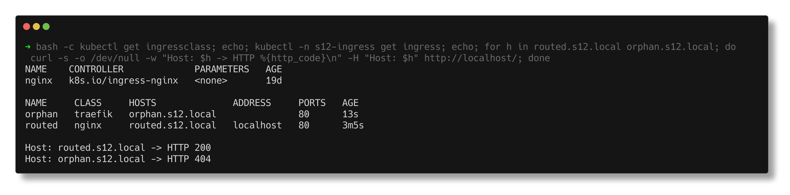
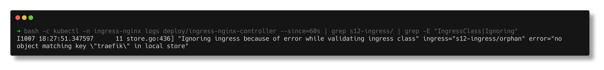
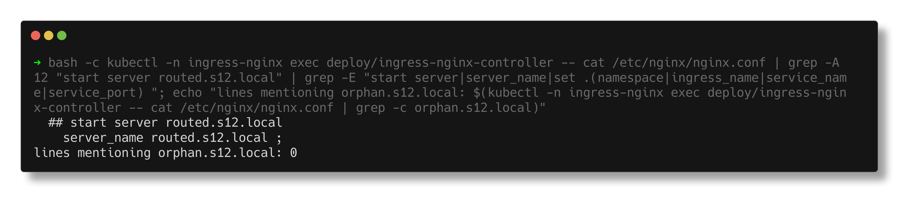

# Task 4 - Ingress vs Ingress Controller

> **Submitted by:** Pratyush Mohanty  |  **Roll No.:** 24BCS10238

**Form field:** Kubernetes Ingress, ConfigMaps & Secrets · **Course session:** `session-12-ingress-configmaps-secrets`

Run it: `./run.sh` (namespace `s12-ingress`), `./run.sh cleanup` to remove.
Verified output: [output.md](output.md) - kind cluster, Kubernetes v1.37.0, ingress-nginx 1.11.3.

| File | What it is |
|---|---|
| [app.yaml](app.yaml) | Namespace, a 2-replica `hello` app (replies with its pod name) and its Service |
| [ingresses.yaml](ingresses.yaml) | `routed` (class `nginx`) and `orphan` (class `traefik`) - identical apart from the class |
| [ingress-no-class.yaml](ingress-no-class.yaml) | `classless` - no `ingressClassName` at all |

---

## 1. What is an Ingress?

An **Ingress** is a Kubernetes API object that *describes* HTTP routing: "requests
for host `routed.s12.local`, path `/`, go to Service `hello` port 80". Plus
optional TLS. It is only data stored in etcd - it opens no port and runs no code.

## 2. What is an Ingress Controller?

An **Ingress Controller** is a program running in the cluster (here a pod in
`ingress-nginx`) that watches Ingress objects and turns them into real proxy
configuration, then proxies the traffic itself. Inside the pod:

```text
  PID   USER     TIME  COMMAND
     11 www-data  5:09 /nginx-ingress-controller --election-id=ingress-nginx-leader --controller-class=k8s.io/ingress-nginx --ingress-class=nginx --conf
     33 www-data  0:01 nginx: master process /usr/bin/nginx -c /etc/nginx/nginx.conf
```
A Go process watches the API and writes `nginx.conf`; an ordinary nginx serves
the requests. Its flags decide which Ingresses it will touch:
```text
  --controller-class=k8s.io/ingress-nginx
  --ingress-class=nginx
  --watch-ingress-without-class=true
  --publish-status-address=localhost
```

The link between the two is an **IngressClass**:
```text
NAME    CONTROLLER             PARAMETERS   AGE
nginx   k8s.io/ingress-nginx   <none>       19d
```
Ingress -> `ingressClassName: nginx` -> IngressClass `nginx` ->
`controller: k8s.io/ingress-nginx` -> the pod started with that `--controller-class`.

## 3. The difference, proven

Two Ingress objects, identical except the class:

```text
NAME     CLASS     HOSTS              ADDRESS     PORTS   AGE
orphan   traefik   orphan.s12.local               80      18s
routed   nginx     routed.s12.local   localhost   80      18s
```

| | `routed` (class `nginx`) | `orphan` (class `traefik`) |
|---|---|---|
| Accepted by the API server | yes | **yes** - it is a valid object |
| ADDRESS | `localhost` (written by the controller) | empty - nobody owns it |
| Events | `Normal Sync ... nginx-ingress-controller Scheduled for sync` | `<none>` |
| Lines in `nginx.conf` | a full `server { server_name routed.s12.local; ... }` block | `0` |
| `curl -H 'Host: ...' http://localhost/` | **HTTP 200**, served by `hello-794b94bfb5-ptg9p` | **HTTP 404** |

```text
  curl -H 'Host: routed.s12.local    ' http://localhost/  ->  HTTP 200  served by hello-794b94bfb5-ptg9p
  curl -H 'Host: orphan.s12.local    ' http://localhost/  ->  HTTP 404  (<head>404 Not Found</head>)
```
The orphan request still reaches ingress-nginx (host port 80 belongs to it in
this kind cluster), but the controller has no rule for that host, so its
default server says 404. On a cluster with no controller at all there would be
nothing listening.

The controller's own log says exactly why:
```text
I1007 18:24:59.073151      11 store.go:440] "Found valid IngressClass" ingress="s12-ingress/routed" ingressclass="nginx"
I1007 18:24:59.137086      11 store.go:436] "Ignoring ingress because of error while validating ingress class" ingress="s12-ingress/orphan" error="no object matching key \"traefik\" in local store"
```





### What the controller generated

From inside the controller pod, `cat /etc/nginx/nginx.conf`:
```text
  1077:	## start server routed.s12.local
  1078-	server {
  1079:		server_name routed.s12.local ;
			set $namespace      "s12-ingress";
			set $ingress_name   "routed";
			set $service_name   "hello";
			set $service_port   "80";
```
and `orphan.s12.local` appeared **0** times. The pod IPs are not in
`nginx.conf` at all - ingress-nginx pushes them to its Lua balancer at runtime,
visible with the bundled `/dbg backends get s12-ingress-hello-80`:
```text
        "address": "10.244.1.7",
        "port": "8080"
        "address": "10.244.2.37",
        "port": "8080"
  pod: hello-794b94bfb5-ptg9p   10.244.1.7
  pod: hello-794b94bfb5-txjjt   10.244.2.37
```
So the controller reads both the Ingress (rules) and the EndpointSlices
(pod IPs) - it does not go through the Service's ClusterIP.



**The fix for the orphan** was one field:
```text
$ kubectl patch ingress orphan -p '{"spec":{"ingressClassName":"nginx"}}'
orphan   nginx   orphan.s12.local   localhost   80      78s
  curl -H 'Host: orphan.s12.local    ' http://localhost/  ->  HTTP 200  served by hello-794b94bfb5-ptg9p
  nginx.conf matches for orphan.s12.local now: 3
```

**No class at all** (`classless`) was served too - but only because this
controller runs with `--watch-ingress-without-class=true`. Without that flag or
an IngressClass annotated `ingressclass.kubernetes.io/is-default-class: "true"`
(not set here), it would be ignored exactly like `orphan`.

## 4. Why both are required

- The **Ingress** alone is a wish list nobody reads - shown above: accepted,
  no address, no config, 404.
- The **controller** alone has nothing to do; it needs rules, and the Ingress
  API is the standard, portable way to give them. The same Ingress YAML works
  with ingress-nginx, Traefik, HAProxy or a cloud controller.
- Splitting them lets the platform team pick and run the proxy, while app teams
  only write small Ingress objects for their own hosts and paths.

| | Ingress | Ingress Controller |
|---|---|---|
| Kind of thing | API object (YAML, stored in etcd) | Running software (Deployment/DaemonSet + Service) |
| Who creates it | App team, per app | Platform team, once per cluster (or per class) |
| Contains | Hosts, paths, backends, TLS secret names | The proxy, its config generator, its own Service/LB |
| Without the other | Accepted, does nothing | Runs, routes nothing (404 default backend) |
| Selected by | `ingressClassName` -> IngressClass | `--controller-class` matching IngressClass `spec.controller` |

## 5. Examples

| Controller | IngressClass `spec.controller` | Where you meet it |
|---|---|---|
| ingress-nginx (this cluster) | `k8s.io/ingress-nginx` | kind, minikube, most self-managed clusters |
| Traefik | `traefik.io/ingress-controller` | k3s default |
| AWS Load Balancer Controller | `ingress.k8s.aws/alb` | EKS - each Ingress becomes an ALB |
| GKE Ingress | class `gce` (managed by GKE) | GKE - a Google HTTP(S) LB |
| HAProxy, Kong, Contour, Istio gateway | their own values | specific feature needs |

---

## Notes from actually running this

- **`ADDRESS` is `localhost` here** because the controller runs with
  `--publish-status-address=localhost`. In the earlier Ingress task
  ([../output.md](../output.md)) the address column was empty: the Ingress was only
  5 seconds old and the controller had not written its status yet. Empty ADDRESS
  can mean "not yet" as well as "never".
- **A wrong class gives no error anywhere you would normally look.**
  `kubectl apply` succeeded and `kubectl describe` showed no events; only the
  controller's log mentioned it.
- **`kubectl get ingress` showed the classless one with `CLASS <none>` but an
  ADDRESS** - easy to misread as "no controller".

## Interview Q&A

**Q: Ingress vs Ingress Controller in one line?**
The Ingress is the routing rule (an API object); the controller is the running
proxy that reads those rules and enforces them.

**Q: I created an Ingress and nothing happens. First checks?**
`kubectl get ingressclass` (is there one, and does `ingressClassName` match?),
is the controller pod running, does the Ingress have an ADDRESS and Sync events,
then the controller logs, then the backend Service's endpoints.

**Q: What is an IngressClass for?**
It lets several controllers coexist: each Ingress names a class, each class names
a controller. One can be marked default for Ingresses that name none.

**Q: Does the controller send traffic to the Service's ClusterIP?**
ingress-nginx does not: it reads the EndpointSlices and balances across pod IPs
directly (shown via `/dbg backends`). The Service is used for discovery.

**Q: Ingress vs LoadBalancer Service?**
A LoadBalancer Service is L4 and needs one LB per Service. An Ingress is L7
(host/path/TLS) and lets many Services share one controller - which itself is
usually exposed through one LoadBalancer or NodePort Service.
