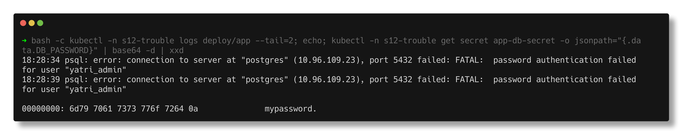
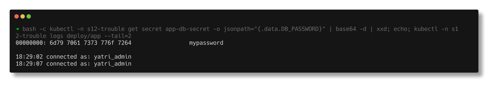
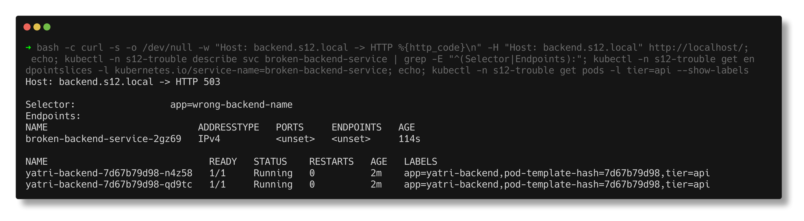
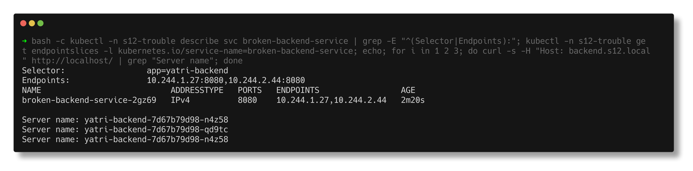
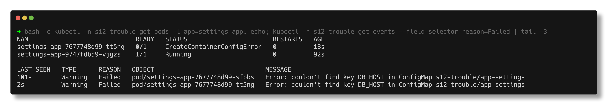
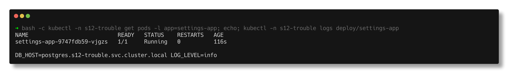

# Task 5 - Troubleshooting ConfigMaps, Secrets and Ingress

> **Submitted by:** Pratyush Mohanty  |  **Roll No.:** 24BCS10238

**Form field:** Kubernetes Ingress, ConfigMaps & Secrets · **Course session:** `session-12-ingress-configmaps-secrets`

Run it: `./run.sh` (all three, namespace `s12-trouble`), `./run.sh 1|2|3` for one, `./run.sh cleanup`.
Verified output: [output.md](output.md) - a real run on the kind cluster, Kubernetes v1.37.0.

The problems come from the course's troubleshooting folder:
`session-12-ingress-configmaps-secrets/troubleshooting/secret-base64-gotcha.md`
(issue 1) and `session-11-kubernetes-services/troubleshooting/empty-endpoints.yaml`
(issue 2, put behind an Ingress). Issue 3 is the ConfigMap mistake I hit most
often myself. Each has a `broken.yaml` and a `fixed.yaml`; the script applies the
broken one, investigates, applies the fix and verifies.

| # | Symptom | Root cause | Folder |
|---|---|---|---|
| 1 | `FATAL: password authentication failed` with the "right" password | Secret encoded with `echo` -> trailing `\n` | [01-secret-base64-newline](01-secret-base64-newline/) |
| 2 | Ingress returns **503** | Service selector matches no pods -> empty EndpointSlice | [02-empty-endpoints](02-empty-endpoints/) |
| 3 | Pod stuck in `CreateContainerConfigError` | `configMapKeyRef` names a key that does not exist | [03-configmap-missing-key](03-configmap-missing-key/) |

---

## Issue 1 - the trailing-newline Secret

**Identify.** Postgres is up, the app keeps failing:
```text
  18:26:07 psql: error: connection to server at "postgres" (10.96.109.23), port 5432 failed: FATAL:  password authentication failed for user "yatri_admin"
```

**Investigate.** The database and the user exist (`select usename from pg_user`
-> `yatri_admin`). Both Secrets "contain mypassword" - until you look at the bytes:
```text
  db-server-secret POSTGRES_PASSWORD:
    00000000: 6d79 7061 7373 776f 7264                 mypassword
  app-db-secret DB_PASSWORD (raw: bXlwYXNzd29yZAo=):
    00000000: 6d79 7061 7373 776f 7264 0a              mypassword.
  length inside the app container: 11 bytes (expected 10)

  echo "mypassword" | base64     -> bXlwYXNzd29yZAo=
  echo -n "mypassword" | base64  -> bXlwYXNzd29yZA==
```

**Root cause.** The app's Secret was encoded with plain `echo`, which appends
`0x0a`. The app sends `mypassword\n` and Postgres correctly rejects it. On screen
`base64 -d` looks identical; only `xxd` / `wc -c` show the extra byte. The tell
is a base64 value ending in `Ao=` / `K` instead of `==`.

**Fix.** Re-encode with `echo -n` ([fixed.yaml](01-secret-base64-newline/fixed.yaml)),
then `kubectl rollout restart deployment/app` - the value is an env var, read
only when the container starts. Better still: `stringData` or
`kubectl create secret generic --from-literal`, so nobody hand-encodes.

**Verify.**
```text
  00000000: 6d79 7061 7373 776f 7264                 mypassword
  18:26:29 connected as: yatri_admin
  18:26:34 connected as: yatri_admin
```

| Before | After |
|---|---|
|  |  |

---

## Issue 2 - Ingress 503 from empty endpoints

**Identify.**
```text
  curl -H 'Host: backend.s12.local' http://localhost/ -> HTTP 503
  <head><title>503 Service Temporarily Unavailable</title></head>
```

**Investigate** - walk the chain Ingress -> Service -> endpoints -> pods:
```text
  Selector:                 app=wrong-backend-name
  Endpoints:

NAME                           ADDRESSTYPE   PORTS     ENDPOINTS   AGE
broken-backend-service-2gz69   IPv4          <unset>   <unset>     8s

NAME                             READY   STATUS    RESTARTS   AGE   LABELS
yatri-backend-7d67b79d98-n4z58   1/1     Running   0          14s   app=yatri-backend,pod-template-hash=7d67b79d98,tier=api
yatri-backend-7d67b79d98-qd9tc   1/1     Running   0          14s   app=yatri-backend,pod-template-hash=7d67b79d98,tier=api
```
and the controller log:
```text
  W1007 18:26:44.375807      11 controller.go:1216] Service "s12-trouble/broken-backend-service" does not have any active Endpoint.
```

**Root cause.** The selector is `app=wrong-backend-name`, the pods are
`app=yatri-backend`. The pods are healthy, the Service exists, the Ingress is
fine - but the EndpointSlice is empty, so ingress-nginx has no upstream and
answers 503. (503 = "I know this host but have nowhere to send it"; 404 would
mean the host itself is unknown - see the Ingress vs Controller task.)

**Fix.** Selector `app: yatri-backend` ([fixed.yaml](02-empty-endpoints/fixed.yaml)).

**Verify.**
```text
NAME                           ADDRESSTYPE   PORTS   ENDPOINTS                 AGE
broken-backend-service-2gz69   IPv4          8080    10.244.1.27,10.244.2.44   14s
  HTTP 200  served by yatri-backend-7d67b79d98-qd9tc
  HTTP 200  served by yatri-backend-7d67b79d98-n4z58
```

| Before | After |
|---|---|
|  |  |

---

## Issue 3 - CreateContainerConfigError

**Identify.**
```text
NAME                            READY   STATUS                       RESTARTS   AGE
settings-app-7677748d99-sfpbs   0/1     CreateContainerConfigError   0          10s
```

**Investigate.** `kubectl logs` has nothing - the container was never created:
```text
  kubectl logs: Error from server (BadRequest): container "app" in pod "settings-app-7677748d99-sfpbs" is waiting to start: CreateContainerConfigError
```
The events in `kubectl describe pod` do:
```text
    Warning  Failed     8s (x2 over 9s)  kubelet            spec.containers{app}: Error: couldn't find key DB_HOST in ConfigMap s12-trouble/app-settings
```
and the ConfigMap's real keys:
```text
  db_host = postgres.s12-trouble.svc.cluster.local
  log_level = info
  the pod asks for: DB_HOST
```

**Root cause.** Keys are case-sensitive; `DB_HOST` is not `db_host`. A missing
key in a non-optional `configMapKeyRef` (same for `secretKeyRef`) blocks
container creation.

**Fix.** `key: db_host` ([fixed.yaml](03-configmap-missing-key/fixed.yaml)).

**Verify.**
```text
settings-app-9747fdb59-vjgzs    1/1     Running       0          6s
  DB_HOST=postgres.s12-trouble.svc.cluster.local LOG_LEVEL=info
```

| Before | After |
|---|---|
|  |  |

---

## Notes from actually running this

- **The broken version did not take the app down the second time.** For the
  screenshots I re-applied `broken.yaml` over the fixed Deployment. The new
  ReplicaSet's pod sat in `CreateContainerConfigError` while the old pod kept
  `Running` (both visible in the issue 3 "before" screenshot) - the rolling
  update cannot progress, so it never removes the working pod.
- **Updating a Secret is not enough for env vars.** After applying the fixed
  Secret the old app pod kept failing until `rollout restart`; the value is
  copied into the environment once, at container start.
- **The empty EndpointSlice shows `<unset>` for PORTS and ENDPOINTS**, not an
  error. Nothing anywhere says "selector matches nothing" - you have to compare
  the selector with `--show-labels` yourself.

## Troubleshooting commands I used

```bash
kubectl logs deploy/<name> --tail=N                    # what the app says
kubectl describe pod <pod>                              # Events: the kubelet's reason
kubectl get events --field-selector reason=Failed
kubectl get secret <s> -o jsonpath='{.data.KEY}' | base64 -d | xxd   # the real bytes
kubectl exec deploy/<name> -- sh -c 'printf %s "$VAR" | wc -c'
kubectl get configmap <cm> -o yaml                      # the real keys
kubectl describe svc <svc>                              # Selector + Endpoints
kubectl get endpointslices -l kubernetes.io/service-name=<svc>
kubectl get pods --show-labels
kubectl -n ingress-nginx logs deploy/ingress-nginx-controller | grep <ns>/<svc>
curl -H 'Host: <host>' http://localhost/                # test through the Ingress
```
