# Kubernetes Networking & Services

> **Submitted by:** Pratyush Mohanty  |  **Roll No.:** 24BCS10238

**Form field:** Kubernetes Networking & Services · **Course session:** `session-11-kubernetes-services`

### Task 1 - the five Service types

| # | Service type | Reachable from | Docs |
|---|---|---|---|
| 01 | **ClusterIP** | Inside the cluster only | [section](#01---clusterip) · [full README](01-clusterip/README.md) · [run.sh](01-clusterip/run.sh) · [output](01-clusterip/output.md) |
| 02 | **NodePort** | `<AnyNodeIP>:30080`, i.e. outside | [section](#02---nodeport) · [run.sh](02-nodeport/run.sh) · [output](02-nodeport/output.md) |
| 03 | **LoadBalancer** | A dedicated external IP | [section](#03---loadbalancer) · [run.sh](03-loadbalancer/run.sh) · [output](03-loadbalancer/output.md) |
| 04 | **ExternalName** | n/a - it is a DNS CNAME outward | [section](#04---externalname) · [run.sh](04-externalname/run.sh) · [output](04-externalname/output.md) |
| 05 | **Headless** | No VIP - DNS returns pod IPs | [section](#05---headless) · [run.sh](05-headless/run.sh) · [output](05-headless/output.md) |

### Tasks 2-4

| Task | Topic | Docs |
|---|---|---|
| 2 | Deployment vs ReplicaSet, Deployment vs DaemonSet vs StatefulSet, ReplicaSet vs Service | [comparison/README.md](comparison/README.md) · [run.sh](comparison/run.sh) · [output](comparison/output.md) |
| 3 | FQDNs and Kubernetes Service DNS | [fqdn/README.md](fqdn/README.md) · [run.sh](fqdn/run.sh) · [output](fqdn/output.md) |
| 4 | CoreDNS - config, query path, logging, troubleshooting | [coredns/README.md](coredns/README.md) · [run.sh](coredns/run.sh) · [output](coredns/output.md) |

All five Service types verified, each with its own runnable script and captured
output. ClusterIP was captured on 2026-09-18; the other four were re-run on
2026-10-07 for the screenshots below, and their `output.md` files are from that run.

Verified against a local [kind](https://kind.sigs.k8s.io/) cluster running
**Kubernetes v1.37.0**.

```bash
kind create cluster --name devops-hw --config ../lab/kind-config.yaml
cd 01-clusterip && ./run.sh
```

---

## 01 - ClusterIP

The default Service type: a stable virtual IP from the service CIDR, routable
**only inside the cluster**, load balancing to pods selected by labels.

Verified four ways:

**Reachable by name, ClusterIP and FQDN** - all HTTP 200:
```text
HTTP 200 from http://web-service-clusterip:8080  (0.003835s)
HTTP 200 from http://10.96.157.27:8080
HTTP 200 from FQDN
```

**Load balancing proven** - the 3 nginx pods serve identical HTML, so reading the
response proves nothing. Instead 30 requests are tagged with a unique marker and
counted in each pod's own access log:
```text
  web-app-clusterip-66865d4855-2wpqg       served 10 requests
  web-app-clusterip-66865d4855-48bcj       served 14 requests
  web-app-clusterip-66865d4855-5sd7z       served  6 requests
  TOTAL                                    served 30 requests
```
Uneven because kube-proxy in iptables mode picks a backend **at random per
connection** - it is not round-robin.

**Internal-only proven** - the same ClusterIP times out from the host.

**The reason ClusterIP exists proven** - a pod is deleted mid-run:
```text
before:  web-app-clusterip-66865d4855-bk42c   10.244.0.12   <-- deleted
after:   web-app-clusterip-66865d4855-wsjdf   10.244.0.15   <-- new name, NEW IP

but the ClusterIP is UNCHANGED:  10.96.157.27
and the service still answers:   HTTP 200 - still serving
```
Pod IP changed, service IP didn't, endpoints re-bound automatically, traffic
never stopped. That is the whole value proposition.

Full write-up covers how it works under the hood (endpoints controller ->
EndpointSlice -> kube-proxy iptables -> CoreDNS), all five service types, a
troubleshooting table, and 10 interview Q&As.

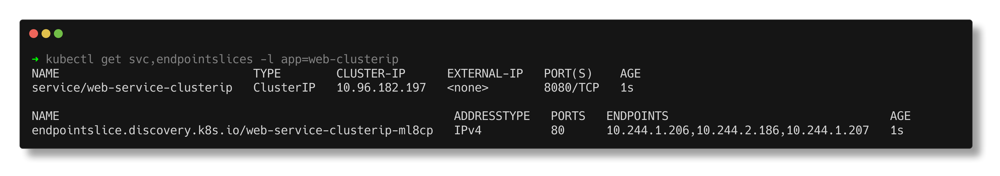

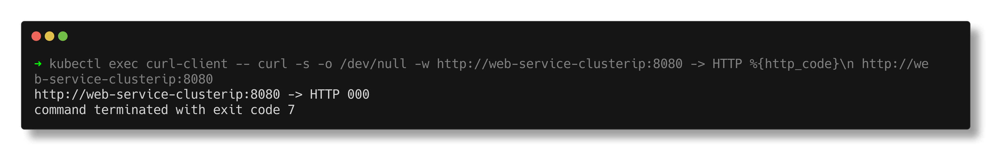

---

## 02 - NodePort

A NodePort Service opens **the same port (30000-32767) on every node** and
forwards it to the Service's pods. It is a superset of ClusterIP: it still gets
a ClusterIP and a `port` for in-cluster clients, plus a `nodePort` for the
outside world.

Manifests: [service.yaml](02-nodeport/service.yaml) (`type: NodePort`,
`port: 80`, `targetPort: 80`, `nodePort: 30080`) and a 2-replica
[app-deployment.yaml](02-nodeport/app-deployment.yaml).

**Three ports on one Service:**
```text
NAME                   TYPE       CLUSTER-IP      EXTERNAL-IP   PORT(S)        AGE   SELECTOR
web-service-nodeport   NodePort   10.96.142.147   <none>        80:30080/TCP   2s    app=web-nodeport
```
`80:30080` reads as "Service port 80, node port 30080".

**Every node answers, even one with no pod.** Two replicas on three nodes means
the control-plane has none, and it still returns 200 - kube-proxy wrote the same
rule on every node and forwards to a node that does have a pod:
```text
  devops-hw-control-plane    192.168.96.2    pods_on_node=0   HTTP 200
  devops-hw-worker           192.168.96.3    pods_on_node=1   HTTP 200
  devops-hw-worker2          192.168.96.4    pods_on_node=1   HTTP 200
```

**Reachable from macOS.** The kind config maps host port 30080 to the
control-plane's 30080 ([lab/kind-config.yaml](../lab/kind-config.yaml)), so this
is genuinely outside the cluster:
```text
  curl http://localhost:30080  ->  HTTP 200
```
20 tagged requests landed 11 / 9 on the two pods. Asking for `nodePort: 80` is
rejected by the API server:
```text
The Service "bad-nodeport" is invalid: spec.ports[0].nodePort: Invalid value: 80: provided port is not in the valid range. The range of valid ports is 30000-32767
```

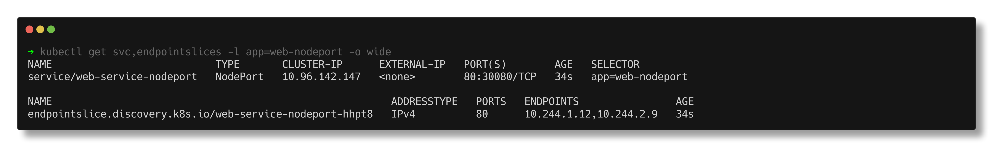

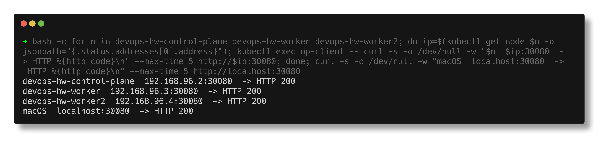

**When to use it:** dev/test, bare metal, or as the entry point an external load
balancer points at. Not for production on a cloud: odd ports, every node exposed,
and clients must know a node IP.

---

## 03 - LoadBalancer

`type: LoadBalancer` asks *something outside Kubernetes* for an external IP. On
EKS/GKE/AKS the cloud controller manager creates a real cloud LB. kind has no
cloud, so this cluster uses **MetalLB** with a pool carved out of kind's Docker
network ([metallb-pool.yaml](03-loadbalancer/metallb-pool.yaml)).

**Without a controller it sits at `<pending>` forever.** The script removes the
pool first to show this:
```text
NAME                       TYPE           CLUSTER-IP     EXTERNAL-IP   PORT(S)        AGE
web-service-loadbalancer   LoadBalancer   10.96.25.107   <pending>     80:30452/TCP   0s
...
Events:                   <none>
```
No events at all - nothing is watching the request, so nothing reports on it.
The screenshot shows the same thing side by side without touching the shared
pool: a Service with `loadBalancerClass: example.com/no-such-controller` (which
MetalLB ignores) stays without an IP, while the normal one got `192.168.96.200`.

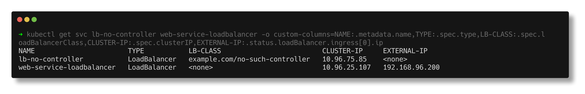

**With the pool back, MetalLB allocates an IP in about a second**, and the
Service shows all three layers at once:
```text
  ClusterIP : 10.96.25.107
  NodePort  : 30452
  ExternalIP: 192.168.96.200
```

**Connectivity:** from a pod and from a kind node the external IP returns 200;
30 requests split 9 / 10 / 11 across the 3 pods. From macOS it times out - not a
Kubernetes problem, Docker Desktop runs containers inside a VM and does not
route `192.168.96.0/20` to the host. On Linux, or on a cloud, that IP is directly
reachable.

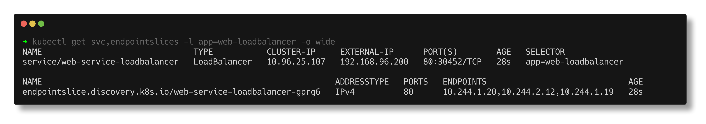

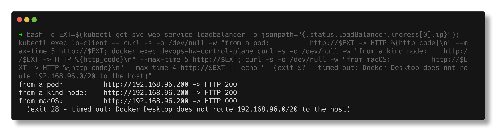

---

## 04 - ExternalName

The odd one out: **no ClusterIP, no selector, no endpoints, no proxying.** It is
a CNAME record served by CoreDNS ([service.yaml](04-externalname/service.yaml)
points `external-database-service` at `example.com`).

```text
NAME                        TYPE           CLUSTER-IP   EXTERNAL-IP   PORT(S)   AGE
external-database-service   ExternalName   <none>       example.com   <none>    1s
```
`kubectl get endpointslices` for it returns `No resources found` - normal here,
a red flag for any other type.

**What a pod actually gets back:**
```text
external-database-service.default.svc.cluster.local	canonical name = example.com
Name:	example.com
Address: 104.20.23.154
```

**The Host-header trap.** DNS worked, the connection reached example.com, and
the answer was still 403, because curl sends `Host: external-database-service`
and the origin has no such virtual host. Same URL with the right header:
```text
$ curl http://external-database-service/
  HTTP 403
$ curl -H 'Host: example.com' http://external-database-service/
  HTTP 200
```
HTTPS fails the same way, worse: the TLS handshake itself fails (curl exit 35)
because the SNI name does not match anything the origin serves.

**Why use it:** the app hardcodes one internal name and you repoint it by
editing only the Service. `kubectl patch ... externalName: iana.org` changed
the CNAME within seconds with no app change.

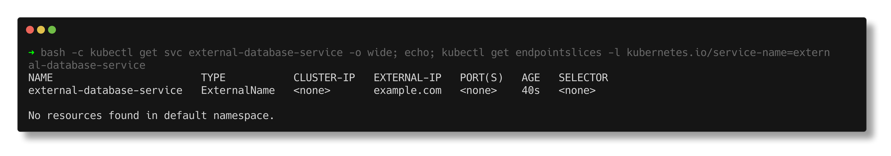

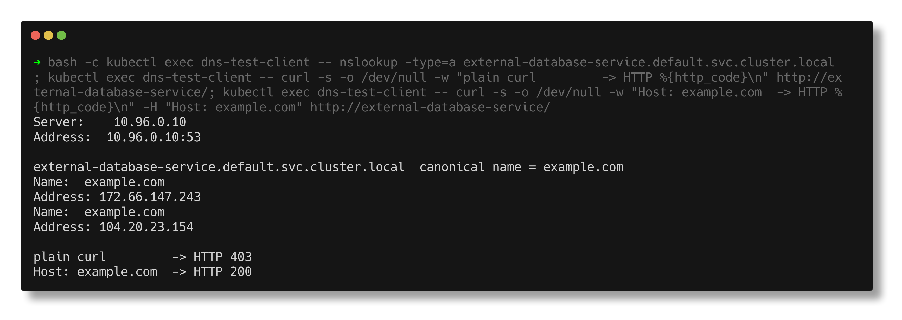

---

## 05 - Headless

`clusterIP: None` ([service.yaml](05-headless/service.yaml)). No virtual IP, no
kube-proxy rules - DNS returns **every ready pod IP**, and with a StatefulSet
([app-statefulset.yaml](05-headless/app-statefulset.yaml)) each pod also gets
its own stable DNS name.

```text
NAME                   TYPE        CLUSTER-IP   EXTERNAL-IP   PORT(S)   AGE
web-service-headless   ClusterIP   None         <none>        80/TCP    4s
```

**One name, three A records** (a ClusterIP Service would return exactly one):
```text
  Name:	web-service-headless.default.svc.cluster.local
  Address: 10.244.2.36
  Name:	web-service-headless.default.svc.cluster.local
  Address: 10.244.1.34
  Name:	web-service-headless.default.svc.cluster.local
  Address: 10.244.1.36
```

**Per-pod names**, `<pod>.<service>.<namespace>.svc.cluster.local`, each
reachable on its own with no load balancing in between:
```text
  web-stateful-0.web-service-headless                  -> 10.244.1.34
  web-stateful-1.web-service-headless                  -> 10.244.2.36
  web-stateful-2.web-service-headless                  -> 10.244.1.36
```

**Identity survives deletion:** `web-stateful-1` was deleted and came back with
the same name and a new IP (`10.244.2.36` -> `10.244.2.37`), and its DNS record
followed it. That is why databases and Kafka use this pairing.

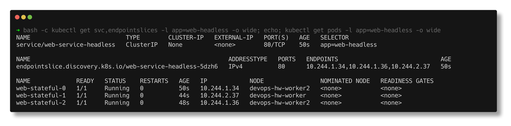

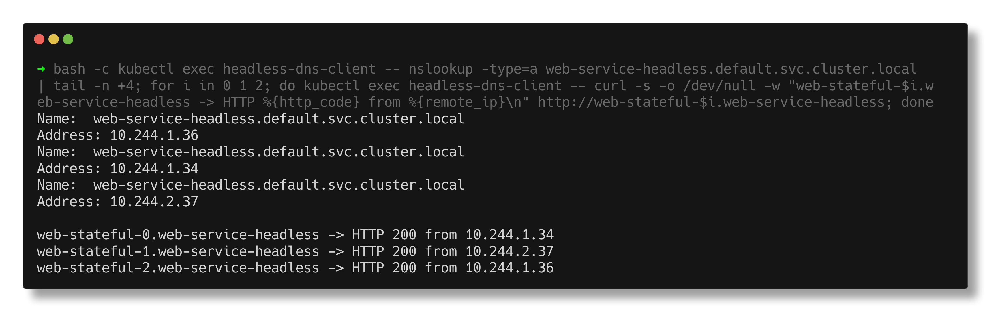

Scaling is ordered both ways. This capture was taken a moment after scaling
from 5 back to 3: `web-stateful-4` is already `Terminating` while
`web-stateful-3` is still `Running` - highest ordinal goes first.

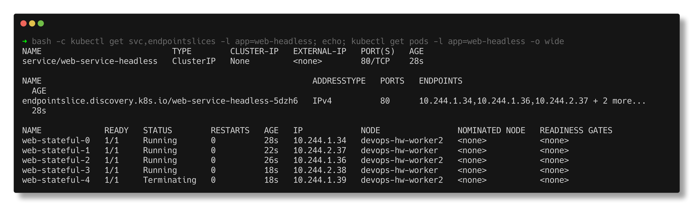

---

## Notes from actually running this

- **A brand-new NodePort is not reachable straight away.** The first re-run on
  2026-10-07 printed this, right after creating the Service:
  ```text
    devops-hw-control-plane    192.168.96.2    pods_on_node=0   HTTP 000
    devops-hw-worker           192.168.96.3    pods_on_node=1   HTTP 000
    devops-hw-worker2          192.168.96.4    pods_on_node=1   HTTP 000
  ...
    curl http://localhost:30080  ->  HTTP 000
  ...
    TOTAL                                  served 14 requests
  ```
  Run by hand once the script had finished, the same curls all returned 200.
  kube-proxy on each node has to see the Service and EndpointSlice and write
  its rules first; the script was simply faster. The script still printed "All nodes return 200"
  under the 000s because that line was hardcoded - a good reminder to read the
  data, not the commentary. `run.sh` now polls `localhost:30080` until it
  answers (about 2s on the next run) before verifying.
- **Node IPs are not stable either.** On 2026-09-18 the control-plane was
  `192.168.96.4`; after the nodes restarted it is `192.168.96.2`. Anything that
  hardcodes a node IP for a NodePort breaks on restart.
- **`Events: <none>` on a pending LoadBalancer.** The script's comment promised
  the events would explain the `<pending>`, and there were none. That is the
  actual symptom: with no controller, nothing ever acts on the Service, so
  nothing writes an event.
- **ExternalName really goes to the internet.** The example.com HTML in the new
  output is different from the 2026-09-18 run - the site changed its page in
  between. A static fixture would not have.
- **`rollout status` on a StatefulSet scale-down returns before the pods are
  gone.** The first headless screenshot, taken right after the script finished,
  still showed 4 DNS answers and `web-stateful-4` Terminating. Ready pods stay
  in DNS until they actually stop. I kept that capture (above) and retook the
  clean ones a few seconds later.

---

## Interview Q&A

**Q: NodePort vs LoadBalancer?**
NodePort opens a high port on every node; clients need a node IP. LoadBalancer
builds on it: an external controller provides one stable IP (a cloud LB, or
MetalLB) that forwards to those node ports. A LoadBalancer Service still has a
ClusterIP and a NodePort underneath - shown above with all three at once.

**Q: Why does a LoadBalancer Service stay `<pending>`?**
Nothing is fulfilling it. `type: LoadBalancer` is a request; on kind or bare
metal there is no cloud controller, so you need MetalLB (or similar), or the
`loadBalancerClass` names a controller that is not installed.

**Q: Can a node with no pods for the Service answer a NodePort?**
Yes, with the default `externalTrafficPolicy: Cluster` - it forwards to a pod on
another node (and SNATs, so the pod loses the client IP). With `Local` it only
answers if it has a local pod, and preserves the client IP.

**Q: What does an ExternalName Service return?**
A CNAME to `spec.externalName`. No ClusterIP, no endpoints, no proxying - so the
Host header and TLS SNI still carry the internal name, which is why HTTP vhosts
and HTTPS often fail against it.

**Q: Headless Service - when and why?**
`clusterIP: None`. DNS returns all ready pod IPs and, with a StatefulSet, gives
each pod a stable name like `web-stateful-0.web-service-headless`. Used when the
client must reach a specific member: databases, Kafka, ZooKeeper.

**Q: Why is the NodePort range 30000-32767?**
It is the API server's default `--service-node-port-range`, kept away from
well-known ports so a Service cannot grab 22 or 80 on every node. Requesting 80
is rejected at admission, as shown.
