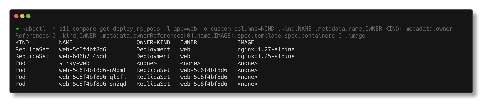
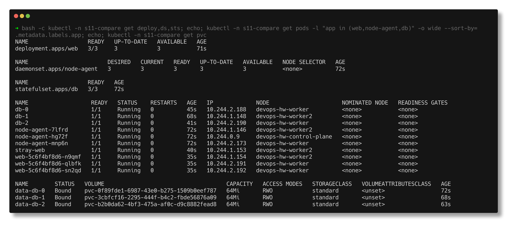
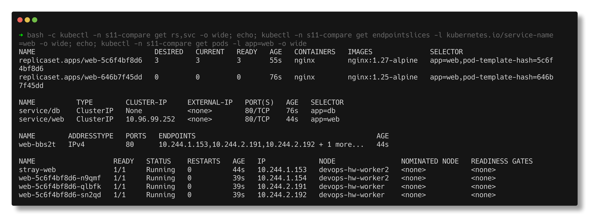
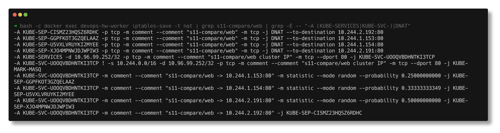

# Task 2 - Kubernetes Object Comparison

> **Submitted by:** Pratyush Mohanty  |  **Roll No.:** 24BCS10238

**Form field:** Kubernetes Networking & Services · **Course session:** `session-11-kubernetes-services`

Run it: `./run.sh` (deploy + verify, namespace `s11-compare`), `./run.sh cleanup` to remove.
Verified output: [output.md](output.md) - a real run on the 3-node kind cluster, Kubernetes v1.37.0.

| File | What it is |
|---|---|
| [workloads.yaml](workloads.yaml) | Namespace, a Deployment `web`, a DaemonSet `node-agent`, a StatefulSet `db` with a headless Service and `volumeClaimTemplates`, a curl client |
| [service.yaml](service.yaml) | A ClusterIP Service `web`, plus a bare pod `stray-web` that carries the same label |

Every claim below is backed by a line in `output.md`. The tables summarise; the
output is the evidence.

---

## 1. Deployment vs ReplicaSet

| | ReplicaSet | Deployment |
|---|---|---|
| **Purpose** | Keep exactly N pods matching a selector alive | Manage the *version* of an app over time: rollouts, history, rollback |
| **Pod management** | Creates/deletes pods directly; owns them | Never touches pods; creates and scales ReplicaSets |
| **Scaling** | `spec.replicas` | `spec.replicas`, which it copies onto the current ReplicaSet |
| **Rolling updates** | None - changing the template affects only *new* pods | New ReplicaSet per template; scales new up and old down within `maxSurge`/`maxUnavailable` |
| **Rollback** | No history | Old ReplicaSets kept at 0 replicas = instant `rollout undo` |
| **You create it yourself?** | Almost never | Yes - this is the normal way to run stateless apps |

### The relationship, from the cluster itself

```text
KIND         NAME                   OWNER-KIND   OWNER
ReplicaSet   web-646b7f45dd         Deployment   web
Pod          web-646b7f45dd-gfffc   ReplicaSet   web-646b7f45dd
Pod          web-646b7f45dd-gqxx2   ReplicaSet   web-646b7f45dd
Pod          web-646b7f45dd-jsfw5   ReplicaSet   web-646b7f45dd
```

`metadata.ownerReferences` is the chain: **Deployment -> ReplicaSet -> Pod**. The
glue is the `pod-template-hash` label, which the Deployment adds to both the
ReplicaSet's selector and the pods:

```text
  ReplicaSet name : web-646b7f45dd   (= <deployment>-<pod-template-hash>)
  RS selector     : {"app":"web","pod-template-hash":"646b7f45dd"}
  pod web-646b7f45dd-gfffc  labels={"app":"web","pod-template-hash":"646b7f45dd"}
```

### Scaling goes through the Deployment

`kubectl scale deployment web --replicas=5` rewrote the ReplicaSet to `DESIRED 5`.
Then I scaled the ReplicaSet **directly** to 1. Three seconds later:

```text
NAME             DESIRED   CURRENT   READY   AGE
web-646b7f45dd   5         5         5       18s

NAME                   READY   STATUS    RESTARTS   AGE
web-646b7f45dd-5gqcq   1/1     Running   0          3s
web-646b7f45dd-bnqfb   1/1     Running   0          3s
web-646b7f45dd-clv9t   1/1     Running   0          3s
web-646b7f45dd-g8djp   1/1     Running   0          3s
web-646b7f45dd-jsfw5   1/1     Running   0          18s
```

Back to 5 - the Deployment reconciled it. But four pods are 3 seconds old: the
ReplicaSet really did kill four pods before being overruled. Editing a
Deployment-owned ReplicaSet does not stick, and it causes real churn.

### Rolling update = a second ReplicaSet

```text
$ kubectl set image deployment/web nginx=nginx:1.27-alpine
NAME             DESIRED   CURRENT   READY   AGE   CONTAINERS   IMAGES              SELECTOR
web-5c6f4bf8d6   3         3         3       3s    nginx        nginx:1.27-alpine   app=web,pod-template-hash=5c6f4bf8d6
web-646b7f45dd   0         0         0       24s   nginx        nginx:1.25-alpine   app=web,pod-template-hash=646b7f45dd
```

New template, new hash, new ReplicaSet scaled up; the old one is kept at 0 so a
rollback is just scaling it back. Deleting a pod afterwards brought a
replacement owned by `ReplicaSet/web-5c6f4bf8d6` - self-healing is the
ReplicaSet's job, rollouts are the Deployment's.



---

## 2. Deployment vs DaemonSet vs StatefulSet

| | Deployment | DaemonSet | StatefulSet |
|---|---|---|---|
| **Use case** | Stateless, interchangeable replicas | One agent per node | Members that need identity and their own data |
| **Pod creation** | All at once, random names (`web-5c6f4bf8d6-lnbqr`) | One per eligible node (`node-agent-7lfrd`) | One at a time, in order, ordinal names (`db-0`, `db-1`, `db-2`) |
| **Scaling** | `replicas`, any order | No `replicas` - follows the node count | `replicas`, up 0->N, down N->0 |
| **Networking** | Behind a normal Service (one VIP) | Usually per node: `hostPort` / `hostNetwork`, or not reached at all | Headless Service: a stable DNS name per pod |
| **Storage** | Shared or none; a pod's local files die with it | Often `hostPath` to read the node (logs, metrics) | `volumeClaimTemplates`: one PVC per pod that follows the pod |
| **Rolling update** | `RollingUpdate` / `Recreate` | `RollingUpdate` / `OnDelete`, node by node | Ordered, highest ordinal first; `partition` for canaries |
| **Examples** | Web front ends, REST APIs, workers | kube-proxy, kindnet, Fluent Bit, node-exporter | PostgreSQL, Kafka, ZooKeeper, Elasticsearch, etcd |

### What the three look like in one namespace

```text
NAME                   READY   STATUS    RESTARTS   AGE   IP             NODE
db-0                   1/1     Running   0          25s   10.244.2.176   devops-hw-worker
db-1                   1/1     Running   0          21s   10.244.1.148   devops-hw-worker2
db-2                   1/1     Running   0          16s   10.244.2.179   devops-hw-worker
node-agent-7lfrd       1/1     Running   0          25s   10.244.1.146   devops-hw-worker2
node-agent-hg72f       1/1     Running   0          25s   10.244.0.9     devops-hw-control-plane
node-agent-mnp6n       1/1     Running   0          25s   10.244.2.173   devops-hw-worker
web-5c6f4bf8d6-lnbqr   1/1     Running   0          3s    10.244.2.185   devops-hw-worker
...
```
(trimmed to the useful columns)

- **DaemonSet:** exactly one `node-agent` on each of the 3 nodes, including the
  control-plane, because the pod template tolerates its `NoSchedule` taint. It
  cannot be scaled at all - the API has no `/scale` subresource for it:
  ```text
  $ kubectl scale daemonset node-agent --replicas=5
    Error from server (NotFound): the server could not find the requested resource
  ```
- **StatefulSet ordering:** creation timestamps are ~5 s apart - each pod waits
  for the previous one to be Ready:
  ```text
  db-0   2026-10-07T18:03:09Z   devops-hw-worker
  db-1   2026-10-07T18:03:13Z   devops-hw-worker2
  db-2   2026-10-07T18:03:18Z   devops-hw-worker
  ```

### Storage: the real difference

Each StatefulSet pod got its own claim from the template, dynamically
provisioned by the `standard` (local-path) StorageClass:
```text
NAME        STATUS   VOLUME                                     CAPACITY   ACCESS MODES   STORAGECLASS
data-db-0   Bound    pvc-0f89fde1-6987-43e0-b275-1509b0eef787   64Mi       RWO            standard
data-db-1   Bound    pvc-3cbfcf16-2295-444f-b4c2-fbde56876a09   64Mi       RWO            standard
data-db-2   Bound    pvc-b2b0da62-4bf3-475a-af0c-d9c8882fead8   64Mi       RWO            standard
```

Same experiment on both kinds of pod - write a file, delete the pod:
```text
StatefulSet:
  before: db-0  ip=10.244.2.176  node=devops-hw-worker
  after : db-0  ip=10.244.2.188  node=devops-hw-worker  claim=data-db-0
  file  : written by db-0 at 18:03:35

Deployment:
  deleted web-5c6f4bf8d6-lnbqr, replacement is web-5c6f4bf8d6-xtjp2 (a new random name)
  file  : cat: can't open '/tmp/identity.txt': No such file or directory
```

And scaling the StatefulSet down to 2 removed `db-2` but left `data-db-2`
**Bound**; scaling back to 3 re-attached the same claim. Kubernetes never
deletes StatefulSet data for you.

### Networking

Through the headless Service `db`, every member has its own name:
```text
  db-0.db.s11-compare.svc.cluster.local -> 10.244.2.188
  db-1.db.s11-compare.svc.cluster.local -> 10.244.1.148
  db-2.db.s11-compare.svc.cluster.local -> 10.244.2.190
```
`db-0` kept its name across the restart and the DNS record followed the new IP.
Deployment pods have no such names - they are reached through a Service VIP.



---

## 3. ReplicaSet vs Service

| | ReplicaSet | Service |
|---|---|---|
| **Responsibility** | *How many* pods exist: create, replace, delete | *How to reach* them: one stable name + IP, load balanced |
| **Selects pods by** | Label selector (for a Deployment's RS: `app` + `pod-template-hash`) | Label selector (`app=web`) - an independent query |
| **Reacts to** | Pod count != desired | Pods becoming Ready / not Ready / gone |
| **Produces** | Pods | An EndpointSlice + DNS record + kube-proxy rules |
| **Lifetime of its address** | Pod IPs change on every replacement | ClusterIP fixed for the Service's life |

### They do not know about each other

```text
  Service web    ownerReferences: ''   selector: {"app":"web"}
  ReplicaSet web-5c6f4bf8d6  mentions a Service? 0 times
```

The only link is the label. To make that visible, `service.yaml` also creates
a bare pod `stray-web` with `app=web`. The Service picked it up, the ReplicaSet
did not (its selector also needs `pod-template-hash`):

```text
  10.244.1.151  ready=true  pod=web-5c6f4bf8d6-tvktp
  10.244.2.189  ready=true  pod=web-5c6f4bf8d6-xtjp2
  10.244.2.186  ready=true  pod=web-5c6f4bf8d6-wkr8s
  10.244.1.153  ready=true  pod=stray-web

NAME             DESIRED   CURRENT   READY   AGE
web-5c6f4bf8d6   3         3         3       15s
```

4 endpoints, 3 managed pods. This is also how a forgotten debug pod with the
wrong labels ends up taking production traffic.

### Why a Service is required

Every ReplicaSet pod was deleted at once. The ReplicaSet replaced them - with
new names **and new IPs**. The Service did not change:

```text
--- before ---
  ClusterIP: 10.96.99.252
  web-5c6f4bf8d6-tvktp   10.244.1.151
  web-5c6f4bf8d6-wkr8s   10.244.2.186
  web-5c6f4bf8d6-xtjp2   10.244.2.189
--- after ---
  ClusterIP: 10.96.99.252
  web-5c6f4bf8d6-n9qmf   10.244.1.154
  web-5c6f4bf8d6-qlbfk   10.244.2.191
  web-5c6f4bf8d6-sn2qd   10.244.2.192
--- and clients never noticed ---
  http://web -> HTTP 200  (served by 10.96.99.252:80, the VIP)
```

A client holding pod IPs would now be talking to nothing. A client using
`http://web` kept working, because the endpointslice controller rewrote the
slice to the new IPs.

### How traffic reaches the pods

1. **DNS:** `web.s11-compare.svc.cluster.local` resolves to the ClusterIP
   `10.96.99.252` (CoreDNS), never to a pod.
2. **kube-proxy** on every node turned the Service + EndpointSlice into iptables
   NAT rules. Read-only from `devops-hw-worker`:
   ```text
   -A KUBE-SERVICES -d 10.96.99.252/32 -p tcp -m comment --comment "s11-compare/web cluster IP" -m tcp --dport 80 -j KUBE-SVC-UOOQVBDHNTKI3TCP
   -A KUBE-SVC-UOOQVBDHNTKI3TCP -m comment --comment "s11-compare/web -> 10.244.1.153:80" -m statistic --mode random --probability 0.25000000000 -j KUBE-SEP-GGPFKOT3GZQELAAZ
   -A KUBE-SVC-UOOQVBDHNTKI3TCP -m comment --comment "s11-compare/web -> 10.244.1.154:80" -m statistic --mode random --probability 0.33333333349 -j KUBE-SEP-U5VXLVRUYKI2MYEE
   -A KUBE-SVC-UOOQVBDHNTKI3TCP -m comment --comment "s11-compare/web -> 10.244.2.191:80" -m statistic --mode random --probability 0.50000000000 -j KUBE-SEP-XJ04MPNWJDJWPIW3
   -A KUBE-SVC-UOOQVBDHNTKI3TCP -m comment --comment "s11-compare/web -> 10.244.2.192:80" -j KUBE-SEP-CISMZ23HQSZ6RDHC
   -A KUBE-SEP-CISMZ23HQSZ6RDHC -p tcp -m comment --comment "s11-compare/web" -m tcp -j DNAT --to-destination 10.244.2.192:80
   ```
3. **DNAT:** the packet to `10.96.99.252:80` is rewritten to one pod IP. The
   probabilities 1/4, 1/3, 1/2, rest give each of the 4 endpoints 25%. That is
   also why curl reports the VIP as the remote address - the rewrite happens in
   the kernel, below the application.

The ReplicaSet appears nowhere in this path.





---

## Notes from actually running this

- **Terminating pods pollute every listing.** The first run scaled the
  ReplicaSet behind the Deployment's back and then rolled out a new image. Its
  "pods now belong to the NEW ReplicaSet" table listed 9 pods, 6 of them from
  the *old* ReplicaSet, and the Service's EndpointSlice later showed them as
  `ready=false`:
  ```text
  10.244.1.84  ready=false  pod=web-646b7f45dd-tz8ff
  10.244.1.90  ready=true  pod=web-5c6f4bf8d6-tv9fm
  ```
  They were Terminating, not running. Terminating pods stay in `kubectl get`
  and in the EndpointSlice (as not ready) until they are gone. `run.sh` now
  waits until exactly 3 ReplicaSet pods exist before printing anything.
- **`kubectl get deploy,rs,pods -l app=web` does not list the Deployment.** The
  label is on the pod template, not on the Deployment's own metadata. Labels on
  an object and labels in its template are different things.
- **The DaemonSet scale error is `NotFound`, not "not supported".** It reads like
  a missing object; it is the missing `/scale` subresource.
- **local-path pins StatefulSet pods to a node.** `db-0` came back on the same
  node every time because its PV has node affinity. With network storage (EBS,
  Ceph) it could move.
- The `output.md` here is from the run after these fixes; the screenshots were
  taken from that run's live objects before `./run.sh cleanup`.

---

## Interview Q&A

**Q: Why not create ReplicaSets directly?**
They only keep a count. You lose rollouts, history and rollback, and changing the
image updates nothing that is running. A Deployment gives you all of that and
manages the ReplicaSets for you.

**Q: How does a Deployment know which pods are its own?**
It doesn't track pods directly. Each ReplicaSet's selector includes the
`pod-template-hash` label, and pods carry `ownerReferences` to their ReplicaSet,
which carries one to the Deployment.

**Q: What happens if you scale a Deployment's ReplicaSet by hand?**
The Deployment controller sets it back - but not before the ReplicaSet has acted
on it. In this run four pods were killed and recreated within three seconds.

**Q: When do you pick a StatefulSet over a Deployment?**
When pods are not interchangeable: they need a stable name (`db-0`), a stable DNS
record via a headless Service, their own persistent volume, and ordered start/stop.

**Q: What happens to a StatefulSet's PVCs on scale-down?**
They stay (Bound). Scaling up re-attaches them to the same ordinal. You delete them
yourself, or set `persistentVolumeClaimRetentionPolicy`.

**Q: How do you run a DaemonSet on only some nodes?**
`nodeSelector` or node affinity in the pod template. To include tainted nodes
(like the control-plane), add tolerations.

**Q: ReplicaSet vs Service in one sentence?**
The ReplicaSet keeps the right number of pods alive; the Service gives whatever
pods currently match its selector one stable address.

**Q: A pod not managed by the Deployment is receiving traffic. How?**
It carries labels matching the Service selector. The Service selects by label
only, whatever created the pod.
