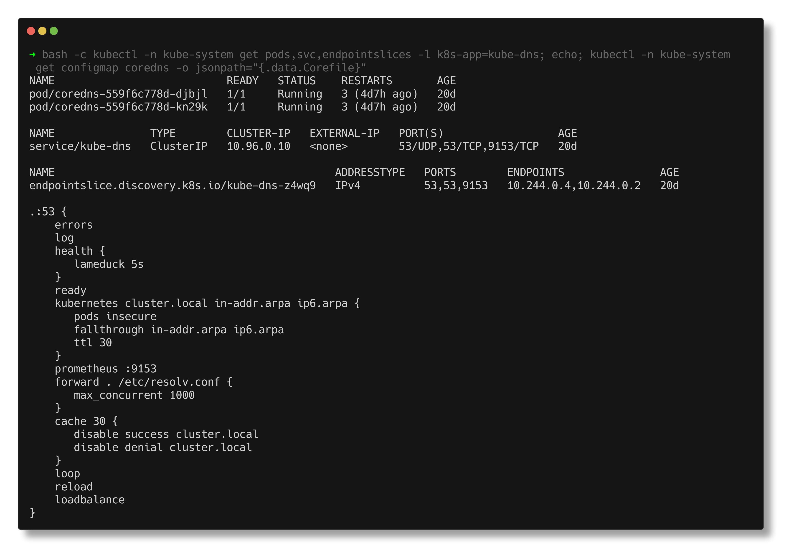
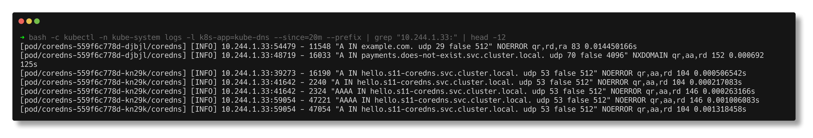

# Task 4 - CoreDNS

> **Submitted by:** Pratyush Mohanty  |  **Roll No.:** 24BCS10238

**Form field:** Kubernetes Networking & Services · **Course session:** `session-11-kubernetes-services`

Run it: `./run.sh` (namespaces `s11-coredns`, `s11-coredns-probe`), `./run.sh cleanup` to remove.
Verified output: [output.md](output.md) - Kubernetes v1.37.0, CoreDNS v1.14.6.

| File | What it is |
|---|---|
| [lab.yaml](lab.yaml) | A `hello` Deployment + Service, a `dns-client` pod (dig + curl containers), a `dns-probe` pod in a second namespace |
| [troubleshooting/broken-deny-egress.yaml](troubleshooting/broken-deny-egress.yaml) | Scenario 1, broken: namespace-wide default-deny egress |
| [troubleshooting/fix-allow-dns.yaml](troubleshooting/fix-allow-dns.yaml), [fix-allow-app.yaml](troubleshooting/fix-allow-app.yaml) | Scenario 1, the two fixes |
| [troubleshooting/broken-nameserver-pod.yaml](troubleshooting/broken-nameserver-pod.yaml), [fixed-nameserver-pod.yaml](troubleshooting/fixed-nameserver-pod.yaml) | Scenario 2: `dnsPolicy: None` with a typo'd nameserver, and the fix |

The only change to shared cluster state is temporarily adding the `log` plugin to
the CoreDNS Corefile. The script saves the original, restores it at the end (and
from a trap if it dies) and compares it byte for byte:
```text
  all 2 CoreDNS pods reloaded after ~60s
  Corefile now identical to the saved original - 'log' removed.
```

---

## 1. What is CoreDNS?

CoreDNS is a DNS server written in Go, built from a chain of **plugins** (a CNCF
graduated project). In Kubernetes it runs as an ordinary Deployment in
`kube-system` and is the cluster's DNS:

```text
NAME      READY   UP-TO-DATE   AVAILABLE   AGE   CONTAINERS   IMAGES                                    SELECTOR
coredns   2/2     2            2           20d   coredns      registry.k8s.io/coredns/coredns:v1.14.6   k8s-app=kube-dns

NAME                       READY   STATUS    RESTARTS       AGE   IP           NODE
coredns-559f6c778d-djbjl   1/1     Running   3 (4d7h ago)   20d   10.244.0.4   devops-hw-control-plane
coredns-559f6c778d-kn29k   1/1     Running   3 (4d7h ago)   20d   10.244.0.2   devops-hw-control-plane

NAME       TYPE        CLUSTER-IP   EXTERNAL-IP   PORT(S)                  AGE   SELECTOR
kube-dns   ClusterIP   10.96.0.10   <none>        53/UDP,53/TCP,9153/TCP   20d   k8s-app=kube-dns
```

The Service is still named `kube-dns` (the DNS server before CoreDNS) so nothing
pointing at it had to change. **Its ClusterIP `10.96.0.10` is the `nameserver`
in every pod's `/etc/resolv.conf`:**
```text
  search s11-coredns.svc.cluster.local svc.cluster.local cluster.local
  nameserver 10.96.0.10
  options ndots:5
```
The kubelet writes that file from its `clusterDNS: [10.96.0.10]` setting.



## 2. Why Kubernetes uses CoreDNS

- **Service discovery without config:** apps call `http://hello`, never an IP.
  Pod and Service IPs change; names do not.
- **It reads the API directly.** Its RBAC is only list/watch on the objects it
  needs:
  ```text
    [""] ["endpoints","services","pods","namespaces"] ["list","watch"]
    ["discovery.k8s.io"] ["endpointslices"] ["list","watch"]
  ```
- **Plugins** - Kubernetes records, forwarding, caching, metrics, health,
  logging, rewrites - all in one small binary, configured by one text file.
- It replaced kube-dns (three containers: kubedns, dnsmasq, sidecar) as the
  default in Kubernetes 1.13; one process is simpler and was faster.

## 3. How Service discovery works

A Service was created and queried straight away, then deleted:
```text
$ kubectl create service clusterip late-svc --tcp=80:80   (and query it immediately)
  late-svc.s11-coredns.svc.cluster.local -> 10.96.127.44   (resolvable within ~1s, API ClusterIP 10.96.127.44)
$ kubectl delete service late-svc
  late-svc.s11-coredns.svc.cluster.local -> status NXDOMAIN
```
No zone file, no restart. The `kubernetes` plugin keeps an in-memory copy of
Services and EndpointSlices from its watch and answers from it:

1. Service created -> API server stores it -> watch event reaches CoreDNS.
2. CoreDNS can now answer `late-svc.s11-coredns.svc.cluster.local` with the ClusterIP
   (or with pod IPs for a headless Service, from the EndpointSlices).
3. Service deleted -> watch event -> the name is NXDOMAIN.

## 4. How a DNS query is resolved

For `curl http://hello` in pod `dns-client`:

```text
 app -> libc resolver -> /etc/resolv.conf: search list + ndots:5
     -> query hello.s11-coredns.svc.cluster.local to 10.96.0.10:53
     -> kube-proxy iptables DNAT 10.96.0.10 -> one CoreDNS pod (10.244.0.2 / 10.244.0.4)
     -> CoreDNS plugin chain:
          cluster.local name?  kubernetes plugin answers (authoritative)
          anything else?       forward plugin -> node's resolver 192.168.65.254
     -> answer: 10.96.45.128 (ClusterIP) -> curl connects -> kube-proxy -> a hello pod
```

Each hop, from the run:

**a) Cluster name - answered by CoreDNS itself** (`aa` = authoritative):
```text
  ;; flags: qr aa rd; QUERY: 1, ANSWER: 1, AUTHORITY: 0, ADDITIONAL: 1
  hello.s11-coredns.svc.cluster.local. 30	IN A	10.96.45.128
  ;; SERVER: 10.96.0.10#53(10.96.0.10)
```
**b) 10.96.0.10 is a VIP** - kube-proxy's rules on a node split it 50/50 over the two CoreDNS pods:
```text
  -A KUBE-SVC-TCOU7JCQXEZGVUNU -m comment --comment "kube-system/kube-dns:dns -> 10.244.0.2:53" -m statistic --mode random --probability 0.50000000000 -j KUBE-SEP-YIL6JZP7A3QYXJU2
  -A KUBE-SVC-TCOU7JCQXEZGVUNU -m comment --comment "kube-system/kube-dns:dns -> 10.244.0.4:53" -j KUBE-SEP-WXWGHGKZOCNYRYI7
```
**c) Asking a CoreDNS pod directly** (`dig @10.244.0.4`) gives the same answer - useful to rule kube-proxy in or out.

**d) External name** - not authoritative (no `aa`), relayed upstream:
```text
  ;; flags: qr rd ra; QUERY: 1, ANSWER: 2, AUTHORITY: 0, ADDITIONAL: 1
  example.com.		30	IN	A	172.66.147.243
```
Upstream is the CoreDNS pod's own `/etc/resolv.conf`. CoreDNS runs with
`dnsPolicy: Default`, so that is the node's file: `nameserver 192.168.65.254`,
Docker Desktop's resolver, which asks macOS.

**e) The search list belongs to the client, not to CoreDNS:**
```text
  dig hello          -> status NXDOMAIN   (dig does not apply 'search' unless told to)
  dig +search hello  -> 10.96.45.128
  nslookup hello     -> 10.96.45.128   (system resolver applies 'search')
```

## 5. CoreDNS configuration (the Corefile)

`kubectl -n kube-system get configmap coredns`, unchanged original:
```text
.:53 {
    errors
    health {
       lameduck 5s
    }
    ready
    kubernetes cluster.local in-addr.arpa ip6.arpa {
       pods insecure
       fallthrough in-addr.arpa ip6.arpa
       ttl 30
    }
    prometheus :9153
    forward . /etc/resolv.conf {
       max_concurrent 1000
    }
    cache 30 {
       disable success cluster.local
       disable denial cluster.local
    }
    loop
    reload
    loadbalance
}
```

| Plugin | What it does here |
|---|---|
| `.:53` | One server block for every zone (`.`), on port 53 |
| `errors` | Logs errors to stdout |
| `health` / `lameduck 5s` | `:8080/health` for the liveness probe; keeps serving 5 s while shutting down |
| `ready` | `:8181/ready` for the readiness probe - only Ready once plugins are ready |
| `kubernetes cluster.local in-addr.arpa ip6.arpa` | Answers Service/pod/endpoint names and reverse lookups from the API watch |
| `pods insecure` | Answers `<ip-dashed>.<ns>.pod.cluster.local` for any IP without checking a pod exists |
| `fallthrough in-addr.arpa ip6.arpa` | Reverse lookups it cannot answer go to the next plugin instead of NXDOMAIN |
| `ttl 30` | Records are cached by clients for 30 s |
| `prometheus :9153` | Metrics (`coredns_dns_responses_total` etc.) |
| `forward . /etc/resolv.conf` | Everything else goes to the node's upstream resolvers |
| `cache 30` + `disable success/denial cluster.local` | Caches external answers 30 s, but **not** cluster names - they are already in memory and must stay fresh |
| `loop` | Detects a forwarding loop (upstream pointing back at CoreDNS) and stops the pod |
| `reload` | Re-reads the Corefile when the ConfigMap changes (checked every 30 s) - used below |
| `loadbalance` | Shuffles the order of A records in each answer |

## 6. Seeing real queries: the `log` plugin

The script inserts one line after `errors`:
```text
  2a3
  >     log
```
and waits for both pods to log `Reloading complete` (85 s in this run - the
ConfigMap volume sync plus the 30 s `reload` check). Then the client runs
`nslookup hello`, `nslookup example.com` and a lookup of a name that does not
exist. CoreDNS's log, filtered to the client's IP `10.244.1.33`:
```text
  coredns-559f6c778d-djbjl [INFO] 10.244.1.33:54479 - 11548 "A IN example.com. udp 29 false 512" NOERROR qr,rd,ra 83 0.014450166s
  coredns-559f6c778d-djbjl [INFO] 10.244.1.33:48719 - 16033 "A IN payments.does-not-exist.svc.cluster.local. udp 70 false 4096" NXDOMAIN qr,aa,rd 152 0.000692125s
  coredns-559f6c778d-kn29k [INFO] 10.244.1.33:58165 - 57772 "A IN hello.s11-coredns.svc.cluster.local. udp 53 false 512" NOERROR qr,aa,rd 104 0.000626791s
  coredns-559f6c778d-kn29k [INFO] 10.244.1.33:53238 - 62831 "A IN example.com.s11-coredns.svc.cluster.local. udp 59 false 512" NXDOMAIN qr,aa,rd 152 0.010255459s
  coredns-559f6c778d-kn29k [INFO] 10.244.1.33:35095 - 3940 "A IN example.com.svc.cluster.local. udp 47 false 512" NXDOMAIN qr,aa,rd 140 0.000729084s
  coredns-559f6c778d-kn29k [INFO] 10.244.1.33:54810 - 57094 "A IN example.com.cluster.local. udp 43 false 512" NXDOMAIN qr,aa,rd 136 0.00024825s
```
- `hello`: one query, NOERROR, `aa`, 0.6 ms.
- `example.com`: three NXDOMAINs from the search list (ndots:5) **then** the real
  query, which has no `aa` and took 14 ms because it went upstream - 20x slower
  than a cluster name.
- The two CoreDNS pods each got some of the queries: the kube-dns VIP really is
  load balanced.



(The screenshot was taken a little later, so it also shows the A + AAAA pairs
from `curl` during the troubleshooting step.)

The `log` plugin logs **every** query in the cluster, so it was switched off
again as soon as the scenarios below were done.

## 7. How to troubleshoot DNS - scenario 1, a real failure

A "lock it down" policy ([broken-deny-egress.yaml](troubleshooting/broken-deny-egress.yaml))
is applied to `s11-coredns` only:
```text
  curl http://hello -> HTTP 000 (curl exit 6)
```

| Step | Command | Result | Conclusion |
|---|---|---|---|
| 1. Is it DNS? | `nslookup hello` | `;; connection timed out; no servers could be reached` | DNS, and a timeout, not NXDOMAIN |
| 2. Is CoreDNS healthy? | `get pods,endpointslices -l k8s-app=kube-dns` | 2/2 Running, endpoints `10.244.0.4,10.244.0.2` | yes |
| 3. Cluster-wide? | `nslookup` from a pod in `s11-coredns-probe` | `Address: 10.96.45.128` | only this namespace is affected |
| 4. Pod resolver config? | `cat /etc/resolv.conf` | `nameserver 10.96.0.10`, right search list | correct |
| 5. Bypass the VIP | `dig @10.244.0.4 hello...` | `connection timed out` | not kube-proxy - packets are dropped |
| 6. Did queries arrive? | CoreDNS `log` for `10.244.1.33` | `0` lines since the policy | dropped before CoreDNS |
| 7. What filters traffic? | `kubectl get networkpolicy` | `default-deny-egress   <none>` | found it |

```text
  Spec:
    PodSelector:     <none> (Allowing the specific traffic to all pods in this namespace)
    Not affecting ingress traffic
    Allowing egress traffic:
      <none> (Selected pods are isolated for egress connectivity)
    Policy Types: Egress
```

**Root cause:** the policy isolates every pod for egress and allows nothing.
DNS (UDP/TCP 53 to `kube-system`) is egress too. kindnet enforces
NetworkPolicy, so every lookup is dropped at the pod.

**Fix 1** - [fix-allow-dns.yaml](troubleshooting/fix-allow-dns.yaml): allow 53/UDP+TCP
to pods `k8s-app=kube-dns` in namespace `kube-system`:
```text
  Name:	hello.s11-coredns.svc.cluster.local
  Address: 10.96.45.128
  curl http://hello -> HTTP 000 (curl exit 28)
```
DNS works; the request now times out instead (exit 6 became exit 28) because
the deny also blocks client -> app. **Fix 2** - [fix-allow-app.yaml](troubleshooting/fix-allow-app.yaml):
```text
  curl http://hello -> HTTP 200 via 10.96.45.128
```

### Scenario 2 - one pod's hand-written resolver config

[broken-nameserver-pod.yaml](troubleshooting/broken-nameserver-pod.yaml) sets
`dnsPolicy: None` with `nameservers: [10.96.0.100]`:
```text
  ;; connection timed out; no servers could be reached
  search s11-coredns.svc.cluster.local
  nameserver 10.96.0.100
  options ndots:2
  kube-dns ClusterIP: 10.96.0.10
  pod dnsPolicy     : None
```
Root cause: a typo'd nameserver, and `None` drops all cluster defaults. Fix
([fixed-nameserver-pod.yaml](troubleshooting/fixed-nameserver-pod.yaml)): keep
`ClusterFirst` and only add the wanted option - `dnsConfig` is merged with the
defaults. `dnsPolicy` is immutable, so the pod is recreated:
```text
  search s11-coredns.svc.cluster.local svc.cluster.local cluster.local
  nameserver 10.96.0.10
  options ndots:2
  Name:	hello.s11-coredns.svc.cluster.local
```

### My DNS troubleshooting checklist

```bash
kubectl exec <pod> -- nslookup <svc>                       # 1. DNS or not? NXDOMAIN vs timeout
kubectl -n kube-system get pods,endpointslices -l k8s-app=kube-dns   # 2. CoreDNS up, endpoints present
kubectl -n kube-system logs -l k8s-app=kube-dns           # 3. errors, loop detection, upstream failures
kubectl exec <other-ns-pod> -- nslookup <svc>.<ns>        # 4. cluster-wide or local?
kubectl exec <pod> -- cat /etc/resolv.conf                # 5. nameserver = kube-dns IP? search list?
kubectl exec <pod> -- dig @<coredns-pod-ip> <name>        # 6. bypass kube-proxy
kubectl get networkpolicy -n <ns>                         # 7. egress to 53 allowed?
# 8. still unclear: add 'log' to the Corefile for a few minutes, then remove it
```

| Symptom | Likely cause |
|---|---|
| `NXDOMAIN` for a Service | Wrong name or namespace (short name from another namespace), Service missing |
| Timeout, all namespaces | CoreDNS pods down, kube-dns has no endpoints, kube-proxy broken |
| Timeout, one namespace | NetworkPolicy blocking egress 53 (scenario 1) |
| Timeout, one pod | `dnsPolicy: None` / wrong `dnsConfig` (scenario 2) |
| Cluster names fine, external fail | Upstream: `forward` target / node resolv.conf; SERVFAIL in metrics |
| CoreDNS CrashLoopBackOff, `loop` in log | Node resolv.conf points at 127.0.0.x -> forwarding loop |
| Everything slow | ndots:5 search-list fan-out for external names (section 6) |

---

## Notes from actually running this

- **The reload is slow and invisible.** After patching the ConfigMap nothing
  happened for over a minute: the kubelet syncs ConfigMap volumes periodically and
  `reload` checks every 30 s. Waiting for `Reloading complete` in both pods' logs
  was the only reliable signal (60-85 s here).
- **My first run's commentary was wrong.** It claimed `nslookup` sent an A and an
  AAAA query; the log showed only A queries (this `nslookup` asks for A only;
  `curl` asks for both, visible in the screenshot). I fixed the text and re-ran,
  which is the run in `output.md`.
- **A blocked DNS query and a down CoreDNS look the same from the pod** - both
  time out. Step 3 (another namespace) and step 6 (CoreDNS's own log) are what
  separated them.
- **The probe pod and the API proxy were not affected by the policy.** The
  metrics in section 9 of the output were read through
  `kubectl get --raw .../pods/<coredns>:9153/proxy/metrics`, i.e. through the
  API server, not from the restricted client.

## Interview Q&A

**Q: What is CoreDNS and where does it run?**
The cluster DNS server: a plugin-based Go DNS server running as a Deployment in
`kube-system`, behind the `kube-dns` Service whose ClusterIP every pod uses as its
nameserver.

**Q: How does CoreDNS know about new Services?**
The `kubernetes` plugin list/watches Services, EndpointSlices, Pods and Namespaces
and answers from memory - a new Service resolved within a second.

**Q: Which plugin sends external names out?**
`forward . /etc/resolv.conf` - to the CoreDNS pod's resolv.conf, which (with
`dnsPolicy: Default`) is the node's.

**Q: Why is `cache` disabled for cluster.local here?**
Cluster records come from the in-memory API watch already; caching them would
only serve stale answers after a change. External answers are cached 30 s.

**Q: CoreDNS is in CrashLoopBackOff with "Loop ... detected". Why?**
The node's resolv.conf points at a local stub (127.0.0.53), so `forward` sends
queries back to CoreDNS itself. Point `forward` at real upstreams, or the kubelet
at the real resolv.conf.

**Q: How do you see which queries a pod makes?**
Temporarily add `log` to the Corefile (it reloads itself), filter the CoreDNS logs
by the pod IP, then remove it again - as done here.

**Q: DNS works from one namespace but not another. What do you check first?**
NetworkPolicies in the failing namespace - an egress default-deny without a rule
for UDP/TCP 53 to the CoreDNS pods.
