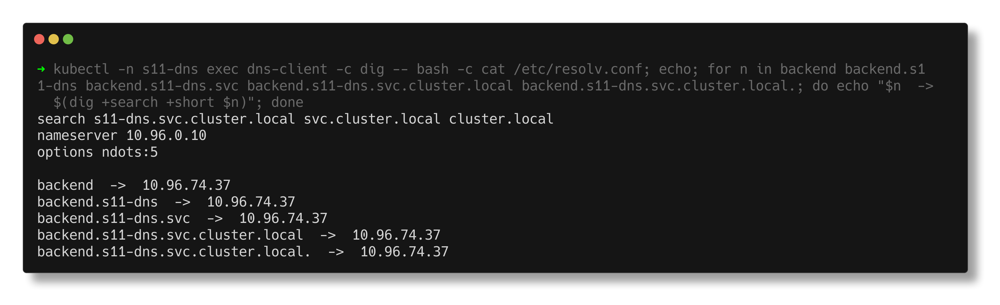
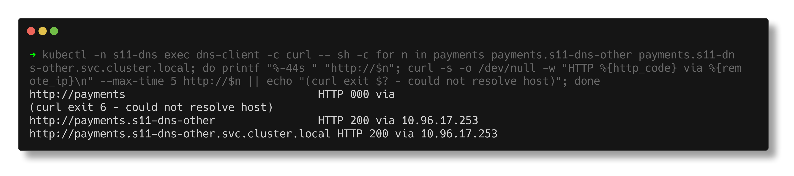
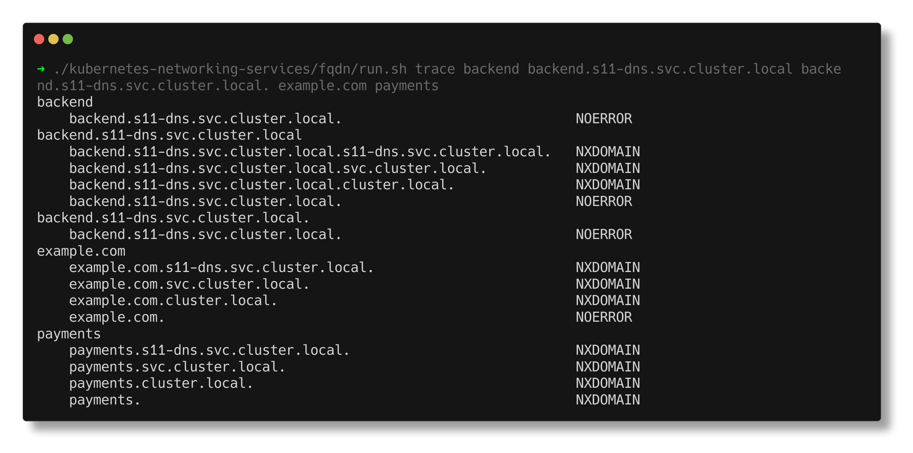
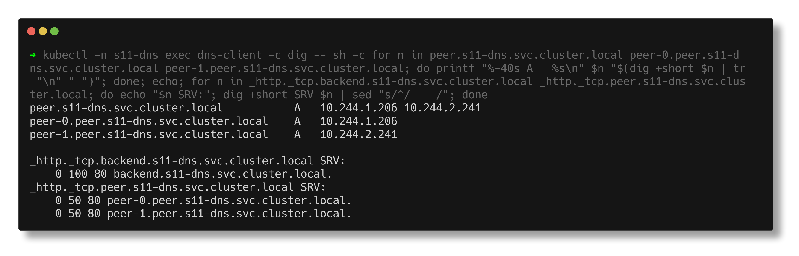

# Task 3 - FQDN and Kubernetes Service DNS

> **Submitted by:** Pratyush Mohanty  |  **Roll No.:** 24BCS10238

**Form field:** Kubernetes Networking & Services · **Course session:** `session-11-kubernetes-services`

Run it: `./run.sh` (namespaces `s11-dns` and `s11-dns-other`), `./run.sh cleanup` to remove.
`./run.sh trace <name>...` prints every query the pod's resolver really sends for a name.
Verified output: [output.md](output.md) - Kubernetes v1.37.0, CoreDNS v1.14.6.

Lab manifest: [dns-lab.yaml](dns-lab.yaml) - a `backend` Deployment + ClusterIP
Service, a `peer` StatefulSet + headless Service, a `payments` Service in a
second namespace, and a `dns-client` pod with two containers (`dig` from
`jessie-dnsutils`, `curl` from `curlimages/curl`).

---

## 1. What is an FQDN?

A **Fully Qualified Domain Name** is a name that is complete all the way to the
DNS root, so it means the same thing no matter who asks. Strictly, it ends in a
dot: `backend.s11-dns.svc.cluster.local.` - the trailing dot *is* the root.

A name without the trailing dot may be treated as **relative**: the resolver is
allowed to append suffixes from its `search` list first. That one dot turns out
to matter a lot inside Kubernetes (section 5).

## 2. Kubernetes Service DNS

Every Service gets DNS records automatically. Nobody registers anything:
CoreDNS watches the API server and answers from what it sees.

| Service kind | Record | Answer |
|---|---|---|
| Normal (ClusterIP) | `A` `<svc>.<ns>.svc.cluster.local` | the ClusterIP |
| Headless (`clusterIP: None`) | `A` `<svc>.<ns>.svc.cluster.local` | every ready pod IP |
| Headless + StatefulSet | `A` `<pod>.<svc>.<ns>.svc.cluster.local` | that one pod's IP |
| Any, with a **named** port | `SRV` `_<port>._<proto>.<svc>.<ns>.svc.cluster.local` | port + target name |
| ExternalName | `CNAME` `<svc>.<ns>.svc.cluster.local` | the external name |
| Every pod | `A` `<ip-with-dashes>.<ns>.pod.cluster.local` | the pod IP |

Where `cluster.local` comes from and who answers - both straight from the cluster:
```text
kubelet config (kube-system/kubelet-config):
  clusterDNS:
  - 10.96.0.10
  clusterDomain: cluster.local

NAME       TYPE        CLUSTER-IP   EXTERNAL-IP   PORT(S)                  AGE
kube-dns   ClusterIP   10.96.0.10   <none>        53/UDP,53/TCP,9153/TCP   20d
```

## 3. The naming convention

```text
   backend  .  s11-dns  .  svc  .  cluster.local  .
   service     namespace   type    cluster domain   root
```

The same Service, five spellings, all answered with its ClusterIP
`10.96.74.37`:
```text
  backend                                  -> 10.96.74.37
  backend.s11-dns                          -> 10.96.74.37
  backend.s11-dns.svc                      -> 10.96.74.37
  backend.s11-dns.svc.cluster.local        -> 10.96.74.37
  backend.s11-dns.svc.cluster.local.       -> 10.96.74.37
```

They only all work because of `/etc/resolv.conf`, which the kubelet writes
into every pod:
```text
  search s11-dns.svc.cluster.local svc.cluster.local cluster.local
  nameserver 10.96.0.10
  options ndots:5
```

- `nameserver 10.96.0.10` - the kube-dns Service, i.e. CoreDNS.
- `search ...` - suffixes to try. The first one is the pod's **own namespace**.
- `ndots:5` - a name with **fewer than 5 dots** is tried against the search list
  *before* being tried as-is.



## 4. Namespace-based DNS

The short name expands only into the **client's** namespace. From a pod in
`s11-dns`, the Service `payments` in `s11-dns-other`:
```text
  payments                                 -> <NXDOMAIN - no answer>
  payments.s11-dns-other                   -> 10.96.17.253
  payments.s11-dns-other.svc.cluster.local -> 10.96.17.253
  backend.default.svc.cluster.local        -> <NXDOMAIN - no answer>
```

What the resolver actually asked for `payments`:
```text
    payments.s11-dns.svc.cluster.local.                            NXDOMAIN
    payments.svc.cluster.local.                                    NXDOMAIN
    payments.cluster.local.                                        NXDOMAIN
    payments.                                                      NXDOMAIN
```
It never tries `payments.s11-dns-other...` - nothing tells it to. Across
namespaces you need at least `<service>.<namespace>`. The last line
(`backend.default...`) shows the reverse mistake: right service, wrong
namespace, no record.



## 5. The search list and ndots, query by query

`./run.sh trace` uses `dig +search +showsearch` to print every query sent:
```text
--- backend ---
    backend.s11-dns.svc.cluster.local.                             NOERROR

--- backend.s11-dns ---
    backend.s11-dns.s11-dns.svc.cluster.local.                     NXDOMAIN
    backend.s11-dns.svc.cluster.local.                             NOERROR

--- backend.s11-dns.svc.cluster.local ---
    backend.s11-dns.svc.cluster.local.s11-dns.svc.cluster.local.   NXDOMAIN
    backend.s11-dns.svc.cluster.local.svc.cluster.local.           NXDOMAIN
    backend.s11-dns.svc.cluster.local.cluster.local.               NXDOMAIN
    backend.s11-dns.svc.cluster.local.                             NOERROR

--- backend.s11-dns.svc.cluster.local. ---
    backend.s11-dns.svc.cluster.local.                             NOERROR
```

The surprise: the "full" name without the trailing dot is the **slowest**
spelling. It has 4 dots, fewer than 5, so it goes through all three search
suffixes first. The short name is fastest for same-namespace calls; the full
name *with* the trailing dot is the only one that is a single query everywhere.

The same cost hits every **external** name a pod looks up:
```text
--- example.com   (1 dot < 5) ---
    example.com.s11-dns.svc.cluster.local.                         NXDOMAIN
    example.com.svc.cluster.local.                                 NXDOMAIN
    example.com.cluster.local.                                     NXDOMAIN
    example.com.                                                   NOERROR
```
Three wasted round trips to CoreDNS per lookup (more with IPv6 `AAAA` queries).
Fixes: a trailing dot in the app's config (`api.example.com.`), or on the pod:
```yaml
spec:
  dnsConfig:
    options:
      - name: ndots
        value: "2"
```



## 6. Pod-to-Service communication

From the `curl` container of the same pod:
```text
  http://backend                                -> HTTP 200 via 10.96.74.37
  http://backend.s11-dns                        -> HTTP 200 via 10.96.74.37
  http://backend.s11-dns.svc.cluster.local      -> HTTP 200 via 10.96.74.37
  http://10.96.74.37                            -> HTTP 200 via 10.96.74.37
  http://payments                               -> HTTP 000 via (curl exit 6)
  http://payments.s11-dns-other                 -> HTTP 200 via 10.96.17.253
```
The path is always: name -> CoreDNS -> ClusterIP -> kube-proxy DNAT to a pod
(see [../comparison/README.md](../comparison/README.md#how-traffic-reaches-the-pods)).
curl exit 6 is "could not resolve host" - a DNS failure, not a network one,
which is the first thing to tell apart when debugging.

## 7. Headless Services and per-pod names

```text
  peer-0   10.244.1.206
  peer-1   10.244.2.241

  peer.s11-dns.svc.cluster.local           -> 10.244.1.206 10.244.2.241
  peer-0.peer.s11-dns.svc.cluster.local    -> 10.244.1.206
  peer-1.peer.s11-dns.svc.cluster.local    -> 10.244.2.241
```
No ClusterIP, so the Service name returns the pod IPs, and each StatefulSet pod
gets `<pod>.<service>.<namespace>.svc.cluster.local`.

**SRV records** carry the port as well, for named ports:
```text
$ dig +short SRV _http._tcp.backend.s11-dns.svc.cluster.local
  0 100 80 backend.s11-dns.svc.cluster.local.
$ dig +short SRV _http._tcp.peer.s11-dns.svc.cluster.local
  0 50 80 peer-0.peer.s11-dns.svc.cluster.local.
  0 50 80 peer-1.peer.s11-dns.svc.cluster.local.
```



## 8. More real Kubernetes FQDNs from this cluster

| FQDN | Resolves to |
|---|---|
| `kube-dns.kube-system.svc.cluster.local` | `10.96.0.10` (CoreDNS itself) |
| `kubernetes.default.svc.cluster.local` | `10.96.0.1` (the API server) |
| `backend.s11-dns.svc.cluster.local` | `10.96.74.37` (ClusterIP) |
| `payments.s11-dns-other.svc.cluster.local` | `10.96.17.253` (other namespace) |
| `peer-0.peer.s11-dns.svc.cluster.local` | `10.244.1.206` (one StatefulSet pod) |
| `_http._tcp.backend.s11-dns.svc.cluster.local` | SRV `0 100 80 backend...` |
| `10-244-1-205.s11-dns.pod.cluster.local` | `10.244.1.205` (a pod by IP) |

Reverse lookups work too:
```text
  dig -x 10.96.74.37 (the ClusterIP)            -> backend.s11-dns.svc.cluster.local.
  dig -x 10.244.1.205 (a backend pod)           -> 10-244-1-205.backend.s11-dns.svc.cluster.local.
```

(The first two rows come from the CoreDNS task: [../coredns/output.md](../coredns/output.md).)

---

## Notes from actually running this

- **The instructor's DNS test image does not exist.** `registry.k8s.io/e2e-test-images/dnsutils:1.3`
  failed with `registry.k8s.io/e2e-test-images/dnsutils:1.3: not found` ->
  `ImagePullBackOff`. `jessie-dnsutils:1.7` from the same project works on this
  arm64 cluster and has `dig`, `nslookup` and `host`.
- **`dig` ignores the search list unless you pass `+search`.** Plain
  `dig backend` asks for the literal name `backend.` and gets nothing, which
  looks like broken DNS. `nslookup`, `curl` and apps use the system resolver
  and do apply the search list.
- **`backend.s11-dns` costs one wasted query** (it first becomes
  `backend.s11-dns.s11-dns.svc.cluster.local`). Not a problem, but it shows
  the search list is applied blindly.
- **A reverse lookup of a pod IP names the Service**, not the pod:
  `10-244-1-205.backend.s11-dns.svc.cluster.local.` - CoreDNS builds it from the
  EndpointSlice.

---

## Interview Q&A

**Q: What is the FQDN of a Service?**
`<service>.<namespace>.svc.<cluster-domain>`, normally
`<service>.<namespace>.svc.cluster.local`, strictly with a trailing dot.

**Q: Why does `curl http://backend` work inside a pod?**
The kubelet writes `search <ns>.svc.cluster.local svc.cluster.local cluster.local`
into the pod's `/etc/resolv.conf`; the resolver appends the first suffix and
CoreDNS answers.

**Q: My app in namespace `staging` can't reach `mysql` in `prod`. Why?**
The short name expands to `mysql.staging.svc.cluster.local`, which does not
exist. Use `mysql.prod` or the full FQDN.

**Q: What does `ndots:5` do and why does it matter?**
Names with fewer than 5 dots are tried against every search domain before being
tried as-is. External names like `example.com` cost 3 extra NXDOMAIN queries
each - measured above. Use trailing dots or lower `ndots` via `dnsConfig`.

**Q: How does a headless Service change DNS?**
The Service name returns all ready pod IPs instead of a VIP, and StatefulSet pods
get their own `<pod>.<svc>.<ns>.svc.cluster.local` records.

**Q: Do pods have DNS names?**
Yes: `<ip-with-dashes>.<ns>.pod.cluster.local`, plus `<hostname>.<subdomain>.<ns>.svc...`
when `hostname`/`subdomain` match a headless Service (which is what StatefulSets do).

**Q: How do you tell a DNS failure from a connectivity failure?**
`curl` exit 6 / "could not resolve host" or NXDOMAIN from `nslookup` is DNS.
A resolved IP with a timeout (exit 28) or connection refused (exit 7) is the
network or the backend.
