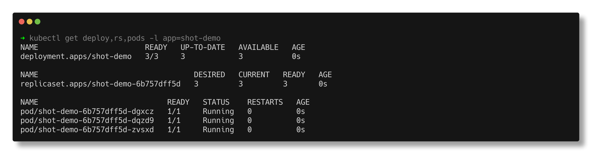
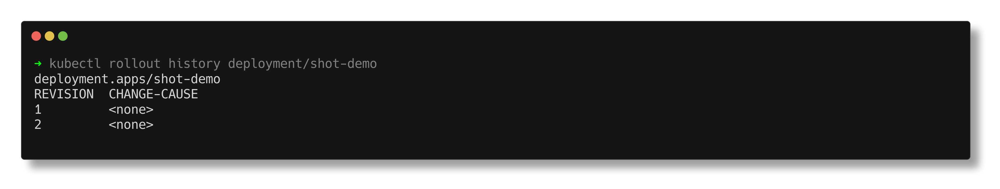
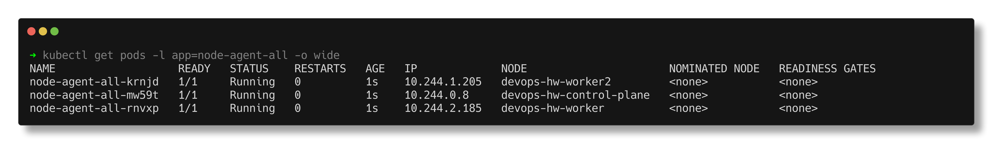

# Kubernetes Pods, ReplicaSets & Deployments

> **Submitted by:** Pratyush Mohanty  |  **Roll No.:** 24BCS10238

**Form field:** Kubernetes Pods, ReplicaSets & Deployments · **Course session:** `session10-k8s-core-objects`

| # | Topic | Script | Verified output |
|---|---|---|---|
| 01 | **Pods** - the atom, and how they fail | [run.sh](01-pods/run.sh) | [output.md](01-pods/output.md) |
| 02 | **ReplicaSets** - self-healing, and their limit | [run.sh](02-replicasets/run.sh) | [output.md](02-replicasets/output.md) |
| 03 | **Deployments** - rollouts, history, rollback | [run.sh](03-deployments/run.sh) | [output.md](03-deployments/output.md) |
| 04 | **Deployment strategies** - Recreate, Rolling, Blue/Green, Canary | [run.sh](04-deployment-strategies/run.sh) | [output.md](04-deployment-strategies/output.md) |
| 05 | **DaemonSets** - one pod per node | [run.sh](05-daemonset/run.sh) | [output.md](05-daemonset/output.md) |

Verified on a 3-node [kind](https://kind.sigs.k8s.io/) cluster, **Kubernetes v1.37.0**
(1 control-plane + 2 workers - a multi-node cluster matters for the DaemonSet
and scheduling demos).

---

## The through-line

These five topics are one argument, each step motivated by a real limitation
demonstrated in the previous one.

### 1. A Pod alone is not enough

A pod is not a container - it is a wrapper around one or more containers that
share a network namespace (one IP, reachable over `localhost`), volumes, and a
lifecycle. The sidecar demo proves both kinds of sharing: a busybox container
writes to a shared `emptyDir`, and nginx serves that file.

Then the key experiment - delete a bare pod:

```text
Deleting standalone-pod ...
--- is it back? ---
  Error from server (NotFound): pods "standalone-pod" not found
>>> GONE. Permanently. Nothing recreates it.
```

**That is why you don't create bare pods in production.** If the node dies, the
app is simply down.

The task also reproduces the two failures you will actually meet:

- **ImagePullBackOff** - `describe` gives the answer:
  `Failed to pull image "nginx:this-tag-does-not-exist": ... not found`
- **CrashLoopBackOff** - `describe` does *not* give the answer; the container's
  own logs do: `fatal: cannot connect to database`. CrashLoopBackOff is not an
  error, it is a *backoff timer*. The error is always in `kubectl logs`.

### 2. A ReplicaSet fixes the count - and only the count

It maintains N pods. Delete one and a replacement appears. It also **adopts any
pod matching its selector**, which the task shows deterministically by creating
a stray pod *before* the ReplicaSet exists:

```text
--- before the ReplicaSet exists: one bare pod, owned by nobody ---
  orphan-pod               Running
  ownerReferences: <none>
--- after ---
  orphan-pod ownedBy = ReplicaSet/web-rs
>>> Total pods matching the selector: 3 (not 4).
```

But change the image in a ReplicaSet and:

```text
--- the ReplicaSet template says: ---
  template image: nginx:1.27-alpine
--- but the RUNNING PODS still say: ---
  web-rs-4lw2z  nginx:1.25-alpine
  web-rs-9cw52  nginx:1.25-alpine
```

**Nothing rolls out.** A ReplicaSet guarantees *how many*, never *what*.

### 3. A Deployment adds the rollout

Same image change, different object, completely different outcome - all four
pods replaced gradually with no downtime. A Deployment manages ReplicaSets, one
per revision, which is what makes rollback instant: the old ReplicaSet is kept
at 0 replicas rather than deleted.

The bad-deploy demo is the useful part. A broken tag is deployed on purpose:

```text
  failing pod: web-deploy-7c4c967f79-fvnwl
--- pod states ---
  web-deploy-6fc6866f47-dkhht        Running      <- OLD pods, still serving
  web-deploy-7c4c967f79-fvnwl        ErrImagePull <- new pods, failing
```

`maxUnavailable: 1` meant the rollout **stalled instead of taking the app down**,
and `kubectl rollout undo` restored the last good revision.

One thing the task gets right that most write-ups get wrong: `kubernetes.io/change-cause`
must be set in the **same patch** as the change, or it labels the wrong revision.



### 4. Strategies - measured, not described

Each strategy's availability was measured with `kubectl get deploy --watch`,
which is event-driven and cannot miss a transition (a polling loop *did* miss it
- see the note below).

| Strategy | Desired | **Minimum available during rollout** | Verdict |
|---|---|---|---|
| **Recreate** | 3 | **0** | a real, measured outage |
| **RollingUpdate** | 4 | **3** | exactly what `maxUnavailable: 1` promises |

**Blue/Green** - two full environments, one selector flip:

```text
--- Service selects version=blue --- 10 requests:
     2  app-blue-...-7rng7    2  app-blue-...-cbgrk    6  app-blue-...-pkh8t
--- after patching the selector to version=green --- 10 requests:
     4  app-green-...-flwpl   2  app-green-...-rmlzj   4  app-green-...-sgdq7
```
100% of traffic moved atomically. Rollback is the same command in reverse, and
it is instant because the blue pods were never torn down. Cost: 2× the pods.

**Canary** - one Service selecting both tracks, so traffic splits by replica ratio:

```text
  requests sent      : 100
  responses counted  : 95
  stable :  86 / 95  (90%)     <- 9 replicas
  canary :   9 / 95  (9%)      <- 1 replica
  after scaling to 5/5 -> stable 53, canary 47 (~50/50)
```

Traffic share is controlled purely by the replica ratio. For percentage control
independent of pod count you need a service mesh or a weighted-routing ingress.



### 5. DaemonSets - coverage instead of count

No `replicas` field at all: one pod per *eligible* node. The instructive part is
that a plain DaemonSet lands on only 2 of 3 nodes, because the control-plane is
tainted `NoSchedule`. Adding a toleration gets it to all 3 - which is exactly
how `kube-proxy` and CNI plugins achieve real cluster-wide coverage.



---

## Notes from actually running this

- **Polling is not a measurement.** The first version of the availability check
  polled `kubectl get` in a loop and reported that Recreate never dropped below
  3 - i.e. *no outage*, which is the opposite of the truth. Each `kubectl get`
  costs 200-400 ms, and with pre-pulled images the whole Recreate transition
  finished between two samples. Switching to `kubectl get --watch` (event-driven)
  immediately showed the real answer: **0**.
- **Don't background a watcher with `$( )`.** A background subshell inherits the
  command substitution's stdout pipe, so `$( )` never sees EOF and the script
  deadlocks. Redirect the subshell's own stdout and assign the PID to a global.
- **`kubectl` jsonpath has no `!` operator**, so you cannot filter out
  terminating pods with `[?(!@.metadata.deletionTimestamp)]`. Use
  `-o custom-columns` (which prints `<none>` for unset fields) and filter with awk.
  Without this, a *finished* rollout still lists a terminating old pod and looks
  incomplete.
- **Revision numbers have gaps.** When a rollback reuses an existing ReplicaSet,
  that ReplicaSet is renumbered to the new revision, so its old number vanishes
  from `rollout history`. The content is what matters, not the numbering.

---

## Interview Q&A

**Q: Pod vs container?**
A container is one process tree with its own filesystem. A pod is a group of one
or more containers that share a network namespace (one IP, `localhost` between
them), volumes, and a lifecycle. Kubernetes schedules pods, never containers.

**Q: Why not deploy bare pods?**
Nothing recreates them. No controller watches a bare pod, so if it or its node
dies the workload is gone permanently - demonstrated in task 01.

**Q: ReplicaSet vs Deployment?**
A ReplicaSet only guarantees the *number* of pods. A Deployment manages
ReplicaSets and adds rollouts, revision history and rollback. Changing the image
on a ReplicaSet updates nothing that is already running - proven in task 02.

**Q: What actually happens on `kubectl set image`?**
The pod template changes, so its hash changes, so the Deployment creates a **new
ReplicaSet** and scales it up while scaling the old one down, within the bounds
of `maxSurge` and `maxUnavailable`. The old ReplicaSet is kept at 0 for rollback.

**Q: CrashLoopBackOff - what does it mean and how do you debug it?**
It is not an error; it means the container keeps exiting and the kubelet is
waiting longer each time before retrying (10s, 20s, 40s... capped at 5 min). The
real error is in `kubectl logs <pod>`, or `kubectl logs <pod> --previous` for the
run before the current backoff.

**Q: ImagePullBackOff?**
The kubelet cannot pull the image. Three causes cover almost every case: a typo
in the tag, the image was never pushed, or a private registry with no
`imagePullSecret`. `kubectl describe pod` shows the registry's actual error.

**Q: maxSurge and maxUnavailable?**
During a RollingUpdate, `maxSurge` is how many pods you may run *above* desired,
`maxUnavailable` how many *below*. With `replicas: 4, maxUnavailable: 1`
availability never drops below 3 - measured in task 04.

**Q: When would you use Recreate over RollingUpdate?**
When two versions must never run simultaneously - a breaking schema migration,
or a singleton holding an exclusive lock. It costs a measured outage (availability
hit 0), so it is a deliberate trade, not a default.

**Q: Blue/Green vs Canary?**
Blue/Green runs two complete environments and flips 100% of traffic in one
atomic selector change - instant rollback, but 2× the pods. Canary sends a small
proportion of real traffic to the new version to validate it, controlled by the
replica ratio - cheaper, but exposes some real users to the new code.

**Q: DaemonSet vs Deployment?**
A Deployment runs N pods placed by the scheduler. A DaemonSet runs exactly one
pod per eligible node, adds one automatically when a node joins, and has no
`replicas` field. Used for per-node agents: log shippers, metrics exporters, CNI.

**Q: Why did my DaemonSet skip the control-plane node?**
It is tainted `node-role.kubernetes.io/control-plane:NoSchedule`. A taint repels
pods unless they carry a matching toleration. Add one and the DaemonSet covers
every node.
