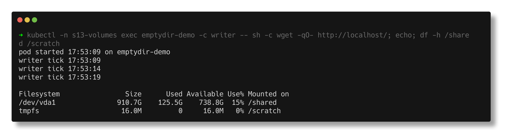
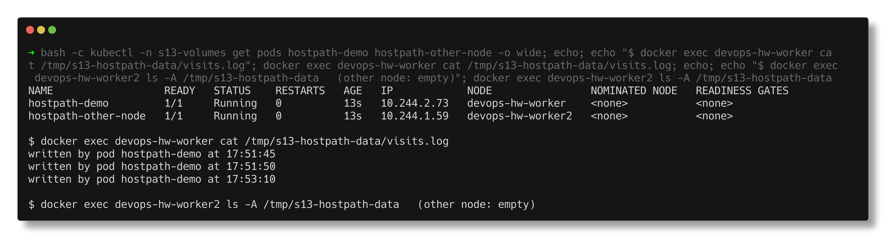
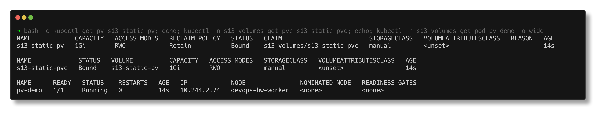
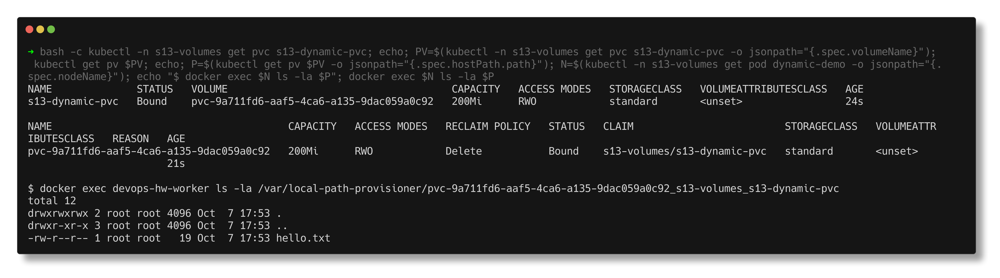
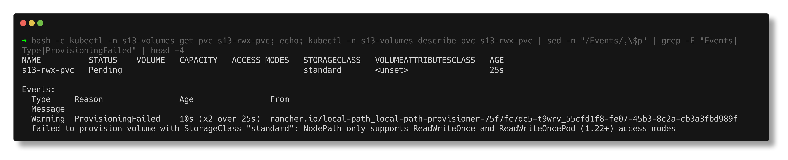

# Task 1 - Kubernetes Volumes

> **Submitted by:** Pratyush Mohanty  |  **Roll No.:** 24BCS10238

**Form field:** Kubernetes Storage, HPA & Probes · **Course session:** `session-13-storage-hpa-probes`

Run it: `./run.sh` (or one part: `./run.sh emptydir|hostpath|static|dynamic|retain|access`, then `./run.sh cleanup`)
Verified output: [output.md](output.md) - a real run against the 3-node kind cluster, Kubernetes v1.37.0, namespace `s13-volumes`.

| Manifest | What it shows |
|---|---|
| [emptydir-pod.yaml](emptydir-pod.yaml) | Two containers sharing one `emptyDir`, plus a RAM-backed (`medium: Memory`) one |
| [hostpath-pod.yaml](hostpath-pod.yaml) | Same `hostPath` on two different nodes |
| [static-pv.yaml](static-pv.yaml) / [static-pvc.yaml](static-pvc.yaml) / [pv-pod.yaml](pv-pod.yaml) | Static provisioning: a hand-made PV, a claim, a pod |
| [static-pvc-trap.yaml](static-pvc-trap.yaml) | A claim that silently ignores the hand-made PV |
| [dynamic-pvc.yaml](dynamic-pvc.yaml) / [dynamic-pod.yaml](dynamic-pod.yaml) | Dynamic provisioning through the `standard` StorageClass |
| [storageclass-retain.yaml](storageclass-retain.yaml) | My own StorageClass with `reclaimPolicy: Retain` |
| [rwx-pvc.yaml](rwx-pvc.yaml) | Asking local-path for `ReadWriteMany` |

---

## The one idea behind all of it

A container's own filesystem is thrown away every time the container restarts.
A **volume** is storage whose lifetime is decoupled from the container. The
only real question for each volume type is **how long does it live, and where?**

| Type | Lives as long as | Where the bytes are | Survives pod delete? | Follows the pod to another node? |
|---|---|---|---|---|
| `emptyDir` | the pod | node disk (or RAM with `medium: Memory`) | no | n/a |
| `hostPath` | the node | a directory on that node | yes | **no** |
| PV + PVC | the PV object (and its reclaim policy) | whatever backs the PV | yes | depends on the backend |

---

## 1. emptyDir

Created empty when the pod is scheduled, deleted when the pod is removed.
Every container in the pod can mount it, which makes it the standard way for a
sidecar and a main container to hand files to each other.

In `emptydir-pod.yaml` a busybox `writer` appends to `/shared/index.html` and an
nginx `web` container serves the same volume as its document root:

```text
$ kubectl exec emptydir-demo -c writer -- wget -qO- http://localhost/
  pod started 17:51:29 on emptydir-demo
  writer tick 17:51:29
  writer tick 17:51:34
```

`localhost` works because containers in a pod also share one network namespace.

**Where it lives** - a directory under the pod's UID on the node:

```text
$ docker exec devops-hw-worker ls /var/lib/kubelet/pods/<pod-uid>/volumes/kubernetes.io~empty-dir/
  ram-scratch
  shared
```

**`medium: Memory`** turns it into a tmpfs. Fast, but it counts against the
container's memory limit, so give it a `sizeLimit`:

```text
  Filesystem                Size      Used Available Use% Mounted on
  /dev/vda1               910.7G    121.3G    743.1G  14% /shared
  tmpfs                    16.0M         0     16.0M   0% /scratch
```

**Container restart vs pod delete** - the run stops nginx inside `web` (the
kubelet restarts that container) and then deletes the whole pod:

```text
STEP 4 - emptyDir SURVIVES a container restart
NAME            READY       WEB-RESTARTS
emptydir-demo   true,true   1
first line after : pod started 17:51:29 on emptydir-demo      <- same file

STEP 5 - emptyDir is LOST when the pod is deleted
first line now : pod started 17:51:43 on emptydir-demo        <- new file
  ls: cannot access '/var/lib/kubelet/pods/<old-uid>': No such file or directory
```

Use it for caches, scratch space, and sidecar hand-off. Never for data you need.



## 2. hostPath

Mounts a directory of the **node** into the pod. On kind a node is a Docker
container, so the path lives inside `devops-hw-worker`, not on the Mac, and can
be read with `docker exec`:

```text
$ docker exec devops-hw-worker cat /tmp/s13-hostpath-data/visits.log
  written by pod hostpath-demo at 17:51:45
  written by pod hostpath-demo at 17:51:50      <- written by the re-created pod
```

It survived a pod delete. But the second pod, same `hostPath`, on `devops-hw-worker2`:

```text
$ kubectl exec hostpath-other-node -- ls -la /host-data
  total 4
  drwxr-xr-x    2 root     root            40 Oct  7 17:51 .
  drwxr-xr-x    1 root     root          4096 Oct  7 17:51 ..
```

Empty - a different directory on a different machine. hostPath data is tied to
one node, and the pod gets direct access to the node's filesystem, which is why
the Pod Security `baseline` and `restricted` levels forbid it. Its real use is
node agents (log shippers reading `/var/log`, the CNI, kube-proxy), not apps.



## 3. PersistentVolume and PersistentVolumeClaim

These split storage into two roles:

- **PersistentVolume (PV)** - a piece of storage that exists in the cluster.
  Cluster-scoped, usually created by an admin or a provisioner. Has a size,
  access modes, a reclaim policy and a backend (here `hostPath`; in a cloud an
  EBS volume, a GCE PD, an NFS export...).
- **PersistentVolumeClaim (PVC)** - a request for storage, made by an app.
  Namespaced. Says "I need 500Mi, RWO, of class X". The pod only ever names
  the claim, so the same pod YAML works on any cluster.

The control plane binds a claim to a matching PV, **1:1**.

```text
NAME            CAPACITY   ACCESS MODES   RECLAIM POLICY   STATUS      CLAIM   STORAGECLASS
s13-static-pv   1Gi        RWO            Retain           Available           manual

$ kubectl apply -f static-pvc.yaml
s13-static-pv   1Gi        RWO            Retain           Bound    s13-volumes/s13-static-pvc   manual
s13-static-pvc  Bound      s13-static-pv  1Gi              RWO      manual
```

The claim asked for 500Mi and got 1Gi: it binds a whole PV, the smallest one
that fits.

**The PV's nodeAffinity steers the pod.** `pv-pod.yaml` has no nodeSelector,
yet the pod landed on `devops-hw-worker`, because the hostPath PV says it only
exists there. Without that `nodeAffinity` the scheduler could have put the pod
on worker2 and silently handed it an empty directory.

**Data outlives the pod:**

```text
  order #1001 saved at 17:51:58 by pv-demo
deleting the pod...
new pod started; reading the file:
  order #1001 saved at 17:51:58 by pv-demo
```



### The default-StorageClass trap

Before the real claim, the run applies the same claim **without**
`storageClassName`:

```text
NAME           STATUS    VOLUME   CAPACITY   ACCESS MODES   STORAGECLASS
s13-trap-pvc   Pending                                      standard
  PV still: s13-static-pv   1Gi   RWO   Retain   Available         manual
```

The `DefaultStorageClass` admission plugin filled in `standard`, so the claim
went off to wait for dynamic provisioning and never looked at my PV. To bind a
hand-made PV the claim must name the same class (or `""` for "no class").

## 4. Reclaim policy

What happens to the PV and its data when the **claim** is deleted:

| Policy | PV after the claim is deleted | Data |
|---|---|---|
| `Retain` | `Released`, kept, cannot be re-bound until an admin clears `claimRef` | kept |
| `Delete` | deleted by the provisioner | deleted |
| `Recycle` | deprecated, do not use | wiped |

Static PV with `Retain`:

```text
s13-static-pv   1Gi   RWO   Retain   Released   s13-volumes/s13-static-pvc   manual
  still on the node: order #1001 saved at 17:51:58 by pv-demo
  claimRef -> s13-volumes/s13-static-pvc
```

## 5. StorageClass

A StorageClass is a **recipe for making PVs**: which provisioner, with what
parameters, what reclaim policy, and when to bind. kind ships one:

```text
NAME                 PROVISIONER             RECLAIMPOLICY   VOLUMEBINDINGMODE      ALLOWVOLUMEEXPANSION
standard (default)   rancher.io/local-path   Delete          WaitForFirstConsumer   false
```

- `provisioner` - the controller that creates the actual storage. On EKS this
  would be `ebs.csi.aws.com`; here it is local-path, which makes a directory
  on a node.
- `reclaimPolicy` - copied onto every PV it creates. `Delete` by default.
- `volumeBindingMode: WaitForFirstConsumer` - do not create the volume until a
  pod using the claim is scheduled. For node-local or zonal storage this is
  essential, otherwise the volume could be made in a zone/node the pod cannot
  reach. `Immediate` creates it at claim time.

I also created my own class, [storageclass-retain.yaml](storageclass-retain.yaml):
the same provisioner with `reclaimPolicy: Retain`. Deleting its claim left the
PV `Released` and the file still on the node:

```text
pvc-9946c663-...   100Mi   RWO   Retain   Released   s13-volumes/s13-retain-pvc   s13-local-retain
$ docker exec devops-hw-worker cat /var/local-path-provisioner/pvc-9946c663-..._s13-volumes_s13-retain-pvc/keep.txt
  important data
```

To throw a retained volume away on purpose, patch it to `Delete` and the
provisioner cleans up both the PV and the directory (step 20 of the output).

## 6. Dynamic provisioning

Nobody writes a PV. The claim names a class, the class's provisioner creates
the PV. With `WaitForFirstConsumer` the claim first sits in Pending, and that
is correct, not an error:

```text
s13-dynamic-pvc   Pending                                      standard
REASON                 MESSAGE
WaitForFirstConsumer   waiting for first consumer to be created before binding
```

Then the pod is created and a PV appears:

```text
s13-dynamic-pvc   Bound    pvc-0e31a6df-2f06-4b91-b40b-45008e6762b0   200Mi   RWO   standard
pvc-0e31a6df-...   200Mi   RWO   Delete   Bound   s13-volumes/s13-dynamic-pvc   standard

  pod node : devops-hw-worker
  PV path  : /var/local-path-provisioner/pvc-0e31a6df-..._s13-volumes_s13-dynamic-pvc
  PV node  : devops-hw-worker
```

Data survived a pod delete, then deleting the claim removed everything, because
the class says `Delete`:

```text
  Error from server (NotFound): persistentvolumes "pvc-0e31a6df-..." not found
  ls: cannot access '/var/local-path-provisioner/pvc-0e31a6df-...': No such file or directory
```



## 7. Access modes

| Mode | Short | Meaning |
|---|---|---|
| ReadWriteOnce | RWO | read-write by pods on **one node** (several pods on that node may share it) |
| ReadOnlyMany | ROX | read-only by pods on many nodes |
| ReadWriteMany | RWX | read-write by pods on many nodes - needs NFS, CephFS, EFS, Azure Files... |
| ReadWriteOncePod | RWOP | read-write by exactly **one pod** in the cluster |

The access mode is a promise the storage backend has to keep, and local-path
cannot keep RWX - it says so:

```text
s13-rwx-pvc   Pending                                      standard
rwx-demo      0/1     Pending   0          0s
ProvisioningFailed   failed to provision volume with StorageClass "standard": NodePath only supports ReadWriteOnce and ReadWriteOncePod (1.22+) access modes
```

A common misreading: RWO is per **node**, not per pod. Two replicas on the same
node can both mount an RWO volume, which is exactly what the
[mini-project](../04-mini-project/README.md) ends up doing.



---

## Notes from actually running this

- **The first PV delete hung forever.** My first `cleanup` deleted the PV while
  a pod still used its claim; the PV sat in `Terminating` because of the
  `kubernetes.io/pv-protection` finalizer. Correct order is pods, then claims,
  then PVs. `run.sh cleanup` now does that.
- **Pod Ready is not "my command has run".** The re-created hostPath pod was
  Ready before its `echo` had executed, so the first capture showed only one
  line and looked like the file had not survived. The script now waits for the
  second line before printing.
- **busybox ignores SIGTERM.** A `sh -c 'sleep 3600'` container takes the full
  30 s grace period to delete. `terminationGracePeriodSeconds: 2` on the demo
  pods cut every delete step from 30 s to about 2 s.
- **The old pod's emptyDir directory does not vanish instantly.** The kubelet's
  housekeeping removes `/var/lib/kubelet/pods/<uid>` shortly after the pod is
  gone, so the script polls for it instead of checking once.
- Node-side cleanup is done by a short-lived pod that mounts the node's `/tmp`
  and removes only this demo's directories, so nothing is left on the nodes.

---

## Interview Q&A

**Q: emptyDir vs hostPath?**
emptyDir is created with the pod and deleted with it; it is for scratch and
for sharing files between containers of one pod. hostPath mounts an existing
node directory, outlives the pod, but is tied to that node and exposes the
node's filesystem, so it is for node agents only.

**Q: Does emptyDir survive a container crash?**
Yes. It belongs to the pod, so a container restart keeps it (shown with the
nginx restart). Only removing the pod deletes it.

**Q: PV vs PVC?**
A PV is the storage (cluster-scoped, made by an admin or a provisioner). A PVC
is a namespaced request for storage. A pod mounts the PVC; Kubernetes binds the
PVC to a suitable PV one-to-one.

**Q: My PVC is Pending. Why?**
With `WaitForFirstConsumer` it is normal until a pod uses it. Otherwise: no PV
matches (size, access mode, class), no default StorageClass, the provisioner
cannot satisfy the access mode, or the claim got the default class when you
meant to bind a static PV. `kubectl describe pvc` shows which.

**Q: What does a StorageClass do?**
It describes how to create PVs on demand: the provisioner, its parameters, the
reclaim policy and the binding mode. Claims that name it get a PV created for
them - dynamic provisioning.

**Q: Retain vs Delete?**
On claim deletion `Delete` removes the PV and the underlying storage; `Retain`
keeps both and marks the PV `Released` for an admin to recover or clean up. Use
Retain (or backups) for anything you cannot afford to lose.

**Q: Why WaitForFirstConsumer?**
So the volume is created where the pod can use it - on the pod's node for local
storage, in the pod's zone for cloud disks. With `Immediate` the volume might be
created in a zone the pod can never be scheduled to.

**Q: Can two pods share an RWO volume?**
Yes, if they run on the same node. RWO limits nodes, not pods. Use RWOP to
limit it to a single pod.

**Q: How do you share a volume between pods on different nodes?**
You need RWX-capable storage: NFS, CephFS, EFS, Azure Files, or a CSI driver
that supports it. A node-local disk or a block device like EBS cannot.
