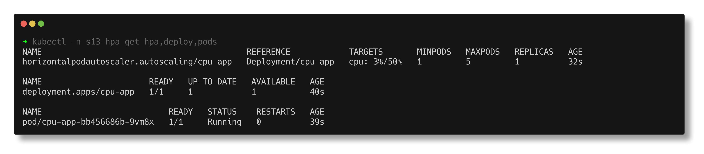
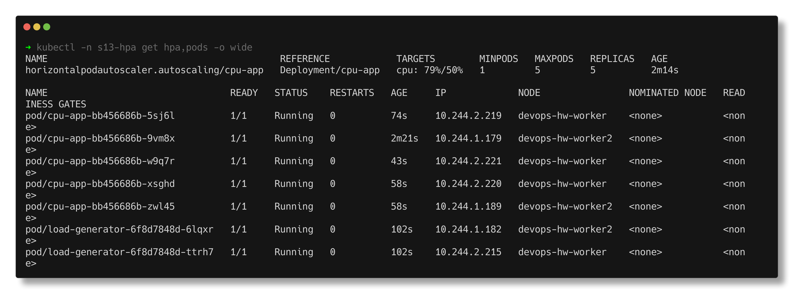
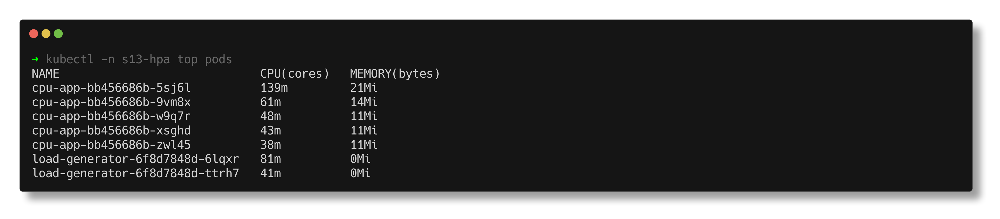
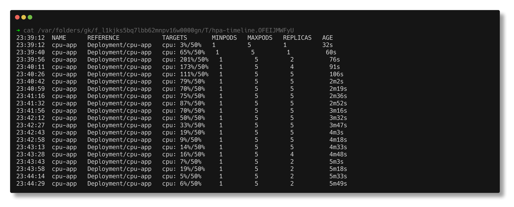
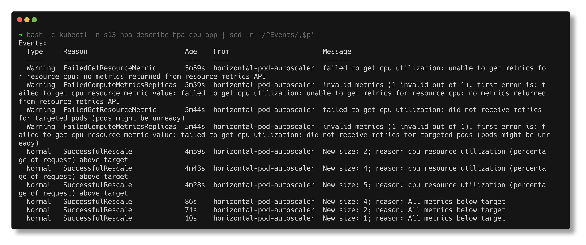

# Task 2 - HPA Hands-on

> **Submitted by:** Pratyush Mohanty  |  **Roll No.:** 24BCS10238

**Form field:** Kubernetes Storage, HPA & Probes · **Course session:** `session-13-storage-hpa-probes`

Run it: `./install-metrics-server.sh` once, then `./run.sh` (about 7 minutes), then `./run.sh cleanup`
Verified output: [output.md](output.md) (HPA run) and [metrics-server-output.md](metrics-server-output.md) (metrics-server install), real runs on the kind cluster, namespace `s13-hpa`.

| File | What it is |
|---|---|
| [hpa.yml](hpa.yml) | The HorizontalPodAutoscaler: CPU target 50%, 1-5 replicas, 60 s scale-down window |
| [deployment.yaml](deployment.yaml) | `cpu-app`: a small Python HTTP server that burns ~20-30 ms of CPU per request; `requests.cpu: 100m` |
| [service.yaml](service.yaml) | ClusterIP `cpu-app`, port 80 -> 8080 |
| [load-generator.yaml](load-generator.yaml) | 2 busybox pods looping `wget http://cpu-app` |
| [install-metrics-server.sh](install-metrics-server.sh) | metrics-server v0.9.0 + the kind-only `--kubelet-insecure-tls` flag |
| [run.sh](run.sh) | deploy, configure, verify, load, observe, stop, observe, report |

---

## 1. How the HPA decides

```text
  pods --(cAdvisor in kubelet)--> metrics-server --(metrics.k8s.io API)--> HPA controller
                                                                              |
     every 15 s:  desired = ceil( currentReplicas x currentUtilisation / target )
                                                                              |
                                                       Deployment .spec.replicas
```

Utilisation is a percentage of the container's **CPU request**, not of the
node and not of the limit. `cpu-app` requests `100m`, so the 50% target means
"keep the average pod at 50m". No request, no percentage: the HPA shows
`<unknown>` forever.

## 2. Prerequisite: metrics-server

kind does not ship metrics-server. Before installing it
([metrics-server-output.md](metrics-server-output.md)):

```text
$ kubectl top nodes
error: Metrics API not available
```

kind's kubelets use self-signed serving certificates, so metrics-server also
needs `--kubelet-insecure-tls` (lab clusters only). After the install the
APIService is `Available` and `kubectl top` works.

## 3. Deploy the app and configure the HPA

```text
NAME                          READY   UP-TO-DATE   AVAILABLE   AGE   CONTAINERS   IMAGES               SELECTOR
deployment.apps/cpu-app       1/1     1            1           8s    app          python:3.12-alpine   app=cpu-app
service/cpu-app               ClusterIP   10.96.190.47   <none>        80/TCP    8s    app=cpu-app
```

`hpa.yml` right after `kubectl apply`, and 31 s later:

```text
NAME      REFERENCE            TARGETS              MINPODS   MAXPODS   REPLICAS   AGE
cpu-app   Deployment/cpu-app   cpu: <unknown>/50%   1         5         1          0s
cpu-app   Deployment/cpu-app   cpu: 1%/50%          1         5         1          31s
```

`<unknown>` for the first half-minute is normal: metrics-server scrapes every
15 s and needs a sample for the new pod. The HPA logged it as warnings
(`FailedGetResourceMetric ... no metrics returned from resource metrics API`)
which show up later in `describe hpa`.



## 4. Verify at rest

```text
$ kubectl top pods -n s13-hpa
NAME                      CPU(cores)   MEMORY(bytes)
cpu-app-bb456686b-9vm8x   1m           11Mi

  resource cpu on pods  (as a percentage of request):  1% (1m) / 50%
Min replicas:                                          1
Max replicas:                                          5
  Scale Down:
    Stabilization Window: 60 seconds
Conditions:
  AbleToScale     True    ReadyForNewScale    recommended size matches current size
  ScalingActive   True    ValidMetricFound    the HPA was able to successfully calculate a replica count ...
```

## 5. Load, CPU and scaling

Two load-generator pods start hitting the Service. Sampled every 15 s:

```text
[23:39:28] cpu 3% of request (target 50%)     replicas current=1 desired=1
[23:39:43] cpu 65% of request (target 50%)    replicas current=1 desired=2
[23:39:59] cpu 201% of request (target 50%)   replicas current=2 desired=4
[23:40:14] cpu 173% of request (target 50%)   replicas current=4 desired=5
             cpu-app-bb456686b-5sj6l   156m   19Mi
             cpu-app-bb456686b-9vm8x   191m   17Mi
[23:40:30] cpu 111% of request (target 50%)   replicas current=5 desired=5
reached 5 replicas in about 142s of load
```

Working the formula on the real numbers:

- **1 -> 2:** `ceil(1 x 65 / 50) = 2`.
- **2 -> 4, not 2 -> 5:** the pod at 201% was the only one with metrics; the
  brand-new second pod had none yet. On scale-up the HPA counts pods without
  metrics as **0%**, so it used `(201 + 0) / 2 = ~100%` and got
  `ceil(2 x 100 / 50) = 4`. It is deliberately cautious with pods it cannot see.
- **4 -> 5:** `ceil(4 x 173 / 50) = 14`, clamped to `maxReplicas: 5`.

At 5 replicas the average was still above target, and the HPA said so:

```text
NAME      REFERENCE            TARGETS        MINPODS   MAXPODS   REPLICAS   AGE
cpu-app   Deployment/cpu-app   cpu: 87%/50%   1         5         5          2m55s

  ScalingLimited  True    TooManyReplicas   the desired replica count is more than the maximum replica count
```

`kubectl get pods` and `kubectl top pods` in the scaled-up state:

```text
cpu-app-bb456686b-5sj6l          1/1     Running   0          115s    10.244.2.219   devops-hw-worker
cpu-app-bb456686b-9vm8x          1/1     Running   0          3m2s    10.244.1.179   devops-hw-worker2
cpu-app-bb456686b-w9q7r          1/1     Running   0          84s     10.244.2.221   devops-hw-worker
cpu-app-bb456686b-xsghd          1/1     Running   0          99s     10.244.2.220   devops-hw-worker
cpu-app-bb456686b-zwl45          1/1     Running   0          99s     10.244.1.189   devops-hw-worker2

NAME                             CPU(cores)   MEMORY(bytes)
cpu-app-bb456686b-5sj6l          61m          21Mi
cpu-app-bb456686b-9vm8x          108m         16Mi
cpu-app-bb456686b-w9q7r          61m          11Mi
cpu-app-bb456686b-xsghd          68m          12Mi
cpu-app-bb456686b-zwl45          63m          12Mi
load-generator-6f8d7848d-6lqxr   31m          0Mi
load-generator-6f8d7848d-ttrh7   51m          0Mi
```

The same load that pinned one pod at its 200m limit is now spread over five,
and the new pods were placed on both workers.





## 6. Stop the load, watch it scale down

```text
[23:41:56] cpu 70% of request (target 50%)   replicas current=5 desired=5
[23:42:28] cpu 33% of request (target 50%)   replicas current=5 desired=5
[23:42:59] cpu 9% of request (target 50%)    replicas current=5 desired=5
[23:43:15] cpu 14% of request (target 50%)   replicas current=5 desired=4
[23:43:31] cpu 16% of request (target 50%)   replicas current=4 desired=2
[23:43:46] cpu 7% of request (target 50%)    replicas current=2 desired=2
[23:44:32] cpu 6% of request (target 50%)    replicas current=2 desired=1
```

Scale-down is slow on purpose. For scale-down the HPA uses the **highest**
recommendation from the last `stabilizationWindowSeconds`, so a short dip in
traffic cannot remove pods that will be needed again a minute later. CPU fell
gradually (metrics are rates over a scrape window), so the 60 s window let the
count step down 5 -> 4 -> 2 -> 1 instead of jumping.

**The default window is 300 s.** I set 60 s in `hpa.yml` only so the demo fits
in a few minutes. With the default, nothing would have happened for 5 minutes
after the load stopped - the [mini project](../04-mini-project/README.md) uses
the default and shows exactly that. Scale-up has no window by default, which is
the right asymmetry: add capacity fast, remove it slowly.

## 7. The `kubectl get hpa -w` timeline

A timestamped watch ran in the background for the whole test:

```text
23:39:12  cpu-app   Deployment/cpu-app   cpu: 3%/50%     1   5   1   32s
23:39:40  cpu-app   Deployment/cpu-app   cpu: 65%/50%    1   5   1   60s
23:39:56  cpu-app   Deployment/cpu-app   cpu: 201%/50%   1   5   2   76s
23:40:11  cpu-app   Deployment/cpu-app   cpu: 173%/50%   1   5   4   91s
23:40:26  cpu-app   Deployment/cpu-app   cpu: 111%/50%   1   5   5   106s
...
23:42:58  cpu-app   Deployment/cpu-app   cpu: 9%/50%     1   5   5   4m18s
23:43:28  cpu-app   Deployment/cpu-app   cpu: 16%/50%    1   5   4   4m48s
23:43:43  cpu-app   Deployment/cpu-app   cpu: 7%/50%     1   5   2   5m3s
```

(Full, unabridged timeline in step 10 of [output.md](output.md).)



## 8. `kubectl describe hpa` - the HPA's own record

```text
Events:
  Warning  FailedGetResourceMetric       5m59s  ...  unable to get metrics for resource cpu: no metrics returned from resource metrics API
  Warning  FailedGetResourceMetric       5m44s  ...  did not receive metrics for targeted pods (pods might be unready)
  Normal   SuccessfulRescale             4m59s  ...  New size: 2; reason: cpu resource utilization (percentage of request) above target
  Normal   SuccessfulRescale             4m43s  ...  New size: 4; reason: cpu resource utilization (percentage of request) above target
  Normal   SuccessfulRescale             4m28s  ...  New size: 5; reason: cpu resource utilization (percentage of request) above target
  Normal   SuccessfulRescale             86s    ...  New size: 4; reason: All metrics below target
  Normal   SuccessfulRescale             71s    ...  New size: 2; reason: All metrics below target
  Normal   SuccessfulRescale             10s    ...  New size: 1; reason: All metrics below target
```



---

## Notes from actually running this

- **`registry.k8s.io/hpa-example` does not run here.** It is the image the
  Kubernetes docs use, but its manifest is amd64-only and these kind nodes are
  arm64 (Apple Silicon). Rather than rely on emulation I wrote the equivalent:
  a few lines of Python that do a `sqrt` loop per request.
- **No `replicas:` in deployment.yaml.** Once an HPA manages a Deployment, a
  `replicas` field in the manifest fights it: every `kubectl apply` resets the
  count and the HPA has to scale again.
- **Utilisation can exceed 100%.** 201% simply means 201m used against a 100m
  request; the limit (200m) is what caps it.
- **The cluster was shared** with other workloads during the run (step 1 shows
  the control-plane at 4596m), so per-pod CPU under load moved around between
  samples. The HPA still converged, which is the point of averaging.
- **Two runs, two scale-down shapes.** In my first run the CPU dropped to ~6%
  within one scrape and the HPA went 5 -> 1 in a single step exactly 60 s
  later. In the run captured here the CPU fell more gradually and it stepped
  5 -> 4 -> 2 -> 1. Same config; the window takes the max of whatever
  recommendations it saw, so the shape follows the shape of the metric.
- My first run also printed a stray `Terminated: 15 ...` line when the script
  killed its background `kubectl get hpa -w`. That is bash reporting a killed
  job; `disown` on the watcher removed it.
- `kubectl` prints the TARGETS column as `cpu: 87%/50%` (with a space), so the
  script reads `.status.currentMetrics` with jsonpath rather than splitting
  columns.

---

## Interview Q&A

**Q: What does the HPA need to work?**
A metrics source (metrics-server for CPU/memory), a `scaleTargetRef` that
supports the scale subresource (Deployment, StatefulSet, ReplicaSet), and for
`Utilization` targets a resource request on the containers.

**Q: HPA shows `<unknown>/50%`. Why?**
No metrics yet (first ~30 s), metrics-server missing or unhealthy
(`kubectl top pods` fails), or the containers have no CPU request.

**Q: How does it calculate the replica count?**
`desired = ceil(current x currentMetric / target)`, every 15 s, ignoring
changes within a 10% tolerance, clamped to min/max and to the scaling policies.

**Q: Why did it go 2 -> 4 and not straight to 5?**
New pods without metrics count as 0% on scale-up, and the default scale-up
policy allows at most +4 pods or +100% per 15 s. Both make scale-up stepwise.

**Q: Why is scale-down slow?**
The default `scaleDown.stabilizationWindowSeconds` is 300: the HPA keeps the
highest recommendation of the last 5 minutes so it does not flap. Tune it with
`spec.behavior`.

**Q: HPA vs VPA vs Cluster Autoscaler?**
HPA changes the number of pods. VPA changes the requests/limits of pods.
Cluster Autoscaler (or Karpenter) adds nodes when pods cannot be scheduled. An
HPA scale-up can trigger the Cluster Autoscaler if the new pods do not fit.

**Q: Can you scale on something other than CPU?**
Yes - memory, custom metrics (requests per second via Prometheus Adapter) and
external metrics (queue length). KEDA builds on this for event-driven scaling.

**Q: Should HPA and VPA both act on CPU for the same Deployment?**
No. They fight: VPA raises the request, which lowers utilisation, which makes
the HPA scale in. Use them on different metrics or not together.
