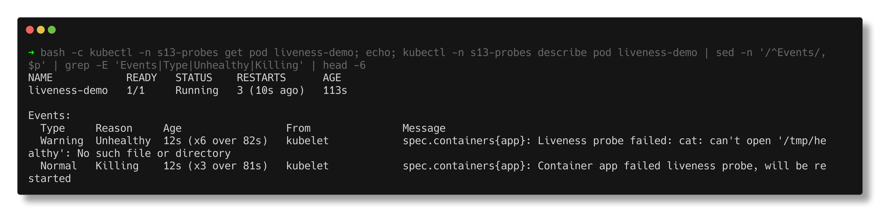
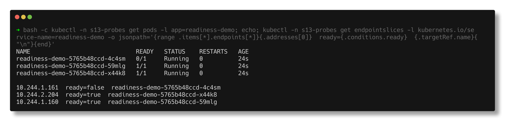
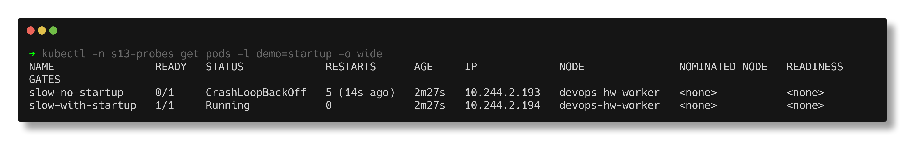

# Probes - Liveness, Readiness, Startup

> **Submitted by:** Pratyush Mohanty  |  **Roll No.:** 24BCS10238

**Form field:** Kubernetes Storage, HPA & Probes · **Course session:** `session-13-storage-hpa-probes`

Run it: `./run.sh` (or `./run.sh liveness|readiness|startup`, then `./run.sh cleanup`)
Verified output: [output.md](output.md) - a real run on the kind cluster, namespace `s13-probes`.

| Probe | Question the kubelet asks | On failure | Manifest |
|---|---|---|---|
| **Liveness** | Is this container still working? | **restart** the container | [liveness.yaml](liveness.yaml) |
| **Readiness** | Should it get traffic right now? | **remove** the pod from Service endpoints (no restart) | [readiness.yaml](readiness.yaml) |
| **Startup** | Has it finished starting? | restart it, but only after the whole startup budget; until it passes, liveness and readiness are **off** | [startup.yaml](startup.yaml) |

Each probe can be `httpGet` (2xx/3xx = pass), `tcpSocket` (port accepts a
connection), `exec` (exit code 0) or `grpc`. Timing is `initialDelaySeconds`,
`periodSeconds`, `timeoutSeconds` and `failureThreshold`: a probe acts only after
`failureThreshold` failures in a row.

---

## 1. Liveness - restart count going up

[liveness.yaml](liveness.yaml) is a busybox app that is healthy for 20 s after
each start and then "hangs" (its health file disappears, the process keeps
running). Probe: `cat /tmp/healthy` every 5 s, 2 misses in a row = restart.

```text
  t(s)     RESTARTS STATUS             READY
  0        0        Running            true
  33       0        Running            true
  41       1        Running            true
  76       2        Running            true
  110      3        Running            true
```

The kubelet's own record of why:

```text
Warning   Unhealthy   6       Liveness probe failed: cat: can't open '/tmp/healthy': No such file or directory
Normal    Killing     3       Container app failed liveness probe, will be restarted
  lastState: reason=Error exitCode=137
```

Exit code 137 = 128 + SIGKILL: the kubelet killed it, the app did not crash.
`kubectl logs --previous` shows the killed container was mid-"hang":

```text
  18:04:58 started, healthy
  18:05:18 simulating a hang: health file removed
```

A restart roughly every 35 s: 20 s healthy, then two failed probes 5 s apart,
then the kill and a fresh container (new `/tmp`, so healthy again). This is the
whole value of liveness: a process that is running but useless (deadlock,
stuck event loop) never exits by itself, so without the probe nothing would
ever restart it.



## 2. Readiness - removed from the Service, not restarted

[readiness.yaml](readiness.yaml): 3 nginx pods, each serving its own hostname,
ready only while `/ready` exists. A curl pod sends 30 requests through the
Service before and after one pod's `/ready` file is deleted:

```text
before:
    11 readiness-demo-5765b48ccd-4c4sm
     7 readiness-demo-5765b48ccd-59mlg
    12 readiness-demo-5765b48ccd-x44k8

$ kubectl exec readiness-demo-5765b48ccd-4c4sm -- rm /usr/share/nginx/html/ready
NAME                              READY   STATUS    RESTARTS   AGE
readiness-demo-5765b48ccd-4c4sm   0/1     Running   0          22s

  10.244.1.161  ready=false  readiness-demo-5765b48ccd-4c4sm
  10.244.2.204  ready=true  readiness-demo-5765b48ccd-x44k8
  10.244.1.160  ready=true  readiness-demo-5765b48ccd-59mlg

after:
    16 readiness-demo-5765b48ccd-59mlg
    14 readiness-demo-5765b48ccd-x44k8
```

`Running`, `RESTARTS 0`, but `0/1` and `ready=false` in the EndpointSlice, so
kube-proxy stops sending it traffic. Put the file back and it rejoins with no
one touching the Service (10/10/10 in step 6).

The events also caught something I had not planned: a `connection refused`
readiness failure in the first second of each pod's life, before nginx was
listening. That is readiness doing its job at startup too - a pod is not added
to the Service until it actually answers.



## 3. Startup - protecting a slow starter

[startup.yaml](startup.yaml) runs the same slow app twice: 30 s of warm-up
before nginx listens. Both have the same liveness probe (3 x 5 s = 15 s
budget). Only the second has a startup probe (12 x 5 s = 60 s budget).

```text
NAME                READY   STATUS             RESTARTS      AGE
slow-no-startup     0/1     CrashLoopBackOff   5 (14s ago)   2m27s
slow-with-startup   1/1     Running            0             2m27s
```

```text
--- slow-no-startup ---
Unhealthy   18      Liveness probe failed: Get "http://10.244.2.193:80/": dial tcp 10.244.2.193:80: connect: connection refused
Killing     6       Container web failed liveness probe, will be restarted
  previous container log: 18:05:46 warming up (30s)...

--- slow-with-startup ---
Unhealthy   6       Startup probe failed: Get "http://10.244.2.194:80/": dial tcp 10.244.2.194:80: connect: connection refused
  log: 18:03:49 warming up (30s)...
  log: 18:04:19 ready, starting nginx
```

The first pod is killed 15 s into a 30 s warm-up, every time, so it never
starts at all. The second fails its startup probe 6 times (30 s), passes, and
only then does liveness begin. The old workaround was a large
`initialDelaySeconds` on liveness, which also delays detecting a real hang
for the whole life of the pod; a startup probe costs nothing after startup.



---

## Notes from actually running this

- **Liveness kills look like crashes in `kubectl get pods`.** Only `describe`
  (`Killing ... failed liveness probe`) and `lastState.exitCode: 137` show it
  was the kubelet. In an incident, check events before blaming the app.
- **A liveness probe that is too strict causes the outage it is meant to
  prevent.** `slow-no-startup` is a healthy app in an endless restart loop.
  The same happens if a liveness check depends on a database: the DB blips and
  every pod restarts at once.
- **Do not point liveness at dependencies; point readiness at them if
  anything.** Readiness failing only drains traffic; liveness failing restarts.
- Overriding `command` on the nginx image skips its `/docker-entrypoint.sh`.
  Fine for these demos, but it means the image's own config templating does not
  run.
- `busybox sh` ignores SIGTERM, so every pod here sets
  `terminationGracePeriodSeconds: 2`, otherwise each liveness kill waits 30 s.

---

## Interview Q&A

**Q: Liveness vs readiness?**
Liveness failing restarts the container. Readiness failing only removes the pod
from Service endpoints until it passes again. Shown here: liveness pushed
RESTARTS to 3; readiness left RESTARTS at 0 but took the pod out of the
EndpointSlice.

**Q: Why do we need a startup probe if we have initialDelaySeconds?**
`initialDelaySeconds` is a fixed guess applied once, and a big value also slows
detection of real hangs. A startup probe polls until the app is up (up to
`failureThreshold x periodSeconds`) and then hands over to liveness.

**Q: What happens if there is no readiness probe?**
The pod counts as ready as soon as its containers start, so it gets traffic
before the app is listening. The run's `connection refused` readiness events in
the first second show exactly the window that would otherwise drop requests.

**Q: A pod is Running but 0/1. What do you check?**
Readiness. `kubectl describe pod` shows `Readiness probe failed` events with the
status code or error, and the EndpointSlice shows `ready=false`.

**Q: RESTARTS keeps climbing but the logs show no error. Why?**
Likely a liveness probe kill - check events for `Killing ... failed liveness
probe` and `lastState` exit code 137. The app may be slow, the probe path or
port wrong, or the timeout too tight.

**Q: Should a liveness probe check the database?**
No. If the DB goes down every pod restarts together and the app cannot recover
when the DB returns. Liveness should check only the process itself.

**Q: What probe types exist?**
httpGet, tcpSocket, exec, and grpc.
