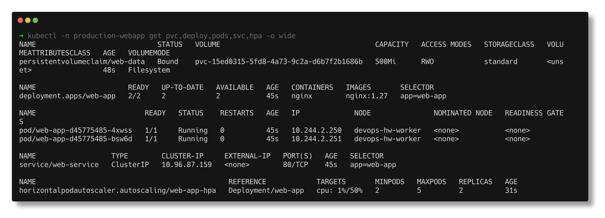
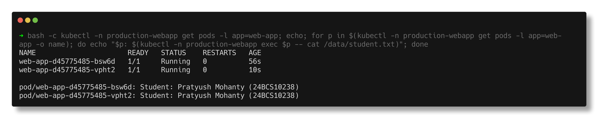
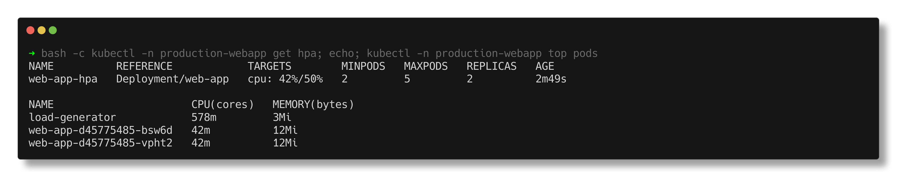
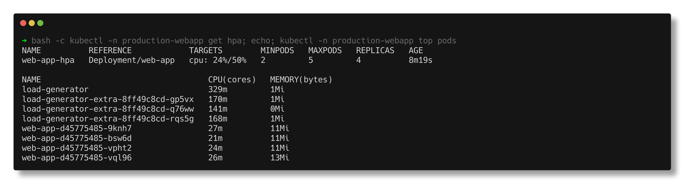
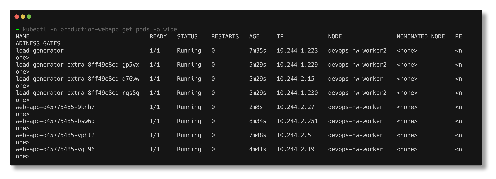
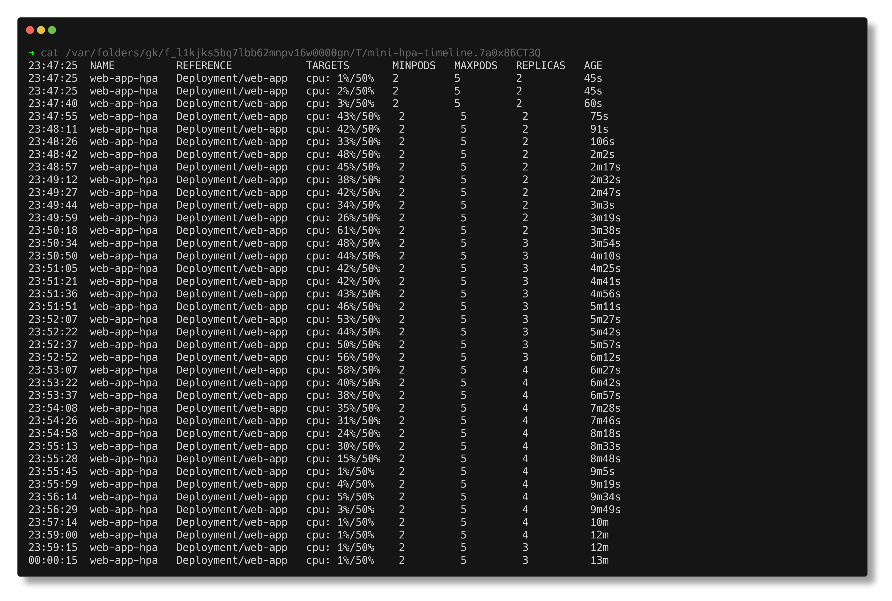
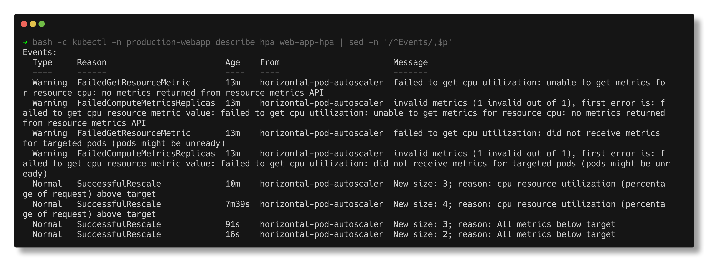
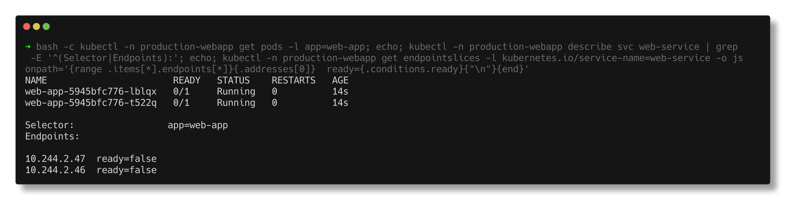
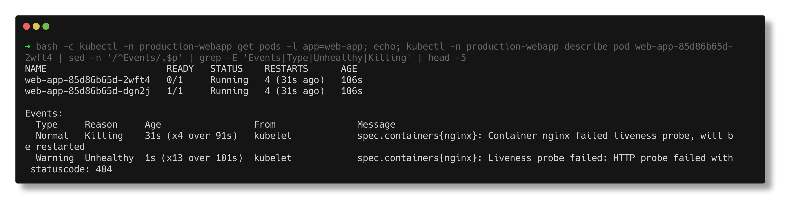

# Task 3 - Mini Project: Production-Ready Web App (PVC + HPA + Probes)

> **Submitted by:** Pratyush Mohanty  |  **Roll No.:** 24BCS10238

**Form field:** Kubernetes Storage, HPA & Probes · **Course session:** `session-13-storage-hpa-probes`

Source assignment: `session-13-storage-hpa-probes/mini-project` in the course repo.
Run it: `./run.sh` (about 20 minutes, most of it waiting for the HPA), then `./run.sh cleanup`
Verified output: [output.md](output.md) - a real run on the 3-node kind cluster (Kubernetes v1.37.0).

| File | What it is | Changed from the course? |
|---|---|---|
| [namespace.yaml](namespace.yaml) | `production-webapp` | no |
| [pvc.yaml](pvc.yaml) | `web-data`, 500Mi, RWO, default StorageClass | comments only |
| [deployment.yaml](deployment.yaml) | `web-app`: nginx:1.27, 2 replicas, `Recreate`, requests/limits, `/data` on the PVC, startup + readiness + liveness probes | comments only |
| [service.yaml](service.yaml) | `web-service`, ClusterIP 80 -> 80 | no |
| [hpa.yaml](hpa.yaml) | `web-app-hpa`: 2-5 replicas at 50% CPU, default behaviour | no |
| [load-generator.yaml](load-generator.yaml) | the course's `kubectl run load-generator ...` as a manifest | same command |
| [load-generator-extra.yaml](load-generator-extra.yaml) | 3 more copies of the same loop | **added** - see step 4 |

```text
                      Service web-service (ClusterIP :80)
                                   |
             +---------------------+---------------------+
             v                     v                     v
       web-app pod 1         web-app pod 2   ...   web-app pod N   <- HPA: 2..5, 50% CPU
       startup/readiness/liveness probes, requests cpu 100m
             |                     |                     |
             +----------- /data ---+---------------------+
                                   |
                PVC web-data (500Mi, RWO) -> PV on devops-hw-worker
                StorageClass standard (rancher.io/local-path)
```

---

## 1. Deploy

```text
persistentvolumeclaim/web-data created
NAME       STATUS    VOLUME   CAPACITY   ACCESS MODES   STORAGECLASS
web-data   Pending                                      standard
```

Pending until a pod uses it - `standard` is `WaitForFirstConsumer`. Then the
Deployment and Service:

```text
NAME                      READY   STATUS    RESTARTS   AGE   IP             NODE
web-app-d45775485-4xwss   1/1     Running   0          13s   10.244.2.250   devops-hw-worker
web-app-d45775485-bsw6d   1/1     Running   0          13s   10.244.2.251   devops-hw-worker

web-data   Bound    pvc-15ed0315-5fd8-4a73-9c2a-d6b7f2b1686b   500Mi      RWO            standard
PV pvc-15ed0315-... lives on node: devops-hw-worker

NAME          TYPE        CLUSTER-IP     EXTERNAL-IP   PORT(S)   AGE
web-service   ClusterIP   10.96.87.159   <none>        80/TCP    13s
web-service-584hp   IPv4          80      10.244.2.250,10.244.2.251   13s

NAME          REFERENCE            TARGETS       MINPODS   MAXPODS   REPLICAS   AGE
web-app-hpa   Deployment/web-app   cpu: 1%/50%   2         5         2          30s
```

**Both replicas are on the same node, and that is not a coincidence.** The PVC
is ReadWriteOnce and local-path creates the volume on one node with
`nodeAffinity`. RWO means one *node*, not one pod, so two pods can share it -
but only on that node. Every pod this Deployment ever runs, including the ones
the HPA adds later, is pinned to `devops-hw-worker`. On a real cluster with a
cloud disk (EBS, PD) the same is true: the disk attaches to one node.

That is also why the course chose `strategy: Recreate`: with a rolling update
the new pod could be scheduled to another node and hang waiting for a disk the
old pod still holds.



## 2. Task 1 - storage persistence

```text
$ kubectl exec web-app-d45775485-4xwss -- sh -c 'echo "Student: Pratyush Mohanty (24BCS10238)" > /data/student.txt'
$ kubectl exec web-app-d45775485-4xwss -- cat /data/student.txt
Student: Pratyush Mohanty (24BCS10238)

and from the OTHER replica (same PV, same node):
$ kubectl exec web-app-d45775485-bsw6d -- cat /data/student.txt
Student: Pratyush Mohanty (24BCS10238)

$ kubectl delete pod web-app-d45775485-4xwss
NAME                      READY   STATUS    RESTARTS   AGE
web-app-d45775485-bsw6d   1/1     Running   0          56s
web-app-d45775485-vpht2   1/1     Running   0          10s

$ kubectl exec web-app-d45775485-vpht2 -- cat /data/student.txt     (the replacement pod)
Student: Pratyush Mohanty (24BCS10238)
```

The pod was replaced; the data was not.



## 3. Task 2 - Service verification

```text
$ kubectl port-forward -n production-webapp svc/web-service 18080:80 &
$ curl http://localhost:18080
<!DOCTYPE html>
<html>
<head>
<title>Welcome to nginx!</title>
HTTP 200
```

I used local port 18080 rather than the course's 8080; any free local port works.

The three probes as the kubelet sees them:

```text
    Liveness:     http-get http://:80/ delay=5s timeout=2s period=5s #success=1 #failure=3
    Readiness:    http-get http://:80/ delay=5s timeout=2s period=5s #success=1 #failure=2
    Startup:      http-get http://:80/ delay=0s timeout=1s period=2s #success=1 #failure=30
```

The startup probe allows up to 30 x 2 s = 60 s to start; only after it passes
do readiness and liveness begin.

## 4. Task 3 - HPA scaling

### With the course's load generator: no scaling, and that is correct

```text
[23:47:56] cpu 43% (target 50%)   replicas current=2 desired=2
[23:48:41] cpu 48% (target 50%)   replicas current=2 desired=2
[23:49:27] cpu 42% (target 50%)   replicas current=2 desired=2

$ kubectl top pods -n production-webapp
NAME                      CPU(cores)   MEMORY(bytes)
load-generator            578m         3Mi
web-app-d45775485-bsw6d   42m          12Mi
web-app-d45775485-vpht2   42m          12Mi
```

The course README expects `110%/50%`. On this cluster one busybox loop gave
nginx 33-48% for two minutes. Serving a static page costs nginx almost
nothing, and look at the load generator: **578m** - forking a new `wget` for
every request costs far more CPU than nginx answering it. The HPA only acts
when `current / target` is outside `1.0 +/- 0.1`, so it rightly did nothing.



### With three more copies of the loop

[load-generator-extra.yaml](load-generator-extra.yaml) adds 3 more of the same
loop:

```text
[23:50:32] cpu 61% (target 50%)   replicas current=2 desired=3
[23:50:47] cpu 48% (target 50%)   replicas current=3 desired=3
[23:52:21] cpu 53% (target 50%)   replicas current=3 desired=3
[23:53:06] cpu 56% (target 50%)   replicas current=3 desired=4
[23:53:22] cpu 58% (target 50%)   replicas current=4 desired=4
[23:54:57] cpu 31% (target 50%)   replicas current=4 desired=4

4 replicas after 320s of the heavier load
```

Each step happened only when the average went clearly above 55% (outside the
tolerance): `ceil(2 x 61 / 50) = 3`, `ceil(3 x 56 / 50) = 4`. 53% at 3
replicas gives a ratio of 1.06, inside the tolerance, so nothing changed. With
4 pods each sat around 25m and it never needed the 5th.

```text
web-app-d45775485-9knh7   1/1   Running   0   2m6s    10.244.2.27    devops-hw-worker
web-app-d45775485-bsw6d   1/1   Running   0   8m32s   10.244.2.251   devops-hw-worker
web-app-d45775485-vpht2   1/1   Running   0   7m46s   10.244.2.5     devops-hw-worker
web-app-d45775485-vql96   1/1   Running   0   4m39s   10.244.2.19    devops-hw-worker

nodes of the web-app pods (the PV lives on devops-hw-worker):
     4 devops-hw-worker
```

The HPA's new pods followed the volume to `devops-hw-worker`, as predicted in
section 1. The load generators, which have no volume, spread over both workers.





### Stop the load: the default 5-minute scale-down window

`hpa.yaml` has no `behavior`, so the default `stabilizationWindowSeconds: 300`
applies (compare [02-hpa](../02-hpa/README.md), where I shortened it to 60 s):

```text
[23:55:22] cpu 30% (target 50%)   replicas current=4 desired=4
[23:56:05] cpu 4% (target 50%)    replicas current=4 desired=4
[23:57:26] cpu 1% (target 50%)    replicas current=4 desired=4
[23:58:47] cpu 1% (target 50%)    replicas current=4 desired=4
[23:59:07] cpu 1% (target 50%)    replicas current=4 desired=3
[23:59:27] cpu 1% (target 50%)    replicas current=3 desired=3
[00:00:28] cpu 1% (target 50%)    replicas current=3 desired=2

back to 2 replicas 326s after the load stopped
```

CPU was at 1-4% from 23:56 onwards, yet nothing happened until 23:59: the HPA
was still honouring the highest recommendation (4) from the last 5 minutes.
Then it stepped down to `minReplicas: 2`. The HPA's own record:

```text
  Normal   SuccessfulRescale   10m     New size: 3; reason: cpu resource utilization (percentage of request) above target
  Normal   SuccessfulRescale   7m37s   New size: 4; reason: cpu resource utilization (percentage of request) above target
  Normal   SuccessfulRescale   89s     New size: 3; reason: All metrics below target
  Normal   SuccessfulRescale   14s     New size: 2; reason: All metrics below target
```

The full timestamped `kubectl get hpa -w` timeline is in step 11 of
[output.md](output.md).





## 5. Bonus Challenge 2 - readiness gating

`readinessProbe.httpGet.path` patched to `/does-not-exist`:

```text
NAME                       READY   STATUS    RESTARTS   AGE
web-app-5945bfc776-lblqx   0/1     Running   0          13s
web-app-5945bfc776-t522q   0/1     Running   0          13s

--- EndpointSlice: the pod IPs are listed, but marked not ready ---
  10.244.2.47  ready=false  web-app-5945bfc776-lblqx
  10.244.2.46  ready=false  web-app-5945bfc776-t522q

--- describe svc: only READY addresses count as endpoints ---
Endpoints:

Unhealthy   Readiness probe failed: HTTP probe failed with statuscode: 404

$ kubectl exec web-app-5945bfc776-lblqx -- curl http://web-service     (from inside one of the pods)
HTTP 000command terminated with exit code 7
, curl exit code 7
```

Running, 0/1, zero restarts, and an empty `Endpoints:` line. curl exit code 7
is "connection refused": with no ready endpoints kube-proxy rejects
connections to the ClusterIP outright. Because the strategy is `Recreate`, the
old healthy pods were removed first, so this one bad probe path took the whole
app offline - a good argument for testing probe changes before rolling them
out.



## 6. Bonus Challenge 3 - liveness restart loop

`livenessProbe.httpGet.path` patched to `/crash`:

```text
  t(s)   pod / READY / RESTARTS
  0      web-app-85d86b65d-2wft4  1/1  Running  0
  12     web-app-85d86b65d-2wft4  0/1  Running  1
  36     web-app-85d86b65d-2wft4  1/1  Running  2
  48     web-app-85d86b65d-2wft4  0/1  Running  3
  73     web-app-85d86b65d-2wft4  0/1  CrashLoopBackOff  3

  Normal   Killing    31s (x4 over 91s)   kubelet   Container nginx failed liveness probe, will be restarted
  Warning  Unhealthy  1s (x13 over 101s)  kubelet   Liveness probe failed: HTTP probe failed with statuscode: 404
```

nginx is perfectly healthy, but the kubelet gets a 404 three times in a row
and restarts it, over and over, until the restart back-off turns it into
`CrashLoopBackOff` after about a minute. A wrong liveness path is
indistinguishable from a crashing app in `kubectl get pods`; only the events
say `failed liveness probe`. Both paths were restored afterwards and the
Deployment rolled back to 2 healthy pods.



Challenge 1 (lowering the target to 30%) was not run separately: section 4
already shows how the replica count follows `current / target`.

---

## Notes from actually running this

- **The load generator was the bottleneck, not nginx.** `kubectl top` showed
  the busybox pods using 140-580m while each nginx used 20-45m. To load-test
  nginx for real you would use something like `hey`, `wrk` or `ab` that keeps
  connections open, instead of a fresh `wget` process per request.
- **The expected output in the course README did not happen**, and the reason
  is worth more than the screenshot would have been: the HPA tolerance and a
  cheap workload. I added load instead of lowering the target, so the HPA
  config stayed exactly as given.
- **RWO + local-path pins the whole Deployment to one node.** It works here,
  but it also means the HPA cannot spread load across nodes and the app goes
  down if that node does.
- `kubectl get endpointslices` lists **not-ready** addresses too; you have to
  look at `conditions.ready` (or `describe svc`'s `Endpoints:` line) to see
  that a Service has nothing to send traffic to.

---

## README questions from the course

| Probe | Question it answers | On failure |
|---|---|---|
| Startup | Has the process finished initialising? | restart, after the whole budget; liveness/readiness are off until it passes |
| Readiness | Can the pod take traffic? | removed from Service endpoints, no restart |
| Liveness | Is the container still working? | container restarted by the kubelet |

**Q: Why does the PVC stay Pending after `kubectl apply -f pvc.yaml`?**
The default class is `WaitForFirstConsumer`; it binds when the first pod is
scheduled. Pending forever with a pod present would mean no StorageClass or a
provisioner problem - `kubectl describe pvc`.

**Q: Why `<unknown>/50%` on the HPA?**
For the first ~30 s there are simply no samples yet. If it persists, check
`kubectl top pods` (metrics-server) and that the container has a CPU request.

**Q: Why does this Deployment use `Recreate`?**
Because of the RWO volume: old pods must let go of the disk before new ones
mount it. A rolling update can deadlock on cloud block storage.

**Q: Why did all replicas land on one node?**
The local-path PV has node affinity and RWO volumes are node-scoped, so the
scheduler must place every pod that mounts it on that node.

**Q: Why did the HPA not scale with the given load generator?**
nginx stayed at 33-48% of its 100m request, below 50% and within the 10%
tolerance. The load generator, not nginx, was using the CPU.
