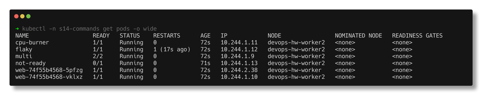
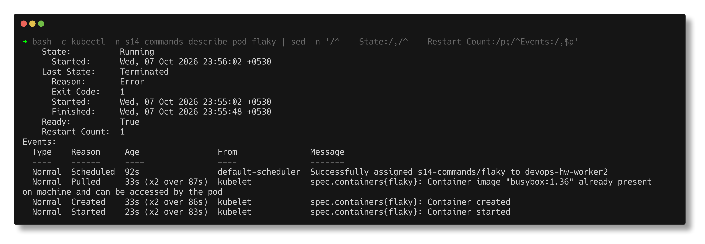
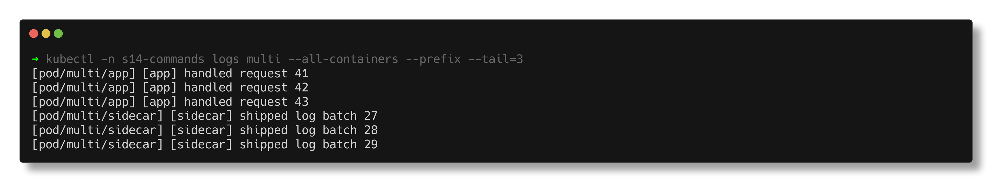
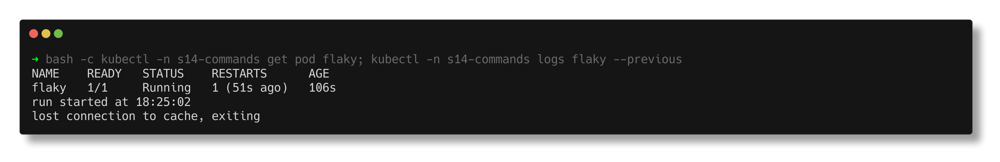
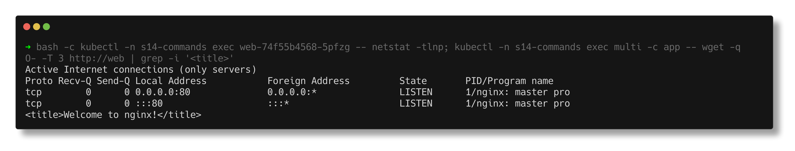
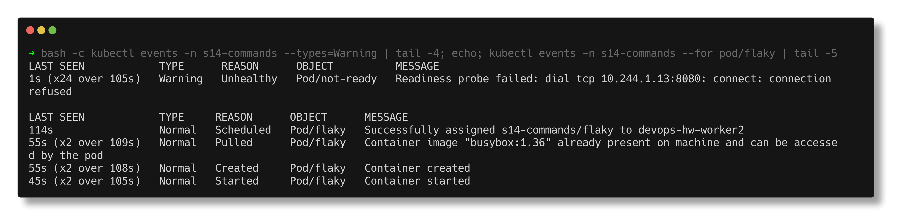
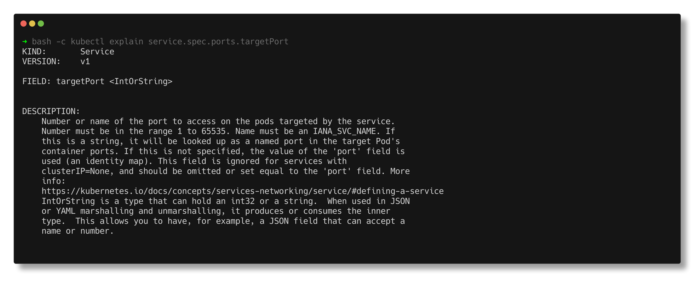
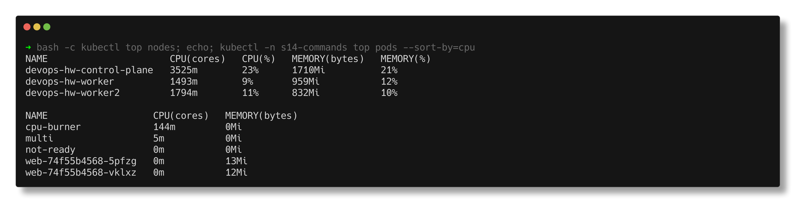

# Kubernetes Troubleshooting Commands

> **Submitted by:** Pratyush Mohanty  |  **Roll No.:** 24BCS10238

**Form field:** Kubernetes Troubleshooting · **Course session:** `session-14-kubernetes-troubleshooting`

Run it: `./run.sh` (or one section: `./run.sh logs`) · Verified output: [output.md](output.md) · Workload: [commands-demo.yaml](commands-demo.yaml)

A small practice workload in namespace `s14-commands`, built so every command
has something real to show: a 2-replica `web` Deployment + Service, a
two-container pod (`multi`), a pod that exits every 45s (`flaky`), a pod that is
Running but never Ready (`not-ready`), and a CPU-capped busy loop
(`cpu-burner`).

| Command | Question it answers |
|---|---|
| `kubectl get` | What exists, and what state is it in? |
| `kubectl describe` | What details and recent Events explain that state? |
| `kubectl logs` | What did the application say? |
| `kubectl exec` | What does it look like from inside the container? |
| `kubectl events` | What did Kubernetes try to do, and what failed? |
| `kubectl explain` | What does this field mean, for this cluster's API version? |
| `kubectl top` | How much CPU/memory is it using right now? |

## 1. get

```text
$ kubectl -n s14-commands get pods
NAME                   READY   STATUS    RESTARTS      AGE
cpu-burner             1/1     Running   0             70s
flaky                  1/1     Running   1 (15s ago)   70s
multi                  2/2     Running   0             70s
not-ready              0/1     Running   0             69s
```

`not-ready` is the trap: STATUS says Running, READY says 0/1, so a Service
would send it no traffic. Always read READY and RESTARTS, not just STATUS.

The variations I actually use (all in [output.md](output.md)):
`-o wide` (IP and node), `--show-labels` and `-l app=web` (what a Service
selects), `--field-selector status.phase=Running`, `--sort-by` restart count,
`-o yaml`, `-o jsonpath='{...}'` for one field, `-o custom-columns` for my own
table, and `-w` to watch. The watch while scaling `web` from 2 to 3:

```text
23:56:12  web-74f55b4568-5pl46   0/1     Pending   0          0s
23:56:13  web-74f55b4568-5pl46   0/1     ContainerCreating   0          1s
23:56:15  web-74f55b4568-5pl46   1/1     Running             0          3s
```



`kubectl get svc -o wide` adds a SELECTOR column - put it next to
`get pods --show-labels` and selector bugs become obvious.

## 2. describe

`describe pod flaky` (trimmed) shows the current **and** previous container
state with its exit code, the conditions, and the Events:



The same command on a Deployment shows strategy and the ReplicaSet scaling
events, on a Service the `Endpoints:` line, and on a node the
`Allocated resources` block (what requests are already reserved) - see
[output.md](output.md).

## 3. logs

```text
$ kubectl -n s14-commands logs multi --tail=3
Defaulted container "app" out of: app, sidecar
```

With two containers you get the first one unless you say `-c sidecar` or
`--all-containers --prefix`:



`--previous` is the one that matters for crashes:

```text
$ kubectl -n s14-commands logs flaky
run started at 18:26:03

$ kubectl -n s14-commands logs flaky --previous
run started at 18:25:02
lost connection to cache, exiting
```

The current run has not failed yet; `--previous` shows the run that did.



Also used: `--tail`, `--timestamps`, `--since=5s`, `-f` (captured for 7s with
arrival times), `-l app=web --prefix` and `deploy/web`.

## 4. exec

From inside a `web` pod: `nginx -v`, `/etc/resolv.conf`, the Service env
vars, and whether the process really listens where I think:



`exec -c sidecar` picks the container. The interactive form is
`kubectl exec -it <pod> -- sh` (not capturable in a script).

## 5. events

```text
$ kubectl events -n s14-commands --types=Warning | tail -4
LAST SEEN            TYPE      REASON      OBJECT          MESSAGE
1s (x24 over 105s)   Warning   Unhealthy   Pod/not-ready   Readiness probe failed: dial tcp 10.244.1.13:8080: connect: connection refused
```

That one line explains `not-ready` completely. `kubectl events --for pod/flaky`
narrows to one object; the older `kubectl get events --sort-by=.lastTimestamp`
and `--field-selector type=Warning` still work. Events expire after one hour
by default, so for yesterday's incident they are gone.



## 6. explain

`kubectl explain pod.spec.containers.livenessProbe`,
`kubectl explain service.spec.ports.targetPort` (which says outright that a
string is looked up as a **named** container port) and
`kubectl explain deployment.spec.strategy --recursive`:



## 7. top (metrics-server)

```text
$ kubectl -n s14-commands top pods --sort-by=cpu
NAME                   CPU(cores)   MEMORY(bytes)   
cpu-burner             144m         0Mi             
multi                  5m           0Mi             
not-ready              0m           0Mi             
web-74f55b4568-5pfzg   0m           13Mi            
web-74f55b4568-vklxz   0m           12Mi            
```

`cpu-burner` sits just under its 150m limit: CPU over the limit is
**throttled**, memory over the limit is **OOMKilled**. `--containers` splits a
pod per container.



## Notes from actually running this

- My first run asked for `logs flaky --previous` and got `unable to retrieve
  container logs for containerd://...`. The container had just exited again,
  the kubelet keeps only the most recent dead container, so the "previous" one
  had been garbage-collected. The script now waits until flaky is running its
  next attempt before reading `--previous`.
- `--field-selector status.phase=Running` still listed `flaky` while its STATUS
  column said `Error`: STATUS is a summary of container states, not the pod
  phase.
- `kubectl get endpoints` now prints `Warning: v1 Endpoints is deprecated in
  v1.33+`; use `get endpointslices -l kubernetes.io/service-name=<svc>`.
- macOS has no `timeout`, so `-w` and `-f` are captured by backgrounding the
  command, sleeping, and killing it (`watch_for` in [../lib.sh](../lib.sh)).
