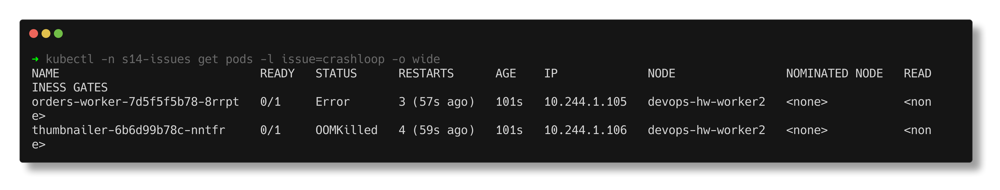
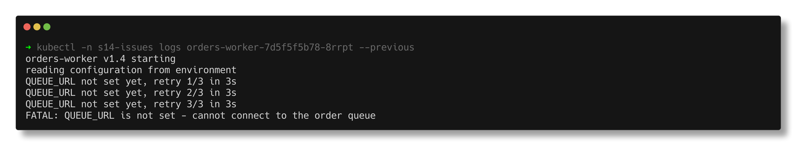
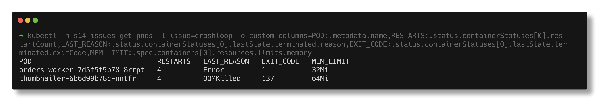
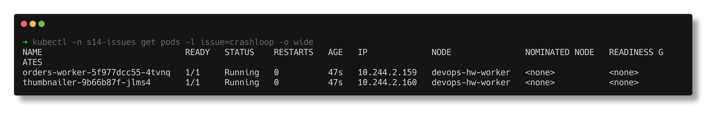

# CrashLoopBackOff

> **Submitted by:** Pratyush Mohanty  |  **Roll No.:** 24BCS10238

**Form field:** Kubernetes Troubleshooting · **Course session:** `session-14-kubernetes-troubleshooting`

Run it: `./run.sh` · Verified output: [output.md](output.md) · Manifests: [broken.yaml](broken.yaml) -> [fixed.yaml](fixed.yaml)

Two Deployments that both end up in `CrashLoopBackOff`, for two unrelated
reasons. I put them side by side on purpose: the status is identical, the
place you find the answer is not.

| Deployment | What is wrong |
|---|---|
| `orders-worker` | the app exits 1 because `QUEUE_URL` is not set |
| `thumbnailer` | it needs ~150 MB but has a 64Mi memory limit, so the kernel kills it |

## 1. Identify

`kubectl get pods -w` for 100 seconds, each line time-stamped as it arrived:

```text
23:29:03  orders-worker-7d5f5f5b78-8rrpt   1/1     Running             0          2s
23:29:04  thumbnailer-6b6d99b78c-nntfr     0/1     OOMKilled           0          3s
23:29:12  orders-worker-7d5f5f5b78-8rrpt   0/1     Error               0            11s
23:29:17  thumbnailer-6b6d99b78c-nntfr     0/1     CrashLoopBackOff    1 (11s ago)   16s
23:29:35  orders-worker-7d5f5f5b78-8rrpt   0/1     CrashLoopBackOff    1 (13s ago)   34s
23:30:07  orders-worker-7d5f5f5b78-8rrpt   1/1     Running             3 (22s ago)   66s
23:30:32  thumbnailer-6b6d99b78c-nntfr     0/1     CrashLoopBackOff    3 (49s ago)   91s
23:30:34  thumbnailer-6b6d99b78c-nntfr     0/1     OOMKilled           4 (51s ago)   93s
```

The status flips between `Running`, `Error`/`OOMKilled` and `CrashLoopBackOff`
and RESTARTS keeps climbing. `CrashLoopBackOff` is not an error message, it is
the kubelet **waiting** before the next restart (10s, 20s, 40s ... capped at 5
minutes) - you can see the gaps between restarts growing.



## 2. Investigate

**orders-worker - `describe` says what, not why:**

```text
    State:          Terminated
      Reason:       Error
      Exit Code:    1
    Last State:     Terminated
      Reason:       Error
      Exit Code:    1
    Restart Count:  3
  Warning  BackOff    25s (x3 over 80s)   kubelet  spec.containers{worker}: Back-off restarting failed container worker ...
```

Exit code 1 means the process chose to exit. Only the app knows why, so the
next stop is the logs. The script waits until the container has just been
restarted, because that is when `logs` and `logs --previous` differ:

```text
$ kubectl -n s14-issues logs orders-worker-7d5f5f5b78-8rrpt
orders-worker v1.4 starting
reading configuration from environment
QUEUE_URL not set yet, retry 1/3 in 3s

$ kubectl -n s14-issues logs orders-worker-7d5f5f5b78-8rrpt --previous
orders-worker v1.4 starting
reading configuration from environment
QUEUE_URL not set yet, retry 1/3 in 3s
QUEUE_URL not set yet, retry 2/3 in 3s
QUEUE_URL not set yet, retry 3/3 in 3s
FATAL: QUEUE_URL is not set - cannot connect to the order queue
```

Plain `logs` shows the attempt that is running now, which has not failed yet.
`--previous` shows the one that crashed. Confirmed from the spec:
`.spec.template.spec.containers[0].env` is empty.



**thumbnailer - the logs are useless here:**

```text
$ kubectl -n s14-issues logs thumbnailer-6b6d99b78c-nntfr
thumbnailer starting, warming a 150 MB image cache
```

Then silence - no error line. Something outside the process killed it, and
`describe` says who:

```text
    Last State:     Terminated
      Reason:       OOMKilled
      Exit Code:    137
    Limits:
      cpu:     200m
      memory:  64Mi
```

The same facts for both pods as one table (`-o custom-columns`):

```text
POD                              RESTARTS   LAST_REASON   EXIT_CODE   MEM_LIMIT
orders-worker-7d5f5f5b78-8rrpt   4          Error         1           32Mi
thumbnailer-6b6d99b78c-nntfr     4          OOMKilled     137         64Mi
```



## 3. Root cause

- **orders-worker:** exit code `1` - the application exited on purpose because
  the Deployment never sets `QUEUE_URL`.
- **thumbnailer:** exit code `137` = 128 + 9 (SIGKILL), reason `OOMKilled`. It
  loads a 150 MB cache inside a 64Mi limit. The code is fine; the limit is wrong.

## 4. Fix

`kubectl diff -f fixed.yaml` before applying, so I know exactly what changes:

```text
  +        env:
  +        - name: QUEUE_URL
  +          value: redis://orders-queue.s14-issues.svc.cluster.local:6379/0
  -            memory: 64Mi
  +            memory: 256Mi
```

(plus the thumbnailer memory request raised from 32Mi to 192Mi so the
scheduler reserves what it really uses).

## 5. Verify

Not just "Running" - still Running with zero restarts 40 seconds later, which
a crash loop could not survive:

```text
NAME                             READY   STATUS    RESTARTS   AGE
orders-worker-5f977dcc55-4tvnq   1/1     Running   0          46s
thumbnailer-9b66b87f-jlms4       1/1     Running   0          46s

$ kubectl -n s14-issues logs deploy/orders-worker --tail=3
polling redis://orders-queue.s14-issues.svc.cluster.local:6379/0 for new orders
...
$ kubectl -n s14-issues logs deploy/thumbnailer
thumbnailer starting, warming a 150 MB image cache
cache warm, serving
```



## Takeaway

| Exit code / reason | Who ended it | Where the answer is |
|---|---|---|
| `1` (or any app code), `Error` | the app | `kubectl logs --previous` |
| `137`, `OOMKilled` | the kernel (memory limit) | `kubectl describe` -> Last State, limits |
| `137` without OOMKilled | SIGKILL from outside, e.g. a failing liveness probe | `describe` events (`Unhealthy`, `Killing`) |
| `128`, `StartError` | the runtime could not exec the command | see [09-configuration](../09-configuration/README.md) |
