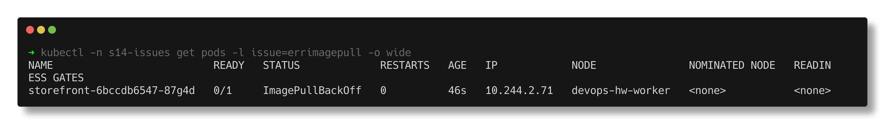
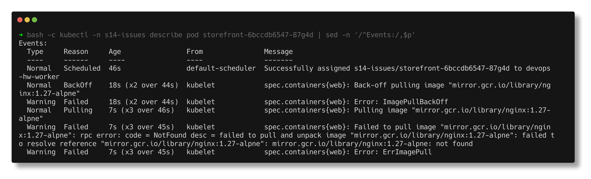
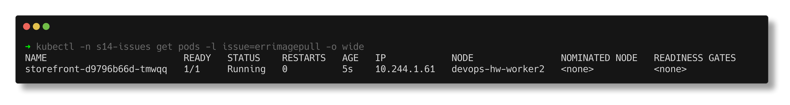

# ErrImagePull

> **Submitted by:** Pratyush Mohanty  |  **Roll No.:** 24BCS10238

**Form field:** Kubernetes Troubleshooting · **Course session:** `session-14-kubernetes-troubleshooting`

Run it: `./run.sh` · Verified output: [output.md](output.md) · Manifests: [broken.yaml](broken.yaml) -> [fixed.yaml](fixed.yaml)

The `storefront` Deployment asks for `nginx:1.27-alpne` - a one-letter typo in
the tag.

> Registry note: the image is referenced through `mirror.gcr.io/library/...`
> (Google's mirror of the Docker Hub library images). While I was doing this
> lab, anonymous pulls from `docker.io` were being answered with
> `429 Too Many Requests`, which would have hidden the real error behind a
> rate-limit one - see [03-imagepullbackoff](../03-imagepullbackoff/README.md).

## 1. Identify

The first 45 seconds of the pod, time-stamped:

```text
23:22:52  storefront-6bccdb6547-87g4d   0/1     ContainerCreating   0          0s
23:22:54  storefront-6bccdb6547-87g4d   0/1     ErrImagePull        0          2s
23:23:06  storefront-6bccdb6547-87g4d   0/1     ImagePullBackOff    0          14s
23:23:20  storefront-6bccdb6547-87g4d   0/1     ErrImagePull        0          28s
23:23:31  storefront-6bccdb6547-87g4d   0/1     ImagePullBackOff    0          39s
```

The two statuses take turns, and that is the whole difference between them:

| Status | Meaning |
|---|---|
| `ErrImagePull` | a pull was just **attempted and failed** |
| `ImagePullBackOff` | the kubelet is **waiting** before the next attempt |

Same problem, two phases of one retry loop. RESTARTS stays 0 because no
container ever existed.



## 2. Investigate

No container, so no logs:

```text
$ kubectl -n s14-issues logs storefront-6bccdb6547-87g4d
Error from server (BadRequest): container "web" in pod "storefront-6bccdb6547-87g4d" is waiting to start: trying and failing to pull image
```

`describe` has the registry's own answer in the Events:

```text
    Image:          mirror.gcr.io/library/nginx:1.27-alpne
    State:          Waiting
      Reason:       ImagePullBackOff
Events:
  Type     Reason     Age                From               Message
  ----     ------     ----               ----               -------
  Normal   Pulling    7s (x3 over 46s)   kubelet            spec.containers{web}: Pulling image "mirror.gcr.io/library/nginx:1.27-alpne"
  Warning  Failed     7s (x3 over 45s)   kubelet            spec.containers{web}: Failed to pull image "mirror.gcr.io/library/nginx:1.27-alpne": rpc error: code = NotFound desc = failed to pull and unpack image "mirror.gcr.io/library/nginx:1.27-alpne": failed to resolve reference "mirror.gcr.io/library/nginx:1.27-alpne": mirror.gcr.io/library/nginx:1.27-alpne: not found
  Warning  Failed     7s (x3 over 45s)   kubelet            spec.containers{web}: Error: ErrImagePull
```



To be sure it is the tag and not networking or credentials, I asked the
registry directly from the laptop. A manifest `HEAD` request is the first thing
the kubelet does too:

```text
  HEAD mirror.gcr.io/v2/library/nginx/manifests/1.27-alpne   -> 404
  HEAD mirror.gcr.io/v2/library/nginx/manifests/1.27-alpine  -> 200
```

Registry reachable, no auth error, no timeout - only the tag is missing.

## 3. Root cause

A typo in the image tag (`alpne`). The registry answers "not found", the
kubelet reports `ErrImagePull`, backs off, and retries forever.

## 4. Fix

```text
$ kubectl diff -f fixed.yaml
  -      - image: mirror.gcr.io/library/nginx:1.27-alpne
  +      - image: mirror.gcr.io/library/nginx:1.27-alpine
```

Changing the pod template makes the Deployment roll out a new ReplicaSet; the
broken pod is replaced, not repaired.

## 5. Verify

```text
NAME                         READY   STATUS    RESTARTS   AGE   IP            NODE                NOMINATED NODE   READINESS GATES
storefront-d9796b66d-tmwqq   1/1     Running   0          5s    10.244.1.61   devops-hw-worker2   <none>           <none>

Pulled      Successfully pulled image "mirror.gcr.io/library/nginx:1.27-alpine" in 1.229s (1.229s including waiting). Image size: 21832241 b
Started     Container started

$ kubectl -n s14-issues exec storefront-d9796b66d-tmwqq -- curl -s -o /dev/null -w '%{http_code}' http://localhost/
HTTP 200
```


