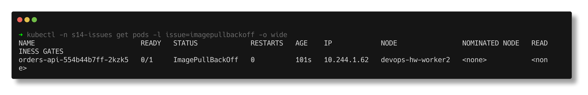
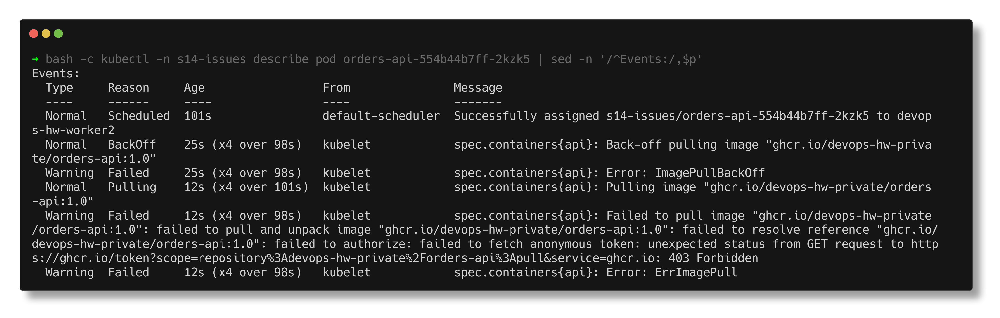
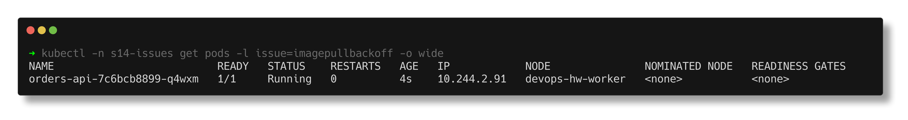

# ImagePullBackOff

> **Submitted by:** Pratyush Mohanty  |  **Roll No.:** 24BCS10238

**Form field:** Kubernetes Troubleshooting · **Course session:** `session-14-kubernetes-troubleshooting`

Run it: `./run.sh` · Verified output: [output.md](output.md) · Manifests: [broken.yaml](broken.yaml) -> [fixed.yaml](fixed.yaml)

`orders-api` points at `ghcr.io/devops-hw-private/orders-api:1.0` - a private
(or never published) GitHub Container Registry repo, with no pull secret. Where
[02-errimagepull](../02-errimagepull/README.md) is about the first failed
attempt, this one is about the **back-off** and about reading the error text.

## 1. Identify

100 seconds of `kubectl get pod -w`:

```text
23:23:45  orders-api-554b44b7ff-2kzk5   0/1     ContainerCreating   0          0s
23:23:48  orders-api-554b44b7ff-2kzk5   0/1     ErrImagePull        0          3s
23:23:59  orders-api-554b44b7ff-2kzk5   0/1     ImagePullBackOff    0          14s
23:24:15  orders-api-554b44b7ff-2kzk5   0/1     ErrImagePull        0          30s
23:24:29  orders-api-554b44b7ff-2kzk5   0/1     ImagePullBackOff    0          44s
23:24:49  orders-api-554b44b7ff-2kzk5   0/1     ErrImagePull        0          64s
23:25:01  orders-api-554b44b7ff-2kzk5   0/1     ImagePullBackOff    0          76s
```

Each `ErrImagePull` is one real attempt, and the gap between attempts grows
(27s, then 34s) as the kubelet's back-off doubles towards its 5 minute cap. So
even after the registry problem is fixed, a pod can take minutes to notice.



## 2. Investigate

```text
  Normal   BackOff    25s (x4 over 98s)   kubelet            spec.containers{api}: Back-off pulling image "ghcr.io/devops-hw-private/orders-api:1.0"
  Warning  Failed     25s (x4 over 98s)   kubelet            spec.containers{api}: Error: ImagePullBackOff
  Normal   Pulling    12s (x4 over 101s)  kubelet            spec.containers{api}: Pulling image "ghcr.io/devops-hw-private/orders-api:1.0"
  Warning  Failed     12s (x4 over 98s)   kubelet            spec.containers{api}: Failed to pull image "ghcr.io/devops-hw-private/orders-api:1.0": failed to pull and unpack image "ghcr.io/devops-hw-private/orders-api:1.0": failed to resolve reference "ghcr.io/devops-hw-private/orders-api:1.0": failed to authorize: failed to fetch anonymous token: unexpected status from GET request to https://ghcr.io/token?scope=repository%3Adevops-hw-private%2Forders-api%3Apull&service=ghcr.io: 403 Forbidden
```



The message decides which kind of image problem it is:

| Message contains | Cause |
|---|---|
| `not found` | wrong name or tag |
| `401 Unauthorized`, `403 Forbidden`, `denied` | private repo, missing or wrong credentials |
| `429 Too Many Requests` | registry rate limit |
| `i/o timeout`, `no such host` | node cannot reach / resolve the registry |

Here: `403` while fetching an **anonymous** token - no credentials were even
offered. Checked both places a pull secret can come from:

```text
$ kubectl -n s14-issues get pod orders-api-554b44b7ff-2kzk5 -o jsonpath='{.spec.imagePullSecrets}'
  ''
$ kubectl -n s14-issues get serviceaccount default -o jsonpath='{.imagePullSecrets}'
  ''
```

And the same request from the laptop gives the same answer, so it is not a
node or network problem:

```text
$ curl 'https://ghcr.io/token?scope=repository:devops-hw-private/orders-api:pull&service=ghcr.io'
  {"errors":[{"code":"DENIED","message":"requested access to the resource is denied"}]}

  HTTP 403
```

## 3. Root cause

The image lives in a repository the cluster is not allowed to read, and the pod
has no `imagePullSecrets`. Every attempt is refused and the kubelet backs off.

## 4. Fix

Point at the image that is actually published (a public stand-in here):

```text
$ kubectl diff -f fixed.yaml
  -      - image: ghcr.io/devops-hw-private/orders-api:1.0
  +      - image: nginxdemos/nginx-hello:plain-text
```

For a genuinely private image the fix is credentials instead:
`kubectl create secret docker-registry ghcr-pull --docker-server=ghcr.io ...`
and `imagePullSecrets: [{name: ghcr-pull}]` in the pod spec (or on the service
account). I could not show that working without a real token.

## 5. Verify

```text
NAME                          READY   STATUS    RESTARTS   AGE   IP            NODE               NOMINATED NODE   READINESS GATES
orders-api-7c6bcb8899-q4wxm   1/1     Running   0          4s    10.244.2.91   devops-hw-worker   <none>           <none>

$ kubectl -n s14-issues exec orders-api-7c6bcb8899-q4wxm -- wget -qO- http://localhost:8080/
Server address: ::1:8080
Server name: orders-api-7c6bcb8899-q4wxm
```



## A real one I hit: 429 Too Many Requests

While testing images for this folder, a plain `nginx:1.27` - a tag that
certainly exists - went into `ImagePullBackOff` on this cluster:

```text
NAME   READY   STATUS             RESTARTS   AGE
ng     0/1     ImagePullBackOff   0          4m54s
  Warning  Failed     78s (x5 over 4m46s)   kubelet            spec.containers{ng}: Failed to pull image "nginx:1.27": failed to pull and unpack image "docker.io/library/nginx:1.27": failed to resolve reference "docker.io/library/nginx:1.27": unexpected status from HEAD request to https://registry-1.docker.io/v2/library/nginx/manifests/1.27: 429 Too Many Requests
```

Docker Hub rate-limits anonymous pulls per IP, and every node behind the same
NAT shares that budget. Nothing in the YAML was wrong. Real fixes: authenticated
pulls (an `imagePullSecret` for a Docker Hub account), a pull-through mirror or
private registry, or pre-loading images onto the nodes. That is why the
manifests in [02-errimagepull](../02-errimagepull/broken.yaml) use
`mirror.gcr.io`.
