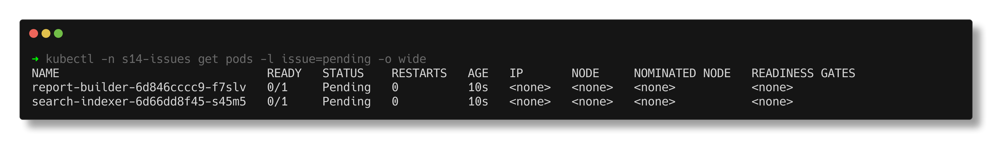
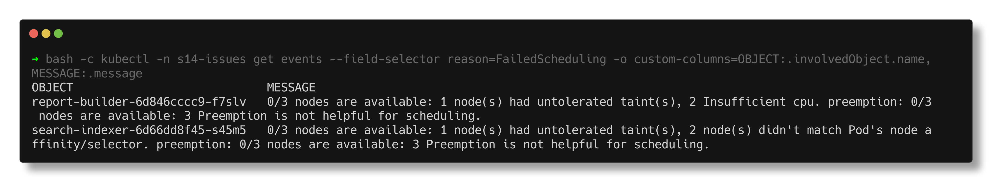
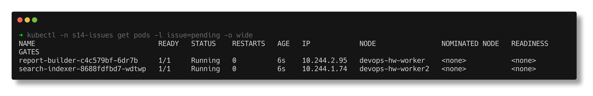

# Pending

> **Submitted by:** Pratyush Mohanty  |  **Roll No.:** 24BCS10238

**Form field:** Kubernetes Troubleshooting · **Course session:** `session-14-kubernetes-troubleshooting`

Run it: `./run.sh` · Verified output: [output.md](output.md) · Manifests: [broken.yaml](broken.yaml) -> [fixed.yaml](fixed.yaml)

Two pods the scheduler cannot place. No node taints were touched - this is a
shared cluster.

| Deployment | What is wrong |
|---|---|
| `report-builder` | `requests.cpu: "64"`; every node has 15 allocatable |
| `search-indexer` | `nodeSelector: disktype=ssd`; no node has that label |

## 1. Identify

```text
NAME                              READY   STATUS    RESTARTS   AGE   IP       NODE     NOMINATED NODE   READINESS GATES
report-builder-6d846cccc9-f7slv   0/1     Pending   0          10s   <none>   <none>   <none>           <none>
search-indexer-6d66dd8f45-s45m5   0/1     Pending   0          10s   <none>   <none>   <none>           <none>
```

`NODE <none>` is the key: the pod was never scheduled, so no kubelet has seen
it - no image pull, no container, and `kubectl logs` returns nothing at all.



## 2. Investigate

The scheduler explains itself in a `FailedScheduling` event:

```text
    Requests:
      cpu:        64
      memory:     32Mi
  Warning  FailedScheduling  1s (x9 over 10s)  default-scheduler  0/3 nodes are available: 1 node(s) had untolerated taint(s), 2 Insufficient cpu. preemption: 0/3 nodes are available: 3 Preemption is not helpful for scheduling.

Node-Selectors:              disktype=ssd
  Warning  FailedScheduling  11s   default-scheduler  0/3 nodes are available: 1 node(s) had untolerated taint(s), 2 node(s) didn't match Pod's node affinity/selector. preemption: 0/3 nodes are available: 3 Preemption is not helpful for scheduling.
```



Read it as a tally over all three nodes: the control-plane is out because of
its normal `NoSchedule` taint, the two workers because of `Insufficient cpu` /
the selector, and preemption would not help either, so it will wait forever.
Then compare the ask with what exists:

```text
NAME                      ALLOCATABLE_CPU   ALLOCATABLE_MEM   TAINTS
devops-hw-control-plane   15                8125796Ki         node-role.kubernetes.io/control-plane
devops-hw-worker          15                8125796Ki         <none>
devops-hw-worker2         15                8125796Ki         <none>

$ kubectl get nodes -L disktype
NAME                      STATUS   ROLES           AGE   VERSION   DISKTYPE
devops-hw-control-plane   Ready    control-plane   19d   v1.37.0   
devops-hw-worker          Ready    <none>          19d   v1.37.0   
devops-hw-worker2         Ready    <none>          19d   v1.37.0   
```

## 3. Root cause

- `report-builder`: a request of 64 CPUs cannot fit on a 15-CPU node. Requests
  are a **reservation** the scheduler must find room for, not actual usage.
- `search-indexer`: the `disktype=ssd` selector matches zero nodes (it was
  written for a cluster whose SSD nodes were labelled).

## 4. Fix

```text
$ kubectl diff -f fixed.yaml
  -            cpu: "64"
  +            cpu: 500m
  -            cpu: "64"
  +            cpu: 100m
  -      nodeSelector:
  -        disktype: ssd
```

The other valid fix for the selector is to label the right node
(`kubectl label node <node> disktype=ssd`); I did not label nodes on a shared
cluster.

## 5. Verify

```text
NAME                              READY   STATUS    RESTARTS   AGE   IP            NODE                NOMINATED NODE   READINESS GATES
report-builder-c4c579bf-6dr7b     1/1     Running   0          6s    10.244.2.95   devops-hw-worker    <none>           <none>
search-indexer-8688fdfbd7-wdtwp   1/1     Running   0          6s    10.244.1.74   devops-hw-worker2   <none>           <none>

Scheduled   Successfully assigned s14-issues/report-builder-c4c579bf-6dr7b to devops-hw-worker
```



Other causes of Pending worth knowing: a PVC that does not bind (no matching
StorageClass/PV), taints without tolerations, and pod anti-affinity that no
node can satisfy. All of them show up the same way - a `FailedScheduling`
event in `describe`.
