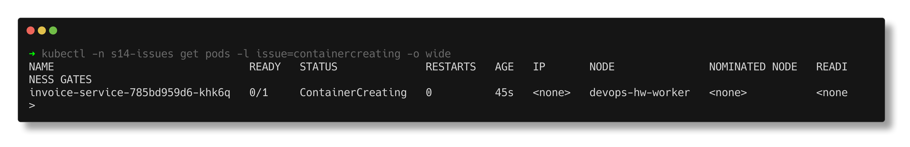
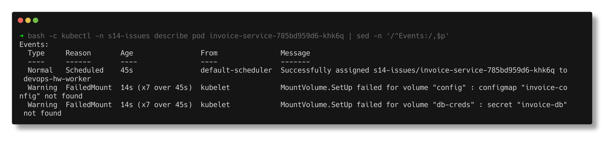
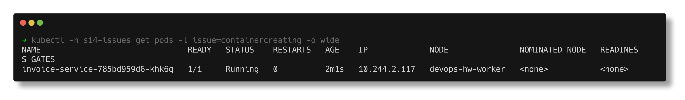

# Stuck in ContainerCreating

> **Submitted by:** Pratyush Mohanty  |  **Roll No.:** 24BCS10238

**Form field:** Kubernetes Troubleshooting · **Course session:** `session-14-kubernetes-troubleshooting`

Run it: `./run.sh` · Verified output: [output.md](output.md) · Manifests: [broken.yaml](broken.yaml) -> [fixed.yaml](fixed.yaml)

`invoice-service` mounts a ConfigMap (`invoice-config`) and a Secret
(`invoice-db`) as volumes. Neither was created - they live in a separate
manifest the deploy step forgot.

## 1. Identify

```text
NAME                               READY   STATUS              RESTARTS   AGE   IP       NODE               NOMINATED NODE   READINESS GATES
invoice-service-785bd959d6-khk6q   0/1     ContainerCreating   0          45s   <none>   devops-hw-worker   <none>           <none>
```

Unlike Pending, `NODE` is filled in: scheduling worked, and the kubelet on that
node is stuck preparing the pod. 45 seconds for a cached 2 MB busybox image is
not slow, it is stuck.



## 2. Investigate

```text
Volumes:
  config:
    Type:      ConfigMap (a volume populated by a ConfigMap)
    Name:      invoice-config
    Optional:  false
  db-creds:
    Type:        Secret (a volume populated by a Secret)
    SecretName:  invoice-db
    Optional:    false
Events:
  Warning  FailedMount  14s (x7 over 45s)  kubelet            MountVolume.SetUp failed for volume "config" : configmap "invoice-config" not found
  Warning  FailedMount  14s (x7 over 45s)  kubelet            MountVolume.SetUp failed for volume "db-creds" : secret "invoice-db" not found
```



Confirmed directly:

```text
$ kubectl -n s14-issues get configmap invoice-config
Error from server (NotFound): configmaps "invoice-config" not found
$ kubectl -n s14-issues get secret invoice-db
Error from server (NotFound): secrets "invoice-db" not found
$ kubectl -n s14-issues logs invoice-service-785bd959d6-khk6q
Error from server (BadRequest): container "invoice" in pod "invoice-service-785bd959d6-khk6q" is waiting to start: ContainerCreating
```

## 3. Root cause

The pod's volumes reference a ConfigMap and a Secret that do not exist in its
namespace, so `MountVolume.SetUp` fails and the kubelet will not start a
container with volumes missing. (A missing ConfigMap **key** used in an env var
fails differently - `CreateContainerConfigError`, see
[09-configuration](../09-configuration/README.md). A missing **PVC** shows up
earlier, as Pending.)

## 4. Fix

Create the two objects. The Deployment itself is untouched
(`deployment.apps/invoice-service unchanged`), so no new pod is created - the
kubelet keeps retrying the mount, and the **same pod** recovers on its own:

```text
configmap/invoice-config created
secret/invoice-db created
deployment.apps/invoice-service unchanged

23:28:41  invoice-service-785bd959d6-khk6q   0/1     ContainerCreating   0          46s
23:28:59  invoice-service-785bd959d6-khk6q   0/1     ContainerCreating   0          64s
23:29:00  invoice-service-785bd959d6-khk6q   1/1     Running             0          65s
```

19 seconds from creating the objects to Running, without touching the pod.

## 5. Verify

```text
$ kubectl -n s14-issues logs invoice-service-785bd959d6-khk6q
invoice-service starting
settings: currency=INR tax.rate=18 
db password file present: yes

FailedMount   7     MountVolume.SetUp failed for volume "config" : configmap "invoice-config" not found
FailedMount   7     MountVolume.SetUp failed for volume "db-creds" : secret "invoice-db" not found
Pulled        1     Container image "busybox:1.36" already present on machine and can be accessed by the pod
Started       1     Container started
```


