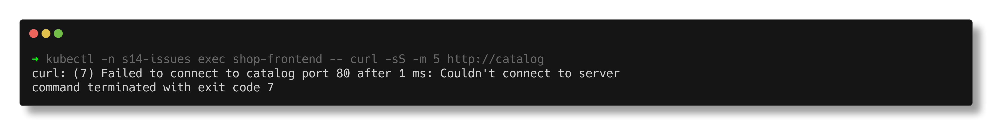
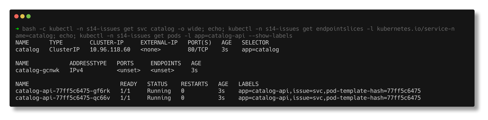
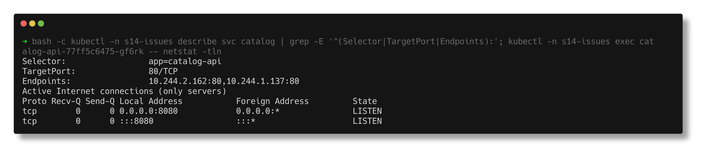
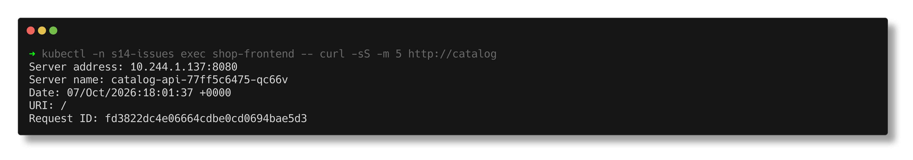

# Service connectivity

> **Submitted by:** Pratyush Mohanty  |  **Roll No.:** 24BCS10238

**Form field:** Kubernetes Troubleshooting · **Course session:** `session-14-kubernetes-troubleshooting`

Run it: `./run.sh` · Verified output: [output.md](output.md) · Manifests: [broken.yaml](broken.yaml) -> [fixed.yaml](fixed.yaml)

`shop-frontend` cannot reach the `catalog` Service. Two bugs are stacked, as
they often are in real life:

1. Service selector `app=catalog`, but the pods are labelled `app=catalog-api`
2. Service `targetPort: 80`, but the container listens on `8080`

## 1. Identify

```text
catalog-api-77ff5c6475-gf6rk   1/1     Running   0          2s    10.244.2.162   devops-hw-worker    <none>           <none>
catalog-api-77ff5c6475-qc66v   1/1     Running   0          2s    10.244.1.137   devops-hw-worker2   <none>           <none>

$ kubectl -n s14-issues exec shop-frontend -- curl -sS -m 5 http://catalog
curl: (7) Failed to connect to catalog port 80 after 1 ms: Couldn't connect to server
```

Every pod Running and Ready, yet the call fails. So the problem is between
client and pods: DNS, the Service, or the network.



## 2. Investigate - layer 1

DNS resolves `catalog` to the ClusterIP, so DNS is fine. The Service:

```text
NAME      TYPE        CLUSTER-IP     EXTERNAL-IP   PORT(S)   AGE   SELECTOR
catalog   ClusterIP   10.96.118.60   <none>        80/TCP    2s    app=catalog

NAME            ADDRESSTYPE   PORTS     ENDPOINTS   AGE
catalog-gcnwk   IPv4          <unset>   <unset>     2s

Selector:                 app=catalog
TargetPort:               80/TCP
Endpoints:                
```

No endpoints: the selector matched zero pods. `kubectl get pods -l app=catalog`
returns `No resources found`; the pods carry `app=catalog-api`.



I fixed only the selector first (`kubectl patch svc catalog -p
'{"spec":{"selector":{"app":"catalog-api"}}}'`) to see what was left:

```text
catalog-gcnwk   IPv4          80      10.244.2.162,10.244.1.137   6s

$ kubectl -n s14-issues exec shop-frontend -- curl -sS -m 5 http://catalog
curl: (7) Failed to connect to catalog port 80 after 1 ms: Couldn't connect to server
```

Endpoints now exist, but the **symptom did not change** - same curl exit 7 in
1 ms. With no endpoints kube-proxy rejects the connection itself; now the pod
end refuses it. Only the endpoints check could tell those apart.

## 3. Investigate - layer 2

```text
[{"containerPort":8080,"name":"http","protocol":"TCP"}]

$ kubectl -n s14-issues exec catalog-api-77ff5c6475-gf6rk -- netstat -tln
tcp        0      0 0.0.0.0:8080            0.0.0.0:*               LISTEN      

$ kubectl -n s14-issues exec shop-frontend -- curl -sS -m 5 http://10.244.2.162:80
curl: (7) Failed to connect to 10.244.2.162 port 80 after 0 ms: Couldn't connect to server
$ kubectl -n s14-issues exec shop-frontend -- curl -sS -m 5 http://10.244.2.162:8080
HTTP 200
```

Going straight to the pod IP, bypassing the Service, proves it: 80 refused,
8080 works.



## 4. Root cause

1. The selector did not match the pod labels, so the EndpointSlice was empty.
2. `targetPort: 80` while the app listens on 8080, so once endpoints existed
   every connection was refused.

## 5. Fix

```text
$ kubectl diff -f fixed.yaml
  -    targetPort: 80
  +    targetPort: http
```

(The selector diff does not show because I had already patched it live.)
`targetPort: http` uses the container's **named** port, so a future port
change in the Deployment cannot silently break the Service again.

## 6. Verify

```text
catalog-gcnwk   IPv4          8080    10.244.2.162,10.244.1.137   11s

Selector:                 app=catalog-api
TargetPort:               http/TCP
Endpoints:                10.244.2.162:8080,10.244.1.137:8080

6 requests through the Service - which pod answered each one:
  catalog-api-77ff5c6475-gf6rk
  catalog-api-77ff5c6475-qc66v
  catalog-api-77ff5c6475-gf6rk
  catalog-api-77ff5c6475-gf6rk
  catalog-api-77ff5c6475-gf6rk
  catalog-api-77ff5c6475-qc66v
```

Both pods serve traffic through the Service.


