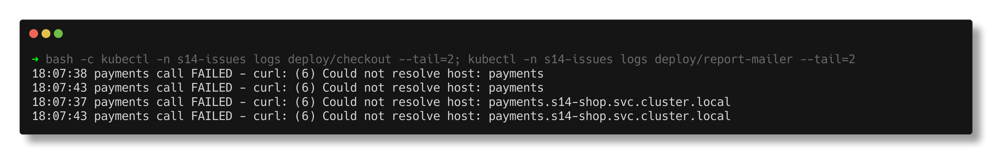
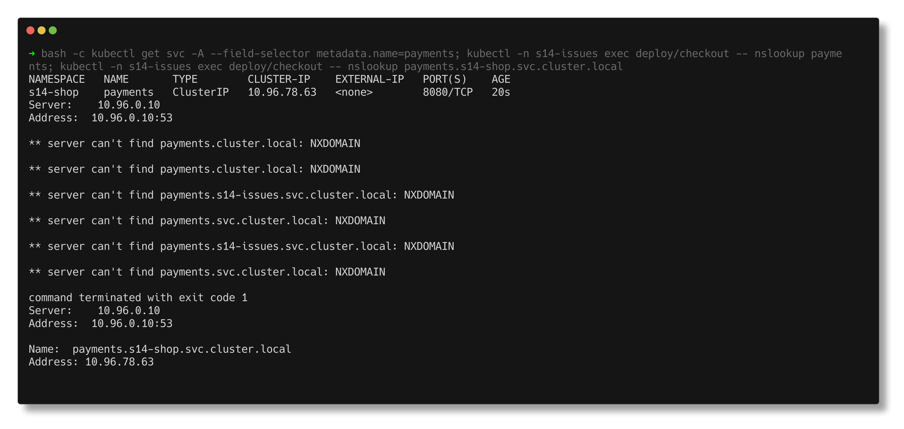
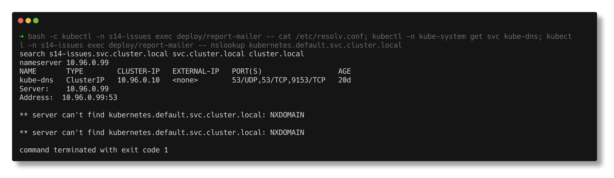
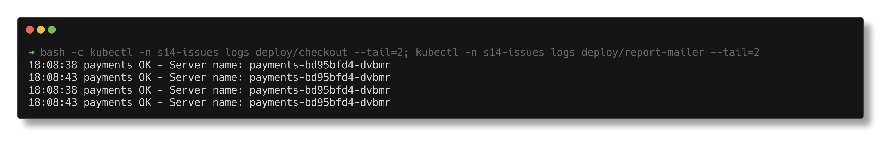

# DNS issues

> **Submitted by:** Pratyush Mohanty  |  **Roll No.:** 24BCS10238

**Form field:** Kubernetes Troubleshooting · **Course session:** `session-14-kubernetes-troubleshooting`

Run it: `./run.sh` · Verified output: [output.md](output.md) · Manifests: [broken.yaml](broken.yaml) -> [fixed.yaml](fixed.yaml)

Two pods in `s14-issues` call the `payments` Service, which lives in namespace
`s14-shop`. Both fail to resolve it, for different reasons. Only these pods
are affected - cluster DNS keeps working for everyone else.

| Pod | What is wrong |
|---|---|
| `checkout` | uses the short name `http://payments:8080` from another namespace |
| `report-mailer` | `dnsPolicy: None` with a hand-written `nameserver 10.96.0.99` |

## 1. Identify

```text
$ kubectl -n s14-issues logs deploy/checkout --tail=2
18:07:38 payments call FAILED - curl: (6) Could not resolve host: payments
18:07:43 payments call FAILED - curl: (6) Could not resolve host: payments

$ kubectl -n s14-issues logs deploy/report-mailer --tail=2
18:07:37 payments call FAILED - curl: (6) Could not resolve host: payments.s14-shop.svc.cluster.local
18:07:43 payments call FAILED - curl: (6) Could not resolve host: payments.s14-shop.svc.cluster.local
```

Same error, but report-mailer already uses the full name - so probably not the
same bug.



## 2. Investigate - is cluster DNS healthy? (read-only)

```text
coredns-559f6c778d-djbjl   1/1     Running   3 (4d6h ago)   20d   10.244.0.4   devops-hw-control-plane   <none>           <none>
coredns-559f6c778d-kn29k   1/1     Running   3 (4d6h ago)   20d   10.244.0.2   devops-hw-control-plane   <none>           <none>
kube-dns   ClusterIP   10.96.0.10   <none>        53/UDP,53/TCP,9153/TCP   20d
```

CoreDNS is up and `nslookup kubernetes.default` from checkout answers via
`10.96.0.10`. So DNS works; for checkout the **name** is the problem.

## 3. Investigate - checkout

```text
$ kubectl -n s14-issues exec deploy/checkout -- cat /etc/resolv.conf
search s14-issues.svc.cluster.local svc.cluster.local cluster.local
nameserver 10.96.0.10
options ndots:5

$ kubectl -n s14-issues exec deploy/checkout -- nslookup payments
** server can't find payments.cluster.local: NXDOMAIN
** server can't find payments.s14-issues.svc.cluster.local: NXDOMAIN
** server can't find payments.svc.cluster.local: NXDOMAIN
** server can't find payments.cluster.local: NXDOMAIN
** server can't find payments.svc.cluster.local: NXDOMAIN
** server can't find payments.s14-issues.svc.cluster.local: NXDOMAIN

$ kubectl get svc -A --field-selector metadata.name=payments
NAMESPACE   NAME       TYPE        CLUSTER-IP    EXTERNAL-IP   PORT(S)    AGE
s14-shop    payments   ClusterIP   10.96.78.63   <none>        8080/TCP   20s

$ kubectl -n s14-issues exec deploy/checkout -- nslookup payments.s14-shop.svc.cluster.local
Name:	payments.s14-shop.svc.cluster.local
Address: 10.96.78.63
```

The search list only expands a short name inside the pod's **own** namespace.



## 4. Investigate - report-mailer

```text
$ kubectl -n s14-issues exec deploy/report-mailer -- nslookup kubernetes.default.svc.cluster.local
Server:		10.96.0.99
Address:	10.96.0.99:53
** server can't find kubernetes.default.svc.cluster.local: NXDOMAIN
```

`kubernetes.default` always exists, so this is not a naming mistake. The clue
is `Server: 10.96.0.99` instead of `10.96.0.10`. Stranger still, internet names
work from the same pod, and even a TEST-NET address that cannot host a DNS
server answers:

```text
$ kubectl -n s14-issues exec deploy/report-mailer -- nslookup example.com 192.0.2.53
Server:		192.0.2.53
Name:	example.com
Address: 172.66.147.243
```

Docker Desktop intercepts outbound DNS on port 53 to any IP and answers it with
the Mac's resolver, which knows nothing about `cluster.local`. On a real
cluster this mistake gives `connection timed out; no servers could be reached`;
here it gives NXDOMAIN and **looks** like a naming problem. Where the wrong
server comes from:

```text
$ kubectl -n s14-issues exec deploy/report-mailer -- cat /etc/resolv.conf
search s14-issues.svc.cluster.local svc.cluster.local cluster.local
nameserver 10.96.0.99

  None {"nameservers":["10.96.0.99"],"searches":["s14-issues.svc.cluster.local","svc.cluster.local","cluster.local"]}

$ kubectl -n s14-issues exec deploy/report-mailer -- nslookup payments.s14-shop.svc.cluster.local 10.96.0.10
Name:	payments.s14-shop.svc.cluster.local
Address: 10.96.78.63
```

Asking the right server explicitly works from the same pod.



## 5. Root cause

- **checkout:** short name across namespaces. Needs `<svc>.<namespace>`.
- **report-mailer:** `dnsPolicy: None` + a nameserver that is not CoreDNS, so
  no cluster name can ever resolve.

## 6. Fix

```text
  -          value: http://payments:8080
  +          value: http://payments.s14-shop:8080
  -      dnsConfig:
  -        nameservers:
  -        - 10.96.0.99
  ...
  -      dnsPolicy: None
  +      dnsPolicy: ClusterFirst
```

## 7. Verify

```text
$ kubectl -n s14-issues logs deploy/checkout --tail=2
18:08:38 payments OK - Server name: payments-bd95bfd4-dvbmr
18:08:43 payments OK - Server name: payments-bd95bfd4-dvbmr

$ kubectl -n s14-issues logs deploy/report-mailer --tail=2
18:08:38 payments OK - Server name: payments-bd95bfd4-dvbmr
18:08:43 payments OK - Server name: payments-bd95bfd4-dvbmr

$ kubectl -n s14-issues exec deploy/report-mailer -- cat /etc/resolv.conf
search s14-issues.svc.cluster.local svc.cluster.local cluster.local
nameserver 10.96.0.10
options ndots:5
```



## Notes

- busybox `nslookup payments.s14-shop` (one dot) returned NXDOMAIN even though
  curl to `http://payments.s14-shop:8080` worked from the same pod: busybox
  nslookup only walks the search list for dot-less names, while the app's
  resolver honours `ndots:5`. Test with the FQDN, or with the app's own client.
- The instructor's `registry.k8s.io/e2e-test-images/dnsutils:1.3` image does not
  exist (`not found`), so I used the busybox `nslookup` inside `curlimages/curl`.
