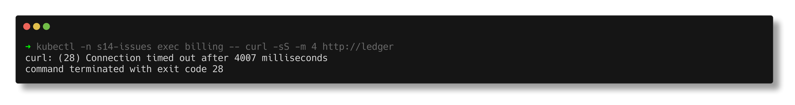
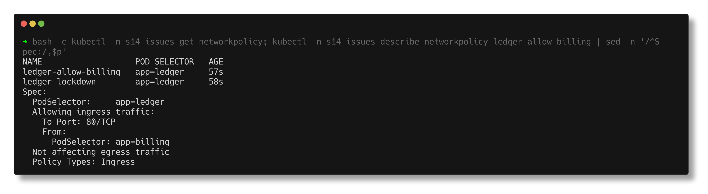
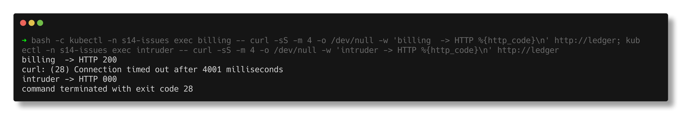

# Pod networking - a NetworkPolicy dropping traffic

> **Submitted by:** Pratyush Mohanty  |  **Roll No.:** 24BCS10238

**Form field:** Kubernetes Troubleshooting · **Course session:** `session-14-kubernetes-troubleshooting`

Run it: `./run.sh` · Verified output: [output.md](output.md) · Manifests: [broken.yaml](broken.yaml) -> [fixed.yaml](fixed.yaml)

`ledger` is locked down with two NetworkPolicies: one that selects it and
allows nothing, and one that allows `app=billing`. Billing still cannot get in.
(kindnet on this kind cluster does enforce NetworkPolicy - I checked with a
deny-all policy before building this.)

## 1. Identify

```text
$ kubectl -n s14-issues exec billing -- curl -sS -m 4 http://ledger
curl: (28) Connection timed out after 4017 milliseconds
HTTP 000 in 4.027563s
command terminated with exit code 28
```

Exit 28 after the full timeout: nothing answered, not even a refusal.
**Refused** means something said no; **timeout** means packets vanished -
the signature of a firewall or NetworkPolicy.



## 2. Investigate - rule out the app and the Service

```text
$ kubectl -n s14-issues exec ledger-588b87f7d7-lsn8q -- wget -qO- http://localhost:8080/
Server address: ::1:8080
Server name: ledger-588b87f7d7-lsn8q

NAME           ADDRESSTYPE   PORTS   ENDPOINTS      AGE
ledger-8lrc5   IPv4          8080    10.244.1.191   41s

$ kubectl -n s14-issues exec billing -- curl -sS -m 4 http://10.244.1.191:8080
curl: (28) Connection timed out after 4807 milliseconds
```

App fine, endpoints fine, and going straight to the pod IP times out too.
kube-proxy is out of the picture, so something on the way **into the pod** is
dropping packets.

## 3. Investigate - the policies

```text
$ kubectl -n s14-issues get networkpolicy
NAME                   POD-SELECTOR   AGE
ledger-allow-billing   app=ledger     54s
ledger-lockdown        app=ledger     55s

$ kubectl -n s14-issues describe networkpolicy ledger-allow-billing
Spec:
  PodSelector:     app=ledger
  Allowing ingress traffic:
    To Port: 80/TCP
    From:
      PodSelector: app=billing

  port=80 targetPort=http
  [{"containerPort":8080,"name":"http","protocol":"TCP"}]
```



Billing matches the `From`. The port does not: the rule allows 80 - the
**Service** port - but the pod receives on 8080.

## 4. Root cause

NetworkPolicy ports are matched against the **pod's** port. By the time a
packet reaches the ledger pod, kube-proxy has already DNAT-ed `ClusterIP:80`
to `podIP:8080`. Nothing allows 8080, the lockdown policy applies, and the
packet is silently dropped.

## 5. Fix

```text
$ kubectl diff -f fixed.yaml
  -    - port: 80
  +    - port: http
```

Using the named port `http` means the policy follows the container port.

## 6. Verify

```text
$ kubectl -n s14-issues exec billing -- curl -sS -m 4 http://ledger
HTTP 200 in 0.088833s
$ kubectl -n s14-issues exec billing -- curl -sS -m 4 http://10.244.1.191:8080
HTTP 200 in 0.129747s

$ kubectl -n s14-issues exec intruder -- curl -sS -m 4 http://ledger
HTTP 000 in 4.002701s
curl: (28) Connection timed out after 4002 milliseconds
```

Billing gets in, the `intruder` pod is still dropped: the policy is fixed, not
removed.


