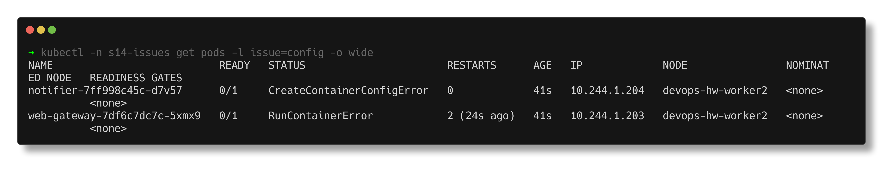
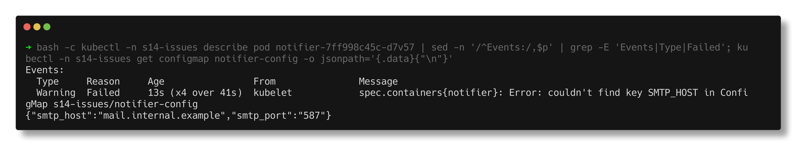
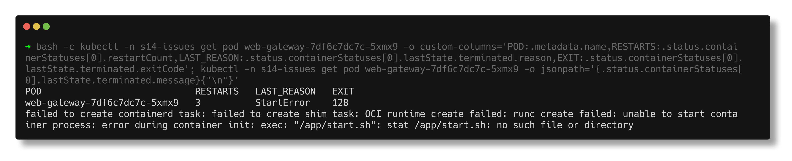
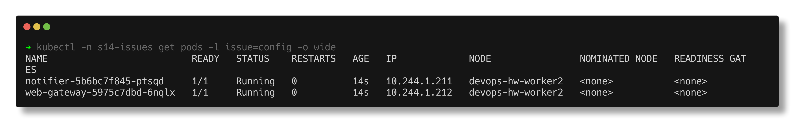

# Configuration issues

> **Submitted by:** Pratyush Mohanty  |  **Roll No.:** 24BCS10238

**Form field:** Kubernetes Troubleshooting · **Course session:** `session-14-kubernetes-troubleshooting`

Run it: `./run.sh` · Verified output: [output.md](output.md) · Manifests: [broken.yaml](broken.yaml) -> [fixed.yaml](fixed.yaml)

The image is fine and the cluster is fine - the YAML is wrong.

| Deployment | What is wrong |
|---|---|
| `notifier` | env var from ConfigMap key `SMTP_HOST`; the key is `smtp_host` |
| `web-gateway` | `command: ["/app/start.sh"]` copied from another service; not in the nginx image |

## 1. Identify

```text
23:43:53  web-gateway-7df6c7dc7c-5xmx9   0/1     RunContainerError   0          2s
23:43:53  notifier-7ff998c45c-d7v57      0/1     CreateContainerConfigError   0          2s
23:43:54  web-gateway-7df6c7dc7c-5xmx9   0/1     RunContainerError            1 (1s ago)   3s
23:44:08  web-gateway-7df6c7dc7c-5xmx9   0/1     CrashLoopBackOff             1 (15s ago)   17s
23:44:09  web-gateway-7df6c7dc7c-5xmx9   0/1     RunContainerError            2 (1s ago)    18s
```

Two statuses that are not CrashLoopBackOff at first:

- `CreateContainerConfigError` - the kubelet could not even **build** the
  container's configuration (env, mounts), so no container exists.
- `RunContainerError` / `StartError` - the container was created but the
  runtime could not **start** its process.



## 2. Investigate - notifier

```text
$ kubectl -n s14-issues logs notifier-7ff998c45c-d7v57
Error from server (BadRequest): container "notifier" in pod "notifier-7ff998c45c-d7v57" is waiting to start: CreateContainerConfigError

    Environment:
      SMTP_HOST:  <set to the key 'SMTP_HOST' of config map 'notifier-config'>  Optional: false
      SMTP_PORT:  <set to the key 'smtp_port' of config map 'notifier-config'>  Optional: false
  Warning  Failed     12s (x4 over 40s)  kubelet            spec.containers{notifier}: Error: couldn't find key SMTP_HOST in ConfigMap s14-issues/notifier-config

$ kubectl -n s14-issues get configmap notifier-config -o jsonpath='{.data}'
  {"smtp_host":"mail.internal.example","smtp_port":"587"}
```



## 3. Investigate - web-gateway

`kubectl logs` returns nothing (the process never ran). `describe`:

```text
    Command:
      /app/start.sh
    State:          Waiting
      Reason:       RunContainerError
    Last State:     Terminated
      Reason:       StartError
      Message:      failed to create containerd task: failed to create shim task: OCI runtime create failed: runc create failed: unable to start container process: error during container init: exec: "/app/start.sh": stat /app/start.sh: no such file or directory
      Exit Code:    128
      Started:      Thu, 01 Jan 1970 05:30:00 +0530
```

(`Started: 1970` is the zero timestamp - the process never started.) A
throwaway pod of the same image confirms the file is not there:

```text
$ kubectl -n s14-issues run probe-nginx --image=nginx:1.27-alpine --restart=Never --command -- ls -l /app/start.sh /docker-entrypoint.sh
  ls: /app/start.sh: No such file or directory
  -rwxr-xr-x    1 root     root          1620 Apr 16  2025 /docker-entrypoint.sh
```



## 4. Root cause

- **notifier:** ConfigMap keys are case-sensitive. `SMTP_HOST` does not exist,
  and a non-optional key reference stops the container from being created at
  all.
- **web-gateway:** `command:` replaces the image's ENTRYPOINT. The script it
  names is not in `nginx:1.27-alpine`, so runc fails the exec (exit 128) on
  every start.

## 5. Fix

```text
$ kubectl diff -f fixed.yaml
  -              key: SMTP_HOST
  +              key: smtp_host
  -      - command:
  -        - /app/start.sh
  -        image: nginx:1.27-alpine
  +      - image: nginx:1.27-alpine
```

## 6. Verify

```text
NAME                          READY   STATUS    RESTARTS   AGE   IP             NODE                NOMINATED NODE   READINESS GATES
notifier-5b6bc7f845-ptsqd     1/1     Running   0          13s   10.244.1.211   devops-hw-worker2   <none>           <none>
web-gateway-5975c7dbd-6nqlx   1/1     Running   0          13s   10.244.1.212   devops-hw-worker2   <none>           <none>

$ kubectl -n s14-issues exec deploy/notifier -- env | grep SMTP
SMTP_HOST=mail.internal.example
SMTP_PORT=587

$ kubectl -n s14-issues exec deploy/web-gateway -- curl -s -o /dev/null -w '%{http_code}' http://localhost/
HTTP 200
```


