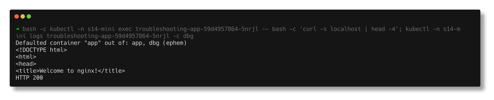
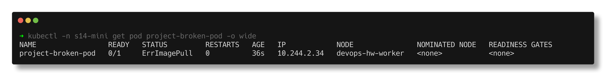
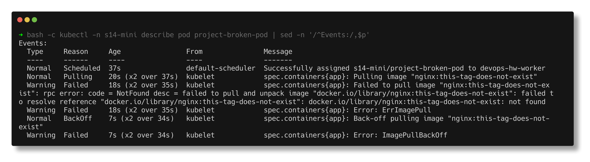
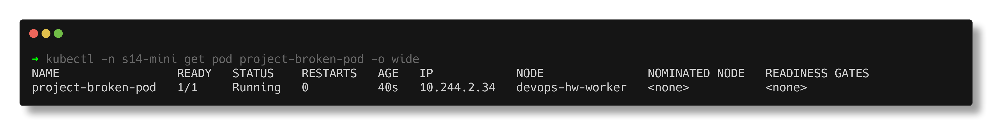
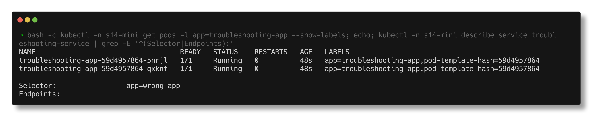
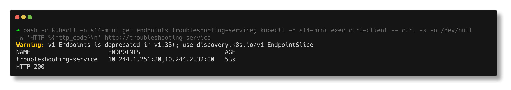

# Kubernetes Troubleshooting Mini-Project

> **Submitted by:** Pratyush Mohanty  |  **Roll No.:** 24BCS10238

**Form field:** Kubernetes Troubleshooting · **Course session:** `session-14-kubernetes-troubleshooting`

Run it: `./run.sh` · Verified output: [output.md](output.md)

The instructor's session-14 mini-project done end to end: deploy an nginx app
behind a Service, observe it, break a pod and a Service, investigate without
touching the YAML first, find the root cause, fix, verify.

| File | What it is |
|---|---|
| [deployment.yaml](deployment.yaml), [service.yaml](service.yaml), [broken-pod.yaml](broken-pod.yaml) | the instructor's manifests, only `namespace: s14-mini` added |
| [service-broken.yaml](service-broken.yaml) | section 8: selector changed to `app: wrong-app` |
| [fixed-pod.yaml](fixed-pod.yaml) | the broken pod with a tag that exists |
| [client-pod.yaml](client-pod.yaml) | a curl pod to test the Service from inside the cluster |

## 1-4. Deploy and observe the healthy app

```text
$ kubectl -n s14-mini get pods -o wide
NAME                                   READY   STATUS    RESTARTS   AGE   IP             NODE                NOMINATED NODE   READINESS GATES
curl-client                            1/1     Running   0          1s    10.244.1.252   devops-hw-worker2   <none>           <none>
troubleshooting-app-59d4957864-5nrjl   1/1     Running   0          2s    10.244.2.32    devops-hw-worker    <none>           <none>
troubleshooting-app-59d4957864-qxknf   1/1     Running   0          2s    10.244.1.251   devops-hw-worker2   <none>           <none>
```

Inside the container, as the task asks:

```text
$ kubectl -n s14-mini exec troubleshooting-app-59d4957864-5nrjl -- bash -c 'curl -s localhost | grep -o "<title>.*</title>"'
<title>Welcome to nginx!</title>
```

I also tried `kubectl debug`, which is what you need when an image has no
shell or curl at all (distroless). It attaches an ephemeral container that
shares the pod's network namespace, so `localhost` is still nginx:

```text
$ kubectl -n s14-mini debug troubleshooting-app-59d4957864-5nrjl --image=curlimages/curl:8.5.0 --container=dbg -- curl -s -o /dev/null -w 'HTTP %{http_code}' http://localhost
$ kubectl -n s14-mini logs troubleshooting-app-59d4957864-5nrjl -c dbg
HTTP 200
```



Service and endpoints were healthy - selector `app=troubleshooting-app`,
`TargetPort: 80/TCP`, two endpoints, and `HTTP 200` from the curl pod. Note the
real deprecation warning: `Warning: v1 Endpoints is deprecated in v1.33+; use
discovery.k8s.io/v1 EndpointSlice`, so I show `get endpointslices` next to it.

## 5-6. The broken pod

```text
23:53:34  project-broken-pod   0/1     ContainerCreating   0          0s
23:53:37  project-broken-pod   0/1     ErrImagePull        0          3s
23:53:51  project-broken-pod   0/1     ImagePullBackOff    0          17s
23:54:05  project-broken-pod   0/1     ErrImagePull        0          31s
```



`describe` -> Events:

```text
  Warning  Failed     17s (x2 over 34s)  kubelet            spec.containers{app}: Failed to pull image "nginx:this-tag-does-not-exist": rpc error: code = NotFound desc = failed to pull and unpack image "docker.io/library/nginx:this-tag-does-not-exist": failed to resolve reference "docker.io/library/nginx:this-tag-does-not-exist": docker.io/library/nginx:this-tag-does-not-exist: not found
  Warning  Failed     17s (x2 over 34s)  kubelet            spec.containers{app}: Error: ErrImagePull
  Normal   BackOff    6s (x2 over 33s)   kubelet            spec.containers{app}: Back-off pulling image "nginx:this-tag-does-not-exist"
```



Cross-checked against the registry (manifest HEAD request, 200 = tag exists):

```text
  nginx:this-tag-does-not-exist   -> 404
  nginx:1.27                      -> 200
```

### The five questions

| # | Question | Answer |
|---|---|---|
| 1 | What is the Pod status? | `0/1`, alternating `ErrImagePull` and `ImagePullBackOff`, RESTARTS 0 (no container was ever created) |
| 2 | What is the actual error? | `Failed to pull image "nginx:this-tag-does-not-exist": ... docker.io/library/nginx:this-tag-does-not-exist: not found` |
| 3 | Which command found it? | `kubectl describe pod project-broken-pod` (the Events section). `kubectl logs` only says `image can't be pulled` |
| 4 | What is wrong with the image? | the repository `nginx` exists, but the tag `this-tag-does-not-exist` does not (registry returns 404) |
| 5 | How would you fix it? | use a real tag. A container image is one of the few pod fields you can change in place: `kubectl set image pod/project-broken-pod app=nginx:1.27`, and put the same change in git ([fixed-pod.yaml](fixed-pod.yaml)) |

The fix, done for real - no delete/recreate, RESTARTS still 0:

```text
$ kubectl -n s14-mini set image pod/project-broken-pod app=nginx:1.27
pod/project-broken-pod image updated
pod/project-broken-pod condition met

$ kubectl apply -f fixed-pod.yaml
pod/project-broken-pod configured

NAME                 READY   STATUS    RESTARTS   AGE   IP            NODE               NOMINATED NODE   READINESS GATES
project-broken-pod   1/1     Running   0          40s   10.244.2.34   devops-hw-worker   <none>           <none>
```



## 8-9. The Service selector challenge

After applying `service-broken.yaml`:

```text
$ kubectl -n s14-mini get endpoints troubleshooting-service
Warning: v1 Endpoints is deprecated in v1.33+; use discovery.k8s.io/v1 EndpointSlice
NAME                      ENDPOINTS   AGE
troubleshooting-service   <none>      47s

$ kubectl -n s14-mini exec curl-client -- curl -sS -m 5 http://troubleshooting-service
HTTP 000
curl: (7) Failed to connect to troubleshooting-service port 80 after 6 ms: Couldn't connect to server
command terminated with exit code 7
```

DNS still resolved the name to the ClusterIP (`10.96.242.66`), so it was not
DNS. Comparing labels with the selector:

```text
troubleshooting-app-59d4957864-5nrjl   1/1     Running   0          48s   app=troubleshooting-app,pod-template-hash=59d4957864
troubleshooting-app-59d4957864-qxknf   1/1     Running   0          48s   app=troubleshooting-app,pod-template-hash=59d4957864

$ kubectl -n s14-mini describe service troubleshooting-service
Selector:                 app=wrong-app
Endpoints:                
```



Re-applying `service.yaml` brought both endpoints back and `HTTP 200`:

```text
troubleshooting-service   10.244.1.251:80,10.244.2.32:80   52s
```



## 11. Troubleshooting table

| Problem | What I saw | Command I used | Root cause | Fix |
|---|---|---|---|---|
| **Broken Pod** | `project-broken-pod 0/1 ErrImagePull`, then `ImagePullBackOff`, RESTARTS 0, `logs` refused | `kubectl get pod`, `kubectl logs` | the container was never created, so there is nothing to run or log | fix the image (below); no restart needed |
| **Service Problem** | endpoints `<none>`, curl exit 7 in a few ms, DNS fine | `kubectl get endpoints`, `describe service`, `get pods --show-labels` | selector `app=wrong-app` matches no pod (pods are `app=troubleshooting-app`) | restore `selector: app: troubleshooting-app` (`kubectl apply -f service.yaml`) |
| **Image Problem** | `docker.io/library/nginx:this-tag-does-not-exist: not found` | `kubectl describe pod` (Events) + registry HEAD -> 404 | tag does not exist in the registry | `kubectl set image ... app=nginx:1.27` / `fixed-pod.yaml` |

## 12. README questions, in my own words

1. **What does `kubectl get` tell us?** The current state in one line per
   object: phase/STATUS, READY count, RESTARTS, age; with `-o wide` also IP and
   node. It answers "what is happening", not "why".
2. **`get` vs `describe`?** `get` is a summary (or the raw object with `-o
   yaml`). `describe` is a human-readable report that also joins in related
   information - container states with exit codes, conditions, mounts, and the
   recent **Events**, which is where the "why" usually is.
3. **Why `kubectl logs`?** To read what the application itself printed. For
   app-level failures (bad config, exceptions) it is the only place the reason
   exists. `--previous` gives the run before the last restart.
4. **When `kubectl exec`?** When the pod is running and I need its point of
   view: is the process listening (`netstat`), what does it resolve (`nslookup`,
   `/etc/resolv.conf`), can it reach another Service (`curl`), what env and files
   did it get.
5. **`CrashLoopBackOff`?** The container keeps exiting and the kubelet is
   waiting an increasing back-off (10s doubling to 5 min) before restarting it.
   The cause is in `logs --previous` or, for `OOMKilled`, in `describe`.
6. **`ImagePullBackOff`?** Pulling the image failed and the kubelet is waiting
   before retrying. `ErrImagePull` is the failed attempt itself. The message in
   Events says which: not found, unauthorized, rate limited, or unreachable.
7. **Why can a Pod stay `Pending`?** The scheduler cannot place it: requests
   bigger than any node's free capacity, a nodeSelector/affinity nothing
   matches, taints without tolerations, or an unbound PVC. `describe` shows a
   `FailedScheduling` event with a per-node tally.
8. **Why can a Service have no endpoints?** Its selector matches no pods, the
   matching pods are not Ready, or they are in another namespace. (ExternalName
   and selector-less Services have none by design.)
9. **Selector vs labels?** A Service has no link to a Deployment; it selects
   pods purely by matching its `spec.selector` against pod labels, and only
   Ready matches become endpoints. One typo on either side breaks it silently.
10. **What is Kubernetes DNS?** CoreDNS in `kube-system`, reached through the
    `kube-dns` Service (10.96.0.10 here, written into every pod's
    `/etc/resolv.conf`). It answers `<service>.<namespace>.svc.cluster.local`
    with the ClusterIP, and the pod's search list lets short names work inside
    the same namespace.

## Notes from actually running this

- The instructor's deployment uses `nginx:1.27`. Earlier the same day the kind
  nodes got `429 Too Many Requests` from Docker Hub for that exact image
  ([03-imagepullbackoff](../02-common-issues/03-imagepullbackoff/README.md)).
  By the time I ran this the nodes had a pull-through mirror configured and the
  pull worked, so the broken pod showed the textbook `not found`.
- I first assumed `nginx:1.27` had no curl, because `sh -c 'command -v bash
  curl'` printed only bash. The image's `sh` is dash, and dash's `command -v`
  printed only the first name it was given. `curl localhost` worked fine when I actually ran
  it.
- `kubectl set image` on a bare pod worked without recreating it - image is one
  of the few mutable pod fields. Almost everything else (env, command, ports)
  needs a delete and re-create, which is another reason to use Deployments.
