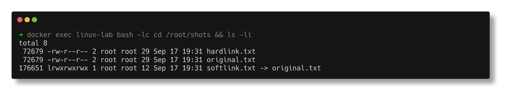
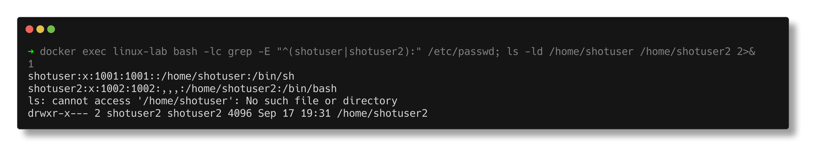
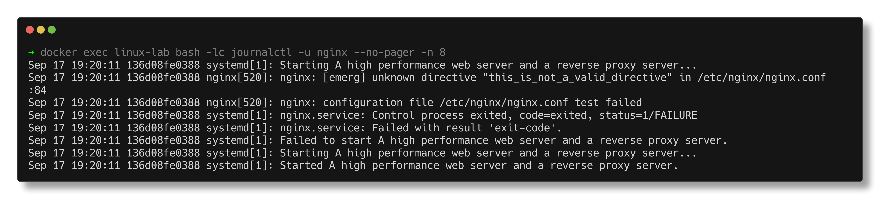
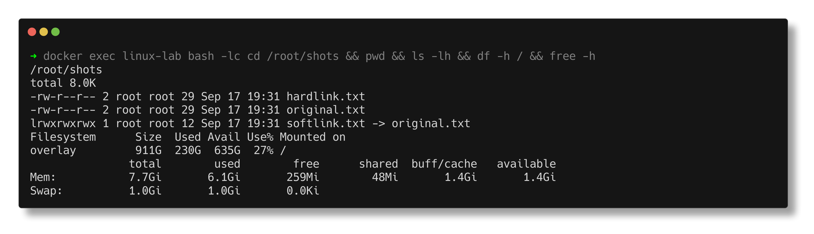

# Linux Fundamentals

> **Submitted by:** Pratyush Mohanty  |  **Roll No.:** 24BCS10238

**Form field:** Linux Fundamentals · **Course session:** `session2-linux`

Four tasks, every command actually executed on a real Linux system. Each
`output.md` is a verbatim transcript, not illustrative text.

| # | Task | Docs | Script | Verified output |
|---|---|---|---|---|
| 1 | Soft link & hard link | [README](task-01-links/README.md) | [practice.sh](task-01-links/practice.sh) | [output.md](task-01-links/output.md) |
| 2 | `adduser` vs `useradd` | [README](task-02-adduser-vs-useradd/README.md) | [practice.sh](task-02-adduser-vs-useradd/practice.sh) | [output.md](task-02-adduser-vs-useradd/output.md) |
| 3 | `journalctl` | [README](task-03-journalctl/README.md) | [practice.sh](task-03-journalctl/practice.sh) | [output.md](task-03-journalctl/output.md) |
| 4 | Linux command cheat sheet | [README](task-04-command-cheatsheet/README.md) | [practice.sh](task-04-command-cheatsheet/practice.sh) | [output.md](task-04-command-cheatsheet/output.md) |

---

## How to run it

This work was done on macOS, which has no `useradd`, `adduser`, `journalctl` or
systemd. So rather than write about commands I couldn't run, I built a real
Linux environment: **Ubuntu 22.04 with systemd as PID 1** (a plain
`docker run ubuntu` gives you neither `systemctl` nor `journalctl`).

```bash
./lab/lab.sh up        # start it - repo is mounted at /work
./lab/lab.sh exec /work/linux-fundamentals/task-01-links/practice.sh
./lab/lab.sh exec /work/linux-fundamentals/task-02-adduser-vs-useradd/practice.sh
./lab/lab.sh exec /work/linux-fundamentals/task-03-journalctl/practice.sh
./lab/lab.sh exec /work/linux-fundamentals/task-04-command-cheatsheet/practice.sh
./lab/lab.sh down
```

Verified: `PID1: systemd`, `Ubuntu 22.04.5 LTS`, `systemctl is-system-running -> running`.
See [lab/](../lab/) for the Dockerfile.

---

## Task 1 - Soft link & hard link

The core idea: **a filename is not the file.** A directory entry maps a *name*
to an *inode number*; the inode is the actual file. A hard link is a second name
for the same inode; a soft link is a separate little file containing a *path*.

```text
4206376 -rw-r--r-- 2 root root 29 original.txt     <-- same inode, link count 2
4206376 -rw-r--r-- 2 root root 29 hardlink.txt     <-- same inode, link count 2
4206377 lrwxrwxrwx 1 root root 12 softlink.txt -> original.txt
```

Deleting the original proves the difference - the hard link survives (count 2->1),
the soft link dangles:

```text
--- hardlink.txt (still works): ---
hello from the original file
--- softlink.txt (now broken): ---
cat: softlink.txt: No such file or directory
```

Both limits captured as real errors:
```text
ln: realdir: hard link not allowed for directory
ln: failed to create hard link 'xfs-hard.txt' => '/dev/shm/other-fs.txt': Invalid cross-device link
```
Includes a full comparison table, why each restriction exists, and 9 interview Q&As.



## Task 2 - `adduser` vs `useradd`

Proven rather than asserted. `file` shows what they are, and `grep` shows
`adduser` **calling** `useradd`:

```text
/usr/sbin/useradd: ELF 64-bit LSB pie executable, ARM aarch64 ... stripped
/usr/sbin/adduser: Perl script text executable

461:    my $useradd = &which('useradd');
466:        &systemcall($useradd, '-d', $home_dir, '-g', $ingroup_name, '-s', ...
```

Both run, and the difference is stark:
```text
test-useradd:x:1000:1000::/home/test-useradd:/bin/sh      <-- no home dir, /bin/sh, LOCKED
test-adduser:x:1001:1001:,,,:/home/test-adduser:/bin/bash <-- home + /etc/skel, bash
```

**Recommended on Ubuntu: `adduser`** for interactive work (complete by default,
follows Debian policy, prompts for a password so you can't leave a locked
account). **`useradd` in scripts and Dockerfiles** - non-interactive and
portable, since `adduser` on RHEL is just a symlink to `useradd` with different
arguments. Test user `devops-test` created with the recommended command.



## Task 3 - `journalctl`

What it is, where it stores logs, and filtering by time, priority, boot and unit.
The heart of it is a **real failure**: the script breaks `nginx.conf` on purpose,
restarts, and walks the actual troubleshooting loop.

```text
systemd:  Job for nginx.service failed ...                    (tells you nothing)
status:   Active: failed (Result: exit-code)                  (tells you it broke)
journal:  nginx: [emerg] unknown directive "this_is_not_a_valid_directive"
                 in /etc/nginx/nginx.conf:84                  (tells you WHY, with a line number)
```

Then repairs it and shows the recovery on the same timeline. The habit to build:
`systemctl status <svc>` -> is it up? -> `journalctl -xeu <svc>` -> why not?



## Task 4 - Linux command cheat sheet

18 sections, ~150 commands, organised by what you're trying to *do*: navigation,
viewing, `grep`, `find`, text processing, pipes and redirection, file ops,
permissions, users, processes, system info, networking, archives, services,
packages, history. Every command ran for real against seeded data.



---

## Things that only come out of actually running it

- **`journalctl` pipes to `less` by default.** In a script, `--no-pager` or it
  hangs forever.
- **`deluser --remove-home` fails with exit 8** on a minimal Ubuntu image:
  `you need to install the 'perl' package`. `deluser` is a Perl script and only
  `perl-base` ships by default. `userdel -r` (a binary) has no such dependency.
- **Disk full but `df` shows space free** -> you're out of **inodes**, not bytes.
  Check `df -i`.
- **Deleted a big log but space didn't return** -> a process still holds the file
  open; the inode isn't freed until the last descriptor closes. `lsof | grep deleted`.
