# Monitoring - Metrics, Logs, Alerts, CPU, Memory and Health

> **Submitted by:** Pratyush Mohanty  |  **Roll No.:** 24BCS10238

**Form field:** Monitoring · **Course session:** `session-20-monitoring-observability-gitops`

Run it: `./run.sh` (check, up, demo, down)  ·  Verified output: [output.md](output.md)

A small Python service I wrote (`orders-api`) runs next to a full Prometheus stack in
Docker Compose. The script puts load on it, burns CPU, eats memory, raises the error rate
and finally kills it, and watches each alert go **inactive -> pending -> firing -> resolved**
through the real Prometheus and Alertmanager APIs.

| File | What it is |
|---|---|
| [app/app.py](app/app.py) | The demo service: `/api/orders`, `/health`, `/metrics`, `/stress/cpu`, `/stress/memory`, `/admin/error-rate`; JSON logs |
| [app/alert_receiver.py](app/alert_receiver.py) | Webhook that stands in for Slack/PagerDuty and prints every notification |
| [docker-compose.yml](docker-compose.yml) | The stack, every image tag pinned |
| [prometheus/prometheus.yml](prometheus/prometheus.yml) | Scrape config (app, node-exporter, cAdvisor, blackbox `/health` probe) |
| [prometheus/alert-rules.yml](prometheus/alert-rules.yml) | 8 alert rules: AppDown, HealthCheckFailing, HighCPU, HighMemory, HighErrorRate, HighLatencyP95, HostHighCPU, HostLowMemory |
| [prometheus/alert-rules.test.yml](prometheus/alert-rules.test.yml) | `promtool test rules` unit tests for the alerts |
| [alertmanager/alertmanager.yml](alertmanager/alertmanager.yml) | Routing, grouping, repeat interval, one inhibit rule |
| [grafana/](grafana/) | Provisioned datasources and two dashboards (metrics, logs) |
| [loki/](loki/loki-config.yml), [alloy/](alloy/config.alloy) | Log storage and the log shipper |

| Component | Image | Port on the Mac | Job |
|---|---|---|---|
| orders-api | built from `app/` (python:3.13-slim) | 18010 | the thing being monitored |
| Prometheus | quay.io/prometheus/prometheus:v3.15.0 | 19190 | scrapes, stores, evaluates rules |
| Alertmanager | quay.io/prometheus/alertmanager:v0.34.1 | 19193 | groups, inhibits, routes, notifies |
| Grafana | grafana/grafana:13.2.3 | 13030 | dashboards (anonymous Viewer on) |
| node-exporter | quay.io/prometheus/node-exporter:v1.12.1 | - | host CPU / memory |
| cAdvisor | gcr.io/cadvisor/cadvisor:v0.55.1 | - | per-container CPU / memory |
| blackbox-exporter | quay.io/prometheus/blackbox-exporter:v0.29.0 | - | probes `/health` from outside |
| Loki + Alloy | grafana/loki:3.7.8, grafana/alloy:v1.20.1 | 13100 | logs |

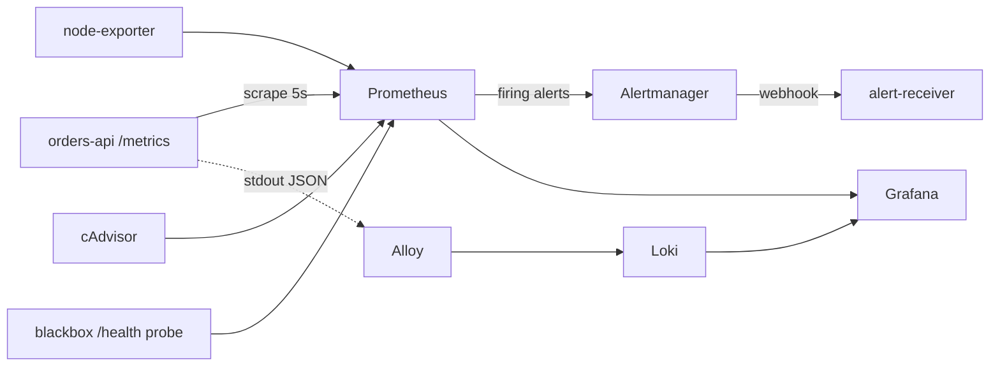

---

## 1. Metrics

Prometheus **pulls**: every 5 seconds it GETs `/metrics` from each target. The app uses
`prometheus_client` and exposes the four things worth knowing about any request-serving
service (rate, errors, duration, saturation):

```text
process_resident_memory_bytes 4.124672e+07
process_cpu_seconds_total 0.62
app_requests_total{endpoint="/health",method="GET",status="200"} 1.0
app_requests_total{endpoint="/api/orders",method="GET",status="200"} 2.0
# HELP app_request_duration_seconds Time spent serving a request
# TYPE app_request_duration_seconds histogram
app_request_duration_seconds_bucket{endpoint="/api/orders",le="0.05"} 1.0
app_request_duration_seconds_bucket{endpoint="/api/orders",le="0.1"} 1.0
app_request_duration_seconds_bucket{endpoint="/api/orders",le="0.25"} 2.0
```

- `app_requests_total` is a **counter** (only goes up) - you never graph it raw, you graph `rate()`.
- `app_request_duration_seconds` is a **histogram** - buckets, so p50/p95/p99 can be computed in PromQL.
- `process_*` come free from the client library: CPU seconds and resident memory of the process.

Under ~10 req/s of background load:

```text
request rate (req/s), by endpoint:
  /health      0.309
  /api/orders  9.108
  /            2.273
p50 latency /api/orders:  0.067s
p95 latency /api/orders:  0.413s
error ratio (5xx / all):  0.012
app process CPU (cores):  0.057
app process RSS (MiB):    39.461
host CPU used (%):        62.478
```

The p95 is a good lesson in histograms. The real latencies are 20-250 ms (Loki, computing
from the raw log lines, gave an exact p95 of **254.6 ms**), but Prometheus says **413 ms**:
the 95th percentile falls inside the `0.25 - 0.5` bucket and `histogram_quantile` can only
interpolate linearly inside a bucket. Bucket boundaries should sit near the SLO you care about.

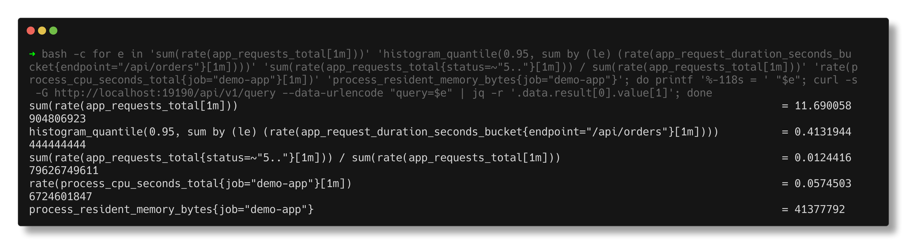

## 2. CPU utilisation

`/stress/cpu?seconds=110` spins one core in a background thread. Rule:
`rate(process_cpu_seconds_total[1m]) > 0.8 for 30s`.

```text
  18:18:56 UTC  t+  0s  HighCPU            inactive  value=-
  18:19:54 UTC  t+ 58s  HighCPU            pending   value=0.848
  18:20:18 UTC  t+ 82s  HighCPU            inactive  value=-
  gave up after 180s
```

On the captured run it **never fired**, and that is the honest result: other demos were
loading the Docker VM at the same time (the kind nodes alone were using ~9 cores), so the
spinning thread only got 0.77 - 0.84 of a core. The rate crossed 0.8, the alert went
**pending**, dipped under 0.8 inside the 30 s `for:` window and went back to inactive. That
is exactly what `for:` is for - a borderline value does not page anyone. In my earlier,
quieter trial run of the same script it did fire:

```text
  23:31:12  t+  0s  HighCPU            inactive
  23:32:00  t+ 48s  HighCPU            pending (value 0.835)
  23:32:00  t+  0s  HighCPU            pending (value 0.835)
  23:32:04  t+  4s  HighCPU            pending (value 0.925)
  23:32:10  t+ 10s  HighCPU            pending (value 1.004)
  23:32:14  t+ 14s  HighCPU            pending (value 1.005)
  23:32:28  t+ 28s  HighCPU            firing (value 1.005)
```

(that trial printed local IST times, repeated a line per value change and restarted the
counter between pending and firing, which is why I changed the helper). The CPU spike is clearly visible in three places at once
on the dashboard: the process metric, cAdvisor's container CPU, and node-exporter's host CPU.
The dashed line on the "App process CPU" panel in the screenshot sits at 0.7 because I was
trying a lower threshold in the dashboard while that run was going; the rule stayed at 0.8.

## 3. Memory utilisation and application health

`/stress/memory?mb=350` makes the app hold 350 MB. `/health` is written to report
`degraded` (HTTP 503) above 300 MB, so this one action shows the difference between
**the process is up** and **the application is healthy**:

```text
before: RSS = 19.461 MiB
after:  RSS = 369.461 MiB

$ curl -i http://localhost:18010/health
HTTP/1.1 503 SERVICE UNAVAILABLE
{"held_memory_mb":350,"reason":"holding 350 MB > limit 300 MB","service":"orders-api","status":"degraded","uptime_s":269,"version":"1.0.0"}

  18:22:06 UTC  t+  0s  HighMemory         pending   value=387407872
  18:22:39 UTC  t+ 33s  HighMemory         firing    value=385048576
  18:22:39 UTC  t+  0s  HealthCheckFailing firing    value=0
cAdvisor sees the same thing from the cgroup: container working set = 368.98 MiB
up{job="demo-app"} = 1   probe_success{job="app-health"} = 0
```

`up == 1` (Prometheus can scrape it) while `probe_success == 0` (the blackbox exporter's
GET of `/health` fails). Watching only `up` would have missed this. After
`/stress/release` both alerts resolved within 10 s.

## 4. Alerts, end to end

**Error rate** - `/admin/error-rate?value=0.3`, rule is 5xx ratio > 5% for 30 s:

```text
  18:22:49 UTC  t+  0s  HighErrorRate      inactive  value=-
  18:23:04 UTC  t+ 15s  HighErrorRate      pending   value=0.066
  18:23:34 UTC  t+ 45s  HighErrorRate      firing    value=0.188
```

**App down** - `docker compose stop app`:

```text
18:23:34 $ docker compose stop app
  18:23:37 UTC  t+  0s  AppDown            inactive  value=-
  18:23:44 UTC  t+  7s  AppDown            pending   value=0
  18:24:14 UTC  t+ 37s  AppDown            firing    value=0

Alertmanager says (GET /api/v2/alerts) - note HealthCheckFailing is SUPPRESSED by the inhibit rule:
  HighErrorRate       severity=critical  state=active      inhibitedBy=0  startsAt=18:23:28
  AppDown             severity=critical  state=active      inhibitedBy=0  startsAt=18:24:08
  HealthCheckFailing  severity=warning   state=suppressed  inhibitedBy=1  startsAt=18:24:08

18:24:43 $ docker compose start app
  18:24:46 UTC  t+  0s  AppDown            firing    value=0
  18:24:58 UTC  t+ 12s  AppDown            inactive  value=-
```

7 s to notice (one scrape interval plus one evaluation), then 30 s of `for:`. Prometheus
fires **both** AppDown and HealthCheckFailing (the probe also fails when the app is gone),
but Alertmanager's inhibit rule mutes the health-check alert because the more important
AppDown already explains it. One page instead of two.

What actually reached the "pager" (the webhook receiver), firing and resolved:

```text
  firing    HealthCheckFailing  warning   started 18:22:33
  firing    HighMemory          warning   started 18:22:33
  resolved  HighMemory          warning   started 18:22:33  ended 18:22:43
  resolved  HealthCheckFailing  warning   started 18:22:33  ended 18:22:43
  firing    HighErrorRate       critical  started 18:23:28
  firing    AppDown             critical  started 18:24:08
  resolved  HighErrorRate       critical  started 18:23:28  ended 18:24:28
  resolved  AppDown             critical  started 18:24:08  ended 18:24:53
```

No HealthCheckFailing notification during the outage - the inhibition worked.

The alert rules are also unit tested before anything starts (`promtool test rules`): fake
series go in, and the test asserts AppDown is *not* firing 15 s into an outage but *is*
firing after 40 s.

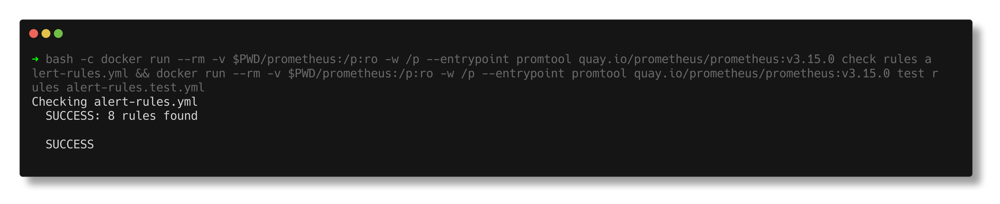

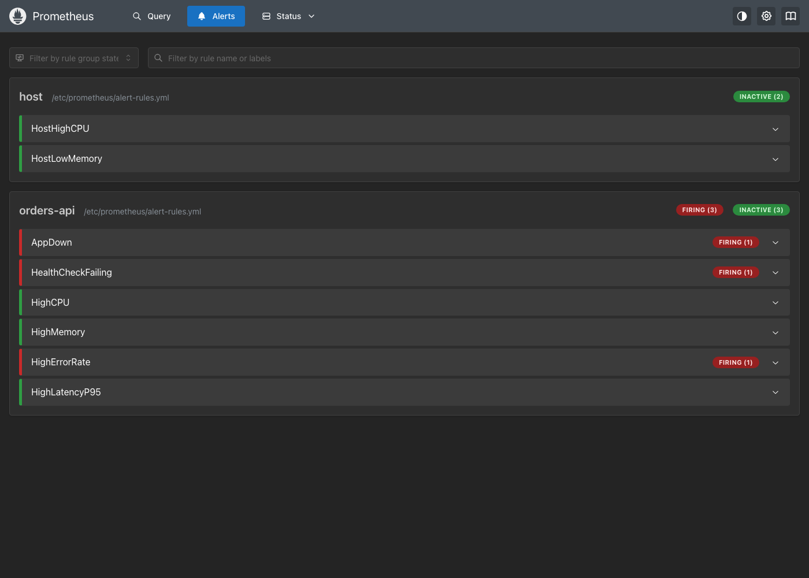

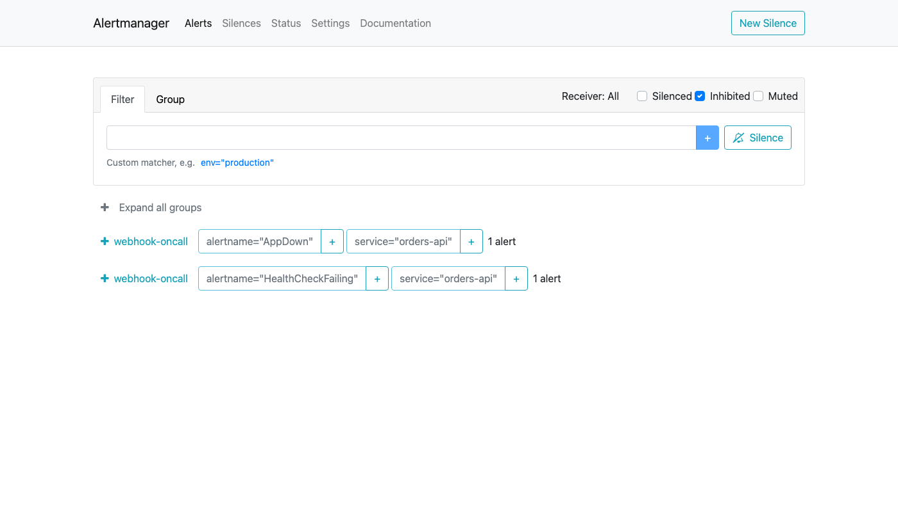

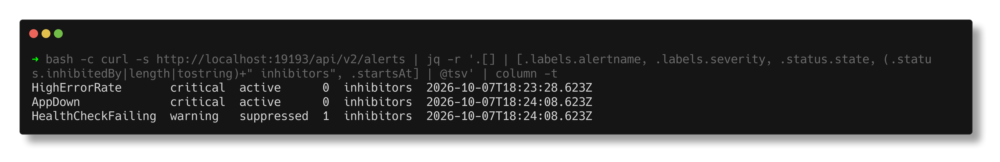

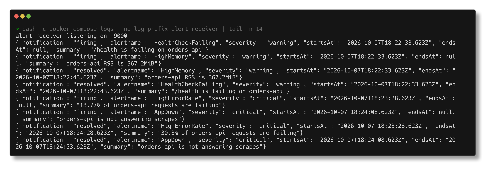

## 5. Logs

The app writes **one JSON object per line** to stdout - no log files, no regex parsing:

```text
{"ts": "2026-10-07T18:25:21.698Z", "level": "INFO", "service": "orders-api", "msg": "request", "method": "GET", "path": "/api/orders", "status": 200, "duration_ms": 250.9, "client": "loadgen"}
```

Grafana Alloy discovers the compose containers through the Docker socket, tails their
output and pushes it to Loki. Only `service`, `container` and `level` become labels; the
rest is parsed at query time with `| json`. LogQL against the same incident:

```text
LogQL: errors in the last 10 minutes, parsed from the JSON body
  sum by (level) (count_over_time({service="app"} | json | status >= 500 [10m]))
  level=ERROR  count=218

LogQL: the WARNING lines (what the stress endpoints and admin calls logged)
  {"ts": "2026-10-07T18:18:56.374Z", "level": "WARNING", "service": "orders-api", "msg": "cpu burn started", "seconds": 110}
  {"ts": "2026-10-07T18:21:59.909Z", "level": "WARNING", "service": "orders-api", "msg": "memory allocated", "added_mb": 350, "held_mb": 350}
  {"ts": "2026-10-07T18:22:49.619Z", "level": "WARNING", "service": "orders-api", "msg": "error rate changed", "error_rate": 0.3}
  {"ts": "2026-10-07T18:23:34.704Z", "level": "WARNING", "service": "orders-api", "msg": "error rate changed", "error_rate": 0.02}
```

The WARNING lines are the "what changed?" answer to every alert above, with exact times.

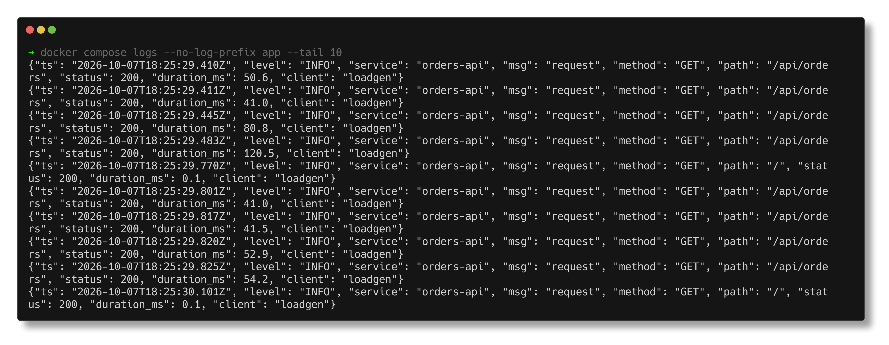

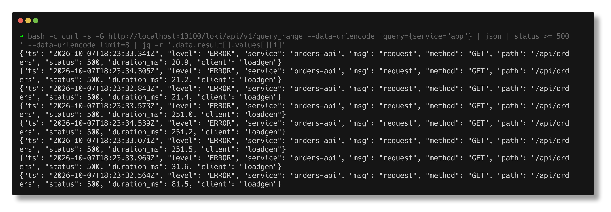

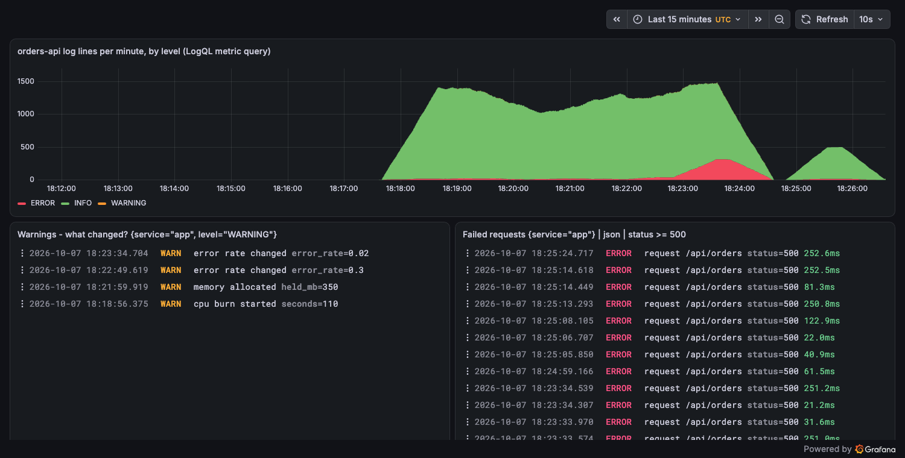

## 6. The dashboard

Provisioned from [grafana/dashboards/orders-api.json](grafana/dashboards/orders-api.json),
so a fresh Grafana comes up with it. Top row is the "is it OK right now" view (up, health
probe, request rate, error ratio, p95, alerts firing); below are request rate, latency
percentiles, error ratio, process CPU and memory with the alert thresholds drawn as dashed
lines, cAdvisor per-container CPU/memory, node-exporter host CPU/memory, an alert-state
timeline (orange = pending, red = firing) and the ERROR/WARNING log lines from Loki. Every
event in this README is visible on it: the CPU hump, the 350 MB spike, the error burst, the
gap where the app was stopped.

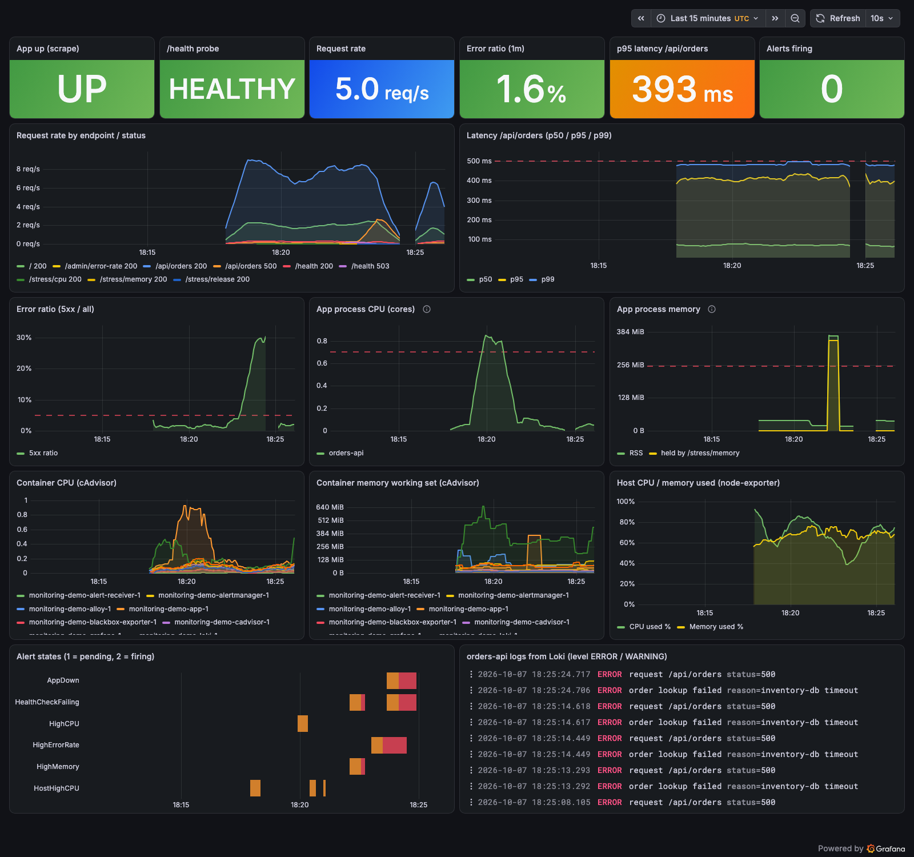

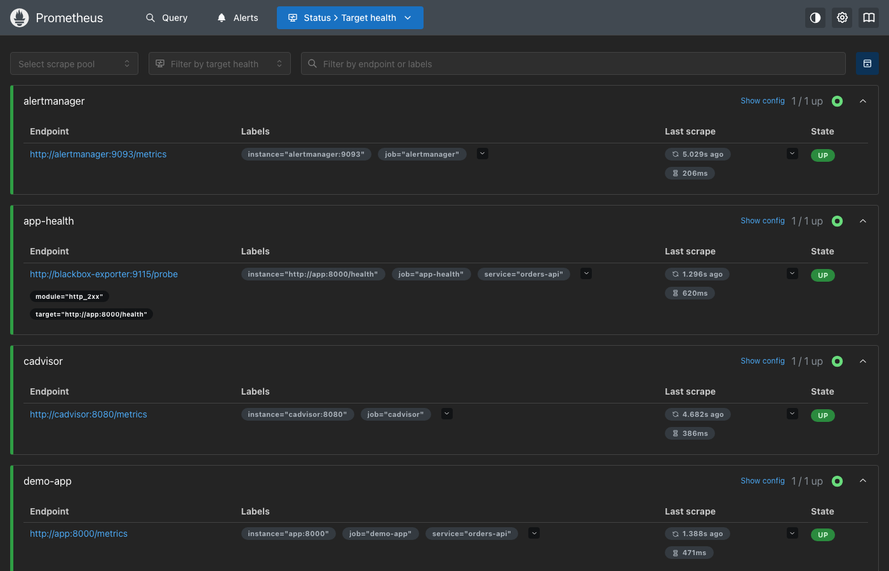

## 7. Kubernetes side: `kubectl top`

The cluster has metrics-server, so the Metrics API works:

```text
NAME                      CPU(cores)   CPU(%)   MEMORY(bytes)   MEMORY(%)
devops-hw-control-plane   2827m        18%      1713Mi          21%
devops-hw-worker          1871m        12%      954Mi           12%
devops-hw-worker2         2184m        14%      797Mi           10%
```

`kubectl top` is a point-in-time number for humans and the HPA, not monitoring - it keeps
no history and cannot alert. See [../02-observability](../02-observability/README.md#5-kubernetes-observability)
for where these numbers come from.

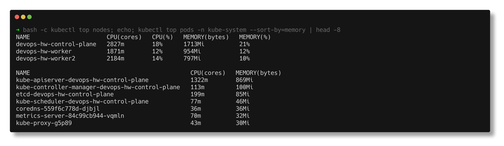

---

## Notes from actually running this

- **node-exporter's documented mount fails on Docker Desktop.** `/:/host:ro,rslave` gives
  `path / is mounted on / but it is not a shared or slave mount`. Plain `/:/host:ro` works.
- **cAdvisor saw no containers at first.** It only exported `id="/"`. Its log said the
  docker factory failed: mounting `/var/run` (as the docs show) does not expose Docker
  Desktop's socket. Mounting `/var/run/docker.sock` fixed that, then it failed again on
  `/run/containerd/containerd.sock`, because Docker 29 uses the containerd image store.
  Mounting the containerd socket too finally gave per-container names.
- **Docker Hub rate limit (429)** mid-pull. The Prometheus images come from `quay.io/prometheus/*`
  instead, which is the project's own registry anyway.
- **gunicorn 26 + a system user with no home** logged `Control server error: Permission denied: '/home/app'`
  (gunicorn's new control socket). `useradd -m` fixed it.
- **Headless Chrome writes the PNG but never exits** on single-page apps (Alertmanager,
  Grafana). The script waits for the file, then kills Chrome.
- **Grafana Explore is not open to anonymous Viewers**, so the Explore URL just redirected
  home. I built a second provisioned dashboard for logs instead.
- **Loki `| json` with no field list turns every field into a label**, so `max_over_time(... | unwrap duration_ms)`
  returned one series per log line (the unique `ts` was a label). `| json path, duration_ms`
  extracts only what is needed.
- **HighCPU flapped instead of firing** on a busy host - see section 2.
- **My "wait for all targets UP" loop passed too early** on the captured run: right after
  start Prometheus returns an empty target list, and "zero targets down" was true. That is
  why the target table in STEP 3 of the output is empty (the targets screenshot, taken
  later, shows all six UP). The loop now treats an empty list as "not ready".

## Interview Q&A

**Q: Why does Prometheus pull instead of having apps push?**
The server controls the rate, a failed scrape is itself a signal (`up == 0`), and targets
come from service discovery so nothing has to be configured in the app. For short batch
jobs that end before a scrape, there is the Pushgateway.

**Q: Counter vs gauge vs histogram?**
Counter only increases (requests, errors) - always use `rate()`. Gauge goes up and down
(memory, queue length). Histogram counts observations into buckets so quantiles can be
computed and aggregated across instances.

**Q: What does `for:` in an alert rule do?**
The expression must stay true for that long before the alert fires; until then it is
pending. It stops one bad scrape or a brief spike from paging someone - section 2 shows a
real case where it did exactly that.

**Q: Prometheus already evaluates alerts - why Alertmanager?**
Prometheus decides *whether* something is wrong. Alertmanager decides *who hears about it
and how often*: grouping, de-duplication across Prometheus replicas, silences during
maintenance, inhibition (AppDown mutes HealthCheckFailing here) and routing to
Slack/PagerDuty/email.

**Q: The process is up but users get errors. Which metric catches it?**
Not `up`. A black-box probe of a real health endpoint (`probe_success`), or the error ratio
from the app's own request counter. Here `up` stayed 1 while `/health` returned 503.

**Q: What would you alert on for a web service?**
Symptoms users feel: error ratio, latency (p95/p99) and availability, ideally against an
SLO. Causes like CPU and memory are better on dashboards or as low-severity warnings -
high CPU that hurts nobody should not wake anyone up.

**Q: Why is high label cardinality dangerous in Prometheus?**
Every unique label combination is a separate time series held in memory. A `user_id` or
`request_id` label multiplies series by millions and takes the server down. Per-request
detail belongs in logs or traces.

**Q: Logs in Loki vs Elasticsearch?**
Loki indexes only a few labels and stores the log text compressed, then filters at query
time - cheap to run, slower for full-text search. Elasticsearch indexes every word - fast
search, much more storage and memory.

**Q: How do you test alert rules?**
`promtool check rules` for syntax and `promtool test rules` with synthetic series and
expected alerts at given times, run in CI like any other test.
