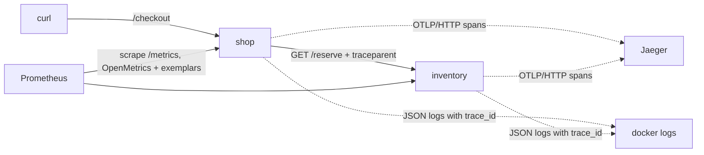
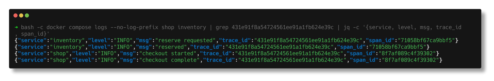
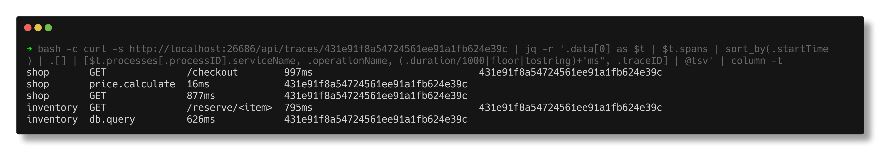
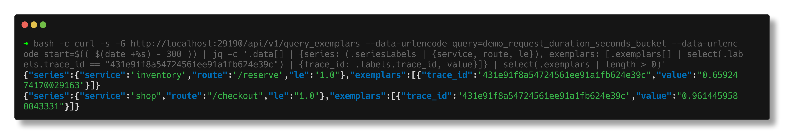
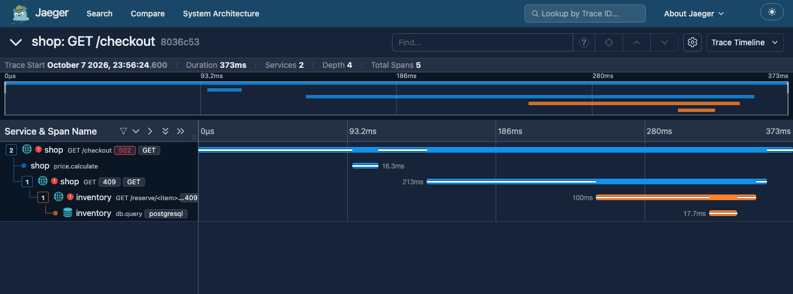
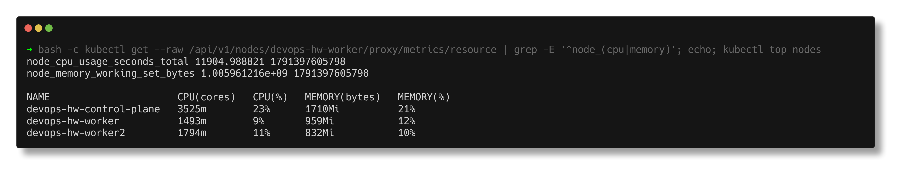

# Observability - Metrics, Logs and Traces

> **Submitted by:** Pratyush Mohanty  |  **Roll No.:** 24BCS10238

**Form field:** Observability · **Course session:** `session-20-monitoring-observability-gitops`

Run it: `./run.sh` (up, demo, k8s, down)  ·  Verified output: [output.md](output.md)

This is mostly documentation, backed by one small real demo: two Python services (`shop`
calls `inventory`) instrumented with **OpenTelemetry**, sending traces to **Jaeger**, logging
JSON lines that carry the **trace_id**, and exposing a latency histogram whose samples carry
the same trace_id as a Prometheus **exemplar**. One request, findable in all three signals.

| File | What it is |
|---|---|
| [services/telemetry.py](services/telemetry.py) | Shared setup: OTel tracer + OTLP exporter, Flask/requests auto-instrumentation, JSON log formatter that adds trace_id/span_id, histogram with exemplars |
| [services/shop.py](services/shop.py) | `/checkout` - a manual `price.calculate` span, then an HTTP call to inventory |
| [services/inventory.py](services/inventory.py) | `/reserve/<item>` - a `db.query` span; `gpu` is slow on purpose, `unicorn` is out of stock |
| [docker-compose.yml](docker-compose.yml) | shop, inventory, `jaegertracing/jaeger:2.22.0` (UI on 26686), Prometheus v3.15.0 with exemplar storage |

---

## 1. Why observability is required

**Monitoring** answers questions you decided on in advance: is CPU above 80%, is the error
rate above 5%, is the service up. That covers the **known unknowns** - failure modes you
already know can happen, so you built a dashboard or an alert for them (that is what
[01-monitoring](../01-monitoring/README.md) does).

**Observability** is being able to answer a question you did *not* think of in advance,
from the telemetry you already have, without shipping new code. That is what you need for
**unknown unknowns**: "checkout is slow, but only for some items, only since Tuesday".

| | Monitoring | Observability |
|---|---|---|
| Question | Is something wrong? | Why is it wrong, where, for whom? |
| Failure modes | Known, predicted | New, never seen before |
| Typical output | Dashboards, alerts | Ad-hoc queries, traces, high-detail events |
| Works best on | A few big components | Distributed systems, microservices |

Why it became necessary: one user request now crosses a load balancer, a gateway, several
services, a queue and a couple of databases, each with its own replicas. "The site is slow"
has dozens of candidate causes, and averages on a per-service dashboard hide the one bad
path. You need to follow the individual request.

## 2. The three pillars

### Metrics - numbers over time

A metric is a named number sampled at intervals, with labels:
`demo_request_duration_seconds_bucket{service="shop", route="/checkout", le="1.0"} 2.0`.
Types: counter (only up), gauge (up and down), histogram (bucketed observations, for
percentiles), summary (quantiles computed in the client).

- **Strengths**: tiny and cheap to store, fast to aggregate across thousands of instances,
  easy to graph and alert on, kept for months.
- **Limits**: pre-aggregated, so they lose per-request detail - a p95 tells you *that*
  something is slow, not *which* request or *why*.
- **Cardinality** is the catch. Every unique label combination is its own series:
  10 routes x 5 status codes x 4 methods = 200 series. Add a `user_id` label with a million
  users and it is 200 million series, which takes Prometheus down. Unbounded values (user,
  request id, full URL) never go in metric labels.

### Logs - discrete events

A log line is a timestamped record of something that happened, ideally **structured**
(JSON) so fields can be queried: `{"level":"ERROR","msg":"out of stock","item":"unicorn","trace_id":"8036c5..."}`.

- **Strengths**: full detail and context (the exact error, the input, the user); good for
  audit trails; any field can be high-cardinality.
- **Limits**: the most expensive signal by volume; hard to aggregate; a log line on its own
  does not show which other services the same request touched - unless it carries a
  trace_id.

### Traces - the path of one request

A **trace** is the whole journey of one request; it is a tree of **spans**. A span is one
unit of work (an HTTP handler, an outgoing call, a DB query) with a start time, duration,
attributes, status and a parent. The trace context travels between services in the W3C
`traceparent` header (`00-<trace_id>-<parent_span_id>-<flags>`), injected and extracted by
the OpenTelemetry instrumentation.

- **Strengths**: shows exactly where time went and which hop failed, across services.
- **Limits**: needs instrumentation in every service, and storing every trace is costly, so
  production systems **sample** - head sampling (decide at the start, e.g. keep 10%) or tail
  sampling (decide after the trace completes, e.g. keep all errors and slow ones).

### When to use which

| Question | Signal |
|---|---|
| Is the error rate above the SLO? Should I page someone? | Metrics |
| How has p95 latency changed this week? | Metrics |
| Which service, which hop, made this request slow? | Traces |
| What exactly went wrong for this request / this customer? | Logs |
| What changed just before the incident? | Logs (deploy, config events) + metrics |

They are most useful **linked**: alert on a metric -> jump through an exemplar to a trace ->
open the logs for that trace_id. That is what the demo shows.

## 3. The demo: one request, three signals



### A slow request

```text
$ curl 'http://localhost:18020/checkout?item=gpu'
{"item":"gpu","price":54999,"reservation":"R-69771","trace_id":"431e91f8a54724561ee91a1fb624e39c"}
  (HTTP 200, 1.045267s)
```

**Logs** - both services, one trace_id (note inventory received the `traceparent` header
with the same id):

```text
{"service":"inventory","level":"INFO","msg":"reserve requested","trace_id":"431e91f8a54724561ee91a1fb624e39c","span_id":"71058bf67ca9bbf5","item":"gpu","traceparent":"00-431e91f8a54724561ee91a1fb624e39c-5a89656192852011-03"}
{"service":"inventory","level":"INFO","msg":"reserved","trace_id":"431e91f8a54724561ee91a1fb624e39c","span_id":"71058bf67ca9bbf5","item":"gpu","remaining":1}
{"service":"shop","level":"INFO","msg":"checkout started","trace_id":"431e91f8a54724561ee91a1fb624e39c","span_id":"8f7af089c4f39302","item":"gpu"}
{"service":"shop","level":"INFO","msg":"checkout complete","trace_id":"431e91f8a54724561ee91a1fb624e39c","span_id":"8f7af089c4f39302","item":"gpu","price":54999}
```

**Trace** - from Jaeger's API, as a tree with [start offset, duration]:

```text
  shop: GET /checkout  [+0ms, 997ms]  
    shop: price.calculate  [+38ms, 16ms]  
    shop: GET  [+97ms, 877ms]  
      inventory: GET /reserve/<item>  [+145ms, 795ms]  
        inventory: db.query  [+191ms, 626ms]  db.statement=SELECT qty FROM stock WHERE sku = $1 FOR UPDATE
```

The answer is right there: 626 of the 997 ms is one database query in inventory. No log
line or dashboard would have said that so directly.

**Metric** - the histogram sample recorded for this request carries the trace_id:

```text
  demo_request_duration_seconds_bucket{service="inventory", route="/reserve", status="200", le="1.0"}  exemplar value=0.6592474170029163s  trace_id=431e91f8a54724561ee91a1fb624e39c
  demo_request_duration_seconds_bucket{service="shop", route="/checkout", status="200", le="1.0"}  exemplar value=0.9614459580043331s  trace_id=431e91f8a54724561ee91a1fb624e39c
```

and in the raw OpenMetrics text the shop serves, the exemplar is after the `#`:

```text
demo_request_duration_seconds_bucket{le="1.0",route="/checkout",service="shop",status="200"} 2.0 # {trace_id="431e91f8a54724561ee91a1fb624e39c"} 0.9614459580043331 1791397563.805896
```








### A failing request

`item=unicorn` is never in stock: inventory returns 409, shop returns 502.

```text
  shop: GET /checkout  [+0ms, 372ms]  otel.status_code=ERROR error=true
    shop: price.calculate  [+96ms, 16ms]  
    shop: GET  [+143ms, 213ms]  otel.status_code=ERROR error=true
      inventory: GET /reserve/<item>  [+249ms, 100ms]  otel.status_code=ERROR error=true
        inventory: db.query  [+320ms, 17ms]  db.statement=SELECT qty FROM stock WHERE sku = $1 FOR UPDATE

--- Jaeger search (API v3): traces of service 'shop' with error=true in the last 15 minutes ---
  trace_id=8036c53e6da949ed8ef3f7fd568d39da  root span=GET /checkout  status=ERROR
```

The error starts in inventory and propagates up; the matching logs carry the reason
(`"msg":"out of stock"` in inventory, `"reason":"out of stock"` in shop).



### The summary the script prints

```text
--- SUMMARY: one trace_id, three signals ---
  slow request    trace_id=431e91f8a54724561ee91a1fb624e39c
    in logs:      4 lines
    in Jaeger:    5 spans
    in metrics:   2 exemplars
  failed request  trace_id=8036c53e6da949ed8ef3f7fd568d39da
    in logs:      4 lines (2 at ERROR)
    in Jaeger:    5 spans, error=true
```

## 4. Common tools

| Area | Tools | Notes |
|---|---|---|
| Instrumentation standard | **OpenTelemetry** (API, SDKs, Collector, OTLP protocol) | Vendor-neutral; instrument once, send anywhere. Used in this demo |
| Metrics | **Prometheus**, Thanos / Mimir / VictoriaMetrics (long-term, multi-cluster), Graphite, InfluxDB | Prometheus is the default on Kubernetes |
| Dashboards | **Grafana** | Reads Prometheus, Loki, Tempo, Jaeger, Elasticsearch, cloud sources |
| Alert routing | **Alertmanager**, Grafana Alerting, PagerDuty, Opsgenie | |
| Logs | **Loki** (labels-only index), **ELK / EFK** = Elasticsearch + Logstash or Fluentd/Fluent Bit + Kibana, OpenSearch | Shippers: Fluent Bit, Fluentd, Vector, Grafana Alloy (Promtail's successor) |
| Traces | **Jaeger**, Grafana **Tempo**, Zipkin | Jaeger v2 is itself built on the OTel Collector |
| All-in-one SaaS | Datadog, New Relic, Dynatrace, Honeycomb, Elastic Observability, Splunk | Pay for convenience and correlation; cost grows with volume |
| Cloud native | AWS CloudWatch + X-Ray, Azure Monitor, Google Cloud Operations | |

## 5. Kubernetes observability

### Where the numbers come from

| Component | What it exposes | Used by |
|---|---|---|
| **cAdvisor** (built into every kubelet) | Per-container CPU, memory, filesystem, network from cgroups | Prometheus (`/metrics/cadvisor`) |
| **kubelet resource endpoint** | Summarised node/pod CPU and memory | metrics-server |
| **metrics-server** | The Metrics API (`metrics.k8s.io`): latest CPU/memory only, in memory, no history | `kubectl top`, HPA, VPA |
| **kube-state-metrics** | State of *objects* from the API server: desired vs ready replicas, pod phase, restarts, job failures | Prometheus - "the Deployment wants 3, has 1" |
| **node-exporter** (DaemonSet) | Host OS: CPU, memory, disk, filesystem, network | Prometheus |
| Control plane | apiserver, etcd, scheduler, controller-manager `/metrics` | Prometheus |

metrics-server is for autoscaling, not monitoring. kube-state-metrics tells you what
Kubernetes *thinks* (objects), cAdvisor and node-exporter tell you what is actually
*consumed*. A real cluster usually runs all of them, typically via `kube-prometheus-stack`.

Real, read-only look at the kind cluster:

```text
The kubelet's summarised resource endpoint - this is what metrics-server scrapes:
$ kubectl get --raw /api/v1/nodes/devops-hw-worker/proxy/metrics/resource | grep ^node_
node_cpu_usage_seconds_total 11904.988821 1791397605798
node_memory_working_set_bytes 1.005961216e+09 1791397605798

metrics-server aggregates that into the Metrics API (what kubectl top and the HPA read):
NAME                      CPU(cores)   CPU(%)   MEMORY(bytes)   MEMORY(%)   
devops-hw-control-plane   3525m        23%      1710Mi          21%         
devops-hw-worker          1493m        9%       959Mi           12%         
devops-hw-worker2         1794m        11%      832Mi           10%         

  apiservice v1beta1.metrics.k8s.io  service=kube-system/metrics-server  available=True
```



### Logs and events

- `kubectl logs <pod>` (`-c` container, `-f` follow, `--previous` for the crashed
  instance, `-l app=x` by label, `--since=10m`).
- `kubectl get events --sort-by=.lastTimestamp` and `kubectl describe pod` - scheduling
  failures, image pull errors, OOMKills and probe failures show up here, not in app logs.
  Events expire after about an hour, so ship them somewhere if you need history.
- Containers write to stdout/stderr; the container runtime stores that as files on the node:

```text
Container logs live as files on each node; a DaemonSet log agent tails exactly these paths:
  /var/log/pods/kube-system_kindnet-xd667_b15d8c96-12da-479d-8b9f-b569fbda4d2d/
  /var/log/pods/kube-system_kube-proxy-tqnkd_965450cb-a307-418f-9349-5a715e85cdd3/
```

  That is why cluster logging is a **DaemonSet** (Fluent Bit, Alloy, Vector): one agent per
  node tails `/var/log/pods`, adds pod/namespace labels from the API and ships to Loki or
  Elasticsearch. Logs survive pod deletion only because they were shipped.

### Traces

The OpenTelemetry Collector runs as a DaemonSet (agent per node) and/or a Deployment
(gateway that batches, samples and exports). The OpenTelemetry Operator can inject
auto-instrumentation into pods through an annotation, so apps need no code change.

### Prometheus Operator: ServiceMonitor

With the Prometheus Operator you do not edit `prometheus.yml`. You describe *what* to scrape
with a CRD, next to the app, and the operator generates the config:

```yaml
apiVersion: monitoring.coreos.com/v1
kind: ServiceMonitor
metadata:
  name: shop
  labels:
    release: kube-prometheus-stack   # must match the Prometheus serviceMonitorSelector
spec:
  selector:
    matchLabels:
      app: shop                      # selects the Service, not the pods
  endpoints:
    - port: http                     # the Service port NAME
      path: /metrics
      interval: 30s
```

`PodMonitor` does the same without a Service; `PrometheusRule` holds alert rules as a CRD.
(Shown for reference - the CRDs are not installed on this cluster, so it was not applied.)

---

## Notes from actually running this

- **Jaeger 2.22 returned `404 page not found` for `/api/services` and `/api/traces?service=...`**,
  while `/api/traces/<id>` still worked. Service listing and search moved to the v3 API
  (`/api/v3/services`, `/api/v3/traces?query.service_name=...`), which is what the script uses.
- **Exemplars only travel in OpenMetrics format.** The `/metrics` handler has to negotiate
  the format from the `Accept` header (`choose_encoder`), and Prometheus needs
  `--enable-feature=exemplar-storage`; otherwise the trace_ids are silently dropped.
- **Spans showed up in Jaeger ~5 s late** because the batch span processor flushes every
  5 s by default. `OTEL_BSP_SCHEDULE_DELAY=1000` made the demo deterministic.
- **gunicorn 26** logged `Control server error: Permission denied: '/home/app'` for a
  system user without a home directory; `useradd -m` fixed it.
- The `traceparent` flags are `03`, not the classic `01`: sampled plus the W3C level-2
  "random trace id" flag that recent OTel SDKs set.
- Latencies vary between runs (0.8 - 1.15 s for the `gpu` checkout) because other demos were
  loading the same machine; the 600 ms `db.query` stays the dominant span every time.
- Headless Chrome hangs after writing the screenshot on the Jaeger UI; the script waits for
  the PNG and then stops Chrome.

## Interview Q&A

**Q: Monitoring vs observability in one sentence each?**
Monitoring tells you when a known condition is violated. Observability lets you ask new
questions of your telemetry to explain behaviour you did not predict.

**Q: What are the three pillars and what is each bad at?**
Metrics (cheap, aggregatable, but no per-request detail), logs (full detail, but expensive
and hard to correlate), traces (show the request path, but need instrumentation and
sampling).

**Q: How do you connect a log line to a trace?**
Put the trace_id and span_id from the current span context into every log line. The OTel
SDK exposes them; here a log formatter adds them automatically.

**Q: What is an exemplar?**
A sample attached to a metric bucket that carries a trace_id, so from a latency spike on a
graph you can jump straight to an example trace that produced it.

**Q: How does the trace_id get from one service to the next?**
Context propagation: the client instrumentation injects the W3C `traceparent` header into
the outgoing HTTP request; the server instrumentation extracts it and starts its span as a
child.

**Q: Head vs tail sampling?**
Head sampling decides at the start of a trace (cheap, but may drop the interesting ones).
Tail sampling decides after the trace finishes, so it can keep every error and slow trace,
but the collector must buffer whole traces.

**Q: metrics-server vs kube-state-metrics vs cAdvisor?**
cAdvisor measures container resource usage; metrics-server aggregates the latest usage into
the Metrics API for `kubectl top`/HPA; kube-state-metrics exports the state of Kubernetes
objects (replicas, phases, restarts). Different questions, all three are normally present.

**Q: Why is log collection on Kubernetes done with a DaemonSet?**
Container stdout lands in files under `/var/log/pods` on whichever node runs the pod. One
agent per node can tail all of them and enrich them with pod metadata, with no change to the
apps.

**Q: Why OpenTelemetry instead of a vendor agent?**
One open standard for traces, metrics and logs; instrument once and switch backends (Jaeger,
Tempo, Datadog...) by changing exporter config, not code.
