# GitOps with Argo CD

> **Submitted by:** Pratyush Mohanty  |  **Roll No.:** 24BCS10238

**Form field:** GitOps · **Course session:** `session-20-monitoring-observability-gitops`

Run it: `./run.sh` · Verified output: [output.md](output.md) · Reach the tools later: [`lab/gitops.sh`](../../lab/gitops.sh)

| File | What it is |
|---|---|
| [argocd/kustomization.yaml](argocd/kustomization.yaml) | Argo CD **v3.5.4** install, pinned release manifest + a patch for `argocd-cm` |
| [git-server/gitea.yaml](git-server/gitea.yaml) | Gitea **28.1.0** (rootless, SQLite) inside the cluster - the Git source of truth |
| [gitops-repo/app/](gitops-repo/app/) | The desired state that gets pushed to Git: Deployment, Service, ConfigMap |
| [application.yaml](application.yaml) | The Argo CD `Application` used in the demo (points at the in-cluster Gitea) |
| [application-github.yaml](application-github.yaml) | **GitHub variant, not applied** - same app sourced from this repo once it is pushed |
| [run.sh](run.sh) | `install`, `repo`, `app`, `demo`, `history`, `ui-shots`, `cleanup`, `uninstall`, `all` |
| [ui-shot.mjs](ui-shot.mjs) | Headless Chrome over CDP, used for the Argo CD UI screenshots |

Everything below ran on the 3-node kind cluster `devops-hw` (Kubernetes v1.37.0).
My GitHub repo could not be pushed to while doing this, so a Git server runs
**inside the cluster** and plays GitHub's role. Argo CD cannot tell the difference: it
just clones an HTTP Git URL.

```text
 my laptop                         kind cluster devops-hw
 ---------                         ----------------------------------------------------------
 git push ---port-forward--->  git-server ns:  Gitea  (gitops/gitops-demo.git)
                                                  |  ^
                                    push webhook  |  |  git fetch (poll every 60s)
                                                  v  |
                               argocd ns:      Argo CD  (repo-server, application-controller)
                                                  |
                                                  | apply / prune / self-heal
                                                  v
                               gitops-demo ns: Deployment web, Service web, ConfigMap web-content
```

---

## 1. What is GitOps?

GitOps is a way of running deployments where **the desired state of the system lives in
Git as declarative files, and an agent inside the cluster keeps the cluster equal to
what Git says**. Four principles (from OpenGitOps):

| Principle | What it means in this demo |
|---|---|
| Declarative | `gitops-repo/app/*.yaml` describe *what* should run, not the commands to get there |
| Versioned and immutable | every change is a Git commit with an author, a message and a SHA |
| Pulled automatically | Argo CD fetches from Git; nobody pushes into the cluster |
| Continuously reconciled | Argo CD compares Git with the live cluster all the time and fixes drift |

The practical result: **a deployment is a `git push`, a rollback is a `git revert`, and
the audit log is `git log`.** In the demo I never ran `kubectl apply` on the app.

## 2. Git as the source of truth

"Source of truth" means that when Git and the cluster disagree, **Git wins**, even when
Git is wrong. Three moments from the run show it:

- A manual `kubectl scale --replicas=6` was undone, because Git says 3.
- A hand edit of the live ConfigMap (`hot-fixed by hand in production`) was overwritten
  with the Git version.
- A commit with a typo in the image tag *was* deployed faithfully (Argo CD synced it in
  12s), and the fix had to be another commit.

So Git has to be treated like production: protected `main` branch, pull requests,
reviews, CI checks on the manifests. Whoever can merge to `main` can change the cluster.

What I got for free from having Git as the record:

```text
--- git log (the source of truth) ---
2e677a7  Remove feature-flags ConfigMap (no longer used)
6c64d4a  Add feature-flags ConfigMap
af85b3a  Revert "Bump nginx image (typo)"
3e53611  Bump nginx image (typo)
13438cf  Upgrade nginx to 1.29.0 and publish page v2
01f5d2e  Scale web to 3 replicas
bf5094d  Initial commit: web v1, 2 replicas, nginx 1.28.0
```

## 3. Declarative configuration

Imperative: `kubectl create deployment`, `kubectl scale`, `kubectl set image` - a sequence
of commands, where the end state depends on what ran before and on who ran it.

Declarative: a file that says "there is a Deployment `web` with 3 replicas of
`nginx:1.29.0-alpine`". Applying it twice changes nothing the second time, and comparing
it with the live object gives a diff. That diff is the whole basis of GitOps - without
declarative files there is nothing to reconcile against.

The manifests in [gitops-repo/app/](gitops-repo/app/) are plain YAML (Argo CD would
equally render Kustomize, Helm or Jsonnet). Two details matter for GitOps:

- **No `namespace:` in the manifests.** The Application's `destination.namespace` decides
  it, so the same folder can be deployed to different namespaces or clusters.
- **`gitops-demo/config-version` annotation in the pod template.** A ConfigMap change alone
  does not restart pods, so the page would update only lazily. Bumping this annotation in
  the same commit changes the pod template, which makes the Deployment roll.

## 4. Continuous reconciliation

Argo CD's application-controller runs a loop: **render Git -> read the live objects ->
diff -> if different and auto-sync is on, sync**. It is triggered three ways, and all
three were measured:

| Trigger | What starts it | Measured in this run |
|---|---|---|
| Periodic refresh | `timeout.reconciliation` (60s here, 180s by default) | Git change applied **82s** after `git push` |
| Git webhook | Gitea POSTs to `argocd-server/api/webhook` on every push | Git change applied **12s** after `git push` |
| Cluster watch | the controller watches every resource it manages | manual drift reverted in **3-6s** |

```text
pushed 01f5d2e  Scale web to 3 replicas
Argo CD synced 01f5d2e  82s after git push   (polling)

--- application-controller log: the periodic refresh that picked it up ---
2026-10-07T18:10:21Z  Refreshing app status (comparison expired, requesting refresh. reconciledAt: 2026-10-07 18:09:18 +0000 UTC, expiry: 1m0s), level (2)
```

```text
pushed 13438cf  Upgrade nginx to 1.29.0 and publish page v2
Argo CD synced 13438cf  12s after git push   (webhook)
rollout complete            49s after git push

--- argocd-server log: the webhook arriving ---
{"app-namespace":"argocd","application":"gitops-demo","level":"info","msg":"refreshing app from webhook","project":"default","time":"2026-10-07T18:11:20Z"}
```

**Self-heal** (drift caused by people, not by Git):

```text
spec.replicas right after the manual change: 6
self-heal put it back to 3 after 6s
ScalingReplicaSet   Scaled up replica set web-75d98ff5cf from 3 to 6
ScalingReplicaSet   (combined from similar events): Scaled down replica set web-75d98ff5cf from 6 to 3

configmap/web-content patched
live ConfigMap now: hot-fixed by hand in production
self-heal restored the Git version after 3s
live ConfigMap now: gitops-demo version=v2 message="changed by a git commit"

Service UID before: 569ca6cc-7e39-432c-9408-0dba9adf7c2f
service "web" deleted from gitops-demo namespace
Service re-created by Argo CD after 6s
Service UID after:  0be7be09-a887-4f3b-9045-939f37477a68   <- a new object
```

Self-heal is deliberately not instant: the controller backs off between self-heal
attempts (`--self-heal-backoff-timeout-seconds` default 2, `--self-heal-backoff-factor`
default 3, read from `argocd-application-controller --help` in the pod), so Argo CD and
some other controller cannot fight over the same field in a tight loop. In my first run
the three repairs took 1s, 6s and 18s, which is that 2s / 6s / 18s pattern; in the
captured run (cluster busy with other demos) they took 6s, 3s and 6s. Either way: seconds.

The webhook number needs one honest footnote. The logs put the webhook at `18:11:20`,
the sync start at `18:11:21`, `Sync operation ... succeeded` at `18:11:27` and the status
flip to `Synced` at `18:11:30`. So the notification itself took about 2s and most of the
12s was the sync finishing on a loaded cluster; an earlier run on a quieter cluster
measured 3s.

**Prune** (something deleted from Git):

```text
pushed 6c64d4a  Add feature-flags ConfigMap
feature-flags created 2s after the push
pushed 2e677a7  Remove feature-flags ConfigMap (no longer used)
feature-flags pruned  4s after the push
```

## 5. GitOps workflow

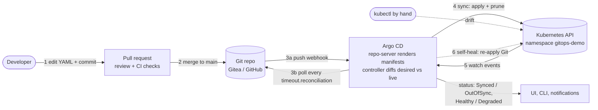

1. A change is made as a commit (here: replicas, image, page content, a typo, a revert).
2. It reaches `main` (in a team, through a reviewed PR).
3. Argo CD learns about the new commit, by webhook (seconds) or by polling (up to a minute
   or two).
4. The repo-server renders the folder, the controller diffs it with the live objects and
   applies the difference. With `prune: true` it also deletes what is no longer in Git.
5. The controller keeps watching the live objects.
6. If someone changes them by hand, `selfHeal: true` puts Git's version back.

Rollback is the same loop with a `git revert` commit as step 1.

## 6. Kubernetes + GitOps

Kubernetes is what makes GitOps practical: its API is already declarative (every object
has a `spec` = desired and a `status` = actual), and its own controllers already work as
reconciliation loops. Argo CD is one more controller, one level up: it reconciles **Git ->
API objects**, and the built-in controllers reconcile **API objects -> containers**.

What got installed (`kubectl -n argocd get pods`):

| Component | Job |
|---|---|
| `argocd-server` | API + web UI + webhook endpoint (`/api/webhook`) |
| `argocd-repo-server` | clones Git and renders manifests (plain YAML, Kustomize, Helm) |
| `argocd-application-controller` | the reconciliation loop: diff, sync, health, self-heal |
| `argocd-redis` | cache for rendered manifests and cluster state |
| `argocd-dex-server` | SSO (unused here, admin login only) |
| `argocd-applicationset-controller` | generates many Applications from a template |
| `argocd-notifications-controller` | Slack/email/webhook on sync and health events |

Argo CD v3 marks every object it manages with an annotation,
`argocd.argoproj.io/tracking-id: gitops-demo:apps/Deployment:gitops-demo/web` (v2 used a
label by default). That is how it knows which live objects belong to which Application,
and why `prune` never touches things it did not create.

The unit of work is the **`Application`** custom resource ([application.yaml](application.yaml)):
*source* (repo, revision, path) + *destination* (cluster, namespace) + *sync policy*.
It is the only thing applied by hand, once.

Argo CD also understands health, not just "applied": a Deployment is `Progressing` until
its rollout finishes and `Degraded` when `progressDeadlineSeconds` is exceeded. The bad
commit in the demo shows exactly that (section 8).

Flux is the other CNCF GitOps tool: same pull model, no built-in UI, configured through
several smaller CRDs (`GitRepository`, `Kustomization`, `HelmRelease`).

## 7. Push vs pull deployment

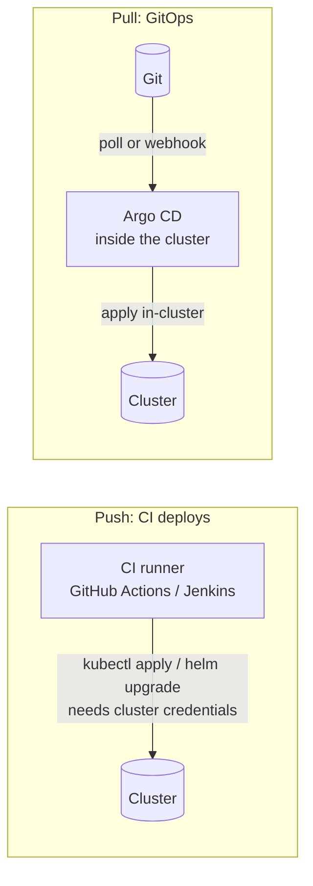

| | Push (CI runs `kubectl apply`) | Pull (Argo CD) |
|---|---|---|
| Cluster credentials | stored in the CI system, outside the cluster | stay inside the cluster; CI needs only Git access |
| Firewall | CI must reach the API server | only outbound Git access from the cluster |
| Drift after deploy | invisible until the next pipeline run | detected and reverted continuously (STEP 9-11) |
| Rollback | re-run an old pipeline | `git revert` (STEP 13) |
| Audit | pipeline logs | `git log` + `argocd app history` |
| Many clusters | pipeline loops over every cluster | each cluster (or one Argo CD) pulls the same repo |

They are usually combined: **CI** builds, tests and scans the image, then commits the new
image tag to the config repo; **CD** is Argo CD pulling that commit.

## 8. The demo, step by step

`./run.sh all` = install, repo, app, demo, history. Full verbatim log: [output.md](output.md).

**Initial sync** - one `kubectl apply -f application.yaml`, then Argo CD created
everything:

```text
application.argoproj.io/gitops-demo created
synced to Git HEAD bf5094d after 4s
Healthy after 6s total

APP           SYNC     HEALTH    REVISION
gitops-demo   Synced   Healthy   bf5094d7198f057b800117672029e83cec40b9ca
```

**Bad commit, then rollback through Git.** A typo in the image tag (`nginx:1.29.0-alpne`)
was committed. Argo CD deployed it, the new pod could not pull its image, and after the
Deployment's 60s `progressDeadlineSeconds` the app turned `Degraded`. The rolling update
never removed the old pods, so the site stayed up the whole time:

```text
pushed 3e53611  Bump nginx image (typo)
Argo CD synced the bad commit 3e53611 after 12s - Git is the truth, even when wrong
waiting for the Deployment's progressDeadlineSeconds (60s) to expire ...
app health is Degraded 71s after the push
APP           SYNC     HEALTH     REVISION
gitops-demo   Synced   Degraded   3e53611a72943470668b88a216a794eea756e67d

POD                    IMAGE                 READY   WAITING
web-58b8cb554b-db8cr   nginx:1.29.0-alpne    false   ImagePullBackOff
web-75d98ff5cf-6xlzz   nginx:1.29.0-alpine   true    <none>
web-75d98ff5cf-w6d44   nginx:1.29.0-alpine   true    <none>
web-75d98ff5cf-wfb7t   nginx:1.29.0-alpine   true    <none>

old pods are still serving (rolling update never removed them): gitops-demo version=v2 message="changed by a git commit"
```

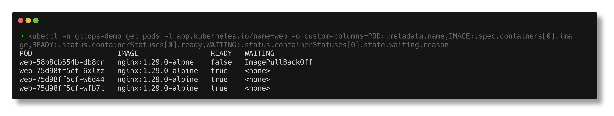

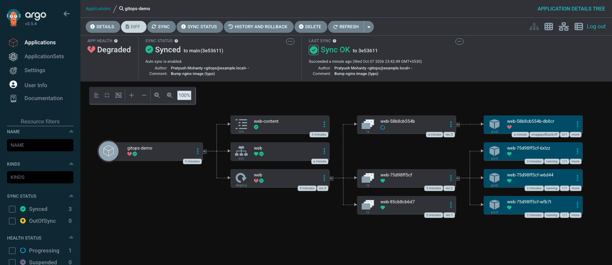

The fix was `git revert`, not `kubectl rollout undo`:

```text
pushed af85b3a  Revert "Bump nginx image (typo)"
Argo CD synced the revert af85b3a after 4s
app Healthy again 4s after the push
APP           SYNC     HEALTH    REVISION
gitops-demo   Synced   Healthy   af85b3a5b439a7b299b5f040430657fa674c326b
POD                    IMAGE                 READY
web-58b8cb554b-db8cr   nginx:1.29.0-alpne    false
web-75d98ff5cf-6xlzz   nginx:1.29.0-alpine   true
web-75d98ff5cf-w6d44   nginx:1.29.0-alpine   true
web-75d98ff5cf-wfb7t   nginx:1.29.0-alpine   true
```

Healthy 4s after the push because the previous ReplicaSet `web-75d98ff5cf` was still
running all 3 pods; the Deployment only had to scale the broken ReplicaSet to 0 (its event
`Scaled down replica set web-58b8cb554b from 1 to 0` is at `18:14:12` UTC, one second after the revert sync at 23:44:11 IST).
That is why the broken pod still appears in the listing above - it was being deleted.

`argocd app rollback` is refused while auto-sync is on, which is the point - a rollback
that is not in Git would be undone by the next sync:

```text
--- rollback through Argo CD is refused while auto-sync is on ---
{"level":"fatal","msg":"rpc error: code = FailedPrecondition desc = rollback cannot be initiated when auto-sync is enabled","time":"2026-10-07T23:44:26+05:30"}
```

**History** - every revision Argo CD deployed, matched against Git:

```text
SOURCE  http://gitea.git-server.svc.cluster.local:3000/gitops/gitops-demo.git
ID      DATE                           REVISION
0       2026-10-07 23:39:17 +0530 IST  main (bf5094d)
1       2026-10-07 23:40:41 +0530 IST  main (01f5d2e)
2       2026-10-07 23:41:27 +0530 IST  main (13438cf)
3       2026-10-07 23:42:48 +0530 IST  main (3e53611)
4       2026-10-07 23:44:11 +0530 IST  main (af85b3a)
5       2026-10-07 23:44:16 +0530 IST  main (6c64d4a)
6       2026-10-07 23:44:23 +0530 IST  main (2e677a7)
```

## Screenshots


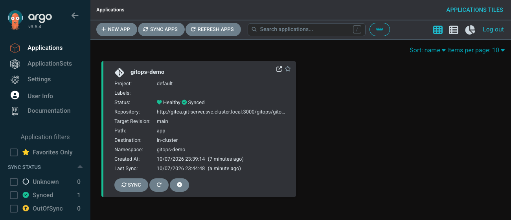

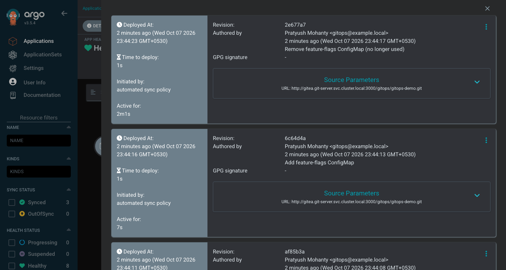

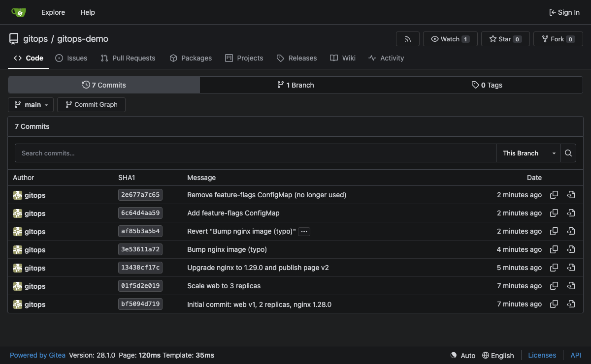

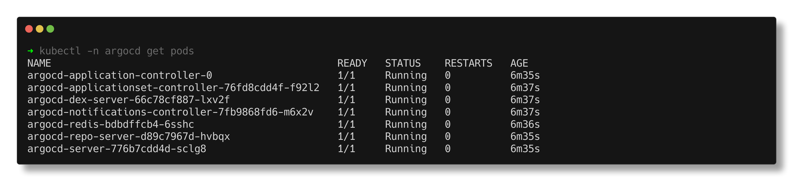

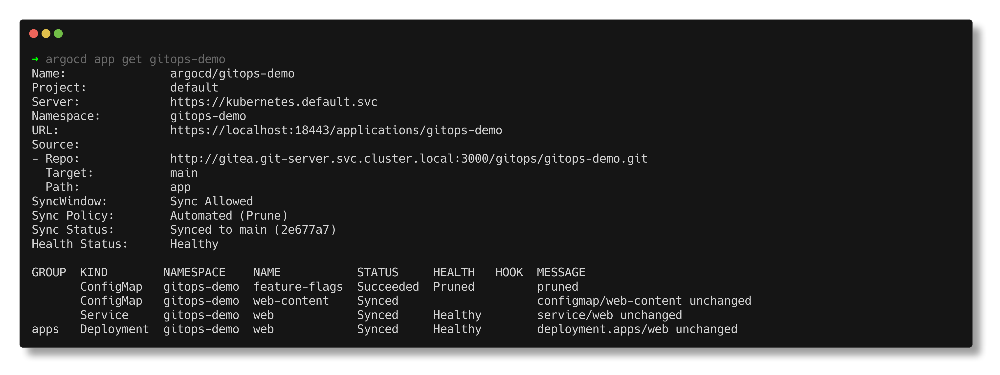

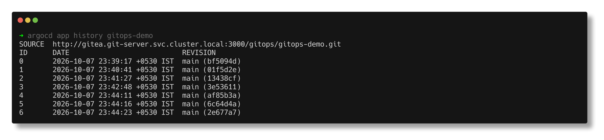

A second drift test, captured live after the demo - `kubectl scale` to 6 and Argo CD
puts it back:

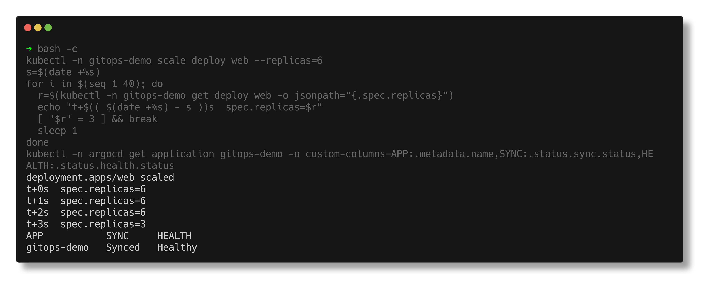

## The GitHub variant

[application-github.yaml](application-github.yaml) is the same Application pointed at
`https://github.com/bypratyush/devops-assignment.git`, path
`monitoring-observability-gitops/03-gitops/gitops-repo/app`. It was **not applied** here
(the repo was not pushed yet). Once it is: `kubectl apply -f application-github.yaml`, and
from then on editing `gitops-repo/app/` and pushing to `main` is the deployment. Without a
webhook (GitHub cannot reach a laptop kind cluster) it relies on polling, so expect a
delay of up to one or two reconciliation periods.

## Cleanup

The demo Application and its namespace were deleted at the end (`./run.sh cleanup`);
Argo CD and Gitea were left running for the final project. `./run.sh uninstall` removes
them too. The block below is from the second cleanup in [output.md](output.md) (section 3),
which counts what is left after deleting only the Application - zero, so the finalizer
really did the cascading delete; the namespace itself still had to go separately.

```text
--- before: resources owned by the Application ---
NAME                  READY   UP-TO-DATE   AVAILABLE   AGE
deployment.apps/web   3/3     3            3           7s

NAME          TYPE        CLUSTER-IP     EXTERNAL-IP   PORT(S)   AGE
service/web   ClusterIP   10.96.122.65   <none>        80/TCP    7s

NAME                    DATA   AGE
configmap/web-content   1      8s

application.argoproj.io "gitops-demo" deleted from argocd namespace
left in gitops-demo after deleting only the Application: 0 objects
namespace "gitops-demo" deleted

namespace gitops-demo: Error from server (NotFound): namespaces "gitops-demo" not found
```

---

## Notes from actually running this

- **Polling is slower than the setting suggests.** With `timeout.reconciliation: 60s`
  the polled commit took 82s. The commit was made at `18:09:22`, four seconds after the
  previous reconcile (`reconciledAt: 18:09:18`), so it waited almost the full minute for
  the next `comparison expired` refresh at `18:10:21`, and the sync then needed ~20s more
  on the busy cluster. In my first run it was 92s, and there the log showed the refresh
  two minutes after the previous one (`17:54:14` -> `17:56:13`), i.e. one cycle was
  skipped. So budget up to about two periods. With the default 180s plus up to 60s
  jitter that is several minutes, which is why the webhook matters.
- **The webhook needed three Gitea settings.** Gitea refuses to deliver webhooks to private
  IPs by default (`argocd-server` is a ClusterIP), so `ALLOWED_HOST_LIST=private`; the
  argocd-server certificate is self-signed, so `[webhook] SKIP_TLS_VERIFY=true`; and
  `ROOT_URL` must be the in-cluster URL, because Argo CD matches the repo URL in the
  webhook payload against the Application's `repoURL`. Argo CD treats Gitea as Gogs
  (Gitea also sends the `X-Gogs-Event` header), so the shared secret goes in
  `argocd-secret` as `webhook.gogs.secret`. I checked that it is really validated by
  setting a wrong secret and pushing an empty commit, then the right one:

  ```text
  2026-10-07T18:20:29Z  info  Gogs webhook HMAC verification failed
  2026-10-07T18:20:29Z  info  Webhook processing failed: HMAC verification failed
  2026-10-07T18:20:43Z  info  Received push event repo: http://gitea.git-server.svc.cluster.local:3000/gitops/gitops-demo, revision: main, touchedHead: true
  ```
- **Gitea 28 renamed a setting mid-flight.** My first install used
  `[webhook].ALLOWED_HOST_LIST` and Gitea logged
  `Deprecation: ... please use [security].ALLOWED_HOST_LIST instead`. After moving it, the
  fresh install logged a softer warning that the list only restricts private hosts in the
  default "lax" egress mode, which is exactly what is wanted here.
- **Self-heal backs off.** In my first run three drifts in a row were fixed in 1s, 6s and
  18s, which looked like Argo CD getting slower until I found the backoff flags (2s, x3 per
  attempt). In the captured run the numbers were noisier (6s, 3s, 6s) because other demos
  were loading the same cluster.
- **Kubernetes 1.37 warns about the classic Argo CD finalizer.** Applying
  `resources-finalizer.argocd.argoproj.io` printed `prefer a domain-qualified finalizer name
  including a path (/)`. Argo CD also accepts `resources-finalizer.argocd.argoproj.io/foreground`
  (same cascading delete), so the manifests use that.
- **Argo CD does not delete a namespace it created with `CreateNamespace=true`.** Deleting
  the Application removed the Deployment, Service and ConfigMap, but `gitops-demo` itself
  had to be deleted separately.
- **The controller pod failed once during install** with `secret "argocd-redis" not found`
  (the secret is created by another component at startup) and came up on its own a few
  seconds later. Harmless, but it looks alarming in `kubectl describe`.
- **`argocd app get` shows `Sync Policy: Automated (Prune)`** and does not mention
  self-heal even though it is on; `kubectl get application -o yaml` is the place to check.
- **Headless Chrome hung on the Argo CD UI.** `chrome --headless --screenshot
  --virtual-time-budget=...` never returned, because the UI keeps a streaming watch request
  open, so virtual time never runs out. [ui-shot.mjs](ui-shot.mjs) drives Chrome over the
  DevTools protocol instead: it sets the `argocd.token` session cookie (from
  `POST /api/v1/session`), waits a fixed time and captures. That also avoided turning on
  anonymous access just for screenshots.
- **A ConfigMap change does not restart pods.** Without the `config-version` annotation
  bump, the new page would only appear after the kubelet refreshed the mounted volume
  (up to a minute or so), and with `subPath` mounts or env vars it would never appear.

## Interview Q&A

**Q: What is GitOps, in one line?**
Git holds the declarative desired state, and an agent in the cluster continuously pulls
it and reconciles the cluster to match, so deploying is a commit and rolling back is a
revert.

**Q: How is GitOps different from CI/CD?**
It replaces the "CD" half. CI still builds, tests and scans, then writes the new image tag
into the config repo. Instead of the pipeline pushing into the cluster with stored
credentials, Argo CD pulls the change from Git. The cluster credentials never leave the
cluster.

**Q: How does Argo CD notice a new commit?**
Two ways: it re-checks Git every `timeout.reconciliation` (180s by default, 60s here), or a
Git webhook to `/api/webhook` tells it immediately. Here the polled change took 82s
and the webhook one 12s.

**Q: What do `prune` and `selfHeal` do, and why are they off by default?**
`prune` deletes live resources that were removed from Git; `selfHeal` re-applies Git when
someone changes the live state. Both are destructive (they delete and overwrite things),
so Argo CD makes you opt in. Without `selfHeal`, drift only shows as `OutOfSync`.

**Q: Someone hot-fixes production with `kubectl edit`. What happens?**
With `selfHeal` the change is reverted within seconds (3s for the ConfigMap edit here).
The right hot-fix is a commit; for a real emergency you first disable auto-sync on that
Application, fix, then put the fix in Git.

**Q: How do you roll back?**
`git revert <bad-commit>` and push. `argocd app rollback` is refused while auto-sync is on,
because a rollback that is not in Git would be undone by the next sync. Kubernetes keeps the
old ReplicaSet, so a revert to the previous image is near instant (Healthy 4s after the push here).

**Q: A bad commit was synced. Why was the site still up?**
Rolling update. With `maxUnavailable` rounding to 0 for 3 replicas, Kubernetes created one
new pod, it never became ready (ImagePullBackOff), so none of the old pods were removed.
Argo CD reported `Degraded` once `progressDeadlineSeconds` (60s) was exceeded.

**Q: Where do secrets go if everything is in Git?**
Not in Git as plain Secrets. Common options: Sealed Secrets (encrypted in Git, decrypted by
a controller in the cluster), SOPS with KMS/age, or External Secrets Operator pulling from
Vault / a cloud secret manager, with only the reference in Git.

**Q: Argo CD or Flux?**
Both are CNCF graduated pull-based GitOps controllers. Argo CD has a UI, an `Application`
CRD, SSO/RBAC and multi-cluster management from one place; Flux is a set of smaller
controllers (`GitRepository`, `Kustomization`, `HelmRelease`) with no built-in UI and a
more "Kubernetes-native" feel. Either works; the model is the same.

**Q: Should application code and Kubernetes manifests live in the same repo?**
Usually separate: an app repo (code, Dockerfile, CI) and a config repo (manifests per
environment). Then a CI commit that bumps an image tag does not retrigger the app build,
and access to the config repo can be locked down more tightly.
