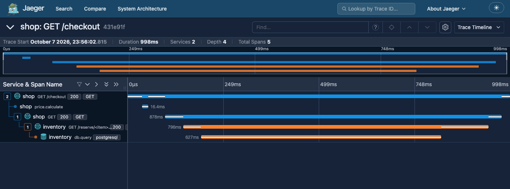
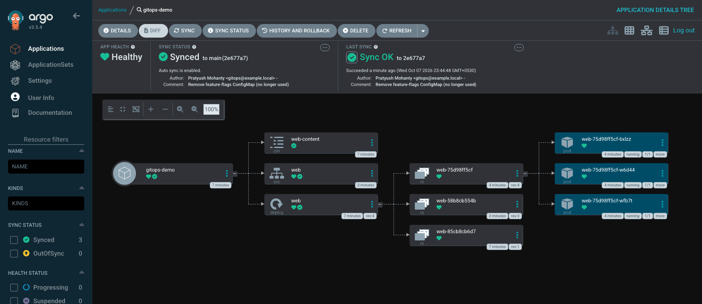

# Monitoring, Observability & GitOps

> **Submitted by:** Pratyush Mohanty  |  **Roll No.:** 24BCS10238

**Form field:** Monitoring, Observability & GitOps · **Course session:** `session-20-monitoring-observability-gitops`

Everything here was run for real on this Mac: two Docker Compose stacks for monitoring and
observability, and Argo CD plus an in-cluster Git server on the kind cluster `devops-hw`
(Kubernetes v1.37.0).

| Deliverable | Where |
|---|---|
| **Monitoring demo** (metrics, logs, alerts, CPU, memory, application health) | [01-monitoring/](01-monitoring/README.md) - [run.sh](01-monitoring/run.sh), [output.md](01-monitoring/output.md), [docker-compose.yml](01-monitoring/docker-compose.yml), [alert rules](01-monitoring/prometheus/alert-rules.yml), [dashboard](01-monitoring/grafana/dashboards/orders-api.json) |
| **Observability documentation** (three pillars, why, tools, Kubernetes) + a trace/log/metric demo | [02-observability/](02-observability/README.md) - [run.sh](02-observability/run.sh), [output.md](02-observability/output.md) |
| **GitOps demo** (Argo CD + Gitea in the cluster) | [03-gitops/](03-gitops/README.md) - [run.sh](03-gitops/run.sh), [output.md](03-gitops/output.md), [application.yaml](03-gitops/application.yaml), [application-github.yaml](03-gitops/application-github.yaml) |
| **Screenshots** | [01-monitoring/screenshots](01-monitoring/screenshots), [02-observability/screenshots](02-observability/screenshots), [03-gitops/screenshots](03-gitops/screenshots) |
| **README.md** | this file, plus one per part |

```bash
cd 01-monitoring    && ./run.sh      # ~10 min: check, up, demo, down
cd 02-observability && ./run.sh      # ~2 min
cd 03-gitops        && ./run.sh all  # needs the kind cluster; see ../lab/gitops.sh
```

---

## 1. Monitoring

A small service of my own (`orders-api`, Python + `prometheus_client`) monitored by
Prometheus, Alertmanager, Grafana, node-exporter, cAdvisor, a blackbox `/health` probe and
Loki/Alloy for logs. The script drives it into trouble and watches the alerts change state
through the real APIs:

```text
  18:23:44 UTC  t+  7s  AppDown            pending   value=0
  18:24:14 UTC  t+ 37s  AppDown            firing    value=0

  AppDown             severity=critical  state=active      inhibitedBy=0  startsAt=18:24:08
  HealthCheckFailing  severity=warning   state=suppressed  inhibitedBy=1  startsAt=18:24:08
```

Memory: 350 MB held -> RSS 369 MiB -> HighMemory fired after 33 s, and `/health` returned
503 while `up` stayed 1, so the process was up but the application was not healthy. CPU: a
spinning thread got only 0.77 - 0.84 of a core on the busy host, so HighCPU went pending
and back without firing. That is what `for: 30s` is for (it fired in a quieter trial run).


## 2. Observability

The write-up covers what each pillar is, its strengths and limits, cardinality, when to use
which, monitoring vs observability (known vs unknown unknowns), the common tools, and
Kubernetes observability (cAdvisor, metrics-server, kube-state-metrics, node-exporter,
`kubectl logs`/events, DaemonSet log agents, ServiceMonitor). The demo then follows one
slow request through all three signals by its trace_id:

```text
  shop: GET /checkout  [+0ms, 997ms]  
    shop: price.calculate  [+38ms, 16ms]  
    shop: GET  [+97ms, 877ms]  
      inventory: GET /reserve/<item>  [+145ms, 795ms]  
        inventory: db.query  [+191ms, 626ms]  db.statement=SELECT qty FROM stock WHERE sku = $1 FOR UPDATE
```

The same `431e91f8...` id is in 4 log lines across both services and in 2 Prometheus
exemplars.



## 3. GitOps

Argo CD v3.5.4 and Gitea 28.1.0 run inside the cluster. Gitea is the Git source of truth
because the GitHub repo could not be pushed to while I worked on this.
[application-github.yaml](03-gitops/application-github.yaml) is the same Application
pointed at this repo on GitHub, for once it is pushed. Measured on a busy cluster:

| Step | Result |
|---|---|
| Initial sync after `kubectl apply` of the Application | Synced in 4 s, Healthy in 6 s |
| Git commit picked up by polling (60 s interval) | 82 s |
| Git commit with the Gitea webhook | 12 s |
| `kubectl scale` drift -> self-heal back to Git's replicas | 6 s |
| Bad image tag commit -> Degraded; `git revert` -> Healthy | Degraded at 71 s; Healthy 4 s after the revert push |

```text
deployment.apps/web scaled
spec.replicas right after the manual change: 6
self-heal put it back to 3 after 6s
```



Argo CD and Gitea are left installed for the final project; how to reach them is in
[../lab/gitops.sh](../lab/gitops.sh).

---

## Notes from running it

- Docker Hub rate-limited anonymous pulls part-way through; the Prometheus images come from
  `quay.io/prometheus/*` (the project's own registry).
- On Docker Desktop, node-exporter's documented `rslave` mount fails, and cAdvisor needs both
  the Docker **and** containerd sockets mounted (Docker 29 uses the containerd image store),
  or it reports no container names.
- Headless Chrome writes the screenshot but never exits on single-page apps (Grafana,
  Alertmanager, Jaeger, Argo CD), so each script waits for the PNG and then stops Chrome.
- Other demos were running on the same machine, so absolute timings (CPU, latency, sync
  times) are noisier than on an idle laptop. Each part's README says where that showed.

## Interview Q&A

**Q: Monitoring, observability, GitOps - how do they fit together?**
GitOps decides what should be running (Git) and keeps the cluster matching it. Monitoring
tells you when what is running misbehaves. Observability tells you why. A bad deploy shows
up as an alert, the trace shows where it broke, and the fix is a `git revert` that Argo CD
rolls out.

**Q: What should page a human?**
Symptoms users feel: errors, latency, availability, against an SLO. CPU or memory alone
should be a warning or a dashboard, not a page.

**Q: Why use exemplars and trace_ids in logs?**
They link the three signals: from a latency graph to an example trace, from the trace to the
exact log lines, without guessing by timestamps.

**Q: Push vs pull deployment?**
Push: CI holds cluster credentials and runs `kubectl apply`. Pull (GitOps): an agent inside
the cluster pulls from Git and reconciles continuously, so drift is corrected and the
cluster credentials never leave it.

**Q: How do you roll back in GitOps?**
`git revert` the bad commit. Git history is the deployment history; Argo CD even refuses
`argocd app rollback` while auto-sync is on, because Git must stay the source of truth.
