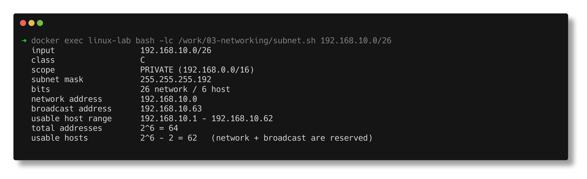
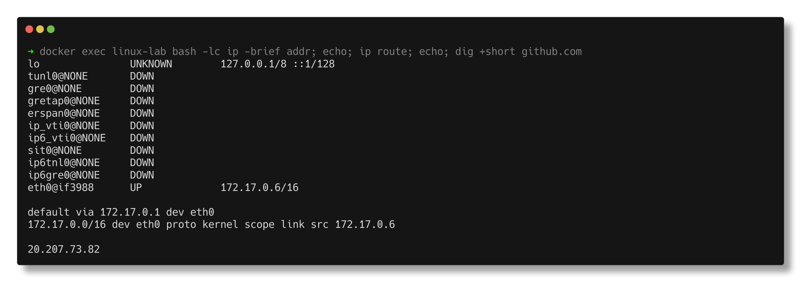

# Networking

> **Submitted by:** Pratyush Mohanty  |  **Roll No.:** 24BCS10238

**Form field:** Networking · **Course session:** `session4-networking`

| Script | What it does | Output |
|---|---|---|
| [subnet.sh](subnet.sh) | Calculates class, mask, network/broadcast, usable hosts for any CIDR | [output.md](output.md) |
| [netcmds.sh](netcmds.sh) | Runs the networking toolkit for real against live hosts | [output.md](output.md) |

```bash
./lab/lab.sh exec '/work/networking/subnet.sh'
./lab/lab.sh exec '/work/networking/subnet.sh 192.168.10.0/26'
./lab/lab.sh exec '/work/networking/netcmds.sh'
```

---

## 1. IP addressing

An IPv4 address is **32 bits**, written as four octets. It is split into a
**network part** and a **host part**; the **subnet mask** is what says where the
split falls.



### Classes (the historical scheme)

| Class | First octet | Default mask | Network/host bits | Purpose |
|---|---|---|---|---|
| **A** | 1-126 | 255.0.0.0 (/8) | 8 / 24 | very large networks |
| **B** | 128-191 | 255.255.0.0 (/16) | 16 / 16 | medium |
| **C** | 192-223 | 255.255.255.0 (/24) | 24 / 8 | small |
| **D** | 224-239 | - | - | multicast |
| **E** | 240-255 | - | - | experimental |

127.x.x.x is loopback and is not a usable class A network.

Classful addressing is obsolete in practice - everything is **CIDR** now, where
the prefix length is explicit (`/26`) rather than implied by the first octet. The
classes still come up in interviews and still describe the default masks.

### Private ranges (RFC 1918) - not routable on the internet

```text
10.0.0.0    - 10.255.255.255     10.0.0.0/8       class A
172.16.0.0  - 172.31.255.255     172.16.0.0/12    class B
192.168.0.0 - 192.168.255.255    192.168.0.0/16   class C
169.254.0.0 - 169.254.255.255    link-local (APIPA - you failed to get DHCP)
127.0.0.0   - 127.255.255.255    loopback
```

### The host-count formula

```text
host bits    = 32 - prefix
addresses    = 2 ^ host_bits
usable hosts = 2 ^ host_bits - 2
```

Minus 2 because two addresses in every subnet are reserved: the **network
address** (all host bits 0) and the **broadcast address** (all host bits 1).

`subnet.sh` computes all of this rather than reciting it. Its defaults include
the exact examples from the session notes:

```text
  input                  120.27.1.0/8
  class                  A
  subnet mask            255.0.0.0
  bits                   8 network / 24 host
  network address        120.0.0.0
  broadcast address      120.255.255.255
  usable host range      120.0.0.1 - 120.255.255.254
  usable hosts           2^24 - 2 = 16777214

  input                  197.23.45.10/24
  class                  C
  network address        197.23.45.0
  broadcast address      197.23.45.255
  usable hosts           2^8 - 2 = 254

  input                  192.168.10.0/26
  scope                  PRIVATE (192.168.0.0/16)
  subnet mask            255.255.255.192
  network address        192.168.10.0
  broadcast address      192.168.10.63
  usable hosts           2^6 - 2 = 62
```

A `/32` is the edge case worth understanding - one address, zero usable hosts.
It is how you express "exactly this one host" in a firewall or routing rule.

---

## 2. The commands, run for real



### Interfaces and routing

```text
$ ip -brief addr
eth0@if3982      UP             172.17.0.6/16

$ ip route
default via 172.17.0.1 dev eth0
172.17.0.0/16 dev eth0 proto kernel scope link src 172.17.0.6

$ ip route get 8.8.8.8
8.8.8.8 via 172.17.0.1 dev eth0 src 172.17.0.6 uid 0
```

`ip route get` is underused: it asks the kernel which route and source address it
*would* choose, without sending a packet. That answers "why is this traffic
leaving the wrong interface?" directly.

### DNS

```text
$ dig +short github.com
20.207.73.82

$ dig +short MX github.com
0 github-com.mail.protection.outlook.com.
```

Resolution order is not DNS-first. `/etc/nsswitch.conf` decides:

```text
hosts:          files dns
```

`files` means `/etc/hosts` is consulted **before** DNS - which is why a stale
`/etc/hosts` entry produces a "DNS problem" that no DNS change can fix.

### Connectivity

```text
$ ping -c 3 1.1.1.1
64 bytes from 1.1.1.1: icmp_seq=1 ttl=63 time=17.9 ms
3 packets transmitted, 3 received, 0% packet loss
```

**ping uses ICMP, not TCP.** A perfectly healthy host can drop ICMP at a
firewall. "Ping fails" never means "the service is down" - test the actual port.

### Ports and sockets

```text
$ ss -tulnp
tcp   LISTEN 0  511   0.0.0.0:80   0.0.0.0:*   users:(("nginx",pid=52,fd=6),...)
```

`-t` TCP, `-u` UDP, `-l` listening, `-n` numeric, `-p` process. This is *the*
answer to "what is using port 8080?". `netstat` is the legacy equivalent.

### Testing a port properly

```text
$ nc -zv localhost 80
Connection to localhost (::1) 80 port [tcp/http] succeeded!

$ nc -zv localhost 9999
nc: connect to localhost (::1) port 9999 (tcp) failed: Connection refused
```

The three outcomes are distinct and diagnostic:
**succeeded** (open) · **Connection refused** (reachable, nothing listening) ·
**hangs/timeout** (a firewall is dropping the packets silently).

### Where the time actually goes

```text
  dns_lookup   : 0.018619s
  tcp_connect  : 0.094459s
  tls_handshake: 0.152563s
  first_byte   : 0.186333s
  total        : 0.314525s
```

One `curl -w` call tells you *which phase* is slow - name resolution, the TCP
handshake, the TLS handshake, or the server thinking. That turns "the site is
slow" into an actionable answer.

### Inspecting a certificate

```text
$ openssl s_client -connect github.com:443 -servername github.com </dev/null
  subject=CN = github.com
  issuer=C = GB, O = Sectigo Limited, CN = Sectigo Public Server Authentication CA DV E36
  notBefore=Sep  1 00:00:00 2026 GMT
  notAfter=Nov 29 23:59:59 2026 GMT
```

`-servername` sends SNI, which is how one IP serves many HTTPS sites. This is the
tool for expired certs, wrong hostnames, and broken chains.

---

## 3. What one HTTP request actually does

```text
curl https://github.com/

1. DNS       resolve github.com -> an IP        (/etc/hosts, then resolv.conf)
2. ROUTE     kernel picks interface + gateway   (ip route get)
3. ARP       find the gateway's MAC             (ip neigh)
4. TCP       3-way handshake  SYN -> SYN/ACK -> ACK
5. TLS       ClientHello / certificate / key exchange
6. HTTP      GET / HTTP/1.1 + Host: github.com
7. RESPONSE  status line, headers, body
8. CLOSE     FIN/ACK, or keep-alive for reuse
```

Each layer has its own tool: **1** `dig` · **2** `ip route get` · **3** `ip neigh`
· **4** `nc -zv`, `ss` · **5** `openssl s_client` · **6-7** `curl -v`.

## 4. Ports worth knowing

```text
22   SSH        25  SMTP       53   DNS        80   HTTP       443  HTTPS
3306 MySQL      5432 PostgreSQL 6379 Redis     27017 MongoDB
6443 k8s API    2379/2380 etcd   9090 Prometheus

0-1023      well-known  (root required to bind)
1024-49151  registered
49152-65535 ephemeral   (the source port a client picks)
```

---

## Interview Q&A

**Q: How many usable hosts in a /26?**
`32 − 26 = 6` host bits -> `2⁶ = 64` addresses -> `64 − 2 = 62` usable. The two
reserved are the network and broadcast addresses.

**Q: What is a subnet mask for?**
It marks where the network part of an address ends and the host part begins, so a
host can decide whether a destination is on its own link (send directly) or off-link
(send to the default gateway).

**Q: Public vs private IP?**
Private ranges (10/8, 172.16/12, 192.168/16) are not routed on the internet and
are reused inside every organisation; NAT translates them to a public address at
the edge.

**Q: TCP vs UDP?**
TCP is connection-oriented with a handshake, ordering, retransmission and flow
control - used for HTTP, SSH, databases. UDP is fire-and-forget, no handshake or
guarantees, lower latency - used for DNS, DHCP, VoIP, video.

**Q: `ping` works but the app doesn't. What now?**
ping only proves ICMP reachability at layer 3. Test the actual port with
`nc -zv host port`, check the service is listening with `ss -tulnp`, then check
firewall rules. Equally, ping failing proves nothing - ICMP is routinely blocked.

**Q: Walk me through what happens when you type a URL.**
DNS resolution (hosts file, then resolver), route lookup, ARP for the gateway,
TCP 3-way handshake, TLS handshake if HTTPS, the HTTP request, the response, then
close or keep-alive.

**Q: What is the default gateway?**
The next hop for any destination not matching a more specific route - the
`default via X` line in `ip route`.

**Q: `ss` vs `netstat`?**
Both list sockets. `ss` is from iproute2, reads netlink directly, is much faster
on busy hosts, and is the modern tool. `netstat` is from the deprecated net-tools
package and is often not installed on current distros.

**Q: What is 169.254.x.x doing on my interface?**
Link-local / APIPA. The host asked for DHCP, got no answer, and self-assigned.
It means the DHCP server is unreachable.
