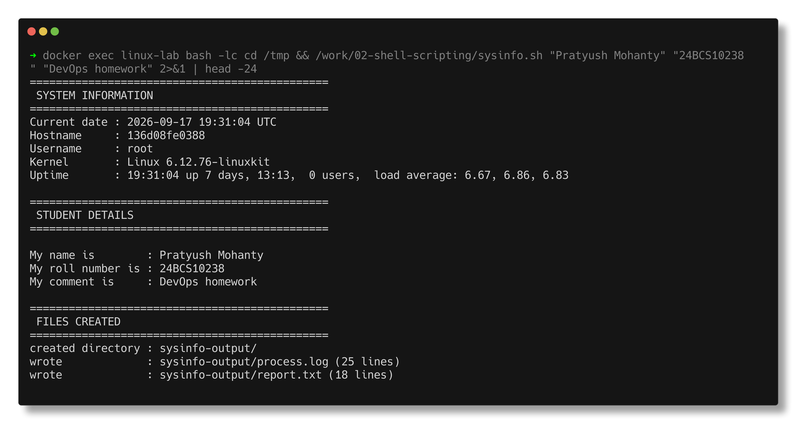
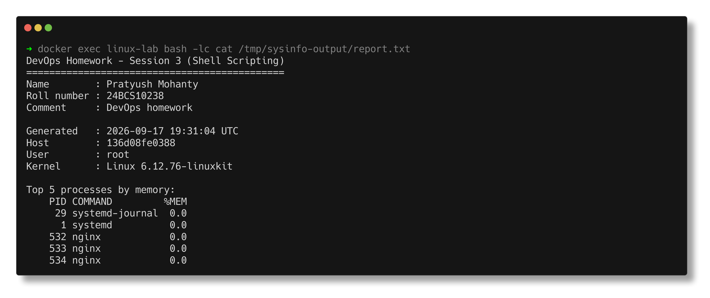

# Shell Scripting

> **Submitted by:** Pratyush Mohanty  |  **Roll No.:** 24BCS10238

**Form field:** Shell Scripting · **Course session:** `session3-shell-scripting`

| Script | What it is | Output |
|---|---|---|
| [sysinfo.sh](sysinfo.sh) | The assignment task | [output.md](output.md) |
| [fundamentals.sh](fundamentals.sh) | Shell building blocks, each demonstrated | [output.md](output.md) |

```bash
./lab/lab.sh up
./lab/lab.sh exec '/work/shell-scripting/sysinfo.sh'
./lab/lab.sh exec '/work/shell-scripting/fundamentals.sh'
```

---

## 1. `sysinfo.sh` - the assignment

The task asked for: current date, hostname and username, process info written to
`process.log`, name / roll number / comment taken as input and printed, plus use
of variables and creating a file and a directory.

```text
==============================================
 SYSTEM INFORMATION
==============================================
Current date : 2026-09-17 19:00:00 UTC
Hostname     : 5c3032b381ec
Username     : root
Kernel       : Linux 6.12.76-linuxkit
Uptime       : 19:00:00 up 7 days, 12:42,  0 users,  load average: 6.76, 7.32, 6.98

==============================================
 STUDENT DETAILS
==============================================
My name is        : Pratyush Mohanty
My roll number is : 24BCS10238
My comment is     : DevOps homework - session 3 shell scripting

==============================================
 FILES CREATED
==============================================
created directory : sysinfo-output/
wrote             : sysinfo-output/process.log (23 lines)
wrote             : sysinfo-output/report.txt (18 lines)
```



### One design decision worth explaining

The assignment uses `read -p`, which **blocks forever when there is no terminal** -
so the script cannot run in CI, in a pipeline, or from another script. Rather
than drop the interactive behaviour, `read_field()` takes input in order of
precedence:

```text
command-line argument  >  piped stdin  >  interactive prompt  >  default
```

All three paths are verified in [output.md](output.md):

```bash
./sysinfo.sh                                    # prompts, or uses defaults with no TTY
./sysinfo.sh "Pratyush Mohanty" "24BCS10238" "..."   # arguments
printf "Name\nRoll\nComment\n" | ./sysinfo.sh        # piped
```

`[ -t 0 ]` is the test that makes this work - it is true only when stdin is a
terminal, which is how a script tells "a human is typing" from "input is piped".

---

## 2. `fundamentals.sh` - the building blocks



### Variables and quoting

```text
  plain          : $name        -> Pratyush
  braces         : ${name}_id   -> Pratyush_id     (needed when text follows)
  command subst  : $(date +%Y)  -> 2026
  arithmetic     : $((count*2)) -> 10

  single quotes  : no $name expansion here
  double quotes  : yes Pratyush expansion here
```

**Always quote your variables.** Demonstrated with a path containing a space:

```text
    unquoted -> 2 arguments (WRONG)
    quoted   -> 1 argument  (right)
```

Unquoted `$var` undergoes word splitting and globbing. This is the single most
common shell bug, and it only shows up once a filename contains a space.

### Parameter expansion - string handling without calling out to other tools

```text
  ${maybe:-fallback}  -> fallback    use a default if unset
  ${file##*/}         -> syslog.1    basename
  ${file%/*}          -> /var/log    dirname
  ${file%.*}          -> /var/log/syslog   strip the extension
  ${#name}            -> 8           length
```

### Conditionals

```bash
[ "$n" -gt 10 ]      # numeric : -eq -ne -lt -le -gt -ge
[ "$a" = "$b" ]      # string  : =  !=  -z (empty)  -n (non-empty)
[ -f "$file" ]       # files   : -f file  -d dir  -e exists  -r -w -x  -s non-empty
case "$(uname -s)" in Linux) ... ;; Darwin) ... ;; *) ... ;; esac
```

### Loops

The `while read` idiom is the one that matters, and the one people get wrong:

```bash
while IFS=, read -r word number; do
  printf "word=%s number=%s\n" "$word" "$number"
done < file.csv
```

`IFS=,` sets the field separator for that one command; `-r` stops backslashes
being interpreted. Without `-r`, `C:\path` silently loses its backslashes.

### Functions

```text
  greet Pratyush -> hello, Pratyush
  greet          -> hello, world
  4 is even
  7 is odd
```

A function returns an **exit status**, not a value. To return data, `echo` it and
capture with `$(func)`. Use `local` for variables, or they leak into global scope.

### Error handling - the header every script should start with

```bash
set -euo pipefail
```

| flag | effect |
|---|---|
| `-e` | exit immediately if any command fails |
| `-u` | error on an undefined variable - catches typos |
| `-o pipefail` | a pipeline fails if **any** stage fails, not just the last |

`pipefail` demonstrated, because it is the one people have not met:

```text
    without pipefail -> exit 0     <- false | true  HIDES the failure
    with pipefail    -> exit 1     <- the failure surfaces
```

Without it, `curl ... | grep ...` reports success even when curl failed.

And traps, for cleanup that must happen no matter how the script ends:

```bash
trap 'rm -f "$tmpfile"' EXIT      # always runs
trap 'echo "failed at line $LINENO"' ERR
```

---

## Interview Q&A

**Q: `sh` vs `bash`?**
`sh` is the POSIX shell spec; `bash` is a superset with arrays, `[[ ]]`,
`${var/a/b}`, process substitution and more. A script with `#!/bin/sh` must stick
to POSIX. On Ubuntu `/bin/sh` is **dash**, not bash - bash-only syntax in a
`#!/bin/sh` script fails there but works on distros where `sh` links to bash.

**Q: Single vs double quotes?**
Single quotes are literal - nothing expands. Double quotes expand `$var`,
`$(cmd)` and backticks but still prevent word splitting and globbing.

**Q: Why quote variables at all?**
Unquoted `$var` is word-split on `$IFS` and glob-expanded. `rm $file` where
`file="my report.txt"` tries to delete two files. Quote everything.

**Q: `$@` vs `$*`?**
Quoted `"$@"` expands to each argument as a separate word - almost always what
you want. `"$*"` joins them into one string separated by the first `$IFS` char.

**Q: What does `set -e` not catch?**
Failures inside a pipeline (unless `pipefail` is set), commands in a condition
(`if cmd; then`), and anything followed by `||` or `&&`. `set -e` is a safety
net, not a guarantee - check critical commands explicitly.

**Q: How do you return a value from a function?**
You don't - `return` sets an exit status (0-255). `echo` the value and capture it
with `$(func)`, or assign to a global.

**Q: `[ ]` vs `[[ ]]`?**
`[` is a command (POSIX). `[[ ]]` is a bash keyword with pattern matching
(`==` with globs), regex (`=~`), and `&&`/`||` inside - and it does not word-split,
so unquoted variables are safer. Use `[[ ]]` in bash, `[ ]` in POSIX scripts.

**Q: How do you debug a shell script?**
`bash -x script.sh` traces every expanded command, or `set -x` / `set +x` around a
section. `shellcheck` catches most bugs statically before you ever run it.
