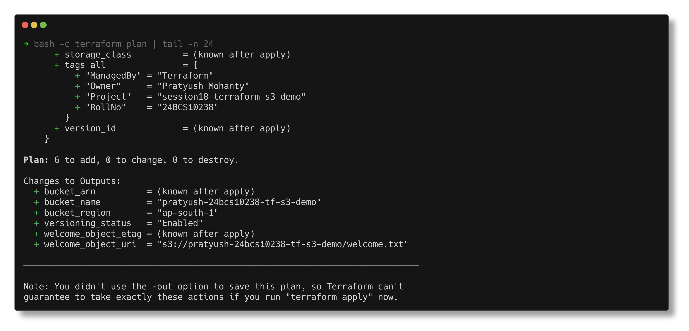
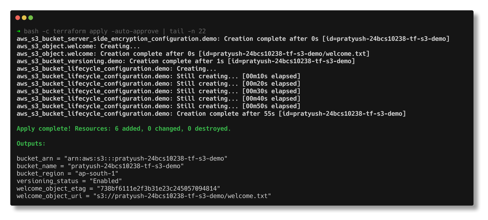
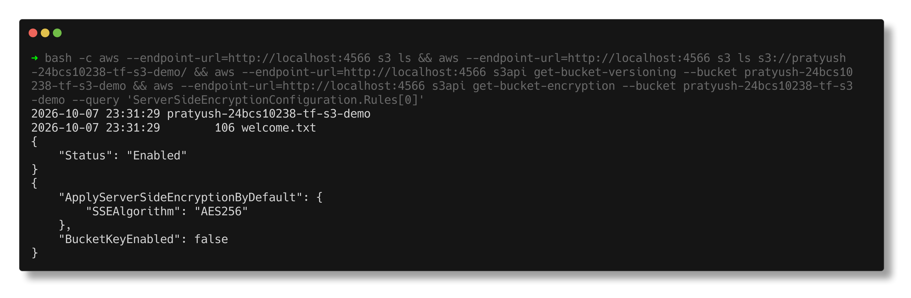
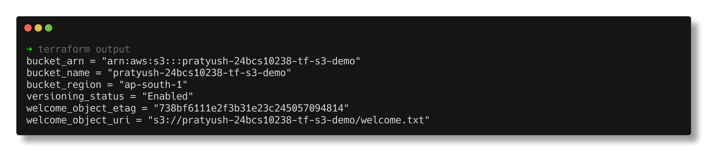
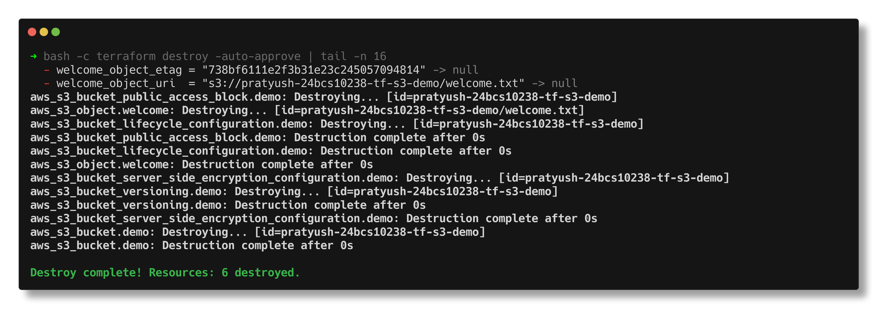

# Terraform S3 Demo

> **Submitted by:** Pratyush Mohanty  |  **Roll No.:** 24BCS10238

**Form field:** Terraform & Infrastructure as Code (Task 1) · **Course session:** `session18-terraform-iac`

Run it: `../../lab/localstack.sh up && ./run.sh`  ·  Verified output: [output.md](output.md)

One S3 bucket, `pratyush-24bcs10238-tf-s3-demo`, taken through the full
Terraform lifecycle: `init -> fmt -> validate -> plan -> apply -> show -> output -> destroy`,
with the AWS CLI used in between to prove the bucket really exists.

There is no AWS account behind this homework, so every API call goes to
**LocalStack 4.14.0** (an AWS emulator in Docker, `localhost:4566`). The
Terraform code is the same code you would run against AWS: one variable,
`use_localstack`, switches the provider between the two.

---

## Files

| File | What it holds |
|---|---|
| [provider.tf](provider.tf) | `terraform {}` block (Terraform >= 1.6, AWS provider `~> 6.0`) and the `aws` provider, including the LocalStack switch and `default_tags` |
| [variables.tf](variables.tf) | Inputs with types, descriptions, defaults, and a `validation` rule on the bucket name |
| [terraform.tfvars](terraform.tfvars) | The values for this run. No secrets - credentials never go in here |
| [main.tf](main.tf) | The bucket plus versioning, encryption, public access block, lifecycle rules and one object |
| [outputs.tf](outputs.tf) | Name, ARN, region, versioning status, object URI and ETag |
| [.terraform.lock.hcl](.terraform.lock.hcl) | Exact provider version and checksums (committed, like `package-lock.json`) |
| [.gitignore](.gitignore) | Keeps `.terraform/`, `*.tfstate*`, plan files and crash logs out of git |
| [run.sh](run.sh) | Runs the whole workflow (`deploy`, `verify`, `destroy`, `shots`, default `all`) |

## What gets created (6 resources)

| Resource | Why it is there |
|---|---|
| `aws_s3_bucket.demo` | The bucket. `force_destroy = true` so destroy can empty it first |
| `aws_s3_bucket_versioning.demo` | Every overwrite/delete keeps the old version - accidental deletes are recoverable |
| `aws_s3_bucket_server_side_encryption_configuration.demo` | SSE-S3 (AES-256) by default for every object |
| `aws_s3_bucket_public_access_block.demo` | All four "block public" switches on, so no ACL or policy can make it public later |
| `aws_s3_bucket_lifecycle_configuration.demo` | Delete noncurrent versions after 30 days (versioning without this grows the bill forever), abort stale multipart uploads after 7 days, move `logs/` to STANDARD_IA after 30 days |
| `aws_s3_object.welcome` | One small text file, so there is something real to read back |

Since AWS provider v4 each bucket setting is its own resource pointing at the
bucket, instead of one giant `aws_s3_bucket` block. It makes each setting
independently changeable and importable.

## The LocalStack switch

```hcl
provider "aws" {
  region     = var.aws_region
  access_key = var.use_localstack ? "test" : null   # null = normal credential chain
  secret_key = var.use_localstack ? "test" : null

  skip_metadata_api_check = var.use_localstack
  s3_use_path_style       = var.use_localstack       # http://localhost:4566/bucket/key

  dynamic "endpoints" {
    for_each = var.use_localstack ? [var.localstack_endpoint] : []
    content {
      s3        = endpoints.value
      s3control = endpoints.value
      sts       = endpoints.value
    }
  }
}
```

To run it against real AWS: set `use_localstack = false` in `terraform.tfvars`,
make sure `aws sts get-caller-identity` works in the shell, and run the same
commands (without `--endpoint-url` on the AWS CLI). The bucket name must be
globally unique on real S3; this one includes the roll number for that reason.

---

## The workflow, command by command

### 1. `terraform init`

Reads the `required_providers` block, downloads the AWS provider into
`.terraform/`, and records the exact version and hashes in
`.terraform.lock.hcl`. Run it once per checkout, and again after changing
providers, modules or the backend.

```text
Initializing provider plugins...
- Reusing previous version of hashicorp/aws from the dependency lock file
- Installing hashicorp/aws v6.67.0...
- Installed hashicorp/aws v6.67.0 (signed by HashiCorp)

Terraform has been successfully initialized!
```

"Reusing previous version ... from the dependency lock file" is the lock file
doing its job: `~> 6.0` would allow any 6.x, but the lock pins 6.67.0 until
someone deliberately runs `terraform init -upgrade`.

### 2. `terraform fmt`

Rewrites `.tf` files into the canonical style (alignment of `=`, indentation).
In CI you use `terraform fmt -check`, which changes nothing and exits non-zero
if a file needs formatting.

```text
terraform fmt -check exit code: 0  (0 = every file already formatted)
```

### 3. `terraform validate`

Checks syntax, types and references without calling any API. It caught nothing
here, but it is what catches `var.bucket_nmae` before a plan wastes time.

```text
Success! The configuration is valid.
```

### 4. `terraform plan -out=tfplan`

Refreshes what exists, compares it with the code, and prints the diff. `+`
create, `~` update in place, `-/+` replace, `-` destroy. `(known after apply)`
marks values only the API can decide (ARN, ETag, version ID).

```text
Plan: 6 to add, 0 to change, 0 to destroy.

Changes to Outputs:
  + bucket_arn          = (known after apply)
  + bucket_name         = "pratyush-24bcs10238-tf-s3-demo"
  + bucket_region       = "ap-south-1"
  + versioning_status   = "Enabled"
  + welcome_object_etag = (known after apply)
  + welcome_object_uri  = "s3://pratyush-24bcs10238-tf-s3-demo/welcome.txt"
```



`-out=tfplan` saves the plan so the next step applies exactly what was
reviewed, even if someone changes the code in between.

### 5. `terraform apply tfplan`

Executes the plan. Applying a saved plan file does not ask for `yes`, because
the review already happened at plan time. Plain `terraform apply` plans again
and asks.

```text
aws_s3_bucket.demo: Creating...
aws_s3_bucket.demo: Creation complete after 0s [id=pratyush-24bcs10238-tf-s3-demo]
aws_s3_bucket_public_access_block.demo: Creating...
aws_s3_bucket_versioning.demo: Creating...
aws_s3_bucket_server_side_encryption_configuration.demo: Creating...
...
aws_s3_bucket_lifecycle_configuration.demo: Creation complete after 55s [id=pratyush-24bcs10238-tf-s3-demo]

Apply complete! Resources: 6 added, 0 changed, 0 destroyed.
```

The bucket goes first, then the four settings in parallel (they only depend on
the bucket), then the object (waits for encryption via `depends_on`) and the
lifecycle rule (waits for versioning).



### 6. Proof from outside Terraform

Terraform saying "created" is not proof, so the bucket is checked with the AWS
CLI talking straight to the S3 API:

```text
$ aws s3 ls
2026-10-07 23:29:32 pratyush-24bcs10238-tf-s3-demo

$ aws s3api get-bucket-versioning
{
    "Status": "Enabled"
}
$ aws s3api get-bucket-encryption
{
    "SSEAlgorithm": "AES256"
}
$ aws s3api get-bucket-tagging (default_tags + resource tags merged)
Environment	dev
ManagedBy	Terraform
Name	pratyush-24bcs10238-tf-s3-demo
Owner	Pratyush Mohanty
Project	session18-terraform-s3-demo
RollNo	24BCS10238

$ aws s3api head-object (was it encrypted by the bucket default?)
{
    "size": 106,
    "type": "text/plain",
    "sse": "AES256",
    "version": "AaEXgQal0CNpSczgDxuX0tYQ9KtkCIlp"
}
```

(`aws` here is `aws --endpoint-url=http://localhost:4566` - see [run.sh](run.sh).)



### 7. `terraform show`

Prints the current state in readable form: every attribute of every resource
as Terraform last saw it (full listing in [output.md](output.md), step 7).
`terraform state list` gives just the addresses:

```text
aws_s3_bucket.demo
aws_s3_bucket_lifecycle_configuration.demo
aws_s3_bucket_public_access_block.demo
aws_s3_bucket_server_side_encryption_configuration.demo
aws_s3_bucket_versioning.demo
aws_s3_object.welcome
```

### 8. `terraform output`

Prints the values declared in `outputs.tf`. `-raw` drops the quotes for shell
scripts, `-json` is for other tools.

```text
bucket_arn = "arn:aws:s3:::pratyush-24bcs10238-tf-s3-demo"
bucket_name = "pratyush-24bcs10238-tf-s3-demo"
bucket_region = "ap-south-1"
versioning_status = "Enabled"
welcome_object_etag = "738bf6111e2f3b31e23c245057094814"
welcome_object_uri = "s3://pratyush-24bcs10238-tf-s3-demo/welcome.txt"
```



### 9. `terraform destroy`

Plans the reverse of everything in state and deletes it, dependents first, the
bucket last.

```text
Plan: 0 to add, 0 to change, 6 to destroy.
...
aws_s3_bucket.demo: Destroying... [id=pratyush-24bcs10238-tf-s3-demo]
aws_s3_bucket.demo: Destruction complete after 0s

Destroy complete! Resources: 6 destroyed.

$ aws s3api head-bucket --bucket pratyush-24bcs10238-tf-s3-demo
aws: [ERROR]: An error occurred (404) when calling the HeadBucket operation: Not Found
```



---

## Two extra experiments in run.sh

**Versioning and `force_destroy`.** `logs/app.log` is uploaded twice with the
AWS CLI. Both versions are kept:

```text
|  logs/app.log|  True   |  13   |  AaEXgQansDCKFoYJUs.7Z83Urii_I6hd   |
|  logs/app.log|  False  |  12   |  AaEXgQamsEATM_UdqkcrXKfJqdBNLlO0   |
```

Those objects are not in Terraform state. Without `force_destroy = true`,
`terraform destroy` would fail with `BucketNotEmpty`, because S3 refuses to
delete a bucket that still holds objects or versions.

**Drift.** Versioning is suspended behind Terraform's back with the CLI, then
`terraform plan -detailed-exitcode` is run:

```text
  # aws_s3_bucket_versioning.demo will be updated in-place
      ~ versioning_configuration {
          ~ status     = "Suspended" -> "Enabled"
        }
Plan: 0 to add, 1 to change, 0 to destroy.
plan exit code: 2
```

Exit code 2 means "changes pending", which is how a scheduled CI job detects
drift. One `apply` put it back to `Enabled`.

---

## The state file

`terraform.tfstate` is Terraform's memory: a JSON map from each resource
address in the code (`aws_s3_bucket.demo`) to the real object's ID and its last
known attributes.

```text
12678 bytes  terraform.tfstate
format version 4 | terraform 1.16.4 | serial 7 | lineage 65be624a-51f3-3a3c-a4c7-6ee1aeb13fe4
```

- **serial** increases on every write, so an older copy can never silently
  overwrite a newer one. It reached 16 by the end of this run.
- **lineage** is fixed when the state is first created; two states with
  different lineages are different histories and Terraform refuses to mix them.
- Without state, Terraform would not know the bucket is "its" bucket and would
  try to create it again. With a wrong state it can delete the wrong thing.
- It can contain secrets (passwords, keys in resource attributes), so it is in
  `.gitignore`. Teams keep it in a remote backend (S3 with locking) so two
  people cannot apply at once.
- After destroy the file stays, with zero resources:
  `The state file is empty. No resources are represented.`

---

## Notes from actually running this

- **The latest LocalStack image would not start.** `localstack/localstack:latest`
  (2026.9.1) exits with code 55: `License activation failed! ... No credentials
  were found in the environment. Please set the LOCALSTACK_AUTH_TOKEN variable`.
  Since 2026.03.0 the image requires an account token. `4.14.0` is the last
  Community release and starts without one, so [lab/localstack.sh](../../lab/localstack.sh)
  pins it.
- **The first apply failed, and the failed call went to real AWS.** With only
  `s3` and `sts` endpoints overridden, apply died with
  `operation error S3 Control: ListTagsForResource, https response error StatusCode: 403 ... AccessDenied`.
  The LocalStack logs showed no S3 Control call at all: AWS provider 6.x reads
  bucket tags through the separate **S3 Control** API, which had no override,
  so it went to the real AWS endpoint with fake keys. Adding `s3control` fixed
  it. Lesson: on LocalStack every service the provider touches needs an
  endpoint, or calls quietly leave the laptop.
- **That failure left a tainted resource.** The bucket was created but the
  apply errored after, so the next plan said
  `aws_s3_bucket.demo is tainted, so must be replaced` (`6 to add, 1 to destroy`).
  Terraform does not trust a half-finished create.
- **The lifecycle rule takes 55 seconds every time.** Not LocalStack being slow:
  `TF_LOG=DEBUG` showed 57 `GetBucketLifecycleConfiguration` calls. The
  provider source waits 10 s, then polls every 5 s until it sees the same rules
  **10 times in a row** (`ContinuousTargetOccurence: 10`), because lifecycle
  config on real S3 is eventually consistent.

---

## Interview Q&A

**Q: What is Infrastructure as Code, and why bother?**
Describing infrastructure in versioned files instead of clicking in a console.
You get review (pull requests), history (git log), repeatability (the same code
builds dev and prod), and a plan that shows the change before it happens.

**Q: Declarative vs imperative?**
Terraform is declarative: you describe the end state and it works out the
create/update/delete calls. A bash script of `aws` commands is imperative: you
list the steps, and running it twice usually breaks.

**Q: What does `terraform plan` actually compare?**
Three things: the code (desired), the state file (what Terraform created last
time), and the real infrastructure (refreshed through the API). The drift
experiment above is the third one disagreeing with the first two.

**Q: Why commit `.terraform.lock.hcl` but not `.terraform/`?**
The lock file pins exact provider versions and checksums, so everyone gets the
same provider. `.terraform/` is the downloaded binaries (hundreds of MB),
recreated by `init`.

**Q: Why should state never be in git?**
It may contain secrets in plain text, and git has no locking, so two people
applying from different commits would corrupt it. Use a remote backend with
locking.

**Q: What does `force_destroy` do on a bucket?**
Lets Terraform delete all objects and versions before deleting the bucket.
Without it, destroy fails on a non-empty bucket. Good for demos, dangerous on a
bucket with real data.

**Q: `terraform apply` vs `terraform apply tfplan`?**
The first re-plans and asks for confirmation. The second applies exactly the
saved plan, no prompt, and fails if the state changed since the plan was made.
CI pipelines use the second.

**Q: What is a tainted resource?**
One whose create failed part-way. Terraform cannot trust it, so the next apply
replaces it. You can also mark one yourself with `terraform apply -replace=ADDRESS`.
